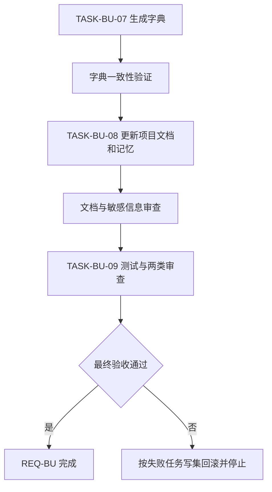
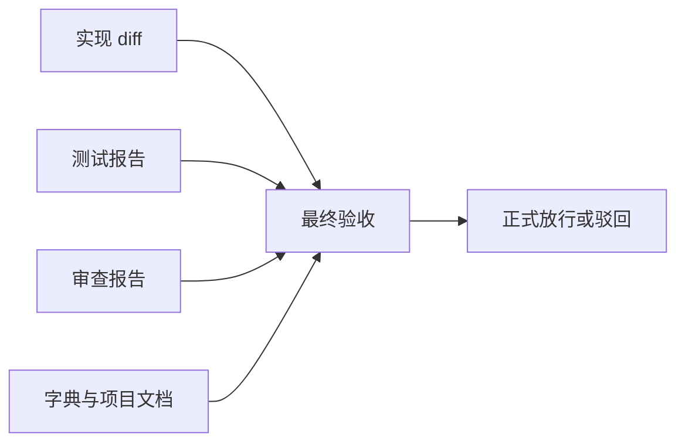

# CYCLE-BU-04：字典、项目文档、审查与验收

结论：本周期已刷新 Skill 字典和项目说明，并完成 Browser Use Cloud 升级的测试、审查和最终验收；影响：新增能力可被发现、理解和安全调用；范围：字典、项目说明、项目记忆、中央测试、审查和验收文档；非范围：不提交 Git、不配置 key、不运行真实 Cloud；变化：实现证据已同步为长期文档并形成正式放行结论；完成标准：所有门禁 PASS 且工作树其它任务改动未被覆盖；术语说明：当前改动总审查是指只审查本任务范围内的差异和重叠风险，不收口其它任务；验证状态：周期完成。

## 当前周期目标、边界与进入条件

- 周期 ID / 期次定位：`CYCLE-BU-04` / 第四期。
- 唯一目标：让已实现能力可发现、可审查、可验收并完成项目状态同步。
- 进入条件：`CYCLE-BU-03` 的路由回归通过。
- 非范围：Git 历史、真实 Cloud、真实 key、用户账户或 profile 变更。
- 图片资产决策：N/A。原因：无视觉交付；证据：文档、测试和审查均为文本与机器报告。

## 进入条件与收口条件

| 类型 | 条件 | 证据 | 状态 |
|---|---|---|---|
| 进入 | Cloud Owner 和统一路由均验收 | `EVD-TASK-BU-06-ACCEPT-001` | completed |
| 收口 | `TASK-BU-07..09` 各自四项闭环且最终验收通过 | `EVIDENCE-BU-ACCEPT-001` | completed |

图形目的：展示最终三个任务的串行收口；关联 ID：`CYCLE-BU-04`、`TASK-BU-07..09`。

图形目的：展示最终证据汇聚关系；关联 ID：`EVIDENCE-BU-IMPL-001`、`EVIDENCE-BU-TEST-001`、`EVIDENCE-BU-REVIEW-001`、`EVIDENCE-BU-ACCEPT-001`。

## 当前代码/文档基线

- 字典入口：`skill-dictionary/generate_dictionary.py`，产物为 `data.js` 与 `字典.md`。
- 项目说明：`README.md`、`编码skill.md`、`项目设计.md`；项目当前、记忆和历史职责分离。
- 测试与审查：中央 `doc/5-tests/`、`doc/6-审查/`、`doc/7-验收/`。
- 停止规则：生成器改写无关资产、项目记忆出现 secret、scoped diff 混入其它任务或任一门禁失败时停止。

## 周期内最小任务执行顺序

| 顺序 | 任务 | 唯一目标 | 允许文件 | 禁止触碰区 | 状态 |
|---:|---|---|---|---|---|
| 1 | `TASK-BU-07` | 刷新字典产物 | 字典生成器既定产物 | 其它 Skill 资产 | completed |
| 2 | `TASK-BU-08` | 更新项目说明与记忆 | 三份项目说明、项目记忆三文件 | 其它任务托管区、vault | completed |
| 3 | `TASK-BU-09` | 生成测试、审查和最终验收证据 | 本任务中央测试/审查/验收目录 | Git 历史、真实 Cloud | completed |

## 文件与符号操作契约

| 任务 | 文件/符号 | 操作 | 修改后职责 | 兼容要求 |
|---|---|---|---|---|
| `TASK-BU-07` | `skill-dictionary/data.js`、`skill-dictionary/字典.md` | 生成器更新 | 收录 Cloud Skill 和最新路由说明 | 仅生成器产物变化 |
| `TASK-BU-08` | `README.md`、`编码skill.md`、`项目设计.md` | 窄更新 | 说明用途、路由、key 与费用边界 | 不宣传永久免费，不保存 key |
| `TASK-BU-08` | `PROJECT_CURRENT.md`、`PROJECT_MEMORY.md`、`PROJECT_HISTORY.md` | 覆盖/合并/追加 | 分别保存当前状态、稳定决策、关键事件 | registry 托管区原样保留 |
| `TASK-BU-09` | 中央测试、审查、验收文档 | 新增/更新 | 保存行为证据、scoped 审查和放行结论 | 路径与模板合规 |

## 最小任务闭环

| 任务 | 实现 | 真实测试或合规免测 | 审查 | 验收 |
|---|---|---|---|---|
| `TASK-BU-07` | 运行生成器 | 重跑后 diff 稳定 | 只含预期字典变化 | Cloud Skill 可检索 |
| `TASK-BU-08` | 更新说明与三件套 | 纯文档合规免行为测试；链接、UTF-8、无泄密扫描 | 职责分层和其它会话保护 | 项目说明一致 |
| `TASK-BU-09` | 汇总全部证据 | 单元、trigger、quick validate、strict、diff check | 实现审查和当前改动总审查 | `AC-BU-001..012` 全部通过 |

## 当前周期验证矩阵

| 测试 ID | 对应任务 | 命令/入口 | 断言 | 失败预期 |
|---|---|---|---|---|
| `TEST-BU-C4-001` | `TASK-BU-07` | `py.exe -3 -X utf8 -B skill-dictionary/generate_dictionary.py` | 二次运行无新增 diff | 产物不稳定或缺 Skill |
| `TEST-BU-C4-002` | `TASK-BU-08` | UTF-8、链接、secret pattern scoped 扫描 | 无 key 原值、职责无混写 | 敏感或记忆越界 |
| `TEST-BU-C4-003` | `TASK-BU-09` | Cloud 单元与 trigger 回归 | 全部测试通过 | 任一行为或路由回归 |
| `TEST-BU-C4-004` | `TASK-BU-09` | Skill quick validate、全部文档 strict | 全部门禁 PASS | 任一结构失败 |
| `TEST-BU-C4-005` | `TASK-BU-09` | `git diff --check` 与 scoped diff 审查 | 无空白错误、无覆盖其它任务 | 无关改动或乱码 |

## 真实测试与断言

本周期复用 `CYCLE-BU-02/03` 的原命令和原样本，不使用不同输入代替回归。字典必须二次生成稳定；项目文档做 UTF-8 与无泄密扫描；最终验收必须同时读取实现、测试、审查四类证据，不能用 build、lint 或人工阅读代替真实行为测试。

## 回滚与停止条件

- `ROLLBACK-BU-C4-001`：字典失败时只恢复生成器产物的本任务增量并停止。
- `ROLLBACK-BU-C4-002`：项目文档失败时只撤销对应窄段，保留 registry 和其它任务内容。
- `ROLLBACK-BU-C4-003`：审查或验收失败时保持证据与失败结论，不伪报通过，回到对应最小任务修复。
- 停止条件：secret、收费调用、无确认入口、无硬上限放行、Cloud 抢占既有路由、生成器异常、其它任务改动被覆盖。
- 最大推进边界：完成本任务所有资产和本地验收后停止；不 commit、不 push、不配置用户环境变量。

## 周期追踪矩阵

| REQ/RULE | AC | TASK | 文件/符号 | TEST | EVIDENCE | 状态 |
|---|---|---|---|---|---|---|
| `RULE-BU-ROUTE-001` | `AC-BU-001/002` | `TASK-BU-07` | 字典产物 | `TEST-BU-C4-001` | `EVD-TASK-BU-07-IMPL-001`、`EVD-TASK-BU-07-TEST-001`、`EVD-TASK-BU-07-REVIEW-001`、`EVD-TASK-BU-07-ACCEPT-001` | completed |
| `REQ-BU-001..012` | `AC-BU-001..012` | `TASK-BU-08` | 项目说明与记忆 | `TEST-BU-C4-002` | `EVD-TASK-BU-08-IMPL-001`、`EVD-TASK-BU-08-TEST-001`、`EVD-TASK-BU-08-REVIEW-001`、`EVD-TASK-BU-08-ACCEPT-001` | completed |
| `REQ-BU-001..012` | `AC-BU-001..012` | `TASK-BU-09` | 测试、审查、验收 | `TEST-BU-C4-003..005` | `EVD-TASK-BU-09-IMPL-001`、`EVD-TASK-BU-09-TEST-001`、`EVD-TASK-BU-09-REVIEW-001`、`EVD-TASK-BU-09-ACCEPT-001` | completed |

## 自审结论

- 三个任务按字典、项目说明、最终证据垂直串行，不先统一验收多个未闭环任务。
- 项目记忆分层、registry 保护、Obsidian CLI-only 和 Git 禁止边界均明确。
- 真实 Cloud、key、费用与 profile 不是验收依赖。
- 图形、表格、证据类别和正式放行状态一致。

## 最小任务闭环证据

### TASK-BU-07

- `EVD-TASK-BU-07-IMPL-001`：生成器已刷新 `skill-dictionary/data.js` 与 `字典.md`，Cloud Skill 可检索。
- `EVD-TASK-BU-07-TEST-001`：连续生成后排除生成时间的语义内容稳定，规划统计为已实现 73 / 74。
- `EVD-TASK-BU-07-REVIEW-001`：生成产物只反映当前 Skill 与说明，不修改其它 Skill 源文件。
- `EVD-TASK-BU-07-ACCEPT-001`：`browser-use-cloud-rules`、相邻让路和路由说明均进入字典。

### TASK-BU-08

- `EVD-TASK-BU-08-IMPL-001`：`README.md`、`编码skill.md`、`项目设计.md` 和 `PROJECT_MEMORY.md` 已窄更新。
- `EVD-TASK-BU-08-TEST-001`：UTF-8、链接和敏感信息扫描通过，没有真实 key、Cookie 或身份字段。
- `EVD-TASK-BU-08-REVIEW-001`：项目说明未宣传永久免费，项目记忆只保存稳定规则与证据索引。
- `EVD-TASK-BU-08-ACCEPT-001`：`PROJECT_CURRENT.md` 为 N/A；原因：当前投影归属其它会话；证据：其来源对象不是 `REQ-BU-20260726-001`，因此保持不修改。`PROJECT_HISTORY.md` 无必需追加项。

### TASK-BU-09

- `EVD-TASK-BU-09-IMPL-001`：`TESTDOC-BU-001`、`REVIEW-BU-001/002` 和 `ACCEPT-BU-FINAL-001` 已落盘。
- `EVD-TASK-BU-09-TEST-001`：单元 14/14、trigger 8/8、Skill 7/7、文档 strict 与 scoped diff 门禁通过。
- `EVD-TASK-BU-09-REVIEW-001`：实现审查与当前改动总审查均无 P0/P1。
- `EVD-TASK-BU-09-ACCEPT-001`：`AC-BU-001..012` 全部判定 PASS，真实 Cloud 保持非范围。

## 周期验收结论

`CYCLE-BU-04:PASS`。`TASK-BU-07/08/09` 均完成“实现 -> 真实测试或合规免测 -> 审查 -> 验收”，没有修改其它会话投影，没有调用真实 Cloud，也没有写入 Git 历史。

## 执行附录

最终测试必须记录命令、退出码、关键断言、失败预期和清理。无泄密扫描使用哨兵值而不使用真实 key；报告不得包含姓名、项目 ID、订阅 ID、Cookie 或鉴权响应。审查只接受本任务 scoped diff，不把工作树其它任务状态写成已完成。

## 追踪附录

最终链路：`CYCLE-BU-04 -> TASK-BU-07/08/09 -> TEST-BU-C4-001..005 -> EVIDENCE-BU-IMPL/TEST/REVIEW/ACCEPT-001`。正式放行要求 `skill-execution-compliance-gate-rules:PASS` 和最终验收通过。
