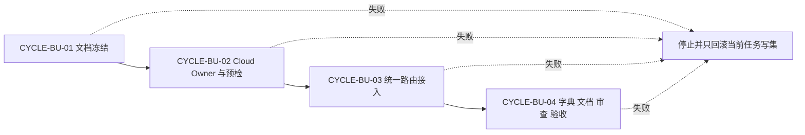
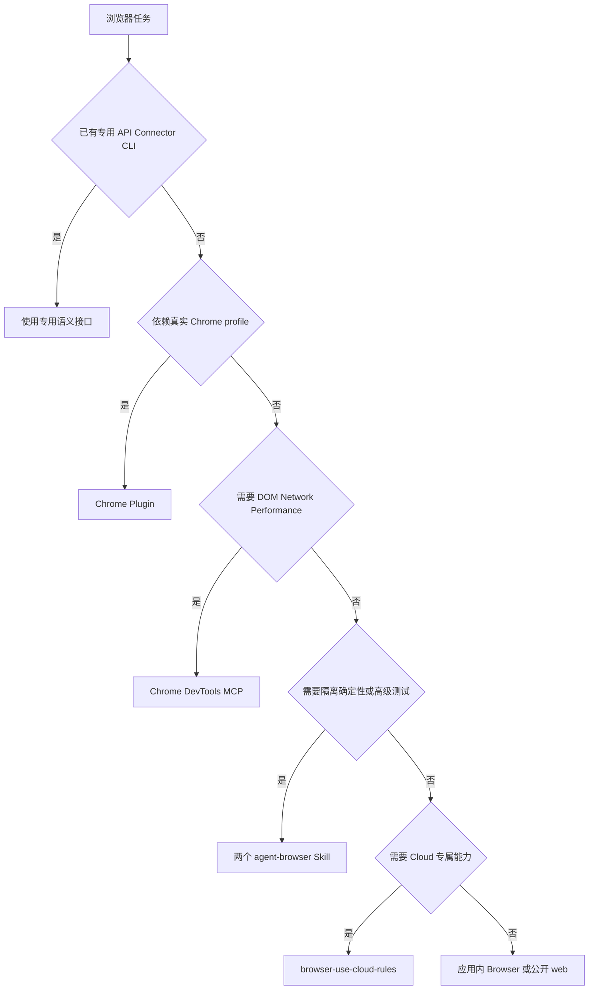
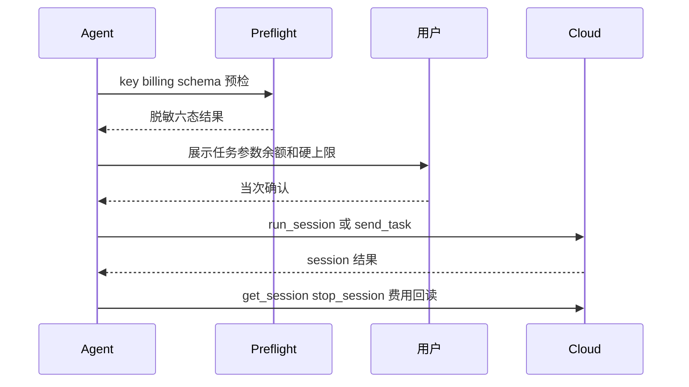

# Browser Use Cloud 浏览器 Skill 升级实施总览

结论：实施以独立 Cloud Owner、失败关闭预检和唯一浏览器路由矩阵为主线；影响：新增一种受控 Cloud 后端，不改变现有浏览器默认习惯；范围：九个最小任务、四个周期、全部本地测试与文档收口；非范围：真实 key、真实 session、额度消费、本地 Browser Use 和 Git 历史；变化：Cloud 收费动作新增逐次确认和费用生命周期；完成标准：四个周期逐一收口；术语说明：Owner 是某类规则和生命周期的唯一事实来源；验证状态：实施授权已确认，当前处于第一周期。

## 当前计划最终方案简要说明

采用 `1A/2A`：只接 Browser Use Cloud，并让 `browser-use-cloud-rules` 唯一负责 Cloud 执行、安全、费用和生命周期。统一路由仍由 `mcp-installation-rules/references/tool-priority.md` 承担，预检和测试全部使用 local mock，避免真实计费与凭据风险。

图片资产决策：N/A + 原因：本实施不交付位图 + 证据：周期、路由和收费交互均由 Mermaid 表达。

## Agent 对当前问题的理解

| 维度 | 冻结内容 |
|---|---|
| 问题/目标 | 让 Agent 知道何时使用 Browser Use Cloud，并在使用前提醒配置 key、检查费用并逐次确认 |
| 本轮范围 | Cloud Skill、预检脚本、路由、测试、字典、项目文档、审查和验收 |
| 非范围 | 本地 Browser Use、真实 Cloud、真实 key、Cookie/profile 上传、Git commit/push |
| 当前优先闭环 | 先完成 CYCLE-BU-01 的文档与追踪，再进入实现 |
| 关键假设 | MCP schema 在真实使用时可检查；Billing 响应可由 local mock 建模 |
| 未决项 | `unresolved_decisions: []`，零个 P0/P1 |

## 实施周期总览

| 顺序 | 周期 | 目标 | 进入条件 | 收口条件 |
|---:|---|---|---|---|
| 1 | `CYCLE-BU-01` | 冻结需求、验收、总览、全量顺序和四周期 | 用户实施授权 | 文档 strict 校验通过 |
| 2 | `CYCLE-BU-02` | 新增 Cloud Owner、预检脚本和单元测试 | CYCLE-BU-01 收口 | local mock 测试、quick_validate、无泄密扫描通过 |
| 3 | `CYCLE-BU-03` | 接入唯一浏览器路由并完成回归 | CYCLE-BU-02 收口 | 正负 trigger 回归通过且既有路由无回归 |
| 4 | `CYCLE-BU-04` | 刷新字典、项目文档、审查与验收 | CYCLE-BU-03 收口 | 全部门禁、审查、验收通过 |

图形目的：表达四周期严格依赖和停止边界；关联 ID：`CYCLE-BU-01..04`。



图形目的：展示 Browser Use Cloud 与既有浏览器能力的边界；关联 ID：`RULE-BU-ROUTE-001`。



图形目的：展示收费动作的端到端确认和清理；关联 ID：`RULE-BU-COST-001`、`RULE-BU-SESSION-001`。



## 阶段计划

| 阶段 | 周期 | 唯一目标 | 输出 |
|---|---|---|---|
| S1 | CYCLE-BU-01 | 冻结零决策文档 | 八份工程文档 |
| S2 | CYCLE-BU-02 | 实现失败关闭预检 | 新 Skill、脚本、单元测试 |
| S3 | CYCLE-BU-03 | 统一条件路由 | 路由增量和 trigger fixture |
| S4 | CYCLE-BU-04 | 形成可交付证据 | 字典、项目文档、测试、审查、验收 |

## 最小任务清单

| 任务 | 唯一目标 | 文件上限 | 真实测试/免测 | 完成条件 |
|---|---|---:|---|---|
| `TASK-BU-01` | 创建需求、验收、总览和全量顺序文档 | 4 | 纯文档免行为测试；strict profile | 四文档通过 |
| `TASK-BU-02` | 创建四份周期文档并冻结追踪 | 4 | 纯文档免行为测试；strict profile | 四周期通过 |
| `TASK-BU-03` | 初始化并实现 Cloud Skill 五类资产 | 5 | 后续由 TASK-BU-04 测试 | 文件结构和契约完整 |
| `TASK-BU-04` | 执行预检单元测试与无泄密扫描 | 2 | local HTTP mock | 全部场景通过 |
| `TASK-BU-05` | 更新 MCP/URL 三个路由文件 | 3 | trigger fixture | 路由矩阵唯一 |
| `TASK-BU-06` | 更新两个浏览器 Skill、团队路由和失败分类 | 5 | trigger fixture | 既有能力无回归 |
| `TASK-BU-07` | 运行字典生成器 | 2 | 生成器重复执行无差异 | 字典同步 |
| `TASK-BU-08` | 更新根文档和项目记忆 | 7 | 文档/UTF-8/diff 门禁 | 项目说明一致 |
| `TASK-BU-09` | 生成测试、审查和最终验收文档 | 4 | 全量门禁复跑 | 合规与验收 PASS |

## 现状与落点

```text
F:/luode-skills/
├── browser-use-cloud-rules/                 # 新增 Cloud 唯一 Owner
│   ├── SKILL.md                             # 触发、费用确认和生命周期
│   ├── agents/openai.yaml                   # UI 元数据和 MCP 依赖说明
│   ├── references/routing-and-safety.md     # 路由、安全和配置模板
│   ├── scripts/browser_use_cloud_preflight.py # 失败关闭预检
│   └── tests/test_browser_use_cloud_preflight.py # local mock 单元测试
├── mcp-installation-rules/                  # 唯一浏览器路由矩阵
├── authenticated-url-routing-rules/         # URL 认证边界
├── browser-session-automation-rules/        # 本地隔离确定性自动化
├── browser-advanced-testing-rules/          # 本地高级验证
├── skill-dictionary/                        # 生成字典资产
└── doc/                                     # 需求、实施、测试、审查、验收证据
```

| 任务 | 文件/符号 | 操作 | 兼容要求 |
|---|---|---|---|
| `TASK-BU-03` | `browser-use-cloud-rules/*` | 新增 | 不读取真实 key，不调用 Cloud |
| `TASK-BU-05` | `tool-priority.md` 等三文件 | 窄改 | 矩阵仍为唯一来源 |
| `TASK-BU-06` | 相邻浏览器/团队/失败规则 | 窄改 | 保留所有既有触发和安全边界 |
| `TASK-BU-07` | `字典.md`、`skill-dictionary/data.js` | 生成 | 只由脚本维护 |
| `TASK-BU-08` | README、编码skill、项目设计、记忆三文件 | 增量更新 | 不覆盖其它会话改动 |

## 真实测试安排

| 测试 ID | 入口 | 环境 | 样本/数据 | 通过标准 |
|---|---|---|---|---|
| `TEST-BU-001` | `python -m unittest discover` | local Python 标准库 | local HTTP mock | 预检六态、认证、余额、schema、脱敏全部通过 |
| `TEST-BU-002` | `quick_validate.py browser-use-cloud-rules` | local | 新 Skill | 结构与 front matter 通过 |
| `TEST-BU-003` | `validate_skill_split.py --mode trigger` | local | 正负 trigger cases | Cloud 专属命中、普通路由不回归 |
| `TEST-BU-004` | `generate_dictionary.py` | local | 全仓 Skill 元数据 | 生成成功且二次运行稳定 |
| `TEST-BU-005` | `validate_engineering_docs.py --strict` | local | 本来源工程文档 | 全部 `valid: true` |
| `TEST-BU-006` | secret/URL 扫描与 `git diff --check` | local | 当前 scoped diff | 无密钥原值、无真实 Cloud 请求、无空白错误 |

## 风险与阻断项

| 风险 | 停止条件 | 回滚 |
|---|---|---|
| 泄露密钥 | 任意输出包含原值 | `ROLLBACK-BU-01` 只回滚当前任务写集并清除测试数据 |
| 真实收费 | 任何真实 Cloud session 被创建 | `ROLLBACK-BU-02` 停止任务并检查 session 状态 |
| 无确认执行 | 规则或测试发现绕过当次确认 | `ROLLBACK-BU-03` 回退相关路由与执行入口 |
| 工作树覆盖 | diff 出现不属于本来源的内容 | `ROLLBACK-BU-04` 停止并保留用户改动 |

## 任务完成、停止与最大推进边界

- 任务完成条件：四周期和九任务逐个完成“实现→真实测试或合规免测→审查→验收”；全部本地门禁通过。
- 任务停止条件：凭据泄露、真实收费调用、无确认执行、费用不可控却自动继续、安全边界绕过或用户改动覆盖。
- 最大推进边界：只完成 Skill、脚本、路由、测试和项目文档升级；不配置真实 key、不创建真实 session、不消费额度、不提交或推送 Git。

## 追踪矩阵

| SRC/DEC | REQ/AC | CYCLE/TASK | 文件/符号 | TEST | EVIDENCE |
|---|---|---|---|---|---|
| `SRC-BU-001/DEC-BU-001` | `REQ-BU-001/002`、`AC-BU-001/002` | `CYCLE-BU-02/03`、`TASK-BU-03/05/06` | Cloud Skill 与路由 | `TEST-BU-002/003` | `EVIDENCE-BU-001` |
| `SRC-BU-002/DEC-BU-002` | `REQ-BU-007/010`、`AC-BU-007/010` | `CYCLE-BU-02`、`TASK-BU-03/04` | 费用确认协议 | `TEST-BU-001` | `EVIDENCE-BU-002` |
| `SRC-BU-003/DEC-BU-003` | `REQ-BU-003..006`、`AC-BU-003..006` | `CYCLE-BU-02`、`TASK-BU-03/04` | 预检脚本 | `TEST-BU-001` | `EVIDENCE-BU-003` |
| `DEC-BU-004/005` | `REQ-BU-008..012`、`AC-BU-008..012` | `CYCLE-BU-03/04`、`TASK-BU-05..09` | 路由、字典、文档 | `TEST-BU-003..006` | `EVIDENCE-BU-004` |

## 自审结论

- `unresolved_decisions` 为零；所有 P0/P1 决策均由用户选择或官方 schema 边界冻结。
- 周期按依赖严格串行，最小任务默认不超过五个文件；TASK-BU-08 超过五个文件，原因是根入口和三文件记忆必须同步，证据是用户计划明确列入同一项目状态收口。
- 每个任务均有文件/符号、测试、停止和回滚入口；真实测试只使用 local mock。
- 图片、数据库、真实 Cloud 和 Git 历史均为 `N/A + 原因 + 证据` 或明确非范围。
