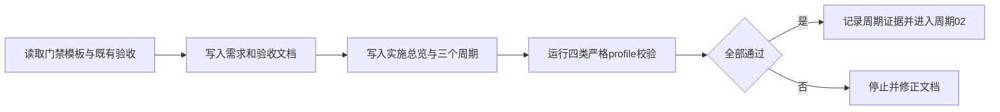
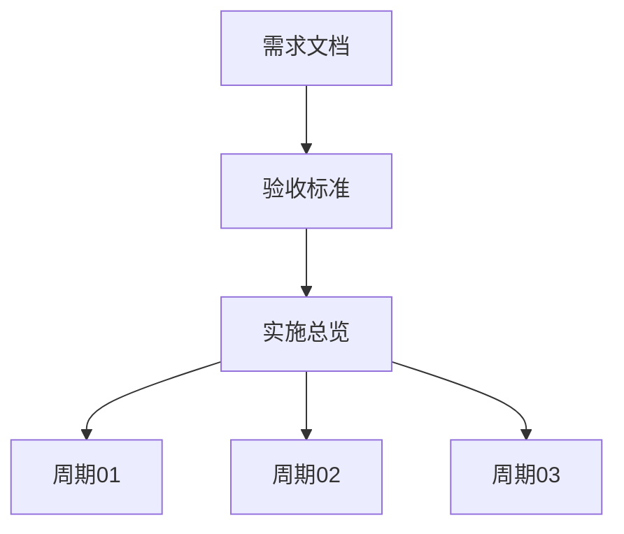

# reasoning-summary-structure-rules「结果与结论」适中详细度实施周期 01：需求与验收冻结

结论：本周期完成结果区详细度需求、验收标准、实施总览和三个周期的文档冻结；影响：后续执行模型可以直接按稳定 ID、文件落点和二值标准工作，不需要重新解释“稍微详细”；范围：需求边界、验收场景、周期依赖、追踪关系和文档门禁；非范围：不修改 Skill、测试脚本、项目记忆、字典或 Git 历史；变化：把用户偏好转成 3–5 句、核心三句和去重边界；完成标准：6 份文档落盘、链接有效、profile 严格校验通过且未决决策为零；术语说明：冻结表示需求、验收和实施顺序已确定，后续执行只能按文档操作；验证状态：6 份文档的 requirement、acceptance、implementation_overview 和 implementation_cycle strict profile 均已执行并通过。

## 当前代码/文档基线

| 项目 | 基线 |
|---|---|
| Git 基线 | `2707009b94c07b6b142057fa8bf32db0d7134cb8` |
| 现有 Skill | 已有结果区、条件字段、图形化和阻断收口规则。 |
| 当前缺口 | 结果区缺少统一的 3–5 句适中详细度、复杂度分支和去重断言。 |
| 工作树 | 存在其他任务未提交改动，本周期只新增指定前缀文档。 |
| 图片资产决策 | N/A + 原因：纯文档冻结，Mermaid 足以表达周期关系；证据：本周期两张流程图。 |

图片资产决策：N/A + 原因：本周期没有 UI 或图片交付；证据：文档只新增 Markdown 与 Mermaid。

## 当前周期目标、边界与进入条件

- 周期 ID：`CYCLE-SUMMARY-DETAIL-01`。
- 目标：完成 `TASK-SUMMARY-DETAIL-01`，冻结需求、验收和实施链路。
- 进入条件：用户已明确授权按正式计划实施，且 `SRC-SUMMARY-DETAIL-001` 已确认。
- 文件边界：只新增本任务 6 份需求、验收、总览和周期 Markdown；不得修改 Skill、测试、README、PROJECT_CURRENT、PROJECT_MEMORY 或 PROJECT_HISTORY。
- 收口条件：文档均为 UTF-8；四类 profile 严格校验通过；内部链接、Mermaid 注释和追踪矩阵无阻断；`unresolved_decisions` 为零。

## 周期内最小任务执行顺序

图形目的：说明本周期从读取基线到文档验收的单向执行顺序；关联 ID：`TASK-SUMMARY-DETAIL-01`、`TEST-SUMMARY-DETAIL-DOC-001`。

图形目的：说明文档之间的领域匹配和回指关系；关联 ID：`REQDOC-SUMMARY-DETAIL-001`、`ACDOC-SUMMARY-DETAIL-001`、`PLAN-SUMMARY-DETAIL-001`、`CYCLE-SUMMARY-DETAIL-01..03`。

| 任务 | 前置 | 动作 | 下一依赖 |
|---|---|---|---|
| `TASK-SUMMARY-DETAIL-01` | 用户授权、门禁模板和既有验收事实已读取。 | 新增 6 份工程文档并建立 `SRC -> REQ -> AC -> CYCLE -> TASK -> TEST -> EVIDENCE` 链。 | `TASK-SUMMARY-DETAIL-02` |

## 最小任务闭环

| 阶段 | 要求 | 状态 | 证据 |
|---|---|---|---|
| 实现 | 需求、验收、总览和 3 个周期文档真实落盘。 | passed | `EVD-TASK-SUMMARY-DETAIL-01-IMPL` |
| 真实测试 | 对应 requirement、acceptance、implementation_overview、implementation_cycle profile 各运行一次。 | passed | `EVD-TASK-SUMMARY-DETAIL-01-TEST` |
| 审查 | 链接、术语、图形、ID 和文件边界核对。 | passed | `EVD-TASK-SUMMARY-DETAIL-01-REVIEW` |
| 验收 | 无未决 P0/P1，文档门禁 PASS。 | passed | `EVD-TASK-SUMMARY-DETAIL-01-ACCEPT` |

## 文件/符号操作契约

| 文件/符号 | 操作 | 保护边界 | 完成判据 |
|---|---|---|---|
| `doc/2-需求/2026-07-26_073000_reasoning-summary-structure-rules_结果与结论详细度调整.md` | 新增 | 不修改历史需求和其他任务。 | requirement profile PASS，含 2 张图和 3 张以上表。 |
| `doc/7-验收/2026-07-26_073000_reasoning-summary-structure-rules_结果与结论详细度验收标准.md` | 新增 | 不提前写最终验收结果。 | acceptance profile PASS，场景有通过/失败标准。 |
| `doc/3-实施/2026-07-26_073000_reasoning-summary-structure-rules_结果与结论详细度_实施总览.md` | 新增 | 不进入 Skill 实现。 | implementation_overview profile PASS。 |
| `doc/3-实施/2026-07-26_073000_reasoning-summary-structure-rules_结果与结论详细度_实施周期01_需求与验收冻结.md` | 新增 | 周期 01 只负责冻结，不代替周期 02。 | implementation_cycle profile PASS。 |

## 当前周期验证矩阵

| 测试 | 命令 | 预期 | 失败处理 |
|---|---|---|---|
| `TEST-SUMMARY-DETAIL-DOC-REQ-001` | `python -X utf8 -B artifact-delivery-gate-rules/scripts/validate_engineering_docs.py --profile requirement --doc <需求文档> --root . --strict` | `PASS`，错误数为 0。 | 只修正需求文档并重跑。 |
| `TEST-SUMMARY-DETAIL-DOC-AC-001` | `python -X utf8 -B artifact-delivery-gate-rules/scripts/validate_engineering_docs.py --profile acceptance --doc <验收文档> --root . --strict` | `PASS`，场景和失败标准存在。 | 只修正验收文档并重跑。 |
| `TEST-SUMMARY-DETAIL-DOC-PLAN-001` | `python -X utf8 -B artifact-delivery-gate-rules/scripts/validate_engineering_docs.py --profile implementation_overview --doc <总览> --root . --strict` | `PASS`，3 张流程图和 4 张以上表存在。 | 只修正总览并重跑。 |
| `TEST-SUMMARY-DETAIL-DOC-CYCLE-001` | `python -X utf8 -B artifact-delivery-gate-rules/scripts/validate_engineering_docs.py --profile implementation_cycle --doc <周期文档> --root . --strict` | `PASS`，2 张流程图和 4 张以上表存在。 | 只修正周期文档并重跑。 |

## 周期阻断、停止与回滚

- 停止条件：任一严格 profile 失败、Mermaid 图缺少目的或关联 ID、内部链接失效、出现未决 P0/P1、或目标外文件发生写入。
- 回滚 `ROLLBACK-SUMMARY-DETAIL-01`：仅删除本周期新建的 6 份文档，不修改历史文件、用户环境变量或其他会话改动。
- 失败恢复：若校验命令异常退出，先按 `execution-failure-learning-rules` 记录分类和输入，再修复环境或文档；不得在无变化情况下盲目重试。
- 最大推进边界：本周期不修改 Skill、不运行专项行为测试、不刷新字典、不提交 Git。

## 周期追踪矩阵

| 周期 | 任务 | 需求 | 验收 | 测试 | 文件/符号 |
|---|---|---|---|---|---|
| `CYCLE-SUMMARY-DETAIL-01` | `TASK-SUMMARY-DETAIL-01` | `REQ-SUMMARY-DETAIL-001..007` | `AC-SUMMARY-DETAIL-001..007` | `TEST-SUMMARY-DETAIL-DOC-*` | 6 份工程 Markdown |

## 文档回指

- [需求](../2-需求/2026-07-26_073000_reasoning-summary-structure-rules_结果与结论详细度调整.md)
- [验收标准](../7-验收/2026-07-26_073000_reasoning-summary-structure-rules_结果与结论详细度验收标准.md)
- [实施总览](2026-07-26_073000_reasoning-summary-structure-rules_结果与结论详细度_实施总览.md)
- [周期 02](2026-07-26_073000_reasoning-summary-structure-rules_结果与结论详细度_实施周期02_规则模板与回归.md)
- [周期 03](2026-07-26_073000_reasoning-summary-structure-rules_结果与结论详细度_实施周期03_审查验收与收口.md)

## 自审结论

- 本周期任务单一且写集互斥，未把 Skill 实现或测试结果提前写成完成事实。
- 文档、图形、追踪、测试和回滚字段均有明确落点，普通模型无需自行补充关键决策。
- 只有本周期严格校验全部通过，才允许进入 `CYCLE-SUMMARY-DETAIL-02`。

## 执行附录

- 本周期使用 local Python 和本地文档校验器；不连接外部服务，不执行真实浏览器或数据库动作。原因：周期目标是文档冻结；证据：当前周期边界。

## 追踪附录

| 上游 | 下游 | 证据 |
|---|---|---|
| `SRC-SUMMARY-DETAIL-001` | `REQDOC-SUMMARY-DETAIL-001` | 需求来源与证据台账 |
| `REQDOC-SUMMARY-DETAIL-001` | `ACDOC-SUMMARY-DETAIL-001` | 验收标准链接 |
| `ACDOC-SUMMARY-DETAIL-001` | `PLAN-SUMMARY-DETAIL-001` | 实施总览周期表 |
| `PLAN-SUMMARY-DETAIL-001` | `CYCLE-SUMMARY-DETAIL-01` | 本周期任务清单与验证矩阵 |
