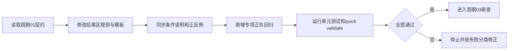
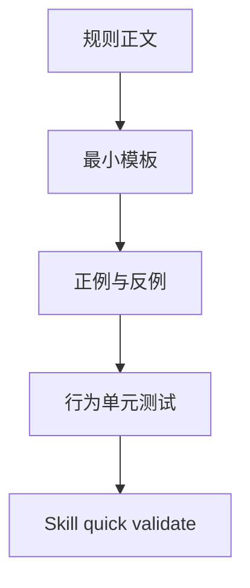

# reasoning-summary-structure-rules「结果与结论」适中详细度实施周期 02：规则、模板与回归

结论：本周期把冻结的 3–5 句结果区契约落实到唯一 Owner 的规则、模板、条件说明、正反例和专项测试；影响：简单任务、复杂任务、过短和冗长候选都能得到一致判定；范围：结果区规则正文、模板示例、条件字段、默认提示如有必要的最小同步和本地回归；非范围：不改变 Skill description、二级标题、字典、其他浏览器或项目记忆；变化：新增核心三句、复杂度扩展、五句上限、去重和阻断边界断言；完成标准：目标文件 UTF-8、专项单元测试和 quick validate 通过，正例与反例均有可复核输出；术语说明：专项回归是针对本次句数和信息覆盖契约编写的本地测试，不等同于完整端到端业务测试；验证状态：专项回归 9 项通过，目标 Skill `quick_validate.py` 通过，目标文件差异检查无错误。

## 当前代码/文档基线

| 项目 | 基线 |
|---|---|
| 上游周期 | `CYCLE-SUMMARY-DETAIL-01` 已完成文档契约和验收标准冻结。 |
| 目标 Owner | `reasoning-summary-structure-rules` 继续负责最终总结结构和结果区。 |
| 现有落点 | `SKILL.md`、`references/summary-structure-template.md`、`references/conditional-sections-rules.md`、`references/output-examples.md`。 |
| 测试基线 | 既有规则测试保留；本周期新增结果区详细度专项回归。 |
| 图片资产决策 | N/A + 原因：规则和测试是文本产物，Mermaid 可表达执行链；证据：本周期两张流程图。 |

图片资产决策：N/A + 原因：本周期不创建 UI 或图片文件；证据：文件/符号契约只包含 Markdown、YAML 和 Python 测试。

## 当前周期目标、边界与进入条件

- 周期 ID：`CYCLE-SUMMARY-DETAIL-02`。
- 目标：完成 `TASK-SUMMARY-DETAIL-02`，使规则、模板、条件说明、示例和测试共享同一 3–5 句契约。
- 进入条件：周期 01 文档 profile 全部通过，`AC-SUMMARY-DETAIL-001..007` 已冻结。
- 允许写集：四个目标规则资产、`agents/openai.yaml`（仅需同步时）、`tests/test_result_conclusion_detail.py`；不得覆盖其它任务改动。
- 收口条件：专项正负测试全部通过，`quick_validate.py` 通过，目标范围 `git diff --check` 通过，且未改变触发条件或章节顺序。

## 周期内最小任务执行顺序

图形目的：说明从规则契约落点到测试和 Skill 校验的单向顺序；关联 ID：`TASK-SUMMARY-DETAIL-02`、`TEST-SUMMARY-DETAIL-001..009`。

图形目的：说明规则、样例和测试之间的职责匹配；关联 ID：`RULE-SUMMARY-DETAIL-001..006`、`AC-SUMMARY-DETAIL-001..006`。

| 任务 | 前置 | 动作 | 下一依赖 |
|---|---|---|---|
| `TASK-SUMMARY-DETAIL-02` | `CYCLE-SUMMARY-DETAIL-01` profile 通过。 | 规则、模板、条件说明、示例和专项回归同步实现。 | `TASK-SUMMARY-DETAIL-03` |

## 最小任务闭环

| 阶段 | 要求 | 状态 | 证据 |
|---|---|---|---|
| 实现 | 规则和测试资产完成窄范围修改。 | passed | `EVD-TASK-SUMMARY-DETAIL-02-IMPL` |
| 真实测试 | 执行简单/复杂/过短/冗长/重复/条件行样例。 | passed | `EVD-TASK-SUMMARY-DETAIL-02-TEST` |
| 审查 | 核对没有删除既有 protected semantics，标题和触发条件未变。 | passed | `EVD-TASK-SUMMARY-DETAIL-02-REVIEW` |
| 验收 | `AC-SUMMARY-DETAIL-001..006` 全部 PASS。 | passed | `EVD-TASK-SUMMARY-DETAIL-02-ACCEPT` |

## 文件/符号操作契约

| 文件/符号 | 操作 | 保护边界 | 完成判据 |
|---|---|---|---|
| `reasoning-summary-structure-rules/SKILL.md` 的结果区规则段 | 窄补丁 | 保留触发、固定顺序、阻断 Owner 和保护语义。 | 明确核心三句、3–5 句上限和复杂度分支。 |
| `references/summary-structure-template.md` | 更新结果区模板 | 不改变标题和整体容器。 | 简单/复杂任务模板均指向同一契约。 |
| `references/conditional-sections-rules.md` | 更新结果区、条件行和阻断边界说明 | 保留 Obsidian、后续和阻断条件。 | 条件句计数、阻断恢复计划位置明确。 |
| `references/output-examples.md` | 增加或调整正反例 | 不删除既有图形化和 Markdown-only 反例。 | 正例 3–5 句，反例覆盖过短/冗长/重复。 |
| `tests/test_result_conclusion_detail.py` | 新增本地行为测试 | 不连接外部服务，不使用真实凭据。 | 所有正负断言可复现并输出原因。 |

## 当前周期验证矩阵

| 测试 | 入口 | 样本/断言 | 预期 | 失败处理 |
|---|---|---|---|---|
| `TEST-SUMMARY-DETAIL-001` | `unittest` | 简单任务 3 句，覆盖三核心字段。 | PASS。 | 修正规则或样例后重跑。 |
| `TEST-SUMMARY-DETAIL-002` | `unittest` | 普通任务 3–4 句，方法与验证状态具体。 | PASS。 | 若出现重复，缩小结果区职责。 |
| `TEST-SUMMARY-DETAIL-003` | `unittest` | 复杂任务 4–5 句，补充关键边界。 | PASS。 | 若超过 5 句，按边界规则压缩。 |
| `TEST-SUMMARY-DETAIL-004` | `unittest` | 仅“已完成”或缺核心字段。 | FAIL。 | 保持拒绝，不放宽下限。 |
| `TEST-SUMMARY-DETAIL-005` | `unittest` | 超过 5 句或复制命令/测试清单。 | FAIL。 | 增加去重断言，禁止复制。 |
| `TEST-SUMMARY-DETAIL-006` | `unittest` | 结果区包含逐文件改动和执行流水账。 | FAIL。 | 回指改动点/执行证据小节。 |
| `TEST-SUMMARY-DETAIL-007` | `unittest` | Obsidian 条件行、无 CLI 沉淀或阻断恢复计划。 | 按条件通过/拒绝。 | 保持条件语义，禁止伪造成果。 |
| `TEST-SUMMARY-DETAIL-QUICK-001` | `quick_validate.py` | Skill 目录结构、front matter 和引用。 | `Skill is valid!`。 | 触发合规闸门并停止。 |

## 周期阻断、停止与回滚

- 停止条件：任一正例失败、任一应拒绝的反例通过、句数规则与模板/示例不一致、标题或 description 发生变化、quick validate 失败、或敏感信息出现在测试 fixture/输出。
- 回滚 `ROLLBACK-SUMMARY-DETAIL-02`：仅回退周期 02 目标文件的窄补丁；不删除周期 01 文档，不重置工作树，不修改其他会话改动。
- 测试失败处理：先按执行失败学习规则记录命令、输入、输出和分类，再做同输入复验；三次同类失败仍无可复核结果时停止并保留阻断证据。
- 最大推进边界：本周期不刷新字典、不修改其他 Skill、不调用外部服务、不创建真实 Cloud session、不提交 Git。

## 周期追踪矩阵

| 周期 | 任务 | 规则 | 验收 | 测试 | 文件/符号 |
|---|---|---|---|---|---|
| `CYCLE-SUMMARY-DETAIL-02` | `TASK-SUMMARY-DETAIL-02` | `RULE-SUMMARY-DETAIL-001..006` | `AC-SUMMARY-DETAIL-001..006` | `TEST-SUMMARY-DETAIL-001..009` | Skill、references、tests |

## 文档回指

- [需求](../2-需求/2026-07-26_073000_reasoning-summary-structure-rules_结果与结论详细度调整.md)
- [验收标准](../7-验收/2026-07-26_073000_reasoning-summary-structure-rules_结果与结论详细度验收标准.md)
- [实施总览](2026-07-26_073000_reasoning-summary-structure-rules_结果与结论详细度_实施总览.md)
- [周期 01](2026-07-26_073000_reasoning-summary-structure-rules_结果与结论详细度_实施周期01_需求与验收冻结.md)
- [周期 03](2026-07-26_073000_reasoning-summary-structure-rules_结果与结论详细度_实施周期03_审查验收与收口.md)

## 自审结论

- 周期 02 只有一个实现任务，规则、模板、样例和测试组成同一垂直切片。
- 正负样例和失败处理均已冻结，执行模型不需要自行决定句数、边界或去重口径。
- 周期 03 只有在本周期所有真实测试、quick validate 和目标范围差异检查通过后才能进入。

## 执行附录

- 真实测试使用本地 Python 和文本 fixture；不连接数据库、HTTP/RPC、浏览器或外部模型。原因：验证的是总结结构行为；证据：文件/符号操作契约。

## 追踪附录

| 来源 | 需求/规则 | 验收 | 任务 | 测试 | 证据 |
|---|---|---|---|---|---|
| `SRC-SUMMARY-DETAIL-001` | `REQ-SUMMARY-DETAIL-001..006`、`RULE-SUMMARY-DETAIL-001..006` | `AC-SUMMARY-DETAIL-001..006` | `TASK-SUMMARY-DETAIL-02` | `TEST-SUMMARY-DETAIL-001..009` | `EVIDENCE-SUMMARY-DETAIL-RULE-*` |
