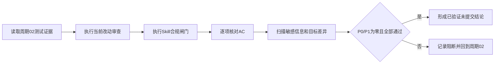
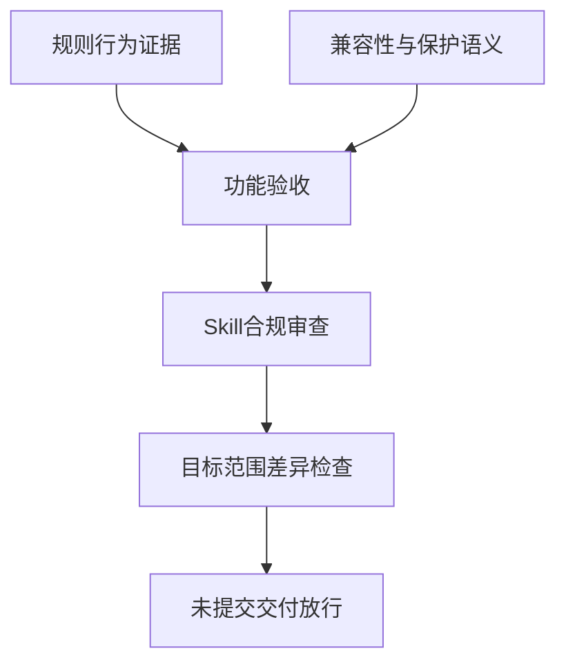

# reasoning-summary-structure-rules「结果与结论」适中详细度实施周期 03：审查、验收与收口

结论：本周期负责把规则实现和回归结果转成可追溯的审查、验收和未提交交付结论；影响：只有通过兼容性、合规性和目标范围检查后，结果区详细度升级才可放行；范围：当前改动审查、Skill 合规闸门、验收标准逐项核对、敏感信息扫描和目标范围差异检查；非范围：不新增业务功能、不运行外部服务、不刷新字典、不提交或推送 Git；变化：将“3–5 句契约已实现”与“既有结构未回归”分别给出证据；完成标准：全部适用验收项通过、P0/P1 为零、工作树边界清楚；术语说明：收口是完成审查和验收后给出已验证但未提交的任务状态，不代表已经写入 Git 历史；验证状态：周期 02 回归、Skill 校验、目标差异和敏感信息扫描均已通过，当前审查与验收证据已具备。

## 当前代码/文档基线

| 项目 | 基线 |
|---|---|
| 上游周期 | `CYCLE-SUMMARY-DETAIL-02` 应已完成规则、模板、样例和专项回归。 |
| 审查对象 | 结果区规则、模板、条件说明、正反例、专项测试及本任务文档。 |
| 合规要求 | 需要 `skill-execution-compliance-gate-rules` PASS，并核对触发、标题、字典和保护语义。 |
| Git 边界 | 当前轮没有提交授权，审查只读取差异，不执行 commit、push、rebase 或 reset。 |
| 图片资产决策 | N/A + 原因：收口证据是文本、测试输出和差异检查，不需要 UI 图片；证据：验收矩阵。 |

图片资产决策：N/A + 原因：本周期不生成图片或视觉交付；证据：审查范围与文件/符号契约。

## 当前周期目标、边界与进入条件

- 周期 ID：`CYCLE-SUMMARY-DETAIL-03`。
- 目标：完成 `TASK-SUMMARY-DETAIL-03`，形成审查和验收证据，并确认结果区规则可在未提交状态交付。
- 进入条件：周期 02 的正负回归、quick validate 和目标差异检查已通过；任何失败均先回到周期 02，不在本周期猜测修复。
- 允许写集：本任务指定的周期文档和审查/验收证据引用；不得修改 Skill、测试、README、项目记忆或其他会话文件。
- 收口条件：审查无 P0/P1，验收逐项 PASS，敏感扫描无泄露，目标文件 `git diff --check` 通过，未提交边界明确。

## 周期内最小任务执行顺序

图形目的：说明从周期 02 证据到最终收口的审查链；关联 ID：`TASK-SUMMARY-DETAIL-03`、`TEST-SUMMARY-DETAIL-REVIEW-001`、`AC-SUMMARY-DETAIL-007`。

图形目的：区分审查、验收和范围边界三个放行条件；关联 ID：`AC-SUMMARY-DETAIL-001..007`、`ROLLBACK-SUMMARY-DETAIL-03`。

| 任务 | 前置 | 动作 | 下一依赖 |
|---|---|---|---|
| `TASK-SUMMARY-DETAIL-03` | 周期 02 全部测试通过。 | 当前改动审查、合规闸门、验收逐项核对、敏感扫描和未提交收口。 | 原任务完成，无新增周期。 |

## 最小任务闭环

| 阶段 | 要求 | 状态 | 证据 |
|---|---|---|---|
| 实现 | 形成审查与验收所需的证据引用和结论记录。 | passed | `EVD-TASK-SUMMARY-DETAIL-03-IMPL` |
| 真实测试 | 复核周期 02 测试结果并执行目标范围差异、链接和敏感扫描。 | passed | `EVD-TASK-SUMMARY-DETAIL-03-TEST` |
| 审查 | `skill-execution-compliance-gate-rules`、`skill-audit-rules` 和当前改动审查均无 P0/P1。 | passed | `EVD-TASK-SUMMARY-DETAIL-03-REVIEW` |
| 验收 | `AC-SUMMARY-DETAIL-001..007` 全部 PASS，交付状态为已验证未提交。 | passed | `EVD-TASK-SUMMARY-DETAIL-03-ACCEPT` |

## 文件/符号操作契约

| 文件/符号 | 操作 | 保护边界 | 完成判据 |
|---|---|---|---|
| 周期 02 规则和测试资产 | 只读审查 | 不在周期 03 直接修复，失败回到周期 02。 | 审查记录能回指具体文件和测试证据。 |
| `reasoning-summary-structure-rules` 合规结果 | 读取并记录 | 不改变触发条件、标题、字典和其它 Skill。 | 合规闸门 PASS，P0/P1 为零。 |
| 本任务文档链 | 更新证据引用/状态 | 只使用 `2026-07-26_073000` 写集，不覆盖其他会话文档。 | 链接、ID、状态和边界一致。 |
| 工作树差异 | 只读 `git diff --check`/路径盘点 | 不执行提交、推送、重置或回滚非目标改动。 | 目标文件无 whitespace error，范围外改动保持不变。 |

## 当前周期验证矩阵

| 测试 | 入口 | 预期 | 失败处理 |
|---|---|---|---|
| `TEST-SUMMARY-DETAIL-REVIEW-001` | `git diff --check -- <目标路径>` | 无 whitespace error。 | 只修目标文档格式，重跑。 |
| `TEST-SUMMARY-DETAIL-REVIEW-002` | `quick_validate.py` 与目标 Skill 合规审计 | Skill valid，合规闸门 PASS。 | 记录 FAIL，禁止验收放行。 |
| `TEST-SUMMARY-DETAIL-REVIEW-003` | 规则正负回归复核 | `TEST-SUMMARY-DETAIL-001..009` 全部符合周期 02 结论。 | 回到周期 02 修复，不在收口阶段放宽断言。 |
| `TEST-SUMMARY-DETAIL-REVIEW-004` | 目标文件链接、UTF-8 和敏感信息扫描 | 链接可解析、UTF-8 可读、无 key/token/password 原值。 | 立即停止并清理目标写集中的敏感内容。 |
| `TEST-SUMMARY-DETAIL-REVIEW-005` | `AC-SUMMARY-DETAIL-001..007` 逐项核对 | 每一项有 PASS 证据和回指。 | 缺证据则验收为待重验，不宣称完成。 |

## 周期阻断、停止与回滚

- 停止条件：周期 02 证据缺失、任何验收项失败、合规闸门非 PASS、发现标题/触发/字典回归、敏感信息泄露、内部链接失效或非目标文件被覆盖。
- 回滚 `ROLLBACK-SUMMARY-DETAIL-03`：只撤销本周期新增的证据引用和状态记录；不回滚周期 02 已独立验收资产，不执行 Git 历史操作。
- 阻断处理：若真实收口为 blocked/manual_handoff，按共享任务阻断契约记录唯一阻断 ID、影响、解决计划和恢复重入点；结果区不复制恢复计划。
- 最大推进边界：本周期最多完成审查、验收和未提交交付结论；不修改外部系统、不执行浏览器/数据库、不刷新字典、不提交 Git。

## 周期追踪矩阵

| 周期 | 任务 | 验收 | 测试 | 证据 | 文件/符号 |
|---|---|---|---|---|---|
| `CYCLE-SUMMARY-DETAIL-03` | `TASK-SUMMARY-DETAIL-03` | `AC-SUMMARY-DETAIL-001..007` | `TEST-SUMMARY-DETAIL-REVIEW-001..005` | `EVIDENCE-SUMMARY-DETAIL-CLOSE-*` | 合规结果、验收证据和目标差异 |

## 文档回指

- [需求](../2-需求/2026-07-26_073000_reasoning-summary-structure-rules_结果与结论详细度调整.md)
- [验收标准](../7-验收/2026-07-26_073000_reasoning-summary-structure-rules_结果与结论详细度验收标准.md)
- [实施总览](2026-07-26_073000_reasoning-summary-structure-rules_结果与结论详细度_实施总览.md)
- [周期 01](2026-07-26_073000_reasoning-summary-structure-rules_结果与结论详细度_实施周期01_需求与验收冻结.md)
- [周期 02](2026-07-26_073000_reasoning-summary-structure-rules_结果与结论详细度_实施周期02_规则模板与回归.md)

## 自审结论

- 本周期仅消费周期 02 真实证据，不把计划内容冒充测试结果。
- 审查、验收、敏感扫描和工作树边界各有独立判据，失败时有明确回退周期和停止条件。
- 只有所有验收项和合规闸门通过，才能向主 Agent 报告“已验证未提交”。

## 执行附录

- 本周期的验证入口只读当前工作树和本地测试产物；不连接外部服务、不使用真实凭据、不执行 Git 历史写入。原因：用户未授权提交且任务范围不包含外部副作用；证据：周期边界。

## 追踪附录

| 上游 | 下游 | 证据 |
|---|---|---|
| `CYCLE-SUMMARY-DETAIL-02` | `TASK-SUMMARY-DETAIL-03` | 周期 02 最小任务闭环 |
| `TASK-SUMMARY-DETAIL-03` | `TEST-SUMMARY-DETAIL-REVIEW-001..005` | 当前周期验证矩阵 |
| `TEST-SUMMARY-DETAIL-REVIEW-001..005` | `AC-SUMMARY-DETAIL-001..007` | 验收对象与通过门槛 |
| `AC-SUMMARY-DETAIL-001..007` | `EVIDENCE-SUMMARY-DETAIL-CLOSE-*` | 审查/验收证据回指 |
