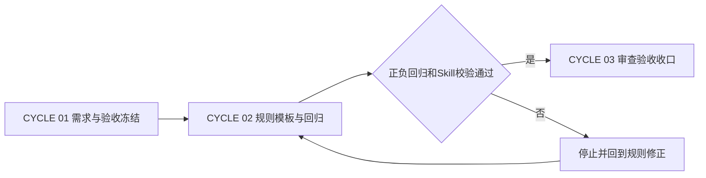
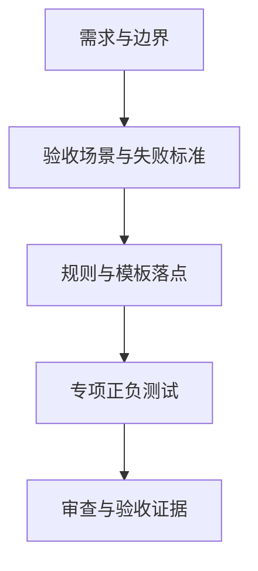

# reasoning-summary-structure-rules「结果与结论」适中详细度实施总览

结论：按“需求与验收冻结 → 规则、模板与回归 → 审查验收收口”三个周期实施结果区 3–5 句契约；影响：执行模型有明确文件落点、测试断言和停止边界，主 Agent 可以在不改变既有结构的情况下完成升级；范围：需求与验收文档、目标 Skill 规则资产、专项回归、合规审查和验收证据；非范围：不接入 Browser Use、不修改其他 Skill、项目记忆、README、字典或 Git 历史；变化：把当前正例中的三句骨架扩展为按任务复杂度自适应的可验证契约；完成标准：每个最小任务独立完成实现、真实测试、审查和验收，所有 profile、正负回归和兼容性检查通过；术语说明：最小任务是可单独实现、验证、审查和验收的垂直闭环，不等同于按文件堆叠的工作清单；验证状态：三个周期的文档 strict profile、专项回归、Skill 校验、差异检查和敏感信息扫描均已通过，当前状态为已验证未提交。

## 当前计划最终方案简要说明

保留现有结果区标题、引用块和固定总结顺序，只增强正文契约和示例：核心三句回答问题、方法、验证状态，复杂或受限任务最多补两句边界。实施按三个垂直周期推进，每个周期完成自己的文档或规则闭环后才进入下一周期。

## 文档信息

图片资产决策：N/A + 原因：本总览只表达规则、周期和测试关系，不交付 UI 或截图；证据：三张 Mermaid 流程图和阶段表已覆盖所需关系。

## Agent 对当前问题的理解

| 维度 | 冻结理解 |
|---|---|
| 问题 | 当前“结果与结论”存在过短风险，单句确认无法表达方法和验证状态。 |
| 目标 | 建立 3–5 句、按复杂度自适应、可由正负样例验证的结果区契约。 |
| 优先闭环 | 先冻结规则和验收，再更新 Skill 资产和回归，最后完成合规审查。 |
| 关键假设 | 不需要改变 description 或 `##` 标题即可表达新契约；若假设失效，停止并回到需求裁决。 |
| 任务边界 | 仅维护本任务文档与后续目标 Skill 资产，保护工作树其他会话改动。 |

## 实施周期总览

| 周期 | 目标 | 最小任务 | 真实测试 | 收口条件 |
|---|---|---|---|---|
| `CYCLE-SUMMARY-DETAIL-01` | 冻结需求、验收、范围和任务追踪。 | `TASK-SUMMARY-DETAIL-01` | 四类文档 profile 严格校验、链接和 Mermaid 静态检查。 | `REQ/AC/CYCLE` 链接完整，`unresolved_decisions` 为零。 |
| `CYCLE-SUMMARY-DETAIL-02` | 更新规则、模板、条件说明、示例和专项回归。 | `TASK-SUMMARY-DETAIL-02` | 单元测试、Skill quick validate、正负 forward-test。 | 过短/适中/冗长样例均按预期判定。 |
| `CYCLE-SUMMARY-DETAIL-03` | 完成审查、兼容性核对、验收和项目状态交接。 | `TASK-SUMMARY-DETAIL-03` | 目标范围 diff check、合规闸门和最终验收核对。 | P0/P1 为零，结果区契约与既有保护语义无回归。 |

## 阶段计划

图形目的：展示三个实施周期的依赖和放行条件；关联 ID：`CYCLE-SUMMARY-DETAIL-01` 至 `CYCLE-SUMMARY-DETAIL-03`、`AC-SUMMARY-DETAIL-001` 至 `AC-SUMMARY-DETAIL-007`。



图形目的：说明每个周期都以一个垂直闭环承接上游决策和下游证据；关联 ID：`TASK-SUMMARY-DETAIL-01`、`TASK-SUMMARY-DETAIL-02`、`TASK-SUMMARY-DETAIL-03`。



图形目的：展示从用户请求到最终结果区行为的端到端交接；关联 ID：`SRC-SUMMARY-DETAIL-001`、`REQ-SUMMARY-DETAIL-001..007`、`EVIDENCE-SUMMARY-DETAIL-*`。


## 最小任务清单

| 任务 ID | 所属周期 | 文件/符号 | 实现动作 | 测试与证据 | 最大边界 |
|---|---|---|---|---|---|
| `TASK-SUMMARY-DETAIL-01` | `CYCLE-SUMMARY-DETAIL-01` | `doc/2-需求/`、`doc/7-验收/`、`doc/3-实施/` 新建 6 份文档 | 写入需求、验收、总览和周期契约，维护双向追踪和图形。 | `TEST-SUMMARY-DETAIL-DOC-001`；对应 profile 严格校验。 | 不修改 Skill、测试和项目记忆。 |
| `TASK-SUMMARY-DETAIL-02` | `CYCLE-SUMMARY-DETAIL-02` | `reasoning-summary-structure-rules/SKILL.md`、`references/summary-structure-template.md`、`references/conditional-sections-rules.md`、`references/output-examples.md`、`tests/test_result_conclusion_detail.py` | 增加 3–5 句契约、复杂度分支、去重规则和正反样例测试。 | `TEST-SUMMARY-DETAIL-001..009`；单元测试与 quick validate。 | 不修改 description、二级标题、字典或其他 Skill。 |
| `TASK-SUMMARY-DETAIL-03` | `CYCLE-SUMMARY-DETAIL-03` | 合规审查入口、验收证据和目标范围差异 | 核对规则、测试、兼容性、敏感信息和工作树边界。 | `TEST-SUMMARY-DETAIL-REVIEW-001`；合规闸门与 diff check。 | 不提交 Git，不覆盖非目标改动。 |

## 现状与落点

```text
F:/luode-skills/
├── reasoning-summary-structure-rules/
│   ├── SKILL.md
│   ├── references/
│   │   ├── summary-structure-template.md
│   │   ├── conditional-sections-rules.md
│   │   └── output-examples.md
│   └── agents/openai.yaml
├── doc/5-tests/2026-07-26_153733/reasoning-summary-structure-rules/
│   └── test_result_conclusion_detail.py             # 新增专项行为回归
├── doc/2-需求/2026-07-26_073000_reasoning-summary-structure-rules_结果与结论详细度调整.md
├── doc/7-验收/2026-07-26_073000_reasoning-summary-structure-rules_结果与结论详细度验收标准.md
└── doc/3-实施/2026-07-26_073000_reasoning-summary-structure-rules_结果与结论详细度_实施总览.md
```

当前 Skill 已有结果区、条件字段、正反例和图形化保护；本任务不迁移旧文件、不删除受保护语义。`agents/openai.yaml` 只在周期 02 需要同步时作为附属落点，若实际不改变提示内容则以现有配置为准并记录 N/A + 原因：当前提示已经能引用规则正文；证据：周期 02 文件/符号契约。

## 真实测试安排

| 测试 ID | 入口 | 样本/数据来源 | 通过标准 | 失败处理 |
|---|---|---|---|---|
| `TEST-SUMMARY-DETAIL-DOC-001` | `validate_engineering_docs.py --profile <profile> --strict` | 本任务 6 份新建 Markdown。 | 每份 profile PASS、链接可解析、图形块有目的和关联 ID。 | 仅修正本任务文档，重跑对应 profile。 |
| `TEST-SUMMARY-DETAIL-001..009` | `py.exe -3 -X utf8 -B -m unittest discover -s doc/5-tests/2026-07-26_153733/reasoning-summary-structure-rules -p "test_*.py"` | 简单、普通、复杂、过短、超长、重复、条件行和阻断样例。 | 正例通过，反例拒绝，句数和信息覆盖断言明确。 | 停止周期 03，回到规则或样例修正。 |
| `TEST-SUMMARY-DETAIL-QUICK-001` | `.system/skill-creator/scripts/quick_validate.py reasoning-summary-structure-rules` | 目标 Skill 资产。 | 输出 `Skill is valid!`，无结构错误。 | 触发 `skill-execution-compliance-gate-rules`，不继续收口。 |
| `TEST-SUMMARY-DETAIL-REVIEW-001` | 目标文件 `git diff --check` 与合规审查 | 目标文件集合和当前工作树差异。 | 无空白错误，P0/P1 为零，非目标改动未被覆盖。 | 保留阻断证据，禁止提交或最终放行。 |

## 风险与阻断项

| 风险/阻断 | 影响 | 预防 | 停止条件 |
|---|---|---|---|
| 过短和冗长边界不清 | 规则仍依赖主观判断。 | 固定三句核心、五句上限和正反样例。 | 任一类别无法形成二值断言。 |
| 结果区复制执行证据 | 输出变成流水账，违背用户“不要太多”。 | 执行证据、验证和改动点各自保留唯一事实 Owner。 | 发现重复命令或完整清单进入正例。 |
| 修改标题触发字典联动 | 范围扩大并影响自动触发。 | 仅修改正文、模板和测试，标题保持原样。 | 实现必须改标题或 description。 |
| 工作树已有未提交改动 | 误覆盖其他会话产物。 | 采用新文件和窄补丁，操作前后核对目标路径。 | 目标外文件出现本任务写入。 |
| 本地测试入口异常 | 无法确认行为。 | 先记录失败分类并按执行失败学习规则恢复。 | 同一输入三次仍无法得到可复核结果。 |

## 任务完成、停止与最大推进边界

- 任务完成条件：三个周期按顺序完成；`TASK-SUMMARY-DETAIL-01..03` 各自完成实现、真实测试、审查、验收；所有适用 `AC-SUMMARY-DETAIL-*` 通过；目标 Skill 合规闸门 PASS。
- 停止条件：任何 P0/P1 未决、正负回归失败、内部链接失效、Mermaid 静态检查失败、密钥/敏感信息进入文档、或非目标文件被覆盖。
- 最大推进边界：最多更新结果区相关 Skill 资产、专项测试、文档和验收证据；不调用浏览器、不创建 Cloud session、不修改数据库、不刷新字典、不提交或推送 Git。

## 自审结论

- 方案使用单一 Owner 和三个垂直周期，避免把结果区规则复制到其他 Skill。
- 每个最小任务都有明确文件/符号、真实测试、失败处理、停止条件和回滚边界。
- `unresolved_decisions` 为零；正文和追踪附录均能回指需求、验收、周期、任务、测试和证据。

## 文档回指

- [需求文档](../2-需求/2026-07-26_073000_reasoning-summary-structure-rules_结果与结论详细度调整.md)
- [验收标准](../7-验收/2026-07-26_073000_reasoning-summary-structure-rules_结果与结论详细度验收标准.md)
- [周期 01](2026-07-26_073000_reasoning-summary-structure-rules_结果与结论详细度_实施周期01_需求与验收冻结.md)
- [周期 02](2026-07-26_073000_reasoning-summary-structure-rules_结果与结论详细度_实施周期02_规则模板与回归.md)
- [周期 03](2026-07-26_073000_reasoning-summary-structure-rules_结果与结论详细度_实施周期03_审查验收与收口.md)

## 执行附录

- 所有测试均限定在本地文件和仓库自带工具；不读取或写入 API key、token、密码、Cookie、本地浏览器 profile 或外部连接串。原因：本任务是总结规则升级；证据：范围和最大推进边界。
- 真实运行结果已由周期文档、测试 README 和最终验收文档回写；当前结论为已验证未提交，不包含 Git 历史写入。

## 追踪附录

| 来源 | 需求 | 验收 | 周期 | 任务 | 测试 |
|---|---|---|---|---|---|
| `SRC-SUMMARY-DETAIL-001` | `REQ-SUMMARY-DETAIL-001..006` | `AC-SUMMARY-DETAIL-001..006` | `CYCLE-SUMMARY-DETAIL-01/02` | `TASK-SUMMARY-DETAIL-01/02` | `TEST-SUMMARY-DETAIL-001..009` |
| `SRC-SUMMARY-VISUAL-20260722-001` | `REQ-SUMMARY-DETAIL-007` | `AC-SUMMARY-DETAIL-007` | `CYCLE-SUMMARY-DETAIL-03` | `TASK-SUMMARY-DETAIL-03` | `TEST-SUMMARY-DETAIL-REVIEW-001` |
