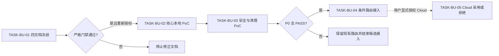

# Browser Use 浏览器能力选型需求与实施计划全量顺序实施方案

结论：把当前来源对象从文档冻结到本地验证、最小接入和 Cloud 独立决策排成唯一顺序；影响：任何执行者都能判断现在只做什么、何时停止和何时不得进入下一期；范围：`REQ-BU-20260726-001` 的需求、验收、实施总览、四个周期和五个最小任务；非范围：替代其它项目来源对象的总顺序、自动安装和自动 Cloud；变化：当前只开放第一周期第一任务；完成标准：每个任务逐个完成实现、真实测试、审查和验收；术语说明：全量顺序是本来源对象的唯一执行索引；验证状态：第一任务正在执行，后续任务均未授权。

## 当前计划最终方案简要说明

推荐保持现有浏览器 Skill 为控制面，只把 Browser Use 作为通过本地 PoC 后的条件执行后端。全量顺序固定为“文档 -> PoC -> 路由 -> Cloud 决策”，任何失败都回到现有路由。

## Agent 对当前问题的理解

- 问题/目标：避免把官方免费试用和丰富能力误解成可直接替换现有 Skill。
- 本轮范围：`TASK-BU-01` 四文档落盘与门禁。
- 非范围：`TASK-BU-02..05` 的安装、测试、改 Skill、Cloud 与 Git。
- 当前优先闭环：四份文档成为唯一来源链。
- 关键假设/待确认点：无 P0/P1 未决；后续行为必须由新的开始实施指令授权。

图片资产决策：N/A + 原因：本方案没有 UI 或视觉资产；证据：流程图和顺序矩阵足以表达依赖。

## 文档信息

| 项目 | 内容 |
| --- | --- |
| 来源集合 | `REQ-BU-20260726-001` 单来源集合 |
| 需求 | [REQDOC-BU-001](../2-需求/2026-07-26_132244_BrowserUse浏览器自动化能力评估与可选接入需求.md) |
| 验收 | [ACDOC-BU-001](../7-验收/2026-07-26_132244_REQ-BU-20260726-001_验收标准.md) |
| 实施总览 | [IMPL-BU-001](2026-07-26_132244_REQ-BU-20260726-001_实施总览.md) |
| 当前任务 | `CYCLE-BU-01/TASK-BU-01` |

## 来源对象清单与回指关系

| 来源对象 | 状态 | 下游承接 | 不得替代 |
| --- | --- | --- | --- |
| `REQDOC-BU-001` | confirmed | `ACDOC-BU-001`、`IMPL-BU-001` | 验收与实施细节 |
| `ACDOC-BU-001` | confirmed | `AC-BU-001..008` | 最终验收结论 |
| `IMPL-BU-001` | confirmed | `CYCLE-BU-01..04`、`TASK-BU-01..05` | 实施周期文档 |
| `MASTER-BU-001` | in_progress | 当前全量顺序 | 单任务执行契约 |

## 全量执行顺序

图形目的：显示四个周期、五个任务和所有停止分支；关联 ID：`CYCLE-BU-01..04`、`TASK-BU-01..05`。

| 总序 | 周期 | 最小任务 | 前置 | 实现/真实测试/审查/验收 | 状态 |
| ---: | --- | --- | --- | --- | --- |
| 1 | `CYCLE-BU-01` | `TASK-BU-01` | 来源与边界冻结 | 四文档、strict、Mermaid、自审/`AC-BU-008` | in_progress |
| 2 | `CYCLE-BU-02` | `TASK-BU-02` | 任务 01 PASS + 新授权 | local 核心 PoC/`TEST-BU-002/003`/代码审查/`AC-BU-003` | pending |
| 3 | `CYCLE-BU-02` | `TASK-BU-03` | 任务 02 PASS | 安全配置/`TEST-BU-004/005`/安全审查/`AC-BU-004/006` | pending |
| 4 | `CYCLE-BU-03` | `TASK-BU-04` | 任务 03 P0 全 PASS | 五文件最小接入/`TEST-BU-006`/Skill 审查/`AC-BU-001/002/006` | pending |
| 5 | `CYCLE-BU-04` | `TASK-BU-05` | 用户当轮 Cloud 授权 | 只读评估/`TEST-BU-007`/合规审查/`AC-BU-005/007` | pending |

## 依赖、进入、收口与阻断

| 周期 | 依赖 | 进入条件 | 收口条件 | 阻断/回滚 |
| --- | --- | --- | --- | --- |
| `CYCLE-BU-01` | 当前仓库、Windows Python、文档 validator | 四文件不存在冲突 | 四 profile strict、图解析和 diff 通过 | 只删除四新文件 |
| `CYCLE-BU-02` | 隔离 local 环境、local fixture、稳定版本 | 周期 01 PASS、明确开工 | 两任务各自四段闭环，清理无残留 | 删除隔离环境，保持现有路由 |
| `CYCLE-BU-03` | PoC 证据、现有 Skill 最新代码 | 周期 02 P0 全 PASS | 路由回归与 Skill 门禁通过 | `ROLLBACK-BU-001` |
| `CYCLE-BU-04` | 当日官方价格/政策、显式授权 | 用户明确允许 Cloud 范围 | 采用或拒绝决策可审计 | 不创建 key、不上传数据 |

## 当前执行入口

- 当前只执行 `TASK-BU-01`：新增四份文档，运行严格门禁、Mermaid 解析、UTF-8 和 diff 自审。
- 当前任务完成后停止，不自动进入 `TASK-BU-02`。
- 最大推进边界：不修改 Skill、脚本、测试、根文档、项目记忆、依赖配置和 Git 历史。

## 需求到任务追踪矩阵

| 需求/规则 | 验收 | 周期/任务 | 测试 | 证据 |
| --- | --- | --- | --- | --- |
| `REQ-BU-001/002`、`RULE-BU-001` | `AC-BU-001/002` | `CYCLE-BU-03/TASK-BU-04` | `TEST-BU-006` | `EVIDENCE-BU-ROUTE-001` |
| `REQ-BU-003/004/006`、`RULE-BU-002/004` | `AC-BU-003/004/006` | `CYCLE-BU-02/TASK-BU-02/03` | `TEST-BU-002..005` | `EVIDENCE-BU-POC-001` |
| `REQ-BU-005`、`RULE-BU-003/005` | `AC-BU-005/007` | `CYCLE-BU-04/TASK-BU-05` | `TEST-BU-007` | `EVIDENCE-BU-CLOUD-GATE-001` |
| 文档链 | `AC-BU-008` | `CYCLE-BU-01/TASK-BU-01` | `TEST-BU-001` | `EVIDENCE-BU-DOC-001` |

## 任务证据类别

| 任务 | 实现证据 | 真实测试证据 | 审查证据 | 验收证据 |
| --- | --- | --- | --- | --- |
| `TASK-BU-01` | `EVD-TASK-BU-01-IMPL-001` | `EVD-TASK-BU-01-TEST-001` | `EVD-TASK-BU-01-REVIEW-001` | `EVD-TASK-BU-01-ACCEPT-001` |
| `TASK-BU-02` | `EVD-TASK-BU-02-IMPL-001` | `EVD-TASK-BU-02-TEST-001` | `EVD-TASK-BU-02-REVIEW-001` | `EVD-TASK-BU-02-ACCEPT-001` |
| `TASK-BU-03` | `EVD-TASK-BU-03-IMPL-001` | `EVD-TASK-BU-03-TEST-001` | `EVD-TASK-BU-03-REVIEW-001` | `EVD-TASK-BU-03-ACCEPT-001` |
| `TASK-BU-04` | `EVD-TASK-BU-04-IMPL-001` | `EVD-TASK-BU-04-TEST-001` | `EVD-TASK-BU-04-REVIEW-001` | `EVD-TASK-BU-04-ACCEPT-001` |
| `TASK-BU-05` | `EVD-TASK-BU-05-IMPL-001` | `EVD-TASK-BU-05-TEST-001` | `EVD-TASK-BU-05-REVIEW-001` | `EVD-TASK-BU-05-ACCEPT-001` |

说明：除 `TASK-BU-01` 外均为证据 ID 预注册，不表示执行完成；状态以周期/任务表和真实产物为准。

## 自审结论

- 全量顺序唯一：文档、PoC、路由、Cloud 不可跳序。
- `unresolved_decisions` 为零；是否进入后续周期属于执行授权条件，不由模型默认。
- 每个任务只有一个垂直目标，文件数不超过五或由后续周期冻结精确隔离资产。
- 当前无需真实浏览器测试；原因：纯文档不改变运行行为；证据：`TEST-BU-001` 是当前唯一适用测试。
- N/A 已附原因与证据，图片和 Cloud 当前不构成伪阻断。

## 执行附录

- 当前 local 命令：四个 `validate_engineering_docs.py --strict`、Mermaid 真解析、UTF-8 读取、`git diff --check`、限定路径 `git status`。
- 当前失败预期：任一命令非零、四文件以外出现新增差异、同来源冲突或链接失效即停止。
- 当前清理/回滚：只删除四个新增文件；不得 reset、checkout 或覆盖既有工作树。

## 追踪附录

- `SRC-BU-001/004 -> DEC-BU-* -> REQ-BU-*/RULE-BU-* -> AC-BU-* -> CYCLE-BU-* -> TASK-BU-* -> TEST-BU-* -> EVIDENCE-BU-*`。
- 本总表是单来源对象的全量顺序入口，不改变仓库中其它来源对象的活动计划与状态。
