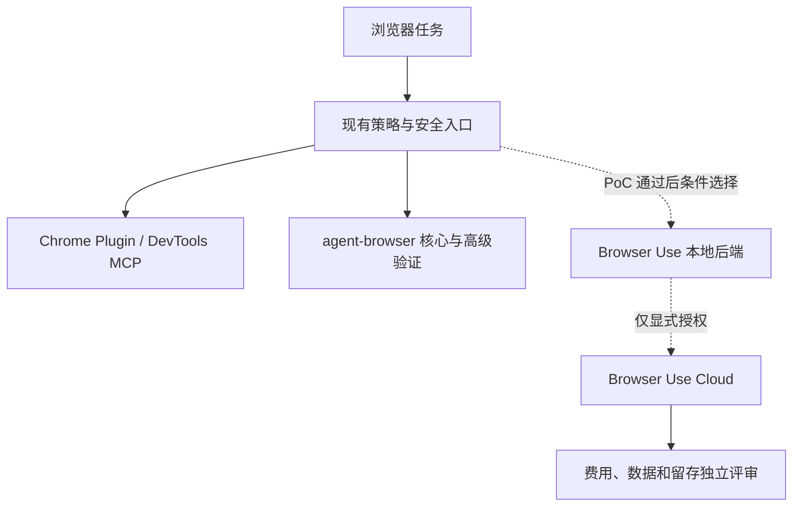
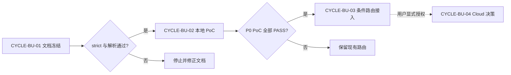
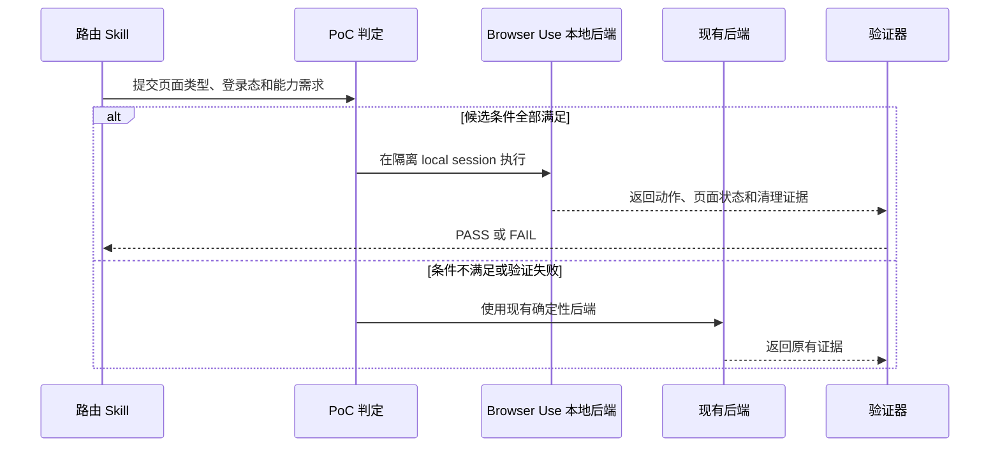

# Browser Use 浏览器自动化能力评估与可选接入实施总览

结论：按“文档冻结、本地隔离 PoC、条件路由接入、Cloud 独立决策”四个周期推进；影响：现有浏览器能力始终可用，Browser Use 只有在提供可验证增益时才进入路由；范围：文档、PoC、最小条件路由和回归；非范围：本轮安装、Cloud、密钥、真实账号和 Git；变化：每个周期必须逐任务完成实现、真实测试、审查和验收；完成标准：所有 P0 验收通过且回滚可恢复到原路由；术语说明：条件路由表示只有明确场景满足时才选择候选工具；验证状态：第一周期正在完成，后续周期未获执行授权。

## 当前计划最终方案简要说明

保留 `authenticated-url-routing-rules`、`browser-session-automation-rules` 和 `browser-advanced-testing-rules` 的现有职责。Browser Use 先在隔离 local 环境证明自治和直接控制价值，再以条件分支接入；Cloud 永不作为失败自动回退。

## Agent 对当前问题的理解

- 问题/目标：判断 Browser Use 是否比现有 Skill 更合适，并把答案变成可执行、可回滚的选型。
- 本轮范围：只新增四份工程文档并验证。
- 非范围：安装、配置 key、运行浏览器、修改 Skill、更新字典、提交 Git。
- 当前优先闭环：`CYCLE-BU-01/TASK-BU-01` 文档冻结。
- 关键假设/待确认点：真实 PoC 结果不能由官方宣传替代；`unresolved_decisions`：无 P0/P1 未决项。

图片资产决策：N/A + 原因：没有 UI、原型、截图或外观基线；证据：三张 Mermaid 与追踪表足以表达系统、依赖和端到端关系。

## 系统边界图

图形目的：显示策略层、现有后端、候选后端和 Cloud 授权边界；关联 ID：`DEC-BU-001..004`、`REQ-BU-001..006`。



异常/边界：登录态、正文读取策略拒绝和高级观测不会因候选后端存在而改路由。

## 周期依赖图

图形目的：冻结周期门禁和不得跳期规则；关联 ID：`CYCLE-BU-01..04`。



异常/边界：PoC 或路由回归失败时不进入后续周期；Cloud 不是默认下一步。

## 端到端时序图

图形目的：说明一次候选任务如何被选择、执行、验证和回滚；关联 ID：`TASK-BU-02..04`、`TEST-BU-002..006`。



异常/边界：任何未知状态都选择现有后端或停止，不推断候选工具已通过。

## 实施周期总览

| 顺序 | 周期 | 单一目标 | 进入条件 | 收口条件 | 状态 |
| ---: | --- | --- | --- | --- | --- |
| 1 | `CYCLE-BU-01` | 冻结需求、验收、总览和总顺序 | 来源和边界明确 | 四文档 strict、Mermaid、diff 门禁通过 | in_progress |
| 2 | `CYCLE-BU-02` | 完成本地隔离 PoC | 周期 01 PASS、用户授权开始执行 | `AC-BU-003/004/006` PASS 且清理完成 | pending |
| 3 | `CYCLE-BU-03` | 接入最小条件路由并回归 | 周期 02 P0 全 PASS | 现有与候选路由测试、审查、验收通过 | pending |
| 4 | `CYCLE-BU-04` | 作出 Cloud 采用或拒绝决策 | 用户当轮明确授权 Cloud 评估 | 费用、数据、留存、条款和回滚结论冻结 | pending |

## 阶段计划

| 阶段 | 周期 | 唯一目标 | 输入 | 输出 | 验证门槛 |
| --- | --- | --- | --- | --- | --- |
| `PHASE-BU-01` | `CYCLE-BU-01` | 冻结零决策文档链 | 官方事实与现有 Skill | 四份文档 | `TEST-BU-001` |
| `PHASE-BU-02` | `CYCLE-BU-02` | 证明本地能力与安全清理 | 隔离环境、local fixture | PoC 证据 | `TEST-BU-002..005` |
| `PHASE-BU-03` | `CYCLE-BU-03` | 增加最小条件路由 | PoC PASS | 路由契约与回归 | `TEST-BU-006` |
| `PHASE-BU-04` | `CYCLE-BU-04` | 冻结 Cloud 决策 | 显式授权、当日价格和数据条款 | 采用/拒绝结论 | `TEST-BU-007` |

## 最小任务清单

| 顺序 | 任务 | 垂直切片目标 | 预计文件数 | 文件/符号 | 真实测试 | 完成/停止 |
| ---: | --- | --- | ---: | --- | --- | --- |
| 1 | `TASK-BU-01` | 让选型具备唯一文档入口 | 4 | 本轮四份 Markdown | `TEST-BU-001` | strict 全 PASS；任一其它文件变化即停止 |
| 2 | `TASK-BU-02` | 在无账号 local 页面完成核心动作 | 不超过 5 | 隔离环境与当期测试资产，精确路径由周期文档冻结 | `TEST-BU-002/003` | 动作、session、清理 PASS；失败保持现状 |
| 3 | `TASK-BU-03` | 证明安全、越域拒绝和无敏感残留 | 不超过 5 | PoC 安全配置与断言 | `TEST-BU-004/005` | 全部 P0 PASS；外传或残留立即停止 |
| 4 | `TASK-BU-04` | 将候选后端接入最小条件路由 | 5 | 下节精确目录树 | `TEST-BU-006` | 触发回归全 PASS；任一语义漂移回滚 |
| 5 | `TASK-BU-05` | 冻结 Cloud 采用/拒绝 | 不超过 3 | 仅评估文档与证据，不保存 key | `TEST-BU-007` | 有明确授权和决策；无授权即停止 |

## 现状与落点

```text
F:/luode-skills/
├── authenticated-url-routing-rules/
│   └── SKILL.md                                      # 保持 URL 与真实 Chrome 唯一路由
├── browser-session-automation-rules/
│   ├── SKILL.md                                      # 后续只增加候选后端条件入口
│   ├── references/browser-use-backend-routing.md     # 后续新增：能力、条件、安全和回滚契约
│   └── tests/test_browser_use_routing_contract.py    # 后续新增：条件路由行为回归
├── browser-advanced-testing-rules/
│   └── SKILL.md                                      # 后续只增加不被候选替代的边界说明
└── doc/5-tests/<当期时间戳>/
    └── BrowserUse本地PoC/README.md                    # 后续新增：真实测试和清理证据
```

文件/符号约束：`TASK-BU-04` 最多触达上述前三个 `SKILL.md`、一个新 reference 和一个新测试；不改 description 时不触发字典，若实现确需改 description 必须回开计划并走 Skill 演进与字典门禁。

## 真实测试安排

| 测试 | 任务 | local 入口/环境 | 样本与断言 | 失败预期 | 清理 | 证据 |
| --- | --- | --- | --- | --- | --- | --- |
| `TEST-BU-001` | `TASK-BU-01` | Windows Python validator、Mermaid 解析器 | 四文档结构、链接、ID、图 | 非零退出 | 删除四新文件 | `EVIDENCE-BU-DOC-001` |
| `TEST-BU-002` | `TASK-BU-02` | 隔离 Python/CLI + local fixture | 导航、state、点击、输入结果 | 动作不确定 | 关闭 session/profile | `EVIDENCE-BU-POC-001` |
| `TEST-BU-003` | `TASK-BU-02` | local 多标签/session | 隔离和持久 daemon 状态 | session 串扰 | close all 并查残留 | `EVIDENCE-BU-POC-002` |
| `TEST-BU-004/005` | `TASK-BU-03` | local 白名单内外、无敏感样本 | 越域拒绝、无遥测/截图/secret | 任一泄露 | 删除环境与证据 | `EVIDENCE-BU-SECURITY-001` |
| `TEST-BU-006` | `TASK-BU-04` | 当前 Skill 回归 | 登录态、公开/local、高级验证全覆盖 | 旧语义漂移 | 回滚五文件 | `EVIDENCE-BU-ROUTE-001` |
| `TEST-BU-007` | `TASK-BU-05` | 只读 pricing/billing/政策核对 | 授权、费用、留存和条款齐全 | 未授权或资料冲突 | 不创建 key | `EVIDENCE-BU-CLOUD-GATE-001` |

## 风险与阻断项

| ID | 风险/阻断 | 当前措施 | 恢复路径 | 禁止动作 |
| --- | --- | --- | --- | --- |
| `ROLLBACK-BU-001` | 候选接入破坏现有路由 | 先 PoC 后最小修改 | 撤销 `TASK-BU-04` 五文件差异 | 全局替换现有 Skill |
| `ROLLBACK-BU-002` | 环境或 profile 残留 | 隔离目录、具名 session、清理核验 | close all、删除隔离 profile | 终止用户真实 Chrome |
| `ROLLBACK-BU-003` | Cloud 费用/数据超界 | 独立显式授权 | 不创建 key、不上传 profile | 以免费额度替代授权 |

## 任务完成、停止与最大推进边界

- 任务完成条件：每个 `TASK-BU-*` 独立完成实现、真实测试、审查、验收，证据四类齐全后才进入下一任务。
- 任务停止/结束条件：P0 失败、local 不可用、同来源冲突、范围外写入、清理失败、secret 暴露或门禁不通过立即停止。
- 最大推进边界：当前 Agent 只完成 `TASK-BU-01`；计划本身不授权 `TASK-BU-02..05`。
- 用户开始实施授权：否；本轮只有创建四份文档的明确授权。

## 自审结论

- 零决策交接：`unresolved_decisions` 为零；Cloud 分支由显式授权条件控制，不是未决默认值。
- 文件/符号落点：当前四文档精确；未来接入限定五文件且需周期文档复核当前代码。
- 需求/验收/任务/测试覆盖率：每个 `REQ-BU-*` 至少关联一个 `AC/TEST/EVIDENCE`。
- 周期顺序与闭环：四周期串行，不能跳过 PoC 或路由回归。
- 占位词和 N/A 证据：图片、数据库、真实浏览器当前不适用均有原因和证据。

## 执行附录

- `TASK-BU-01` 的精确 local 命令为四个 profile 的 validator `--strict`、Mermaid 解析、UTF-8 回读和 `git diff --check`。
- 后续安装命令、版本、fixture 路径和浏览器关闭命令必须由 `CYCLE-BU-02` 周期文档依据当时稳定版本冻结，本总览不构成安装授权。

## 追踪附录

- 上游：[需求](../2-需求/2026-07-26_132244_BrowserUse浏览器自动化能力评估与可选接入需求.md)、[验收](../7-验收/2026-07-26_132244_REQ-BU-20260726-001_验收标准.md)。
- 总入口：[全量顺序方案](2026-07-26_132244_BrowserUse浏览器能力选型_需求与实施计划全量顺序实施方案.md)。
- 证据占位是预先冻结的 ID，不代表未来任务已通过；当前只有 `EVD-TASK-BU-01-IMPL-001`、`EVD-TASK-BU-01-TEST-001`、`EVD-TASK-BU-01-REVIEW-001`、`EVD-TASK-BU-01-ACCEPT-001` 在本周期形成。

