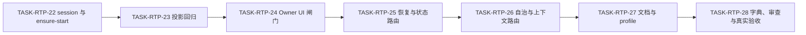
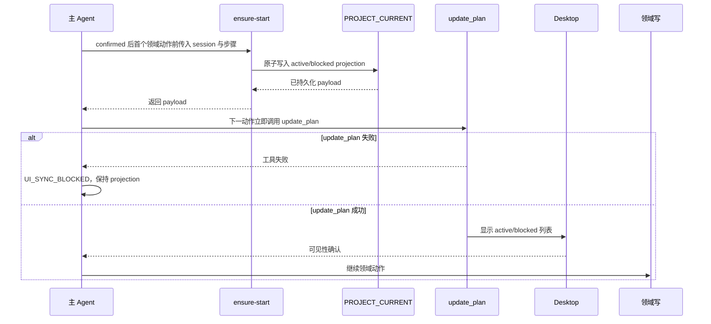

# Codex Desktop 任务悬浮窗断点恢复：实施周期 07 首次持久化即悬浮窗同步

结论：默认执行任务在第一个领域动作前保存当前任务投影，并立即刷新任务悬浮列表；影响：用户可以从任务开始就看到可恢复的步骤，宿主刷新失败时不会误以为任务已可见；范围：首次保存、紧邻刷新、会话识别、状态可见性和十分钟异常修复；非范围：桌面产品源码、后台定时器、历史状态格式和子 Agent 主界面权限；变化：首次显示从超时补建改为保存后立即刷新，十分钟只用于修复漏显示；完成标准：自动行为、文档门禁和顺序审查完成，真实桌面受宿主限制时保留明确受限结论；术语说明：任务投影是写入项目当前文档、供悬浮列表复原的步骤状态；验证状态：本地回归、Skill 与文档 strict profile、审查均已完成，真实 Desktop 首显保持 `LIMITED/HOST_BLOCKED`。

## 当前计划最终方案简要说明

默认执行模式取得 `confirmed` 后，在第一个领域动作前通过唯一 `ensure-start` 入口原子持久化当前 session 的 `active` 或 `blocked` projection；持久化成功后的下一动作固定为 `update_plan`。若 UI 调用失败，保留投影并进入 `UI_SYNC_BLOCKED`，停止下一领域写；十分钟 `ensure-timeout` 只承担漏显示的异常修复。

## Agent 对当前问题的理解

用户反馈会话 `019f9a43-800a-73b0-80bb-2a79bf2abd67` 执行约 29 分钟仍没有任务悬浮窗。现有规则把十分钟检查当作主要补建入口，不能保证首次投影持久化后立即刷新 UI，导致磁盘状态与用户可见状态脱节。本周期的目标是修复顺序和可见性契约，不改变 registry v4 schema，也不修改 Codex Desktop 产品代码。

| 项目 | 本周期冻结内容 |
|---|---|
| 问题 | 首次持久化 projection 后没有强制下一动作刷新 UI，任务可能长时间无列表。 |
| 目标 | 首个领域动作前持久化当前 session；成功后立即 `update_plan`；失败进入 `UI_SYNC_BLOCKED`。 |
| 本轮范围 | `ensure-start` 入口、session 解析、Plan Mode 排除、active/blocked/inactive 可见性、十分钟异常修复、规则文档、单元与真实宿主证据。 |
| 非范围 | Desktop 产品源码、后台定时器、registry v4 新字段、子 Agent 主 UI 调用、Git 历史写入和非 local 服务。 |
| 当前优先闭环 | `TASK-RTP-22` 至 `TASK-RTP-28` 逐项实现、真实测试、审查和验收。 |
| 关键假设 | 宿主 `update_plan` 可接收投影 Owner 返回的合法 payload；真实 UI 证据若被宿主限制，验收保留 `LIMITED/HOST_BLOCKED`。 |

## 当前周期目标、边界与进入条件

| 项目 | 内容 |
|---|---|
| 周期 ID | `CYCLE-RTP-07` |
| 唯一目标 | 把“持久化 projection 后立即刷新任务列表”设为默认执行硬闸门，并保留十分钟异常修复。 |
| 进入条件 | Cycle 06 的 v4 registry、Goal/普通投影入口、原 `ensure-timeout` 和需求/验收增量已可读取；当前工作树的其它 session 改动已识别。 |
| 收口条件 | `AC-RTP-014..017`、文档 profile、投影回归、顺序拦截和真实 Desktop 首显证据均完成；宿主阻断时记录明确受限状态。 |
| 最大推进边界 | 只修改本周期列出的规则、脚本、测试和文档；不修改 Desktop 产品、不连接 test/prod、不提交 Git、不覆盖其它 session。 |

## 当前代码/文档基线

| 基线 | 当前事实 | 本周期保护要求 |
|---|---|---|
| 投影 Owner | `task-plan-rehydration-rules/scripts/task_plan_projection.py` 已维护 v4 registry、原子写入和 payload | 复用白名单 schema，不新增 UI 同步字段；写盘成功后才返回 payload。 |
| 现有入口 | `ensure-timeout` 只在严格大于 600 秒检查点补建 | 保留其时间和暂停语义，但改为异常修复入口；新增首显入口不等待阈值。 |
| 宿主 UI | 主 Agent 使用 `update_plan` 刷新悬浮任务列表 | 子 Agent 不调用主 UI；调用失败保留投影并进入 `UI_SYNC_BLOCKED`。 |
| 规则路由 | 默认执行、Plan Mode、自治和恢复规则已有各自职责 | 只增加单向触发；不复制 schema、Goal 生命周期或恢复状态机。 |
| 工作树 | 其它会话存在未提交新增文档和脚本改动 | 只使用窄补丁，先检查目标文件，再检查 diff；不 reset/checkout。 |
| 图片资产决策 | N/A。原因：本周期交付规则、脚本和行为证据，不生产位图；证据由 Mermaid 图、测试输出和宿主记录表达。 | 不新增图片清单。 |

图片资产决策：N/A。原因：本周期无视觉资产交付，所有关系由流程图、时序图和行为断言表达。

## 现状与落点

```text
F:/luode-skills/
├─ task-plan-rehydration-rules/
│  ├─ SKILL.md
│  ├─ scripts/task_plan_projection.py
│  └─ tests/test_task_plan_projection.py
├─ autonomous-execution-rules/SKILL.md
├─ project-rule-file-bootstrap-rules/SKILL.md
├─ context-compression-rules/SKILL.md
├─ doc/2-需求/2026-07-23_012302_CodexDesktop任务悬浮窗断点恢复.md
├─ doc/3-实施/2026-07-26_150000_CodexDesktop任务悬浮窗断点恢复_实施周期07_首次持久化即悬浮窗同步.md
└─ doc/7-验收/2026-07-23_012302_CodexDesktop任务悬浮窗断点恢复_验收标准.md
```

| 任务 | 文件/符号落点 | 变更边界 |
|---|---|---|
| `TASK-RTP-22` | `task-plan-rehydration-rules/scripts/task_plan_projection.py`：session 解析与 `ensure_start_projection` | 只处理当前 session，显式参数优先；不改 v4 字段。 |
| `TASK-RTP-23` | `task-plan-rehydration-rules/tests/test_task_plan_projection.py`：首次持久化、Plan Mode、许可和跨 session 负向用例 | 只用临时目录和 local Python。 |
| `TASK-RTP-24` | `task-plan-rehydration-rules/SKILL.md` 与公开契约：写盘后立即 UI、`UI_SYNC_BLOCKED` | 保持单一 Owner，不让脚本直接调用宿主。 |
| `TASK-RTP-25` | `project-rule-file-bootstrap-rules`、`task-plan-rehydration-rules`、恢复路由：active/blocked/inactive 与 session 隔离 | 不读取或覆盖其它会话 projection。 |
| `TASK-RTP-26` | `autonomous-execution-rules`、`context-compression-rules`：首次持久化顺序和 Plan Mode 退出 | 不扩张执行许可和子 Agent 权限。 |
| `TASK-RTP-27` | `doc/2-需求`、`doc/7-验收`、本周期文档：需求、AC、回滚和追踪同步 | 中文 UTF-8，profile 必须通过。 |
| `TASK-RTP-28` | `skill-dictionary`、测试/审查/验收证据和真实 Desktop 记录 | 生成资产只保留预期差异；真实 UI 不可见时保持受限。 |

## 周期依赖图与垂直切片

图形目的：说明规则、Owner、测试、文档和真实 UI 的依赖；关联 ID：`TASK-RTP-22..28`、`AC-RTP-014..017`。


| 垂直切片 | 输入 | 输出 | 完成标准 |
|---|---|---|---|
| `SLICE-RTP-006-A` | `confirmed`、首个领域动作、合法 session | 当前 session 的 active/blocked projection | 写盘先于领域动作，未污染其它正文。 |
| `SLICE-RTP-006-B` | 已持久化 payload、宿主成功/失败 | `update_plan` 结果或 `UI_SYNC_BLOCKED` | 下一动作固定为 UI 调用；失败不继续领域写。 |
| `SLICE-RTP-006-C` | active/blocked/inactive、显式/环境 session | 可见性与失败关闭结果 | active/blocked 有列表，inactive 无新列表，冲突/缺失非零退出。 |
| `SLICE-RTP-006-D` | 首次列表缺失、599/600/601 秒检查点 | 异常修复结果 | 默认首显不等十分钟，严格大于 600 秒才可补建。 |

## 周期内最小任务执行顺序

图形目的：每个最小任务先完成自己的实现、真实测试、审查和验收，再进入下一个任务；关联 ID：`TASK-RTP-22..28`。



| 顺序 | 任务 ID | 唯一目标 | 文件/符号 | 依赖 |
|---:|---|---|---|---|
| 1 | `TASK-RTP-22` | 冻结并实现 session 解析和首次投影入口 | `task_plan_projection.py` 的解析函数、`ensure_start_projection` | 需求/验收增量 |
| 2 | `TASK-RTP-23` | 覆盖首次持久化和失败关闭行为 | `test_task_plan_projection.py` 的行为测试 | `TASK-RTP-22` |
| 3 | `TASK-RTP-24` | 冻结写盘后立即 `update_plan` 与 `UI_SYNC_BLOCKED` | Owner Skill、契约、主 Agent 提示 | `TASK-RTP-23` |
| 4 | `TASK-RTP-25` | 接入恢复、active/blocked/inactive 与子 Agent 边界 | 自举/恢复规则及引用 | `TASK-RTP-24` |
| 5 | `TASK-RTP-26` | 接入自治、上下文压缩和 Plan Mode 排除 | `autonomous-execution-rules`、`context-compression-rules` | `TASK-RTP-25` |
| 6 | `TASK-RTP-27` | 同步需求、验收、周期和工程文档追踪 | 三类文档、profile 命令 | `TASK-RTP-26` |
| 7 | `TASK-RTP-28` | 字典、全回归、审查与真实 Desktop 首显 | 生成资产、证据和收口状态 | `TASK-RTP-27` |

## 最小任务闭环

| 任务 | 实现 | 真实测试 | 审查 | 验收 | 停止条件 |
|---|---|---|---|---|---|
| `TASK-RTP-22` | 实现显式 session 优先、环境回退、冲突失败和 `ensure-start` 原子入口 | 直接调用 CLI/函数验证写入、失败退出、哈希不变 | 检查 v4 schema、会话隔离和无敏感字段 | `AC-RTP-014` | 任意冲突被猜测、其它 session 被覆盖或写盘顺序错误。 |
| `TASK-RTP-23` | 增加 active/blocked/inactive、Plan Mode、许可、完成和非法输入测试 | Python 行为测试，样本使用 TemporaryDirectory | 检查断言确实观察文件和调用顺序，不以编译代替行为 | `AC-RTP-014/016` | 测试只静态查文本、跨用共享文件或未清理样本。 |
| `TASK-RTP-24` | 更新 Owner 契约，定义持久化后立即 UI 和 `UI_SYNC_BLOCKED` | 模拟宿主成功/失败，记录下一动作序列 | 检查脚本不直接调用宿主、主 Agent 单一 UI 权限 | `AC-RTP-015` | UI 失败后继续领域写、删除投影或声称可见。 |
| `TASK-RTP-25` | 同步恢复链路与状态可见性，禁止 inactive 新列表和子 Agent UI | 恢复/状态路由正反例与多 session fixture | 检查恢复不跨来源、不恢复执行授权 | `AC-RTP-016` | active/blocked 无列表、inactive 复活或跨 session 读取。 |
| `TASK-RTP-26` | 同步自治、上下文压缩和 Plan Mode 排除 | 规则文本行为测试与受限回合演练 | 检查无后台计时、无 Goal/子 Agent越权 | `AC-RTP-016/017` | Plan Mode 调 UI、子 Agent 调主 UI 或授权范围扩大。 |
| `TASK-RTP-27` | 写入需求、验收、周期和追踪矩阵 | requirement/acceptance/implementation profile | 审查 ID 双向追踪、术语、图形和 UTF-8 | 文档门禁 PASS | profile 失败、孤立 ID、图形不可解析或旧口径残留。 |
| `TASK-RTP-28` | 生成字典并形成回归、审查、验收和真实宿主证据 | 全回归、quick validate、字典生成、Desktop 首显 | 实现审查和当前改动总审查 | `AC-RTP-014..017` | 真实 UI 缺证据时不得宣称正式通过；生成漂移或用户结束指令立即停止。 |

## 当前周期验证矩阵

| 测试 ID | 场景/样本 | 命令或入口 | 通过断言 | 清理 |
|---|---|---|---|---|
| `TEST-RTP-019` | 首个领域动作前 active/blocked 持久化 | Python 行为测试 | 当前 session 先写入 projection，原正文和其它 session 字节不变 | TemporaryDirectory |
| `TEST-RTP-020` | Plan Mode、未确认许可、已完成任务、来源缺失 | Python 负向测试 | 非法前置状态零写盘、零 UI 调用、非零错误有明确原因 | TemporaryDirectory |
| `TEST-RTP-021` | 写盘后 UI 成功/失败顺序 | 宿主调用序列模拟与规则契约测试 | 下一动作唯一为 `update_plan`；失败返回 `UI_SYNC_BLOCKED` 且投影保留 | 临时 registry 与调用日志 |
| `TEST-RTP-022` | active/blocked/inactive 可见性 | 投影恢复与状态路由测试 | active/blocked 生成列表，inactive 不新建 | TemporaryDirectory |
| `TEST-RTP-023` | session 参数优先/回退/冲突/缺失 | CLI/函数测试 | 显式值优先；冲突或缺失非零退出、哈希不变 | TemporaryDirectory |
| `TEST-RTP-024` | 默认首显不等十分钟 | 默认执行路由行为测试 | 首次 projection 立即进入 UI 调用，不运行 timeout | 无持久副作用；只读调用日志 |
| `TEST-RTP-025` | 漏显示 599/600/601 与 Plan Mode/已有 projection | `ensure-timeout` 回归测试 | 599/600 不修复，601 才可异常修复；排除条件不写入 | TemporaryDirectory |

## 真实测试与断言

```powershell
python -X utf8 -B task-plan-rehydration-rules/tests/test_task_plan_projection.py
python -X utf8 -B -m py_compile task-plan-rehydration-rules/scripts/task_plan_projection.py task-plan-rehydration-rules/tests/test_task_plan_projection.py
python -X utf8 -B .system/skill-creator/scripts/quick_validate.py task-plan-rehydration-rules
python -X utf8 -B .system/skill-creator/scripts/quick_validate.py autonomous-execution-rules
python -X utf8 -B artifact-delivery-gate-rules/scripts/validate_engineering_docs.py --profile requirement --doc "doc/2-需求/2026-07-23_012302_CodexDesktop任务悬浮窗断点恢复.md" --root .
python -X utf8 -B artifact-delivery-gate-rules/scripts/validate_engineering_docs.py --profile acceptance --doc "doc/7-验收/2026-07-23_012302_CodexDesktop任务悬浮窗断点恢复_验收标准.md" --root .
python -X utf8 -B artifact-delivery-gate-rules/scripts/validate_engineering_docs.py --profile implementation_cycle --doc "doc/3-实施/2026-07-26_150000_CodexDesktop任务悬浮窗断点恢复_实施周期07_首次持久化即悬浮窗同步.md" --root .
python -X utf8 -B skill-dictionary/generate_dictionary.py
git diff --check
```

依赖环境为 Windows local 工作区、Python 3、当前受管 Skills 仓库和 Codex Desktop 本地宿主；不连接数据库、缓存、消息队列、HTTP/RPC 上游或 test/prod 服务。行为通过文件哈希、调用序列、退出码和 payload 对照断言；编译和静态检查只作辅助，不替代真实行为及 UI 可见性。

图形目的：说明真实宿主验证必须在写盘后立即刷新，失败则停止领域写；关联 ID：`TEST-RTP-019..025`、`AC-RTP-014..017`。



## 任务四类证据矩阵

| 证据 ID | 类别 | 任务 | 证据内容 | 状态 |
|---|---|---|---|---|
| `EVD-TASK-RTP-22-IMPL` | IMPL | `TASK-RTP-22` | session 解析和 `ensure-start` 落点与 schema 边界 | PASS |
| `EVD-TASK-RTP-22-TEST` | TEST | `TASK-RTP-22` | `TEST-RTP-019/020` 输出和原文件哈希 | PASS |
| `EVD-TASK-RTP-22-REVIEW` | REVIEW | `TASK-RTP-22` | 会话隔离、参数优先和原子写入审查 | PASS |
| `EVD-TASK-RTP-22-ACCEPT` | ACCEPT | `TASK-RTP-22` | `AC-RTP-014` 二值验收 | PASS |
| `EVD-TASK-RTP-23-IMPL` | IMPL | `TASK-RTP-23` | 首显与负向回归测试落盘 | PASS |
| `EVD-TASK-RTP-23-TEST` | TEST | `TASK-RTP-23` | `TEST-RTP-020` 行为测试输出 | PASS |
| `EVD-TASK-RTP-23-REVIEW` | REVIEW | `TASK-RTP-23` | 测试样本隔离与清理审查 | PASS |
| `EVD-TASK-RTP-23-ACCEPT` | ACCEPT | `TASK-RTP-23` | `AC-RTP-014/016` 二值验收 | PASS |
| `EVD-TASK-RTP-24-IMPL` | IMPL | `TASK-RTP-24` | Owner UI 顺序和失败状态契约 | PASS |
| `EVD-TASK-RTP-24-TEST` | TEST | `TASK-RTP-24` | `TEST-RTP-021` 调用序列与失败输出 | PASS |
| `EVD-TASK-RTP-24-REVIEW` | REVIEW | `TASK-RTP-24` | 单一 UI Owner 与无越权审查 | PASS |
| `EVD-TASK-RTP-24-ACCEPT` | ACCEPT | `TASK-RTP-24` | `AC-RTP-015` 二值验收 | PASS |
| `EVD-TASK-RTP-25-IMPL` | IMPL | `TASK-RTP-25` | 恢复与状态可见性路由同步 | PASS |
| `EVD-TASK-RTP-25-TEST` | TEST | `TASK-RTP-25` | `TEST-RTP-022/023` 状态和 session 输出 | PASS |
| `EVD-TASK-RTP-25-REVIEW` | REVIEW | `TASK-RTP-25` | 多 session 与 inactive 保护审查 | PASS |
| `EVD-TASK-RTP-25-ACCEPT` | ACCEPT | `TASK-RTP-25` | `AC-RTP-016` 二值验收 | PASS |
| `EVD-TASK-RTP-26-IMPL` | IMPL | `TASK-RTP-26` | 自治、压缩和 Plan Mode 规则同步 | PASS |
| `EVD-TASK-RTP-26-TEST` | TEST | `TASK-RTP-26` | `TEST-RTP-024/025` 排除条件与异常修复输出 | PASS |
| `EVD-TASK-RTP-26-REVIEW` | REVIEW | `TASK-RTP-26` | 授权边界和子 Agent 禁止 UI 审查 | PASS |
| `EVD-TASK-RTP-26-ACCEPT` | ACCEPT | `TASK-RTP-26` | `AC-RTP-016/017` 二值验收 | PASS |
| `EVD-TASK-RTP-27-IMPL` | IMPL | `TASK-RTP-27` | 需求、验收、周期文档和追踪矩阵 | PASS |
| `EVD-TASK-RTP-27-TEST` | TEST | `TASK-RTP-27` | 三类文档 profile 和 UTF-8 检查 | PASS |
| `EVD-TASK-RTP-27-REVIEW` | REVIEW | `TASK-RTP-27` | 旧口径、孤立 ID、图形和双向追踪审查 | PASS |
| `EVD-TASK-RTP-27-ACCEPT` | ACCEPT | `TASK-RTP-27` | 文档交付门禁 | PASS |
| `EVD-TASK-RTP-28-IMPL` | IMPL | `TASK-RTP-28` | 字典、回归、审查和真实 Desktop 证据 | PASS |
| `EVD-TASK-RTP-28-TEST` | TEST | `TASK-RTP-28` | 全量命令和宿主可见性结果 | LIMITED |
| `EVD-TASK-RTP-28-REVIEW` | REVIEW | `TASK-RTP-28` | 实现审查与当前改动总审查 | LIMITED |
| `EVD-TASK-RTP-28-ACCEPT` | ACCEPT | `TASK-RTP-28` | `AC-RTP-014..017` 最终放行或受限 | LIMITED |

## 周期阻断、停止与回滚

| 类型 | 条件 | 动作 |
|---|---|---|
| 阻断 | session 缺失、冲突、非法或跨会话覆盖风险 | 非零退出，保留原文件，不调用 `update_plan`，停止当前任务。 |
| 阻断 | projection 写入失败、UTF-8 漂移、原子替换失败或敏感字段进入投影 | 保留原文件，停止领域写，记录阻断证据。 |
| 阻断 | `update_plan` 失败 | 保留已写投影，标记 `UI_SYNC_BLOCKED`，不宣称可见，不继续下一领域写。 |
| 停止 | Plan Mode、子 Agent 或 inactive 状态触发主 UI | 立即停止并修正规则路由，禁止以十分钟入口掩盖。 |
| 停止 | 真实 Desktop 无法证明列表可见 | 保持 `LIMITED/HOST_BLOCKED`，不把 CLI/静态结果升级为正式 UI 通过。 |
| 回滚 | 周期 07 引入回归或调用顺序漂移 | 仅撤销周期 07 新增入口、规则、测试和文档增量，保留 v4、恢复、Goal 和原 timeout。 |

回滚不使用 `git reset`、`git checkout` 或历史提交，不覆盖其它 session projection；所有临时 fixture 在测试结束删除，失败时先保存哈希证据再清理。

## 周期追踪矩阵

| 来源/变更 | 决策 | 需求/规则 | 验收 | 任务 | 测试/证据 |
|---|---|---|---|---|---|
| `SRC-RTP-006/CHG-RTP-002` | `DEC-RTP-010` | `REQ-RTP-010/011`、`RULE-RTP-016..018` | `AC-RTP-014/015` | `TASK-RTP-22..24` | `TEST-RTP-019..021`、`EVD-TASK-RTP-22..24-*` |
| `SRC-RTP-006/CHG-RTP-002` | `DEC-RTP-011/012` | `REQ-RTP-012/013`、`RULE-RTP-019..022` | `AC-RTP-016/017` | `TASK-RTP-25..28` | `TEST-RTP-022..025`、`EVD-TASK-RTP-25..28-*` |

## 自审结论

- 当前方案把首次投影持久化和 `update_plan` 绑定为同一默认执行闸门，十分钟只保留异常修复语义。
- 每个最小任务均列明文件/符号、真实测试、审查、验收、停止条件和回滚；任务按垂直切片串行收口。
- `PROJECT_CURRENT.md`、`PROJECT_MEMORY.md` 不在本周期写集内，由主 Agent 统一维护，避免覆盖其它会话 projection。
- 当前状态为 `in_progress`；TASK-RTP-22..27 的四类证据为 `PASS`，TASK-RTP-28 的实现为 `PASS`、测试/审查/验收为 `LIMITED`；真实 Desktop 可见性证据未取得前，不得宣称正式通过；`unresolved_decisions: []`。

## 执行附录

数据库、缓存、消息队列、HTTP/RPC 上游和 test/prod 环境均为 N/A。原因：本周期只验证 local Skills、临时投影文件、宿主任务工具和规则文档；任何外部连接均超出授权边界。所有命令从当前 Windows 工作区执行，新增/修改文本保持 UTF-8，命令输出和证据文件不得保存凭据、token、session 原文或用户敏感内容。

## 追踪附录

- 需求文档：`doc/2-需求/2026-07-23_012302_CodexDesktop任务悬浮窗断点恢复.md`。
- 验收文档：`doc/7-验收/2026-07-23_012302_CodexDesktop任务悬浮窗断点恢复_验收标准.md`。
- 主链：`SRC-RTP-006 -> CHG-RTP-002 -> DEC-RTP-010/011/012 -> REQ-RTP-010..013 + RULE-RTP-016..022 -> AC-RTP-014..017 -> CYCLE-RTP-07 -> TASK-RTP-22..28 -> TEST-RTP-019..025 -> EVD-TASK-RTP-22..28-*`。
- 本周期不改写 Cycle 01-06 的历史实现证据；旧“简单任务可先无悬浮窗”口径由 `CHG-RTP-002` 明确替换为“首次持久化即同步，十分钟仅异常修复”。
