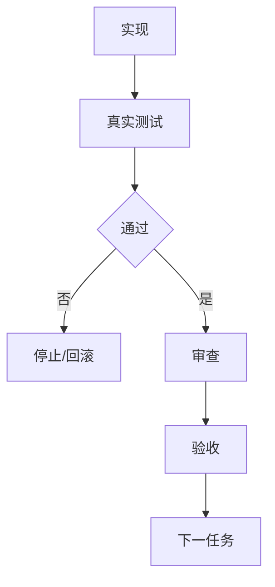
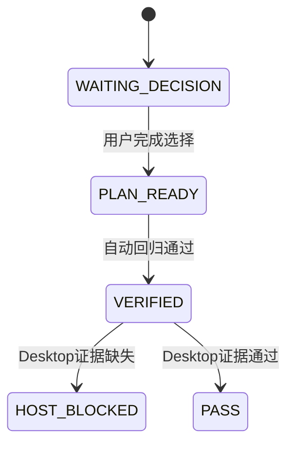

# CYCLE-PLAN-01..05：规则与回归

结论：本周期依次完成夹具、规则、同步、文档、回归和验收；影响：Plan Mode 计划出口；范围：本 Bug 文件集；非范围：产品源码和 Git 历史；变化：唯一 Owner；完成标准：逐任务闭环；术语说明：`HOST_BLOCKED` 表示宿主证据缺失；验证状态：进行中。

## 当前代码/文档基线

基线提交：`2707009b94c07b6b142057fa8bf32db0d7134cb8`；工作树存在其它会话未提交改动，本周期只允许目标文件窄补丁。

## 当前周期目标、边界与进入条件

目标：完成脱敏回归、Skill 互斥、路由同步、文档链和收口验证。进入条件：`BUG-PLAN-OUTPUT-20260726-001` 已确认、用户已授权 Default Mode 执行、无未决选择。边界：不改产品源码、不提交 Git。

## 周期内最小任务执行顺序

| 顺序 | 任务 | 只做一件事 |
|---|---|---|
| 01 | `TASK-PLAN-01` | 建立夹具 |
| 02 | `TASK-PLAN-02` | 修复总结 Skill 的 Plan Mode 负向退出 |
| 03 | `TASK-PLAN-03` | 固定计划 Owner 与唯一出口 |
| 04 | `TASK-PLAN-04` | 固定等待与压缩恢复边界 |
| 05 | `TASK-PLAN-05` | 同步命中总控 |
| 06 | `TASK-PLAN-06` | 同步双平台与 bootstrap |
| 07 | `TASK-PLAN-07` | 补齐工程文档链 |
| 08 | `TASK-PLAN-08` | 更新字典与项目记忆 |
| 09 | `TASK-PLAN-09` | 执行自动回归与合规校验 |
| 10 | `TASK-PLAN-10` | 完成实现审查与当前改动总审查 |
| 11 | `TASK-PLAN-11` | 完成真实新 Plan 会话验证或记录宿主阻断 |

## 最小任务闭环

每个任务固定执行“实现 -> 真实测试 -> 审查 -> 验收”；任何一步失败立即停止当前周期并保留失败证据，不跨任务推进。

## 文件/符号操作契约

| 任务 | 文件/符号 | 禁止触碰 |
|---|---|---|
| `TASK-PLAN-01` | `doc/5-tests/2026-07-26_plan-output/` | 其它测试日期目录 |
| `TASK-PLAN-02..04` | 两个 Skill 与压缩规则 | 非目标 Skill 行为 |
| `TASK-PLAN-05..06` | 命中总控、AGENTS、CLAUDE、bootstrap | 用户既有规则段 |
| `TASK-PLAN-07..08` | doc 链、项目记忆、字典 | 其它来源对象状态 |
| `TASK-PLAN-09..11` | 测试和审查证据 | Git 历史、外部服务 |

## 当前周期验证矩阵

| ID | 入口 | 断言 | 失败处理 |
|---|---|---|---|
| `TEST-PLAN-001` | 专项 unittest + 永久等待状态模型 | 6/6 与 10/10 通过 | 修正夹具/规则后复验 |
| `TEST-PLAN-002` | `quick_validate.py` | 三个 Skill 合规 | 停止收口 |
| `TEST-PLAN-003` | 文档 validator | `valid=true` | 修正文档字段 |
| `TEST-PLAN-004` | 字典生成器 | 无漂移 | 重新生成 |
| `TEST-PLAN-005` | `git diff --check` | 无空白错误 | 修正编码/换行 |
| `TEST-PLAN-006` | 真实新 Plan 会话 | 合法 proposed_plan | LIMITED/HOST_BLOCKED |

## 真实测试与断言

所有测试使用 local Python 3、UTF-8 和脱敏样本；禁止 test/prod 连接。专项测试必须验证 Plan-ready、WAITING_DECISION、context_compacted 和 Default Mode 四类行为，并调用既有状态模型验证空答案循环、部分答案、单活动框和冻结输出。

## 周期阻断、停止与回滚

- 停止：规则 Owner 冲突、任何自动测试失败、profile 失败、发现敏感信息、宿主证据缺失或用户要求停止。
- 回滚：只删除本 Bug 新增文件和新增规则行；不使用 reset/checkout，不触碰其它会话改动。
- 宿主缺证据：保持 `LIMITED/HOST_BLOCKED`，不得把静态测试写成用户可见性通过。

## 周期流程图

图形目的：表达任务闭环和阻断；关联 ID：`CYCLE-PLAN-01-05`。

## 周期状态图

图形目的：表达未决、计划和宿主阻断状态；关联 ID：`AC-PLAN-001..005`。

## 周期追踪矩阵

| 任务 | 规则/验收 | 测试 | 证据 |
|---|---|---|---|
| `TASK-PLAN-01` | `REQ-PLAN-001..005` / `AC-PLAN-001..005` | `TEST-PLAN-001` | fixture 输出 |
| `TASK-PLAN-02..06` | `RULE-PLAN-001..006` | `TEST-PLAN-002/005` | Skill diff |
| `TASK-PLAN-07..08` | 文档追踪契约 | `TEST-PLAN-003/004` | profile/字典 |
| `TASK-PLAN-09..11` | 最终验收 | `TEST-PLAN-006` | 审查/宿主记录 |

## 任务证据登记

| 任务 | 实现证据 | 测试证据 | 审查证据 | 验收证据 |
|---|---|---|---|---|
| `TASK-PLAN-01` | `EVD-TASK-PLAN-01-IMPL` | `EVD-TASK-PLAN-01-TEST` | `EVD-TASK-PLAN-01-REVIEW` | `EVD-TASK-PLAN-01-ACCEPT` |
| `TASK-PLAN-02` | `EVD-TASK-PLAN-02-IMPL` | `EVD-TASK-PLAN-02-TEST` | `EVD-TASK-PLAN-02-REVIEW` | `EVD-TASK-PLAN-02-ACCEPT` |
| `TASK-PLAN-03` | `EVD-TASK-PLAN-03-IMPL` | `EVD-TASK-PLAN-03-TEST` | `EVD-TASK-PLAN-03-REVIEW` | `EVD-TASK-PLAN-03-ACCEPT` |
| `TASK-PLAN-04` | `EVD-TASK-PLAN-04-IMPL` | `EVD-TASK-PLAN-04-TEST` | `EVD-TASK-PLAN-04-REVIEW` | `EVD-TASK-PLAN-04-ACCEPT` |
| `TASK-PLAN-05` | `EVD-TASK-PLAN-05-IMPL` | `EVD-TASK-PLAN-05-TEST` | `EVD-TASK-PLAN-05-REVIEW` | `EVD-TASK-PLAN-05-ACCEPT` |
| `TASK-PLAN-06` | `EVD-TASK-PLAN-06-IMPL` | `EVD-TASK-PLAN-06-TEST` | `EVD-TASK-PLAN-06-REVIEW` | `EVD-TASK-PLAN-06-ACCEPT` |
| `TASK-PLAN-07` | `EVD-TASK-PLAN-07-IMPL` | `EVD-TASK-PLAN-07-TEST` | `EVD-TASK-PLAN-07-REVIEW` | `EVD-TASK-PLAN-07-ACCEPT` |
| `TASK-PLAN-08` | `EVD-TASK-PLAN-08-IMPL` | `EVD-TASK-PLAN-08-TEST` | `EVD-TASK-PLAN-08-REVIEW` | `EVD-TASK-PLAN-08-ACCEPT` |
| `TASK-PLAN-09` | `EVD-TASK-PLAN-09-IMPL` | `EVD-TASK-PLAN-09-TEST` | `EVD-TASK-PLAN-09-REVIEW` | `EVD-TASK-PLAN-09-ACCEPT` |
| `TASK-PLAN-10` | `EVD-TASK-PLAN-10-IMPL` | `EVD-TASK-PLAN-10-TEST` | `EVD-TASK-PLAN-10-REVIEW` | `EVD-TASK-PLAN-10-ACCEPT` |
| `TASK-PLAN-11` | `EVD-TASK-PLAN-11-IMPL` | `EVD-TASK-PLAN-11-TEST` | `EVD-TASK-PLAN-11-REVIEW` | `EVD-TASK-PLAN-11-ACCEPT` |

## 自审结论

周期顺序、文件契约、真实测试、停止条件和回滚边界已冻结；每个任务只能在自身闭环通过后推进。

图片资产决策：`N/A + 原因 + 证据`；周期只改变文本规则和本地测试，不生成业务图片。
