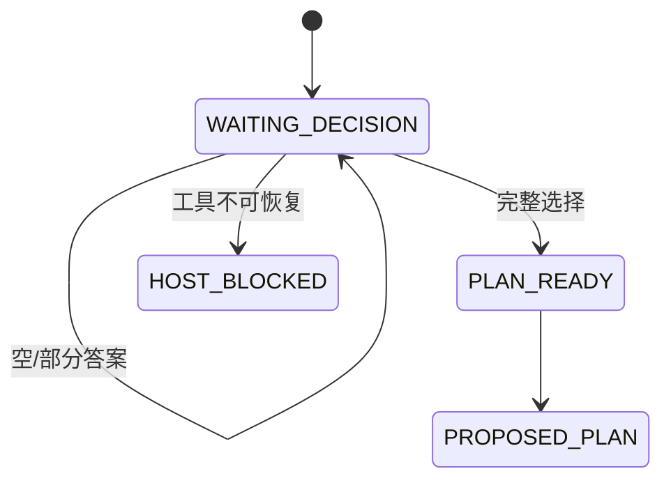
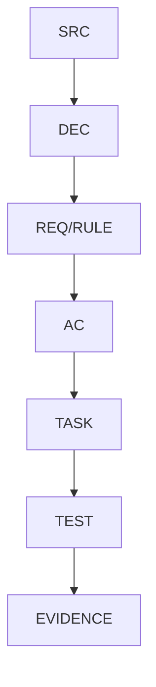

# Plan Mode 计划出口 Bug 实施总览

结论：本总览通过规则互斥和脱敏回归修复 Plan Mode 计划出口；影响：计划可见协议；范围：Skill、测试、文档和验收；非范围：产品源码与 Git 历史；变化：总结 Skill 在 Plan Mode 下标记为不适用；完成标准：每项任务逐个闭环；术语说明：不适用表示该 Skill 不参与计划路由；验证状态：实施中；图片资产决策：N/A + 原因 + 证据：本 Bug 只涉及文本规则、消息契约和测试 fixture，Mermaid 与 JSON 已覆盖可复核信息。

## 当前计划最终方案简要说明

由 `implementation-planning-rules` 独占 Plan Mode 计划出口，给 `reasoning-summary-structure-rules` 增加硬排除，并同步命中总控、压缩恢复和双平台规则；用脱敏消息回归证明计划/总结互斥，最后以真实新 Plan 会话确认用户可见协议。

## Agent 对当前问题的理解

问题是两个 Skill 同时命中，压缩交接阶段由总结 Skill 输出 `final_answer`，导致合法 `<proposed_plan>` 未生成。本实施覆盖规则、测试、文档、字典和验证，不修改 Desktop 产品源码或 Git 历史。

## 实施周期总览

| 周期 | 目标 | 收口条件 |
|---|---|---|
| `CYCLE-PLAN-01` | 脱敏夹具与失败基线 | 失败可复现 |
| `CYCLE-PLAN-02` | 总结负向退出与计划 Owner | Owner 唯一 |
| `CYCLE-PLAN-03` | 命中总控、压缩、双平台同步 | 规则源一致 |
| `CYCLE-PLAN-04` | 文档、字典和状态链 | profile 通过 |
| `CYCLE-PLAN-05` | 回归、审查和真实宿主验证 | PASS 或 LIMITED |

## 阶段计划

| 阶段 | 输入 | 输出 | 验证门槛 |
|---|---|---|---|
| 规则修复 | 原始会话证据 | Owner 互斥窄补丁 | 专项回归 |
| 工程同步 | 已修复规则 | 双平台与文档链 | profile/字典 |
| 收口验证 | 全部改动 | 审查与验收证据 | 无 P0/P1 |

## 最小任务清单

### TASK-PLAN-01：脱敏回归夹具

文件/符号：`doc/5-tests/2026-07-26_plan-output/`；操作：新增四类 fixture、完整计划字段断言和状态模型接入；禁止触碰：其它日期测试目录；真实测试：专项 unittest 并运行既有 10 项等待模型；完成：6/6 与 10/10 通过；停止：fixture 含敏感信息或消息过滤错误。

### TASK-PLAN-02：总结 Skill Plan Mode 负向退出

文件/符号：`reasoning-summary-structure-rules/SKILL.md`、`agents/openai.yaml`、`references/*.md`；操作：加入 `NOT_APPLICABLE`、模板排除和 agent 边界；真实测试：专项静态断言与 quick validate；完成：Plan Mode 不触发；停止：Default Mode 总结回归失败。

### TASK-PLAN-03：计划 Owner 与出口

文件/符号：`implementation-planning-rules/SKILL.md`、`references/plan-output-gate.md`、`agents/openai.yaml`；操作：冻结唯一 Owner 和完整标签出口；真实测试：Plan-ready/Plan-waiting fixture；完成：无未决仅一对标签；停止：存在第二出口。

### TASK-PLAN-04：等待与压缩恢复

文件/符号：`context-compression-rules/SKILL.md`、`implementation-planning-rules/references/plan-output-gate.md`；操作：禁止等待态总结和压缩 `final_answer`；真实测试：waiting/compacted fixture；完成：冻结集合无可见输出；停止：空答案被转为完成。

### TASK-PLAN-05：命中总控同步

文件/符号：`skill-hit-check-rules/SKILL.md`；操作：Plan Mode 排除总结 Skill；真实测试：静态路由断言；完成：命中列表正确；停止：总控仍注入总结 Skill。

### TASK-PLAN-06：双平台与 bootstrap 同步

文件/符号：`AGENTS.md`、`CLAUDE.md`、`project-rule-file-bootstrap-rules/scripts/bootstrap_agents.sh`；操作：同步最低命中条件；真实测试：源与生成文件文本一致性；完成：三处口径一致；停止：生成源漂移。

### TASK-PLAN-07：工程文档链

文件/符号：`doc/2-需求/`、`doc/3-实施/`、`doc/7-验收/`；操作：补 Bug、需求、总览、周期、验收和全量顺序；真实测试：对应 profile；完成：追踪链无孤立 ID；停止：profile 失败。

### TASK-PLAN-08：字典与项目记忆

文件/符号：`skill-dictionary/data.js`、`字典.md`、`PROJECT_CURRENT.md`、`PROJECT_MEMORY.md`、`PROJECT_HISTORY.md`；操作：生成字典并记录稳定规则/当前状态/历史事件；真实测试：生成器、UTF-8、字节数；完成：无漂移；停止：覆盖其它会话状态。

### TASK-PLAN-09：自动回归与合规

真实测试：专项 unittest、三个 `quick_validate.py`、`git diff --check`、文档 profile；完成：全部通过；停止：任一失败。

### TASK-PLAN-10：实现审查与当前改动审查

操作：检查 Owner 唯一性、非 Plan Mode 兼容、敏感信息和用户既有改动；完成：无 P0/P1；停止：发现未授权扩散。

### TASK-PLAN-11：真实新 Plan 会话

操作：新建真实 Plan 会话并记录可回放消息；完成：合法 `<proposed_plan>`；停止：宿主不可操作，状态为 `LIMITED/HOST_BLOCKED`。

## 现状与落点

```text
F:\luode-skills\
├─ reasoning-summary-structure-rules\
├─ implementation-planning-rules\
├─ skill-hit-check-rules\
├─ context-compression-rules\
├─ project-rule-file-bootstrap-rules\scripts\bootstrap_agents.sh
└─ doc\5-tests\2026-07-26_plan-output\
```

## 真实测试安排

使用 local Python 3 和脱敏 fixture；入口为 `py.exe -3 -X utf8 -B doc/5-tests/2026-07-26_plan-output/test_plan_output_contract.py`、三个 Skill `quick_validate.py`、字典生成器和文档 profile。通过标准为行为断言全通过、Skill 合规通过、文档 `valid=true`；静态检查不能替代真实 Desktop 证据。

## 风险与阻断项

| 风险 | 影响 | 处理 |
|---|---|---|
| 工作树已有大量改动 | 误覆盖用户内容 | 仅窄补丁，逐文件 diff |
| Desktop 宿主不可操作 | 无法证明用户可见计划 | 保持 `LIMITED/HOST_BLOCKED` |
| Obsidian 未注册 | 无法沉淀 vault 知识 | 记录阻断，不直接读 vault |
| 字典生成漂移 | Skill 索引不一致 | 重新生成并复核 diff |

## 任务完成、停止与最大推进边界

完成：规则、回归、文档、字典、审查和验收均有证据。停止：未决选择、测试/校验失败、P0/P1、来源冲突或真实宿主阻断。最大推进边界：不修改产品源码、不连接外部服务、不写 Git 历史、不覆盖其它会话 projection。

## 自审结论

计划已按周期和最小任务拆分，每项均有文件/符号、真实测试、完成/停止条件和回滚边界；Mermaid 表达规则流程，未遗留未决决策。


## 依赖流程图

图形目的：表达任务依赖；关联 ID：`CYCLE-PLAN-01..05`。


## 状态图

图形目的：表达等待与计划出口状态；关联 ID：`RULE-PLAN-001..006`。



## 数据关系图

图形目的：表达来源到证据链；关联 ID：`SRC-PLAN-001..003`。



## 追踪矩阵

| REQ/RULE | AC | CYCLE | TASK | TEST | EVIDENCE |
|---|---|---|---|---|---|
| `REQ-PLAN-001..005` | `AC-PLAN-001..005` | `CYCLE-PLAN-01..05` | `TASK-PLAN-01..11` | `TEST-PLAN-001..006` | fixture、profile、审查、宿主日志 |
