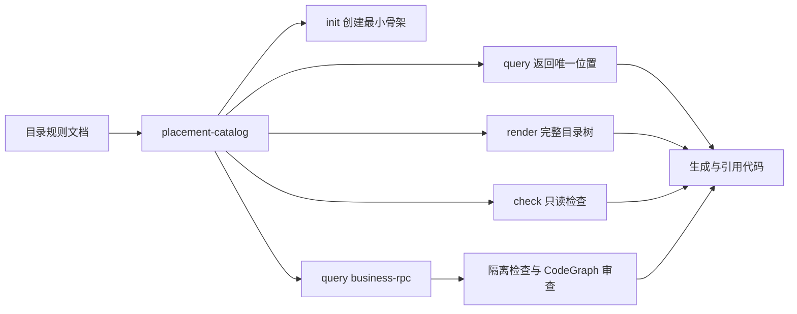
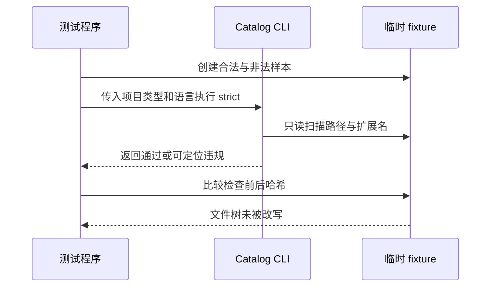
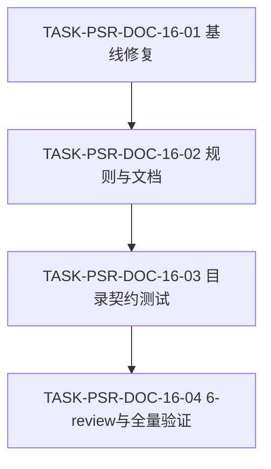

# 代码位置目录规则 V2 实施总览

结论：在保留后端根 `data/` 禁止规则的基础上，本周期把 fullstack、backend、frontend 的活动研发目录统一收敛到 `doc/1-架构/` 至 `doc/6-review/`，并将条件图片资产统一为 `doc/data/images/`；前端根原始静态 data 目录树删除。影响：三类项目的初始化骨架与人工目录树使用同一活动目录，历史旧目录继续只读保留。范围：三类项目人工目录树、Catalog skeleton、初始化骨架、目录专项测试和研发文档。非范围：不迁移业务仓库、不删除历史目录、不改变源码域 data 或执行外部服务。变化：`doc/6-review/` 成为测试后的风格回归记录唯一活动入口。完成标准：三类骨架、人工树和测试断言一致；后端 doc 子树完整；旧活动目录不再生成。术语说明：`skeleton` 指初始化时创建的目录骨架；`6-review` 指测试后的风格回归记录。验证状态：目录专项测试、入口回归、文档 profile 和差异检查按任务顺序执行。图片资产决策：N/A。原因：本次没有视觉验收对象。证据：目录专项测试。

## 当前计划最终方案简要说明

推荐方案是由 `package-structure-rules` 作为唯一目录 Owner：根 `utils/` 只容纳至少一级工具包目录，源码根 `util/` 只容纳直接代码文件，跨业务公开能力只进入 `business/<domain>/rpc/`。这样既能保护 SDK 的项目无关性，也能用 JSON 字符串模拟稳定的服务接口边界。

## Agent 对当前问题的理解

| 项目 | 结论 |
|---|---|
| 用户问题 | 后端根 `data/` 没有唯一职责，却会被目录树、Catalog 和初始化规则保留。 |
| 本轮目标 | 删除该根目录与子树，并让 Catalog、query、render、init、strict 和测试一致。 |
| 当前优先闭环 | `TASK-14-01`：删除目录事实并冻结禁止路径；`TASK-14-02`：验证只读行为和文档证据。 |
| 本轮范围 | `package-structure-rules`、必要相邻规则、V2 测试和研发文档。 |
| 非范围 | 业务仓库迁移、数据库迁移、外部网络、前端 `src/util/`、业务域私有 `util/`。 |
| unresolved_decisions | `[]`；没有 P0 或 P1 未决决策。 |

## 实施周期总览

| 周期 | 目标 | 进入条件 | 收口条件 | 状态 |
|---|---|---|---|---|
| `CYCLE-05` | 固化根 `utils/`、源码根 `util/` 与业务域 `util/` 的职责。 | 用户已冻结目录职责和不兼容迁移策略。 | 四语言映射与引用边界唯一。 | 已完成 |
| `CYCLE-06` | 让 Catalog、CLI、测试、审查和验收对新规则给出相同结论。 | `CYCLE-05` 已完成。 | 查询、渲染、初始化、strict/legacy 行为和无写入证据完成。 | 已完成；文档 profile 与通用 Skill 快速校验通过 |
| `CYCLE-07` | 固化业务域 `rpc/`、JSON 通信与跨域导入禁令。 | 用户冻结微业务通信边界。 | 目录树、引用契约、微业务守护规则无旧 `contract/` 通信口径。 | 已完成 |
| `CYCLE-08` | 让 Catalog、CLI、确定性隔离检查、CodeGraph 与本地测试共同验证 RPC。 | `CYCLE-07` 已完成。 | query/render/init/check、导入正反例、JSON 响应和无写入证据完成。 | 已完成；文档 profile 与通用 Skill 快速校验通过 |
| `CYCLE-09` | 让旧项目通过收敛清单逐步采用 V2，而不进行一次性迁移。 | `CYCLE-08` 已完成，用户已冻结渐进采用边界。 | 清单 Schema、adoption CLI、正反向 fixture、只读哈希与文档闭环。 | 已完成 |
| `CYCLE-10` | 为通用 IP 处理与地址归属查询固定 `utils/ip/`。 | 用户已冻结 IP 工具包职责与非业务边界。 | Catalog、query/render/init/strict、文档和验收给出一致结论。 | 已完成 |
| `CYCLE-11` | 固化后端项目根治理文件与其初始化边界。 | 用户已冻结五个文件的名称、提交策略和根路径。 | Catalog、render、query、init、测试和正文 Owner 对相同文件规则一致。 | 已完成 |
| `CYCLE-12` | 为三类项目补齐 `CLAUDE.md`，并冻结与 `AGENTS.md` 的同内容边界。 | 用户明确要求三个项目根都保存相同规则文件。 | 目录树、Catalog、CLI、bootstrap、fixture 与文档一致，strict 无写入。 | 已完成 |
| `CYCLE-13` | 扩展后端数据存储连接、模型分类和独立字段 SQL。 | 用户已冻结 `connection/`、`model/{db,redis,mongo}` 与字段 SQL 目录职责。 | 目录文档、Catalog、CLI、strict 和真实 fixture 对同一规则一致。 | 已完成 |
| `CYCLE-14` | 删除后端根 `data/` 及其无职责子树。 | 用户明确根 data 无作用且应删除规则。 | 人工目录树、Catalog、query/render/init/strict、测试、审查与验收一致。 | 已完成 |

图形目的：展示从规则收口到机器化验证的周期依赖。
关联 ID：`CYCLE-05` 至 `CYCLE-14`、`TASK-05-01`、`TASK-14-02`。


## 阶段计划

1. 先把根工具目录改为 `utils/`，并明确源码根 `util/` 的扁平边界。
2. 为 Go、Java、Node.js、Python 固定 `source-util` 的实际物理路径与引用方向。
3. 让 Catalog、CLI 的 `query`、`render`、`init`、`check` 使用同一条目和路径规则。
4. 用临时 fixture 验证正向位置、负向位置和 `check` 的无写入性质。
5. 把跨业务调用收敛到目标域 `rpc/`，在域内完成 JSON 解析、私有服务调用和统一响应序列化。
6. 用确定性隔离检查和 CodeGraph 导入节点复核合规 RPC 与私有层直连。
7. 依据测试结果更新审查、验收和项目当前状态，不进行业务项目迁移或 Git 提交。
8. 对旧项目只登记已采纳目录和遗留快照，新增业务或独立逻辑从创建时进入 V2。
9. 为通用 IP 处理新增 `utils/ip/`，只涵盖 IP 提取、规范化、公私网判断和离线或第三方 GeoIP 归属查询适配。
10. 将后端根治理文件建模为 Catalog 文件节点；`init` 仅创建文件位置，正文继续由各自 Owner 维护。
11. 为三类项目成对建模 `AGENTS.md` 与 `CLAUDE.md`；双文件存在时 strict 只读比对字节内容，项目规则自举在显式 `--target both` 下以 `AGENTS.md` 同步 `CLAUDE.md`。
12. 删除后端根 `data/`；不得把前端 `src/data/`、业务域数据或 `doc/data/` 误列为删除对象。

图形目的：说明规则事实源、机器查询和用户代码位置之间的单向关系。
关联 ID：`REQ-PSR-UTILS-001`、`REQ-PSR-SOURCE-UTIL-002`、`REQ-PSR-CLI-003`。



## 最小任务清单

| 任务 | 文件/符号 | 实现动作 | 真实测试 | 审查与验收状态 |
|---|---|---|---|---|
| `TASK-05-01` | `SKILL.md`、`project-layout-v2.md`、`backend-util-layout.md`、`structure-general.md` | 根 `util/` 更名为 `utils/`，加入源码根 `util/`。 | 文本检索确认根工具与源码根工具职责互斥。 | 已完成。 |
| `TASK-05-02` | 四语言 layout、`lookup-and-reference-contract.md`、公共工具示例 | 固定四语言 `source-util` 路径和依赖方向。 | 查询条目与引用规则交叉核对。 | 已完成。 |
| `TASK-06-01` | `placement-catalog.yaml`、Schema、`placement_catalog.py` | 新增 `utils` 和 `source-util` artifact，新增 strict 边界。 | `unittest` 与 CLI 命令。 | 已完成。 |
| `TASK-06-02` | V2 测试、需求、实施、审查、验收文档 | 收口行为证据和工程文档。 | 本地单元测试、只读哈希、三个文档 profile 与两个 Skill 快速校验。 | 已完成。 |
| `TASK-07-01` | 目录树、语言映射、引用契约、微业务规则 | 新增业务域 `rpc/`，冻结 JSON 输入输出与跨域私有层导入禁令。 | 文本检索无旧通信 `contract/` 口径。 | 已完成。 |
| `TASK-07-02` | `micro_business.py`、业务 README 与标记模板 | 脚手架改为 `--with-rpc`，确定性检查仅放行目标域精确 `rpc/` 导入。 | 合规与三个私有层违规 Go fixture。 | 已完成。 |
| `TASK-08-01` | Catalog、Schema、`placement_catalog.py` | 新增 `backend.business-rpc`，支持唯一查询、按需初始化和扁平源码检查。 | `test_business_rpc.py` 与 CLI query/render。 | 已完成。 |
| `TASK-08-02` | V2 测试、需求、实施、审查、验收文档 | 形成 CodeGraph 导入证据、统一 JSON 响应断言及文档追踪。 | 21 项本地单元测试、CodeGraph sync/query、只读哈希、文档 profile 与 Skill 快速校验。 | 已完成。 |
| `TASK-09-01` | `SKILL.md`、目录树、引用契约、Catalog Schema | 冻结收敛清单位置、已采纳路径和遗留快照边界。 | Catalog/Schema 静态断言。 | 已完成。 |
| `TASK-09-02` | Catalog、`placement_catalog.py` | 新增 `adoption`、固定清单参数、只读快照和新增遗留路径检查。 | 临时 fixture 正反向断言与哈希。 | 已完成。 |
| `TASK-09-03` | V2 测试、需求、实施、审查、验收和字典 | 补齐渐进采用证据与 Skill 资产合规闭环。 | 30 项本地单元测试、普通 YAML 与嵌套遗留根断言、文档 profile、字典与 Skill 校验。 | 已完成。 |
| `TASK-10-01` | `SKILL.md`、目录树、工具分类、Catalog | 新增唯一 `backend.utils.ip` 规则与查询位置。 | Catalog 唯一性、query 与 render 断言。 | 已完成。 |
| `TASK-10-02` | V2 测试、需求、实施、审查与验收文档 | 验证显式 init、strict 工具包边界和无写入性质，收口文档证据。 | 34 项本地单元测试、CLI 命令、Python 编译、文档 profile 与 Skill 合规门禁。 | 已完成。 |
| `TASK-11-01` | `SKILL.md`、目录树、Catalog、Schema、`placement_catalog.py` | 新增五个后端根治理文件，区分必需与条件策略，并让 `init` 创建文件位置。 | Catalog 唯一性、query、render 与临时 init 样本。 | 已完成。 |
| `TASK-11-02` | V2 测试、需求、实施、审查与验收文档 | 验证根文件不会被建成目录，条件风格文件不被批量创建，收口追踪证据。 | 37 项本地单元测试、CLI 命令、Python 编译、文档 profile 与 Skill 合规门禁。 | 已完成。 |
| `TASK-12-01` | 需求、验收与实施总览 | 新增 `SRC/DEC/REQ/RULE/AC/CHG-PSR-CLAUDE-006`，声明三类项目与同内容边界。 | 需求与实施文档 profile、追踪矩阵和 Mermaid 依赖图。 | 已完成。 |
| `TASK-12-02` | `SKILL.md`、目录树、Catalog、CLI、bootstrap 脚本 | 新增三类 `claude` 文件节点，完成 query/render/init/strict 及显式双文件同步。 | 临时全栈、后端、前端项目和双文件一致/不一致样本。 | 已完成。 |
| `TASK-12-03` | V2 测试、审查、验收、项目状态与字典 | 运行真实行为测试、文档 profile、Skill 合规与字典刷新，收口证据。 | 41 项 unittest、CLI、`py_compile`、无写入哈希、双平台 bootstrap、审查与验收。 | 已完成。 |
| `TASK-13-01` | `SKILL.md`、目录树、数据库 reference、Catalog、引用契约 | 固定多数据存储连接、模型分类与字段 SQL 的唯一职责和查询位置。 | `database_connection`、三类模型、三类字段 SQL 的 query 与后端 render。 | 已完成。 |
| `TASK-13-02` | `placement_catalog.py`、三个 V2 测试文件 | 以 Catalog 执行模型源码和扁平 SQL 叶子目录检查，验证 init 和严格只读行为。 | 48 项本地 unittest、临时 fixture 哈希、正反向 query/render/init/check。 | 已完成。 |
| `TASK-13-03` | 需求、实施、测试、审查、验收、项目状态与 Skill 合规 | 回写追踪、审查、验收与本地门禁证据。 | 文档 profile、`py_compile`、Skill 校验、`git diff --check`。 | 已完成。 |
| `TASK-14-01` | `SKILL.md`、`project-layout-v2.md`、`placement-catalog.yaml` | 删除后端根 data 树，将 `data` 设为禁止路径。 | Catalog 禁止路径、query 失败与后端 render 不含根 data。 | 已完成。 |
| `TASK-14-02` | 三个 V2 测试、测试 README、需求、实施、审查、验收与项目状态 | 验证 init/strict 失败关闭和无写入，并收口文档证据。 | 50 项 unittest、`py_compile`、文档 profile、Skill 校验、`git diff --check`。 | 已完成。 |

## 现状与落点

```text
<backend-project>/
├── database/
│   ├── connection/
│   ├── model/
│   │   ├── db/
│   │   ├── redis/
│   │   └── mongo/
│   └── sql/
│       ├── ddl/
│       ├── index/
│       └── field/
│           ├── create/
│           ├── update/
│           └── delete/
├── utils/
│   ├── time/
│   ├── http/
│   ├── ip/
│   └── discovery/
│       ├── polaris/
│       └── nacos/
└── <source-root>/
    ├── util/
    │   └── <function>.<ext>
    └── business/
        └── <domain>/
            ├── util/
            └── rpc/
                └── <operation>.<ext>
```

| 代码类型 | 唯一位置 | 允许内容 | 禁止内容 | 依赖方向 |
|---|---|---|---|---|
| 可复制工具包或 SDK | `utils/<package>/` | 工具实现和第三方 SDK 适配。 | `utils/` 根直接文件、项目包依赖。 | 仅自身子包、标准库和第三方依赖。 |
| 通用 IP 技术工具包 | `utils/ip/` | IP 提取、规范化、公私网判断与国家/地区归属查询适配。 | 代理信任、风控、业务黑白名单、业务地域策略。 | 仅自身子包、标准库和第三方依赖。 |
| 高关联工具函数 | `<source-root>/util/<function>.<ext>` | 可复用的项目关联函数。 | 子目录、业务流程编排。 | 可依赖项目其他公开包。 |
| 领域私有辅助 | `business/<domain>/util/` | 单领域辅助。 | 跨领域公共入口。 | 只在当前业务域内复用。 |
| 跨业务公开通信 | `business/<domain>/rpc/<operation>.<ext>` | 直接落盘的 JSON 字符串公开函数。 | 子目录、实体或异常泄漏、调用方导入私有层。 | 调用方只导入目标域 `rpc/`；实现只调用所属域私有层。 |
| 旧项目已采纳目录 | 清单 `adopted_paths` 的 Catalog 路径 | 已有且职责符合 V2 的目录和后续 V2 扩展。 | 禁止路径、占位符路径、非唯一 Catalog ID。 | 继续遵循原 Catalog 的引用边界。 |
| 旧项目遗留根 | 清单 `legacy_source_roots` 的快照根 | 登记时已存在的目录和源码文件。 | 新增源码文件、目录、独立业务逻辑。 | 仅维护；跨域与新逻辑仍使用 V2。 |
| 双平台协作规则 | 根 `AGENTS.md` 与 `CLAUDE.md` | 同一正文的项目协作规则。 | 文件缺失后的静默替代、两份正文漂移。 | 两者共同由项目规则 Owner 维护；目录规则只建模位置与只读一致性。 |
| 数据存储连接 | `database/connection/` | 关系型数据库、Redis、Mongo 等的连接、连接池、方言与客户端初始化源码。 | 业务流程、业务实体、独立 SQL。 | 不依赖具体业务域。 |
| 数据存储模型 | `database/model/{db,redis,mongo}/` | 对应存储类型的持久化、缓存值或文档模型源码。 | `database/model/` 根文件、跨存储模型、独立 SQL。 | 不依赖具体业务域。 |
| 独立字段 SQL | `database/sql/field/{create,update,delete}/` | 每个叶子目录直接放置 `.sql` 文件。 | `read/`、生产源码、非 `.sql`、子目录或迁移 SQL。 | 由人工或数据库工具执行，不由 Repository 调用。 |
| 后端根 data | 不建立 | 没有单一职责；证据：Catalog 将根 data 标记为禁止路径。 | `data/`、`data/business/`、`data/project/`、`data/seed/`。 | 由 strict 只读拒绝；旧项目只能作为冻结遗留快照维护。 |

图形目的：说明 strict 检查如何依据语言识别两个工具位置。
关联 ID：`RULE-PSR-STRICT-004`、`AC-PSR-UTILS-002`、`AC-PSR-UTILS-005`。



## 真实测试安排

| 测试 ID | 环境与样本 | 命令或入口 | 断言 | 通过标准 |
|---|---|---|---|---|
| `TEST-PSR-UTILS-001` | 本地 Python、临时 fixture、规则仓库。 | `python -m unittest discover -s doc/5-tests/2026-07-28_014412_代码位置目录规则V2/package-structure-rules -p "test_*.py"` | 查询、渲染、初始化、根 utils 正向与负向边界、strict、legacy、哈希。 | 14 项测试全部通过。 |
| `TEST-PSR-UTILS-002` | 四语言路径样本。 | `query --artifact source-util --language <language>` | Go、Java、Node.js、Python 都返回一个路径。 | 每种语言唯一返回。 |
| `TEST-PSR-UTILS-003` | 违规 fixture。 | `check --project-kind backend --language go --policy strict` | 根 `utils` 文件、旧根 `util`、源码根 `util` 子目录均失败。 | 退出码为 2 且报告路径。 |
| `TEST-PSR-UTILS-004` | 无写入样本。 | `check` 前后计算目录和文件哈希。 | strict 与 legacy 不改写样本。 | 哈希完全相等。 |
| `TEST-PSR-RPC-001` | 本地 Catalog 与临时 backend fixture。 | `test_business_rpc.py`。 | `business-rpc` 查询唯一、渲染显示 `rpc/`、显式 init 才创建目录。 | Catalog 与 CLI 一致。 |
| `TEST-PSR-RPC-002` | 四个 Go 跨业务导入 fixture。 | `micro_business.py check`、CodeGraph `query --kind import`。 | 仅 `users/rpc` 通过；`service/entity/util` 均定位为违规。 | 两个门禁给出相同结论。 |
| `TEST-PSR-RPC-003` | 本地 JSON 响应 fixture。 | `test_business_rpc.py`。 | 成功、非法 JSON、校验失败、业务失败均可解析为四个统一字段。 | 不跨域抛出异常或泄漏实体。 |
| `TEST-PSR-ADOPT-001` | 本地 Python、临时 legacy/adopted fixture、规则仓库。 | `test_adoption_check.py`。 | 已采纳目录、遗留快照、新 V2 路径、错误清单与无写入哈希。 | 正向通过，负向稳定退出码 2，哈希相同。 |
| `TEST-PSR-IP-001` | 本地 Python、临时 backend fixture、规则仓库。 | 三个既有 Catalog/query/init 测试文件与显式 CLI。 | `utils/ip` 唯一查询、完整渲染、显式 init、strict 正向样本和根目录无文件边界。 | 34 项测试全部通过，检查不写入 fixture。 |
| `TEST-PSR-CLAUDE-001` | 本地 Python、临时 fullstack/backend/frontend fixture、规则仓库。 | 三个 Catalog/query/init/check 测试文件与显式 CLI。 | 三类 `claude` 查询唯一、render、init 双文件创建、同内容通过、不同内容失败与哈希不变。 | 所有正向断言通过，负向样本退出码为 2，检查不写入。 |

不连接数据库、缓存、消息队列、第三方 API 或非 local 环境。原因：本次只验证目录规则工具。证据：`BOUND-PSR-003` 与测试 README。

## 风险与阻断项

| 风险或阻断 | 影响 | 防护或停止动作 |
|---|---|---|
| Catalog 与 CLI 路径不一致 | 生成或检查代码可能落到错误位置。 | 立即停止新增条目，先修复并重跑 query、render、check。 |
| strict 误写用户文件 | 会破坏真实目录或 fixture。 | 立即停止检查实现，使用哈希回归验证只读性质。 |
| 旧根 `util/` 仍被返回 | 迁移规则失效。 | 立即停止收口，补 Catalog 负向条目和 strict 测试。 |
| IP 工具包承载代理或业务策略 | 项目无关工具包会重新依赖项目边界。 | 立即停止放行，将策略收回调用层或业务域，仅保留通用 IP 处理。 |
| 跨域导入目标业务私有层 | 重新耦合业务并绕开 JSON 边界。 | 立即停止放行，改为目标域 `rpc/` 函数后重跑确定性检查与 CodeGraph 查询。 |
| 收敛清单虚构历史或扩大遗留根 | 新业务可能绕过 V2。 | 立即停止 adoption 放行，修正路径、Catalog ID 或快照并重跑只读测试。 |
| `AGENTS.md` 与 `CLAUDE.md` 内容不一致 | Codex 与 Claude Code 会采用冲突的项目协作规则。 | strict 返回可定位错误；显式 `--target both` 时以 `AGENTS.md` 为唯一同步源。 |
| WSL Python 环境缺少 `yaml` | 直接用 WSL Python 执行文档门禁会失败。 | 使用同一本机的 Windows Python 3.14 与 `-X utf8`，已通过文档 profile 与 Skill 快速校验。 |

## 任务完成、停止与最大推进边界

| 类别 | 冻结条件 |
|---|---|
| 完成条件 | 规则、Catalog、CLI、相邻引用、测试、审查、验收和文档互相一致；三类项目根的双平台规则文件成对建模且正文一致，`utils/ip/` 只承载通用 IP 技术能力，RPC 只有一个公开入口，收敛清单不会扩张遗留目录，所有必需本地验证通过。 |
| 停止条件 | 目录职责无法唯一裁决、strict 或 adoption 出现写入、旧根 `util/` 被错误采纳、私有层跨域导入被放行，或 `AGENTS.md` 与 `CLAUDE.md` 无法形成唯一同步源。 |
| 回滚 | 仅撤销本轮规则资产的未提交增量；不移动、删除、重命名任何业务项目文件。 |
| 最大推进边界 | 只修改 `package-structure-rules`、必要相邻 Skill、V2 测试和研发文档；不操作真实数据库、外部服务或 Git 历史。 |

## 自审结论

| 检查项 | 结论 | 证据 |
|---|---|---|
| 决策完整性 | 通过 | `unresolved_decisions` 为空，三类工具与业务域 RPC 职责已冻结。 |
| 范围控制 | 通过 | 没有迁移业务仓库、前端或数据库目录。 |
| 代码与测试 | 已完成核心实现 | `TEST-PSR-UTILS-001`、`TEST-PSR-IP-001`、`TEST-PSR-RPC-001` 至 `003` 与 `TEST-PSR-ADOPT-001` 已提供本地行为验证。 |
| 最终放行 | 通过 | CYCLE-16 文档 profile、根测试、专项测试、6-review 和差异检查均已通过；当前会话投影已失活。 |

## 执行附录

执行顺序固定为：先查询 Catalog，再新增或引用目录；变更后先运行本地单元测试，再运行对应文档 profile；strict 只读检查必须显式传入后端项目类型和语言。出现任一停止条件时，不自动迁移或清理业务文件。

## 追踪附录

| 上游 | 下游 | 实施承接 | 文件/符号 | 测试与证据 |
|---|---|---|---|---|
| `SRC-PSR-001`、`DEC-PSR-UTILS-001` | `REQ-PSR-UTILS-001`、`AC-PSR-UTILS-001` | `CYCLE-05`、`TASK-05-01`、`TASK-06-01` | `project-layout-v2.md`、`placement-catalog.yaml`、`check_path` | `TEST-PSR-UTILS-001`、`TEST-PSR-UTILS-003` |
| `SRC-PSR-002`、`DEC-PSR-SOURCE-UTIL-002` | `REQ-PSR-SOURCE-UTIL-002`、`AC-PSR-UTILS-002` | `CYCLE-05`、`TASK-05-02`、`TASK-06-01` | 四语言 layout、`source_util_root` | `TEST-PSR-UTILS-001`、`TEST-PSR-UTILS-002` |
| `SRC-PSR-003`、`DEC-PSR-CLI-003` | `REQ-PSR-CLI-003`、`RULE-PSR-STRICT-004`、`AC-PSR-UTILS-003` | `CYCLE-06`、`TASK-06-01`、`TASK-06-02` | CLI parser、V2 fixture、审查与验收文档 | `TEST-PSR-UTILS-001`、`TEST-PSR-UTILS-004` |
| `RULE-PSR-LEGACY-005` | `AC-PSR-UTILS-005` | `CYCLE-06`、`TASK-06-02` | `placement_catalog.py:check` | `TEST-PSR-UTILS-004` |
| `SRC-PSR-RPC-003`、`DEC-PSR-RPC-003` | `REQ-PSR-BUSINESS-RPC-004`、`RULE-PSR-RPC-005` | `CYCLE-07`、`TASK-07-01`、`TASK-07-02` | `project-layout-v2.md`、`lookup-and-reference-contract.md`、`micro_business.py:check_isolation` | `TEST-PSR-RPC-001`、`TEST-PSR-RPC-002` |
| `DEC-PSR-RPC-004` | `RULE-PSR-RPC-006`、`AC-PSR-RPC-003` | `CYCLE-08`、`TASK-08-01`、`TASK-08-02` | Catalog、CLI、CodeGraph fixture、审查与验收文档 | `TEST-PSR-RPC-002`、`TEST-PSR-RPC-003` |
| `SRC-PSR-ADOPT-001`、`DEC-PSR-ADOPT-001` | `REQ-PSR-ADOPT-001`、`RULE-PSR-ADOPT-001`、`AC-PSR-ADOPT-001` 至 `003` | `CYCLE-09`、`TASK-09-01` 至 `TASK-09-03` | 清单 Schema、`load_adoption_manifest`、`check_adoption_path` | `TEST-PSR-ADOPT-001` |
| `SRC-PSR-IP-001`、`DEC-PSR-IP-001` | `REQ-PSR-IP-001`、`RULE-PSR-IP-002`、`AC-PSR-IP-001` 至 `002` | `CYCLE-10`、`TASK-10-01`、`TASK-10-02` | `backend-util-layout.md`、`backend.utils.ip` | `TEST-PSR-IP-001` |
| `SRC-PSR-GOVERNANCE-001`、`DEC-PSR-GOVERNANCE-001` | `REQ-PSR-GOVERNANCE-001`、`RULE-PSR-GOVERNANCE-002`、`AC-PSR-GOVERNANCE-001` 至 `002` | `CYCLE-11`、`TASK-11-01`、`TASK-11-02` | `project-layout-v2.md`、`backend.root.*`、`command_init` | `TEST-PSR-GOVERNANCE-001` |
| `SRC-PSR-CLAUDE-001`、`DEC-PSR-CLAUDE-006` | `REQ-PSR-CLAUDE-001`、`RULE-PSR-CLAUDE-002`、`AC-PSR-CLAUDE-001` 至 `002` | `CYCLE-12`、`TASK-12-01` 至 `TASK-12-03` | `project-layout-v2.md`、三类 `*.root.claude`、`command_init`、`check_path`、`bootstrap_agents.sh` | `TEST-PSR-CLAUDE-001` |

**CYCLE-16 三类项目 doc 目录收敛**

**当前代码/文档基线**

现状：人工目录树的 fullstack/frontend 仍含旧活动目录，frontend 仍声明根原始静态 data，backend 的 `doc/` 只有空节点；CYCLE-15 二进制入口回归已恢复为 `5/5`。本周期落点为 `project-layout-v2.md`、`placement-catalog.yaml`、根 `test/package-structure-rules/` 和活动研发文档。

**当前周期最终方案简要说明**

采用一次性契约收敛：人工目录树负责可读语义，Catalog skeleton 负责初始化事实，根测试负责三类项目的正反向断言。独立前端根 `data/business/project` 只从目录规则中移除，源码域数据和文档图片路径继续保留。

**当前周期目标、边界与进入条件**

| 项目 | 冻结内容 |
|---|---|
| 范围 | `project-layout-v2.md`、`placement-catalog.yaml`、V2 需求/实施文档、根 `test/package-structure-rules/project_layout_contract_test.py`、测试 README、`doc/6-review`。 |
| 非范围 | `placement_catalog.py` 行为重构、真实项目迁移、历史 `doc/6-审查`/`doc/7-验收` 内容清理、`src/modules/<domain>/data/` 删除。 |
| 依赖 | 现有 Catalog JSON 兼容 YAML、Python 标准库和 CYCLE-15 二进制入口基线。 |
| 最大推进边界 | 只更新目录契约与验证资产；不执行 Git 历史写入、不连接外部服务。 |

**周期依赖图**

图形目的：保证基线、规则同步、专项测试和收口按顺序执行。关联 ID：`TASK-PSR-DOC-16-01` 至 `TASK-PSR-DOC-16-04`。



**最小任务闭环**

| 任务 | 实现落点 | 真实测试 | 6-review | 完成条件 | 停止条件 |
|---|---|---|---|---|---|
| `TASK-PSR-DOC-16-01` | CYCLE-15 失败入口识别规则与测试边界；仅修复误判，不扩展目录范围。 | `python -X utf8 -B test/package-structure-rules/entrypoint_layout_test.py`，断言 50/50。 | 记录规则归位、最小修复和 UTF-8。 | 两个历史误判消失且无新增失败。 | 仍有非本周期失败或需要重构 CLI。 |
| `TASK-PSR-DOC-16-02` | `project-layout-v2.md` 三类 doc 树；`placement-catalog.yaml` 三类 skeleton；需求/实施文档。 | Catalog `render --all` 与专项目录断言，确认六个活动节点、`doc/data/images` 和无旧节点。 | 检查目录注释和中文语义一致。 | 人工树与 Catalog 一致。 | 发现 Catalog 与 CLI 需要行为重构。 |
| `TASK-PSR-DOC-16-03` | `test/package-structure-rules/project_layout_contract_test.py`、`doc/5-tests/.../README.md`。 | `python -X utf8 -B test/package-structure-rules/project_layout_contract_test.py`，覆盖三类正向和旧节点/前端根 data 负向断言。 | 检查测试入口位于根 `test/`、证据仅在 `doc/5-tests/`。 | 专项测试全通过。 | 需要连接外部环境或修改历史测试资产。 |
| `TASK-PSR-DOC-16-04` | `doc/6-review/...`、`PROJECT_CURRENT.md`、`PROJECT_MEMORY.md`、`PROJECT_HISTORY.md`。 | 文档 profile、根测试、专项测试、`git diff --check`。 | 只输出 `STYLE: PASS` 或 `STYLE: FIX_REQUIRED`。 | 所有声明验证均有命令和证据。 | 任一门禁失败，保留阻断并停止。 |

**当前周期验证矩阵**

| 测试 ID | 环境与样本 | 命令或入口 | 通过标准 |
|---|---|---|---|
| `TEST-PSR-DOC-LAYOUT-001` | 三类临时初始化目录 | `python -X utf8 -B test/package-structure-rules/project_layout_contract_test.py` | 2/2 通过，活动 doc 与条件图片目录存在，旧目录和 frontend 根 data 不存在。 |
| `TEST-PSR-BINARY-BASELINE-001` | CYCLE-15 入口 fixture | `python -X utf8 -B test/package-structure-rules/entrypoint_layout_test.py` | 5/5 通过。 |
| `TEST-PSR-DOC-DOCS-001` | 需求、实施、周期与 6-review 文档 | `validate_engineering_docs.py --profile ...` | 每份 `valid: true`。 |

**端到端执行图**

图形目的：说明目录事实从需求冻结到测试与风格回归的完整链路。关联 ID：`REQ-PSR-DOC-LAYOUT-001`、`TEST-PSR-DOC-LAYOUT-001`。


**CYCLE-16 完成条件与回滚**

- 完成条件：三类 skeleton 只生成六个活动 doc 子目录和条件 `doc/data/images`；frontend 不再生成根 `data/business/project`；backend `doc/` 展开完整；目录专项测试与全量验证通过。
- 停止条件：CYCLE-15 基线仍非 50/50、Catalog 与人工树冲突、测试必须连接非 local 环境、或出现历史目录删除要求。
- 回滚：仅撤销本周期未提交的规则、文档和测试增量；不删除用户现有历史目录。
- 证据入口：`TEST-PSR-DOC-LAYOUT-001`、`EVD-PSR-DOC-16-*`、`doc/6-review/2026-08-02_192314_REQ-PSR-DOC-LAYOUT-001_6-review.md`。

**CYCLE-16 自审结论**

| 检查项 | 结论 | 证据 |
|---|---|---|
| 目录事实一致性 | 通过 | `TEST-PSR-DOC-LAYOUT-001` |
| CYCLE-15 基线保护 | 通过 | `TEST-PSR-BINARY-BASELINE-001` |
| 文档与测试落盘 | 通过 | 四份文档 profile、根 Python 测试 `203/203`、目录专项测试 `2/2`、入口回归 `5/5` 与 `git diff --check`。 |

**CYCLE-16 执行附录**

本周期仅使用本地 Python、临时目录和仓库文件；不连接数据库、缓存、消息队列、第三方 API 或非 local 环境。

**CYCLE-16 追踪附录**

`REQ-PSR-DOC-LAYOUT-001` -> `AC-PSR-DOC-LAYOUT-001/002` -> `CYCLE-16` -> `TASK-PSR-DOC-16-01..04` -> `TEST-PSR-DOC-LAYOUT-001` -> `STYLE: PASS`。

**CYCLE-16 历史证据兼容索引**

CYCLE-16 已在其原周期文档和 `doc/5-tests/`、`doc/6-review/` 中完成闭环；以下仅为实施总览校验器提供按任务识别的兼容索引，不新增测试、不改变历史证据内容，也不把历史任务重新打开为当前任务。

| 历史任务 | 实现证据兼容索引 | 测试证据兼容索引 | STYLE 证据兼容索引 | 原始证据来源 |
|---|---|---|---|---|
| `TASK-PSR-DOC-16-01` | `EVD-TASK-PSR-DOC-16-01-IMPL` | `EVD-TASK-PSR-DOC-16-01-TEST` | `EVD-TASK-PSR-DOC-16-01-STYLE` | `TEST-PSR-BINARY-BASELINE-001`、CYCLE-16 原周期文档 |
| `TASK-PSR-DOC-16-02` | `EVD-TASK-PSR-DOC-16-02-IMPL` | `EVD-TASK-PSR-DOC-16-02-TEST` | `EVD-TASK-PSR-DOC-16-02-STYLE` | `EVD-PSR-DOC-16-02`、CYCLE-16 原周期文档 |
| `TASK-PSR-DOC-16-03` | `EVD-TASK-PSR-DOC-16-03-IMPL` | `EVD-TASK-PSR-DOC-16-03-TEST` | `EVD-TASK-PSR-DOC-16-03-STYLE` | `EVD-PSR-DOC-16-03`、`TEST-PSR-DOC-LAYOUT-001` |
| `TASK-PSR-DOC-16-04` | `EVD-TASK-PSR-DOC-16-04-IMPL` | `EVD-TASK-PSR-DOC-16-04-TEST` | `EVD-TASK-PSR-DOC-16-04-STYLE` | `EVD-PSR-DOC-16-04`、`doc/6-review/2026-08-02_192314_REQ-PSR-DOC-LAYOUT-001_6-review.md` |

**CYCLE-17 环境配置文件命名收敛**

当前新增来源对象：`REQ-PSR-CONFIG-ENV-001`；实施周期：`doc/3-实施/2026-08-02_代码位置目录规则V2_实施周期17_环境配置文件命名收敛.md`。本周期接续 CYCLE-16，冻结独立后端 `config/` 与同仓后端 `backend/config/` 的环境文件命名：YAML 为 `config_<env>.yaml|yml`，Go embedded 为 `config_<env>.go`；只检查已有文件，不要求标准环境齐全或跨目录配对。执行顺序为 `TASK-17-01 -> TASK-17-02 -> TASK-17-03 -> TASK-17-04 -> TASK-17-05`，每个任务必须独立完成真实测试和 6-review 后才能推进。

**CYCLE-18 三类项目根 test 目录统一**

当前新增变更：`CHG-PSR-TEST-ROOT-009`、`REQ-PSR-TEST-ROOT-001`；实施周期：`doc/3-实施/2026-08-02_代码位置目录规则V2_实施周期18_三类项目根test目录统一.md`。本周期接续 CYCLE-17，冻结 fullstack、backend、frontend 三类项目均使用根 `test/` 作为唯一活动测试代码根；Catalog Owner 为 `test-strategy-rules`，`doc/5-tests/` 继续只承载说明和证据。执行顺序为 `TASK-18-01 -> TASK-18-02 -> TASK-18-03 -> TASK-18-04`，每个任务必须独立完成真实测试和 6-review 后才能推进。

**CYCLE-19 embedded 私密配置边界收敛**

当前新增来源对象：`REQ-PSR-CONFIG-SECRET-001`；实施周期：`doc/3-实施/2026-08-02_代码位置目录规则V2_实施周期19_embedded私密配置边界收敛.md`。本周期接续 CYCLE-18，冻结独立后端 `config/embedded/` 与同仓后端 `backend/config/embedded/` 允许源码内 API key、密钥、密码等私密配置，源码为主且默认不依赖环境变量；YAML 与 Agent/日志/文档/测试输出继续禁止秘密原值。实施仅修改配置 reference、目录树、Catalog/Schema、根专项测试、需求/周期文档和项目记忆，不修改具体后端加载器。执行顺序为 `TASK-19-01 -> TASK-19-02 -> TASK-19-03 -> TASK-19-04`，每个任务必须独立完成真实测试和 6-review 后才能推进。

**CYCLE-24 凭据持久化与输出脱敏**

当前新增来源对象：`REQ-PSR-CONFIG-SECRET-002`（变更 `CHG-PSR-CONFIG-SECRET-002`）；实施周期：`doc/3-实施/2026-08-09_215249_REQ-PSR-CONFIG-SECRET-001_实施周期24_凭据持久化与输出脱敏.md`。本周期接续 CYCLE-19，将凭据边界从「禁止写入代码/文档/日志/输出/Git」收敛为「允许将真实 API key、token、密码、私钥、连接串原值写入代码、配置、普通维护文档和对应 Git 提交；禁止在日志、错误信息、测试报告与证据、终端输出、Agent 回复、会话交接、执行失败案例、自动知识摘要中回显原值」；YAML 与 embedded 配置统一 `secret_policy=allow_plain_secret`，`source_policy`、Schema、CLI 参数和返回结构不变。实施修改父级全局规则、仓库规则文件、bootstrap 生成源、Git 预检核查清单、配置 Catalog/reference/测试、测试策略 Skill 和项目记忆，不修改具体后端加载器。执行顺序为 `TASK-24-01 -> TASK-24-02 -> TASK-24-03 -> TASK-24-04 -> TASK-24-05 -> TASK-24-06`，每个任务必须独立完成真实测试和 6-review 后才能推进。
