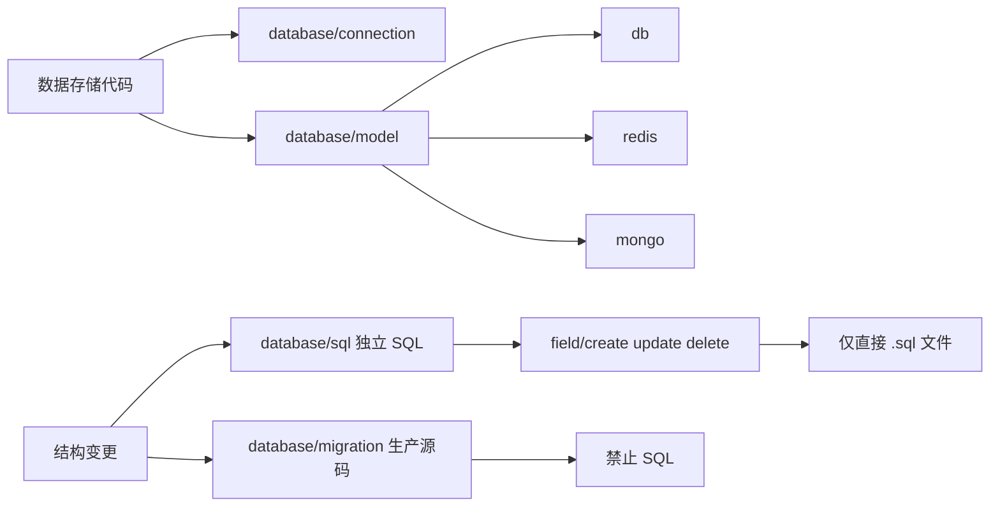
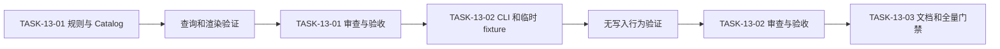

# 代码位置目录规则 V2 实施周期 13：数据存储目录扩展

结论：后端数据存储连接、模型和独立字段 SQL 已有唯一且可检查的位置；影响：新项目和旧项目新增数据存储相关代码能够避免连接、模型与 SQL 混放；范围：本周期覆盖目录规则、查询工具、只读检查和本地验证；非范围：不迁移业务项目、不连接数据服务、不执行 SQL；变化：连接目录扩展到多类数据存储，模型按存储类型分层，字段 SQL 增加创建、修改和删除位置；完成标准：目录文档、Catalog、CLI 与正反向样本保持一致；术语说明：独立 SQL 指人工或数据库工具执行的语句文件，自动迁移指生产源码；验证状态：已通过本机临时样本验证，未连接外部数据服务。

## 当前计划最终方案的简要说明

后端 `database/connection/` 统一作为关系型数据库、Redis、Mongo 等数据存储服务的连接与客户端初始化入口；`database/model/` 按 `db/`、`redis/`、`mongo/` 分类；独立字段 SQL 只进入 `database/sql/field/{create,update,delete}/`。Catalog、CLI 与 strict 将共同保证每个叶子 SQL 目录只直接保存 `.sql` 文件，自动迁移源码仍留在 `database/migration/`。

## Agent 对当前问题的理解

| 项目 | 结论 |
|---|---|
| 用户问题 | 现有规则把连接和模型过度限定为关系型数据库，并且独立 SQL 缺少字段创建、修改和删除的固定位置。 |
| 本周期目标 | 让完整目录树、Catalog、`query`、`init`、`render`、`check` 和真实测试对新的数据存储与字段 SQL 位置给出一致结论。 |
| 本轮范围 | `package-structure-rules`、V2 本地测试、需求、实施、审查、验收与项目四件套。 |
| 非范围 | 业务仓库迁移、真实数据库或 Redis/Mongo 连接、真实迁移、SQL 执行、网络调用和 Git 历史写入。 |
| 当前优先闭环 | 先固定唯一目录和 strict 语义，再验证查询、初始化和无写入检查。 |
| 已冻结决策 | `connection/` 允许直接放连接源码；`model/` 根禁止直接文件；字段 SQL 只使用 `create`、`update`、`delete`，不引入 `read`。 |
| 未决项 | `[]`；用户已明确目录职责，名称沿用既有 `field/create|update|delete` 词汇。 |

## 周期图片资产决策与边界

- 图片资产决策：N/A；原因：本周期只定义文本目录、机器规则和命令行行为，没有页面、视觉比对或可由图片更准确说明的产物；证据：所有验收依据均来自本地目录 fixture、CLI 输出和文件哈希。
- Mermaid 边界：目录职责、任务依赖和检查链路继续使用 Mermaid 表达；图片不能替代目录树、测试矩阵或引用边界。
- 周期图片资产清单：N/A；原因与证据同上，不生成或引用任何位图资产。

## 当前周期目标、边界与进入条件

- 周期 ID / 期次定位：`CYCLE-13` / 第十三期。
- 只做这一件事：将数据存储连接、多存储类型模型和独立字段 SQL 的位置收敛为可查询、可初始化、可渲染、可只读检查的统一规则。
- 对应需求、验收和实施总览：`REQ-PSR-DATABASE-002`、`AC-PSR-DATABASE-001` 至 `AC-PSR-DATABASE-003`、代码位置目录规则 V2 实施总览。
- 本周期不做：业务项目目录迁移、真实连接、真实迁移、执行 SQL、网络调用和 Git 历史写入。

### 进入条件与收口条件

| 类型 | 条件 | 证据/命令 | 状态 |
|---|---|---|---|
| 进入 | 用户已经冻结连接、模型和字段 SQL 的目录职责。 | `REQ-PSR-DATABASE-002`。 | 已满足 |
| 收口 | 每项任务完成实现、真实测试、审查和验收，且文档、Catalog、CLI 一致。 | 本周期的 `TEST-*`、`EVD-*` 与文档 profile。 | 本次复核 |

图形目的：说明本周期每个最小任务都必须经过测试、审查和验收后才能进入下一项。
关联 ID：`CYCLE-13`、`TASK-13-01` 至 `TASK-13-03`。


## 当前代码/文档基线

- 基线提交：`9ac2db0`；本周期在已有未提交工作树上完成，保留用户和其他会话的改动，不执行 reset、checkout、commit 或 push。
- 已核实落点：`package-structure-rules/references/placement-catalog.yaml`、`package-structure-rules/scripts/placement_catalog.py`、后端目录规则说明及 V2 三份真实行为测试。
- local 依赖：Windows Python 3.14、本仓库和临时 fixture；不读取或连接任何数据库、Redis、Mongo、消息队列或外部 API。
- 基线不一致停止规则：若 Catalog、目录文档、CLI 或测试对同一查询返回不同位置，立即停止本周期并修正唯一 Owner；不得猜测替代路径。

## 现状与落点

```text
<backend-project>/
└── database/
    ├── connection/                         # 数据存储服务连接、连接池与客户端初始化源码
    ├── model/                              # 只允许数据存储类型子目录，不直接放文件
    │   ├── db/                             # 关系型数据库持久化模型源码
    │   ├── redis/                          # Redis 数据模型源码
    │   └── mongo/                          # Mongo 文档模型源码
    ├── migration/                          # 自动迁移生产源码；禁止 .sql
    │   └── field/{create,read,update,delete}/
    └── sql/                                # 独立 SQL 资产根；禁止生产源码
        ├── ddl/                            # 直接 .sql 文件
        ├── index/                          # 直接 .sql 文件
        └── field/
            ├── create/                    # 直接 .sql 文件
            ├── update/                    # 直接 .sql 文件
            └── delete/                    # 直接 .sql 文件
```

图形目的：说明自动迁移生产源码与独立字段 SQL 的职责边界。
关联 ID：`REQ-PSR-DATABASE-002`、`RULE-PSR-DATABASE-003`。



## 周期内最小任务执行顺序

| 顺序 | 最小任务 | 垂直切片目标 | 预计文件数 | 真实测试与完成条件 | 停止条件 |
|---:|---|---|---:|---|---|
| 1 | `TASK-13-01` | 固化目录树、连接/模型职责、SQL 路径和唯一 Catalog 条目。 | 5 | `query` 可唯一返回连接、三类模型和三个字段 SQL 路径；`render` 展示全部节点。 | 任一查询多路径或人工树与 Catalog 冲突。 |
| 2 | `TASK-13-02` | 让 `init` 与 strict 精确创建并验证数据存储分类和扁平 SQL 文件。 | 5 | 正向临时 fixture 通过；模型根文件、SQL 嵌套目录、非 `.sql` 文件和迁移 SQL 均失败；检查前后哈希相同。 | `check` 写入 fixture，或 SQL/源码混放被放行。 |
| 3 | `TASK-13-03` | 复核文档、Skill 合规、实现审查、最终验收和项目状态。 | 5 | 全量本地 unittest、`py_compile`、文档 profile、Skill 校验和 `git diff --check` 均通过。 | 任一必需门禁失败或证据与规则不一致。 |

## 最小任务闭环

| 任务 | 实现 | 真实测试 | 审查 | 验收 | 证据 |
|---|---|---|---|---|---|
| `TASK-13-01` | 补充多类数据存储连接、三类模型和字段 SQL 的目录事实。 | 查询、渲染和 schema 断言返回唯一位置。 | 对照目录树、Catalog 和引用契约核对无重叠职责。 | 正向查询和渲染断言通过。 | `EVD-TASK-13-01-IMPL`、`EVD-TASK-13-01-TEST`、`EVD-TASK-13-01-REVIEW`、`EVD-TASK-13-01-ACCEPT`。 |
| `TASK-13-02` | 让 init 和 strict 使用相同的模型、字段 SQL 与文件类型规则。 | 临时 fixture 覆盖正向初始化、非法文件和无写入哈希。 | 核对 `check` 没有移动、删除、重命名或改写文件。 | 正反向 fixture 断言稳定。 | `EVD-TASK-13-02-IMPL`、`EVD-TASK-13-02-TEST`、`EVD-TASK-13-02-REVIEW`、`EVD-TASK-13-02-ACCEPT`。 |
| `TASK-13-03` | 同步研发文档、项目状态、审查和验收记录。 | 全量测试、编译、公开查询、文档和 Skill 校验。 | 审查当前 diff 的一致性与范围。 | 最终验收确认本周期冻结项。 | `EVD-TASK-13-03-IMPL`、`EVD-TASK-13-03-TEST`、`EVD-TASK-13-03-REVIEW`、`EVD-TASK-13-03-ACCEPT`。 |

图形目的：说明本周期按单任务测试、审查、验收闭环的执行顺序。
关联 ID：`TASK-13-01`、`TASK-13-02`、`TASK-13-03`。



## 文件/符号操作契约

| 任务 | 文件/符号 | 操作 | 修改前职责 | 修改后职责 | 调用方影响与兼容要求 |
|---|---|---|---|---|---|
| `TASK-13-01` | `project-layout-v2.md`、`database-layout.md`、`placement-catalog.yaml` | 修改 | 连接和模型主要按关系型数据库描述，SQL 只有 DDL 和索引。 | 连接覆盖多类数据存储，模型固定为三类子目录，字段 SQL 有三个叶子目录。 | 查询同一位置必须唯一；不改变自动迁移源码位置。 |
| `TASK-13-02` | `placement_catalog.py` 的 query、init、check 分支 | 修改 | CLI 未覆盖字段 SQL 和模型根文件限制。 | CLI 支持目录查询、显式初始化和严格只读检查。 | 公开连字符 artifact 与内部下划线名称兼容；不产生旧路径兼容查询。 |
| `TASK-13-03` | V2 测试、需求、实施、审查、验收、项目四件套 | 修改 | 缺少本周期的完整证据链。 | 固化本地行为、审查和验收依据。 | 不改变业务项目或外部系统。 |

## 当前周期验证矩阵

| 测试 ID | 本地样本与入口 | 断言 | 失败预期 | 清理与只读要求 |
|---|---|---|---|---|
| `TEST-PSR-DATABASE-001` | `test_catalog_schema.py`、`test_query_render.py`。 | 连接、模型、字段 SQL 查询唯一且渲染完整。 | 路径缺失或多候选时测试失败。 | 测试只读规则文件。 |
| `TEST-PSR-DATABASE-002` | `test_init_check.py` 临时后端 fixture。 | 显式 init 只创建请求的模型或 SQL 叶子目录。 | 未启用目录被创建时测试失败。 | fixture 由测试创建并清理。 |
| `TEST-PSR-DATABASE-003` | `test_init_check.py` 临时后端 fixture。 | 非法文件、嵌套 SQL 目录和迁移 SQL 在 strict 下失败，哈希不变。 | 非法内容被放行或 hash 改变时测试失败。 | `check` 全程只读，fixture 由测试清理。 |

## 真实测试与断言

| 测试 ID | 本地样本与入口 | 断言 | 通过标准 |
|---|---|---|---|
| `TEST-PSR-DATABASE-001` | V2 `test_catalog_schema.py`、`test_query_render.py`。 | `database-connection`、三类 `database-model`、三类字段 `database-sql` 查询唯一；渲染完整。 | 每项只返回一个规范路径。 |
| `TEST-PSR-DATABASE-002` | V2 `test_init_check.py` 临时后端 fixture。 | 显式 init 只创建请求的模型或 SQL 叶子目录。 | 未启用目录不存在。 |
| `TEST-PSR-DATABASE-003` | V2 `test_init_check.py` 临时后端 fixture。 | `database/model` 根文件、SQL 非 `.sql`、SQL 子目录、迁移 `.sql` 和 SQL 源码均 strict 失败；哈希不变。 | 退出码为 2，原因可定位，哈希相同。 |

执行命令：

```powershell
python -m unittest discover -s doc/5-tests/2026-07-28_014412_代码位置目录规则V2/package-structure-rules -p "test_*.py"
python -m py_compile package-structure-rules/scripts/placement_catalog.py
```

依赖环境仅为本机 Python、规则仓库和临时目录；样本由测试创建并自动清理；不连接数据库、缓存、消息队列或外部 API。

## 回滚与停止条件

- `ROLLBACK-PSR-DATABASE-001`：若任一唯一查询、严格检查或文档 profile 失败，停止继续扩大规则；仅以受审查的 `apply_patch` 撤回本周期的具体目录条目、CLI 分支和测试断言，保留用户和其他会话的改动。
- 停止条件：出现多路径查询、SQL 进入迁移源码、生产源码进入 `database/sql/`、`check` 写入 fixture，或任一必需门禁失败。
- 恢复路径：回到失败任务的目录树、Catalog、CLI 或测试文件，补充同一临时 fixture 的失败证据后重跑对应真实测试；不得连接真实数据存储服务作为替代验证。
- 当前 agent 最大推进边界：仅修改规则资产、V2 测试与研发文档；绝不迁移用户文件、连接真实数据服务、执行 SQL、创建实际业务目录、提交或推送 Git。

## 周期追踪矩阵

| `REQ-*` / `RULE-*` | `AC-*` | `TASK-*` | 文件/符号 | `TEST-*` | `EVIDENCE-*` | 闭环状态 |
|---|---|---|---|---|---|---|
| `REQ-PSR-DATABASE-002`、`RULE-PSR-DATABASE-003` | `AC-PSR-DATABASE-001` | `TASK-13-01` | `project-layout-v2.md`、`placement-catalog.yaml` | `TEST-PSR-DATABASE-001` | `EVD-TASK-13-01-*` | 已验证 |
| `REQ-PSR-DATABASE-002`、`RULE-PSR-DATABASE-003` | `AC-PSR-DATABASE-002` | `TASK-13-02` | `placement_catalog.py` | `TEST-PSR-DATABASE-002`、`TEST-PSR-DATABASE-003` | `EVD-TASK-13-02-*` | 已验证 |
| `REQ-PSR-V2-001`、`RULE-PSR-DATABASE-003` | `AC-PSR-DATABASE-003` | `TASK-13-03` | V2 文档、测试、审查、验收与项目状态 | 全量 `test_*.py`、文档 profile | `EVD-TASK-13-03-*` | 本次复核 |

## 自审结论

- 每个任务只承载一个垂直目标，并按实现、真实测试、审查和验收逐项闭环。
- `unresolved_decisions: []`；用户已经冻结字段 SQL 的三个操作名，未引入 `read` 目录。
- 文档、Catalog、CLI、fixture 和目录树的职责没有重叠；迁移源码和独立 SQL 仍严格分离。
- 两张 Mermaid 图、五张验证和追踪表与正文结论一致；图片资产为 N/A，原因和证据已经明确。

## 执行附录

本周期只使用本机 Python、规则仓库和临时 fixture。执行顺序为先运行全量真实行为测试，再运行 Python 编译、三个公开查询、文档 profile、Skill 校验和 diff 格式检查；任何一步失败都按“回滚与停止条件”停止，不访问外部环境。

```powershell
python -X utf8 -B -m unittest discover -s doc/5-tests/2026-07-28_014412_代码位置目录规则V2/package-structure-rules -p "test_*.py"
python -X utf8 -B -m py_compile package-structure-rules/scripts/placement_catalog.py
python -X utf8 -B package-structure-rules/scripts/placement_catalog.py query --artifact database-connection
python -X utf8 -B package-structure-rules/scripts/placement_catalog.py query --artifact database-model --category redis
python -X utf8 -B package-structure-rules/scripts/placement_catalog.py query --artifact database-sql --category field --operation create
```

继续使用 `validate_engineering_docs.py` 的 `requirement`、`implementation_overview`、`implementation_cycle`、`test`、`review` 和 `final_acceptance` profile 验证本周期新增或更新的研发文档。测试创建的临时 fixture 在进程退出后清理；`check` 的目录树与文件内容哈希在调用前后必须一致。

## 追踪附录

稳定 ID、文件/符号、真实测试与验收关系以“周期追踪矩阵”为唯一索引。`EVD-TASK-13-01-*`、`EVD-TASK-13-02-*` 和 `EVD-TASK-13-03-*` 分别保留目录事实、CLI 行为和交付门禁的证据类别；本周期不产生外部服务日志、数据库数据或图片资产。
