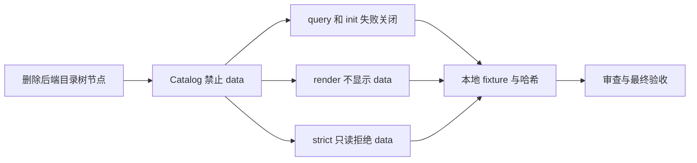
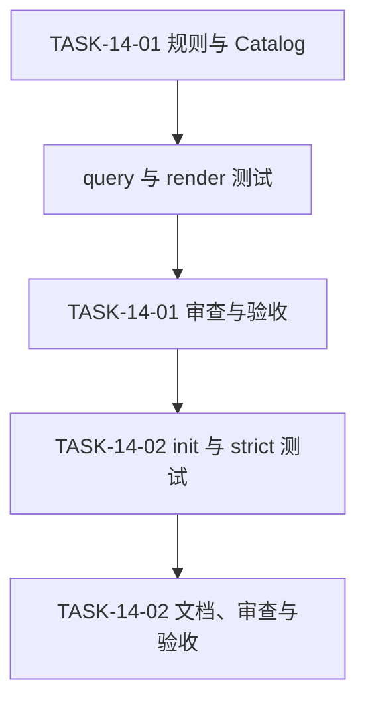

# 代码位置目录规则 V2 实施周期 14：删除后端根 data 目录

结论：后端独立项目不再定义根 `data/` 及其 `business/`、`project/`、`seed/` 子树；影响：新项目不会创建无明确职责的静态数据入口，旧项目不会被自动移动或删除；范围：目录规则、Catalog、测试与研发文档；非范围：前端 `src/data/`、业务域数据、文档 `doc/data/`、业务仓库和真实数据服务；变化：`data` 成为禁止路径，query 与 init 失败关闭；完成标准：完整树、Catalog、CLI 和临时样本一致；术语说明：strict 是仅报告目录违规而不改写项目的检查策略；验证状态：50 项本地行为测试通过。

## 当前计划最终方案的简要说明

删除后端根 `data/` 的目录事实，同时在 Catalog 中将 `data` 纳入禁止路径。CLI 复用既有禁止路径检查，不增加兼容入口或迁移动作，因此能稳定拒绝查询、初始化和 strict 中的根 data，同时保持前端、业务域和文档的数据目录不受影响。

## Agent 对当前问题的理解

| 项目 | 结论 |
|---|---|
| 用户问题 | 后端根 data 没有实际职责，保留该树只会增加代码落点歧义。 |
| 本周期目标 | 删除根 data 规则，并让目录树、Catalog、CLI 和测试给出相同结论。 |
| 本轮范围 | `package-structure-rules`、V2 本地测试、需求、实施、审查、验收和项目四件套。 |
| 非范围 | 业务仓库迁移、删除用户文件、前端 data、业务域数据、数据库迁移、外部服务和 Git 历史写入。 |
| 当前优先闭环 | 先冻结禁止路径，再用 query/render/init/strict 与哈希证明该规则没有写入副作用。 |
| 已冻结决策 | 根 data 不提供兼容查询；已有旧项目目录只能按 adoption 的历史快照维护，不得新增。 |
| 未决项 | `[]`；用户已明确删除范围。 |

## 周期图片资产决策与边界

- 图片资产决策：N/A；原因：本周期只调整目录文本和命令行行为；证据：验收依据全部来自 Catalog、CLI 输出和临时文件哈希。
- Mermaid 边界：使用 Mermaid 表达任务和验证依赖；不生成位图资产。
- 周期图片资产清单：N/A；原因与证据同上。

## 当前周期目标、边界与进入条件

- 周期 ID / 期次定位：`CYCLE-14` / 第十四期。
- 进入条件：用户明确要求删除后端根 `data/`。
- 收口条件：后端完整树不存在该节点，Catalog 禁止该路径，query/init/strict 的行为与测试一致。
- 停止条件：删除范围误伤前端 `src/data/`、业务域数据或 `doc/data/`，或者 check 改写 fixture。
- 最大推进边界：只修改规则资产、本地测试和研发文档；不操作真实业务项目、数据库、外部服务或 Git 历史。

图形目的：说明目录事实到只读验证的单向收口。
关联 ID：`CYCLE-14`、`TASK-14-01`、`TASK-14-02`。

## 当前代码/文档基线

- 代码基线：开始时后端完整树仍定义根 `data/` 及其三个子树，Catalog 也保留对应合法目录条目。
- 文档基线：需求、实施总览、测试 README、实现审查和最终验收均已记录 V2 的既有目录规则，必须随本周期同步更新。
- 保护基线：不扫描、迁移、删除或重命名真实业务项目文件；前端 `src/data/`、业务域数据和 `doc/data/` 保持原规则。

## 周期内最小任务执行顺序

| 顺序 | 最小任务 | 垂直切片目标 | 完成条件 | 停止条件 |
|---:|---|---|---|---|
| 1 | `TASK-14-01` | 删除后端 data 目录事实并冻结禁止路径。 | SKILL、完整树和 Catalog 不再给 data 任何合法位置。 | 任一入口仍渲染、查询或初始化 data。 |
| 2 | `TASK-14-02` | 验证失败关闭、无写入和文档追踪。 | 50 项本地测试、编译、文档门禁、审查和验收一致。 | 任何严格检查写入 fixture 或必需门禁失败。 |

图形目的：说明每项任务必须完成测试、审查、验收后再进入下一项。
关联 ID：`TASK-14-01`、`TASK-14-02`。

## 最小任务闭环

| 任务 | 实现 | 真实测试 | 审查 | 验收 | 证据 |
|---|---|---|---|---|---|
| `TASK-14-01` | 从后端树删除根 data 子树，在 Catalog 加入 `data` 禁止路径。 | Catalog 负向断言、query 零匹配且退出码 2、后端 render 无节点。 | 核对前端与文档 data 未受影响。 | 目录事实只有一个 Owner。 | `EVD-TASK-14-01-IMPL`、`EVD-TASK-14-01-TEST`、`EVD-TASK-14-01-REVIEW`、`EVD-TASK-14-01-ACCEPT`。 |
| `TASK-14-02` | 增加 init 拒绝和 strict 根 data 负向 fixture。 | 50 项 unittest、Python 编译、strict 前后哈希相同。 | 审查当前 diff 和 Skill 合规。 | 最终验收逐条确认两项 AC。 | `EVD-TASK-14-02-IMPL`、`EVD-TASK-14-02-TEST`、`EVD-TASK-14-02-REVIEW`、`EVD-TASK-14-02-ACCEPT`。 |

## 文件与符号落点

| 任务 | 文件/符号 | 修改类型 | 修改前 | 修改后 | 兼容边界 |
|---|---|---|---|---|---|
| `TASK-14-01` | `package-structure-rules/SKILL.md`、`references/project-layout-v2.md`、`references/placement-catalog.yaml` | 修改 | 后端根存在 data 规则。 | data 不在后端根树，Catalog 禁止该路径。 | 不触及前端或文档的 data。 |
| `TASK-14-02` | 三个 V2 Python 测试、测试 README、需求、实施、审查、验收和项目四件套 | 修改 | 没有根 data 的明确行为证据。 | 负向 query/render/init/strict 与无写入证据完整。 | 不实现文件迁移或删除。 |

## 当前周期验证矩阵

| 测试 ID | 环境与样本 | 命令 | 断言 | 通过标准 |
|---|---|---|---|---|
| `TEST-PSR-BACKEND-DATA-001` | Windows Python 3.14、本地临时 backend fixture。 | `python -m unittest discover -s doc/5-tests/2026-07-28_014412_代码位置目录规则V2/package-structure-rules -p "test_*.py"`。 | data 为禁止路径；query 和 init 返回 2；render 无根节点；strict 报告 data 且哈希不变。 | 50 项测试均通过。 |
| `TEST-PSR-BACKEND-DATA-002` | 本地 CLI。 | `query --artifact data`、`render --project-kind backend`。 | 不返回 Catalog 条目且后端树不出现根 data。 | query 返回 2，render 成功且无节点。 |

不连接数据库、缓存、消息队列、第三方 API 或非 local 环境。原因：本周期只验证规则仓库和临时 fixture。证据：上述命令不读取外部配置。

### 真实测试与断言

- `TASK-14-01` 先验证 Catalog 禁止路径、零匹配 query 与后端 render；任一仍显示根 data 即停止后续任务。
- `TASK-14-02` 再验证 init 拒绝、strict 诊断与 fixture 前后哈希；任何写入均判定失败，不执行自动迁移或修复。

## 回滚与停止条件

| 风险 | 防护 | 清理与回滚 |
|---|---|---|
| 误删非后端 data 规则 | 测试仅断言 backend render 不含根节点，并保留前端、业务域、文档路径。 | 仅撤销本周期未提交规则增量，不移动用户文件。 |
| 旧项目把禁止路径当新入口 | adoption 仅承认登记时历史快照，不能把 data 登记为 adopted。 | 不自动迁移；由项目维护者人工重构后再采用 V2。 |
| strict 出现写入 | 对 fixture 执行前后哈希比较。 | 立即停止放行，恢复只读检查后重跑同一测试。 |

## 周期追踪矩阵

| SRC/DEC | REQ/RULE | AC | TASK | 文件/符号 | TEST | EVIDENCE | 状态 |
|---|---|---|---|---|---|---|---|
| `SRC-PSR-BACKEND-DATA-003`、`DEC-PSR-BACKEND-DATA-003` | `REQ-PSR-BACKEND-DATA-003`、`RULE-PSR-BACKEND-DATA-004` | `AC-PSR-BACKEND-DATA-001`、`AC-PSR-BACKEND-DATA-002` | `TASK-14-01`、`TASK-14-02` | SKILL、目录树、Catalog、测试和文档 | `TEST-PSR-BACKEND-DATA-001`、`TEST-PSR-BACKEND-DATA-002` | `EVD-TASK-14-01-*`、`EVD-TASK-14-02-*` | 已验证 |

## 自审结论

- 目录职责：通过。后端根 data 无职责，因此删除而不是改名或另设兼容入口。
- 范围控制：通过。前端 `src/data/`、业务域数据、`doc/data/` 与真实项目均未修改。
- 验证：通过。50 项本地行为测试覆盖 query、render、init、strict 和无写入边界。
- 图片资产：N/A；理由和证据已记录，Mermaid 足以表达本周期依赖。

## 追踪附录

`EVD-TASK-14-01-*` 记录目录事实和 Catalog 的删除证据；`EVD-TASK-14-02-*` 记录本地行为测试、文档门禁、审查与最终验收。全周期没有外部服务日志、真实业务数据或图片资产。
