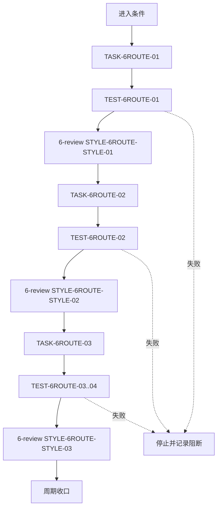
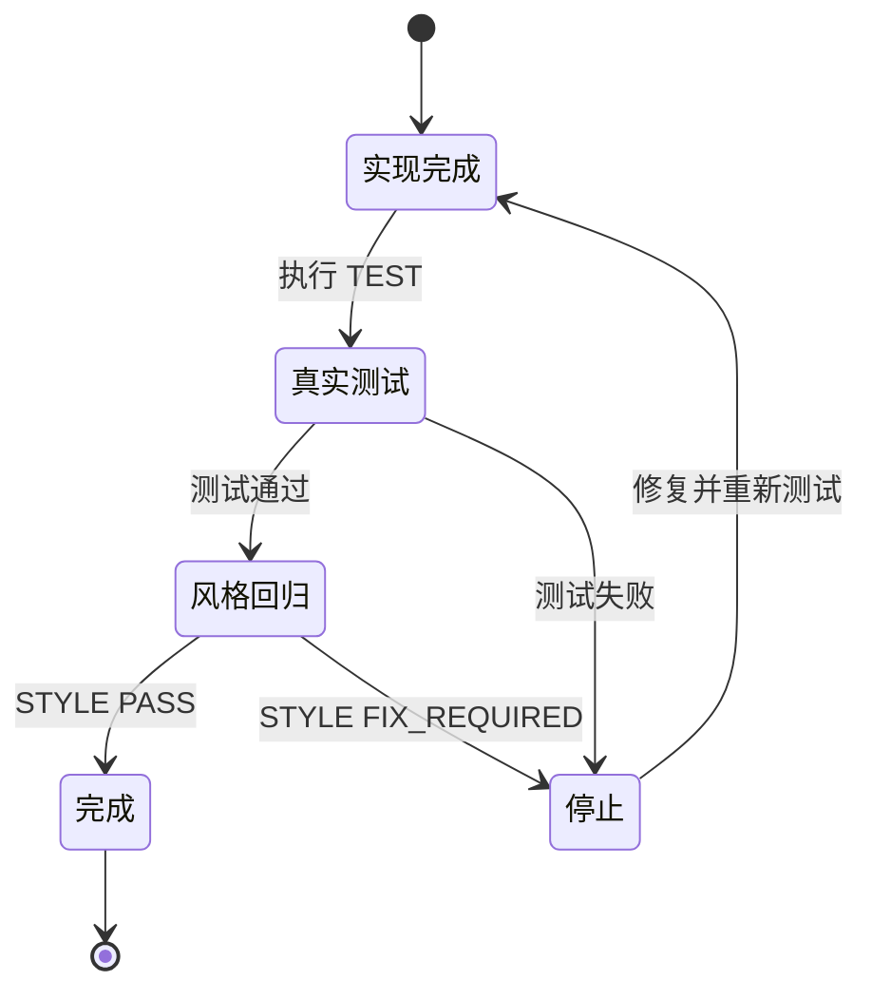

# 6-review 共享 Owner 路由实施周期

结论：本周期已按共享契约、监控迁移、文档回归三个顺序完成路由收敛；影响：质量检查的路由来源唯一且可追踪；范围：本任务列出的规则、代码、测试和活动文档；非范围：业务代码、历史归档、外部环境和 Git 历史；变化：监控成为共享路由的可选消费者；完成标准：每个周期均完成实现、真实测试和 `6-review`；术语说明：周期收口表示本周期所有任务的三项闭环均有证据；验证状态：周期 01、02、03 的共享路由测试、监控测试和专项路由回归均通过。

## 当前代码/文档基线

- 共享路由文件：`code-style-consistency-rules/scripts/static_owner_router.py`。
- 监控消费者：`continuous-code-quality-supervisor-rules/scripts/supervisor_state.py`。
- 当前活动测试根目录：`doc/5-tests/2026-08-01_000000_6-review共享Owner路由/`。
- 历史 `doc/6-审查/`、`doc/7-验收/` 未纳入本次写集。

## 当前周期目标

| 周期 | 目标 | 进入条件 | 收口条件 |
| --- | --- | --- | --- |
| `CYCLE-6ROUTE-01` | 共享 Owner 路由可用 | 风格契约已冻结 | `TEST-6ROUTE-01`、`STYLE-6ROUTE-STYLE-01` |
| `CYCLE-6ROUTE-02` | 监控消费者迁移 | 周期 01 收口 | `TEST-6ROUTE-02`、`STYLE-6ROUTE-STYLE-02` |
| `CYCLE-6ROUTE-03` | 文档和全链路回归 | 周期 02 收口 | `TEST-6ROUTE-03..04`、`STYLE-6ROUTE-STYLE-03` |

## 进入条件与收口条件

- 进入条件：共享路由单元测试和监控兼容单元测试均已通过，活动文档未写入 `doc/6-审查/` 或 `doc/7-验收/`。
- 收口条件：`TASK-6ROUTE-03` 的专项回归、五个严格 profile、字典生成和最终 `STYLE: PASS` 全部通过。
- 停止条件：任一真实测试、文档 profile 或风格回归失败，或检测到历史归档正文变化。

图形目的：说明三个周期只能按顺序推进。关联 ID：`CYCLE-6ROUTE-01..03`。

图形目的：说明单一最小任务的完成、测试、风格回归和停止状态。关联 ID：`TASK-6ROUTE-01..03`。

## 周期内最小任务执行顺序

| 顺序 | 任务 | 允许文件 | 禁止触碰区 | 实现 | 真实测试 | 6-review |
| --- | --- | --- | --- | --- | --- | --- |
| 1 | `TASK-6ROUTE-01` | `code-style-consistency-rules/**` | 其它 Skill 和历史文档 | 已完成 | `TEST-6ROUTE-01` | `STYLE-6ROUTE-STYLE-01` |
| 2 | `TASK-6ROUTE-02` | `continuous-code-quality-supervisor-rules/**` | 业务项目和监控状态 schema | 已完成 | `TEST-6ROUTE-02` | `STYLE-6ROUTE-STYLE-02` |
| 3 | `TASK-6ROUTE-03` | `doc/**`、根文档、字典 | 历史归档正文 | 已完成 | `TEST-6ROUTE-03..04` | `STYLE-6ROUTE-STYLE-03` |

## 最小任务闭环

| 任务 | 实现证据 | 真实测试证据 | 风格回归证据 | 停止条件 |
| --- | --- | --- | --- | --- |
| `TASK-6ROUTE-01` | `EVD-TASK-6ROUTE-01-IMPL-01`：共享路由、来源映射和单测已落盘 | `EVD-TASK-6ROUTE-01-TEST-01`：共享路由单测 | `EVD-TASK-6ROUTE-01-STYLE-01`：共享模块命名和目录归位 | 路由顺序或来源路径不稳定 |
| `TASK-6ROUTE-02` | `EVD-TASK-6ROUTE-02-IMPL-01`：监控改为导入共享路由 | `EVD-TASK-6ROUTE-02-TEST-01`：监控兼容单测 | `EVD-TASK-6ROUTE-02-STYLE-01`：消费者边界和可读性检查 | 状态 schema、脱敏或公开导入变化 |
| `TASK-6ROUTE-03` | `EVD-TASK-6ROUTE-03-IMPL-01`：活动文档、专项脚本和字典更新 | `EVD-TASK-6ROUTE-03-TEST-01`：专项脚本与严格 profile | `EVD-TASK-6ROUTE-03-STYLE-01`：测试后最终 `6-review` | profile、历史归档边界或风格回归失败 |

## 文件与符号操作契约

| 任务 | 文件/符号 | 操作 | 兼容要求 |
| --- | --- | --- | --- |
| `TASK-6ROUTE-01` | `OWNER_NAMES`、`BASE_OWNER_NAMES`、`route_owners`、`owner_source_map_path` | 新增共享模块和来源映射 | 固定顺序、去重、标准库 |
| `TASK-6ROUTE-02` | `supervisor_state.py` 的公开导入与 `_source_map_path` | 删除重复实现，导入共享模块 | 状态、脱敏、finding、CLI 不变 |
| `TASK-6ROUTE-03` | 活动文档和 `validate_6review_shared_owner_routing.py` | 新增证据并刷新字典 | 不新增验收/审查分支 |

## 当前周期验证矩阵

| TEST | 精确命令 | 样本 | 断言 | 失败预期 | 清理 |
| --- | --- | --- | --- | --- | --- |
| `TEST-6ROUTE-01` | `python -X utf8 -B -m unittest discover -s code-style-consistency-rules/tests -p "test_*.py"` | 路径、后缀、信号 | 实际 `7/7` 通过 | 非零停止 | 无字节码 |
| `TEST-6ROUTE-02` | `python -X utf8 -B -m unittest discover -s continuous-code-quality-supervisor-rules/tests -p "test_*.py"` | 临时状态和 source map | 实际 `17/17` 通过 | schema/脱敏回归停止 | 临时目录清理 |
| `TEST-6ROUTE-03` | `python -X utf8 -B doc/5-tests/2026-08-01_000000_6-review共享Owner路由/validate_6review_shared_owner_routing.py` | 活动文件和负例 | 实际输出 `6-review-shared-owner-routing: PASS` | 非零停止 | 只读 |
| `TEST-6ROUTE-04` | `validate_engineering_docs.py --profile ... --strict` | 活动文档 | 结构、图示和追踪通过 | profile 非零停止 | 无外部数据 |

## 回滚与停止条件

- `ROLLBACK-6ROUTE-01`：若共享路由失败，恢复 `code-style-consistency-rules` 新增文件并停止监控迁移。
- `ROLLBACK-6ROUTE-02`：若监控兼容测试失败，恢复监控导入和来源映射；不改状态 schema。
- 停止条件：任一断言失败、profile 失败、活动引用残留、历史文档正文变化、风格回归为 `FIX_REQUIRED`。
- 图片资产决策：N/A + 原因 + 证据：无视觉产物，Mermaid 已表达周期依赖。

## 周期追踪矩阵

| REQ | AC | CYCLE | TASK | TEST | STYLE | EVIDENCE |
| --- | --- | --- | --- | --- | --- | --- |
| `REQ-6ROUTE-01` | `AC-6ROUTE-01` | `CYCLE-6ROUTE-01` | `TASK-6ROUTE-01` | `TEST-6ROUTE-01` | `STYLE-6ROUTE-STYLE-01` | `EVIDENCE-6ROUTE-01` |
| `REQ-6ROUTE-02..03` | `AC-6ROUTE-02..03` | `CYCLE-6ROUTE-02` | `TASK-6ROUTE-02` | `TEST-6ROUTE-02` | `STYLE-6ROUTE-STYLE-02` | `EVIDENCE-6ROUTE-02` |
| `REQ-6ROUTE-04..05` | `AC-6ROUTE-04..05` | `CYCLE-6ROUTE-03` | `TASK-6ROUTE-03` | `TEST-6ROUTE-03..04` | `STYLE-6ROUTE-STYLE-03` | `EVIDENCE-6ROUTE-03` |

## 自审结论

- 每个任务都按实现 -> 真实测试 -> `6-review` 排列，未把测试和风格回归合并为业务验收。
- 文件写集已按周期隔离；历史归档未作为回滚对象。
- `unresolved_decisions`：无；当前无 P0/P1 未决事项。
