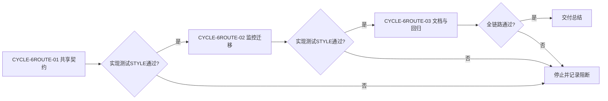
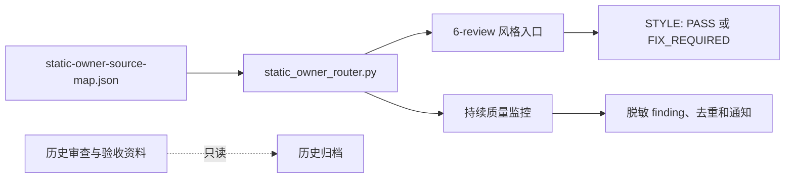
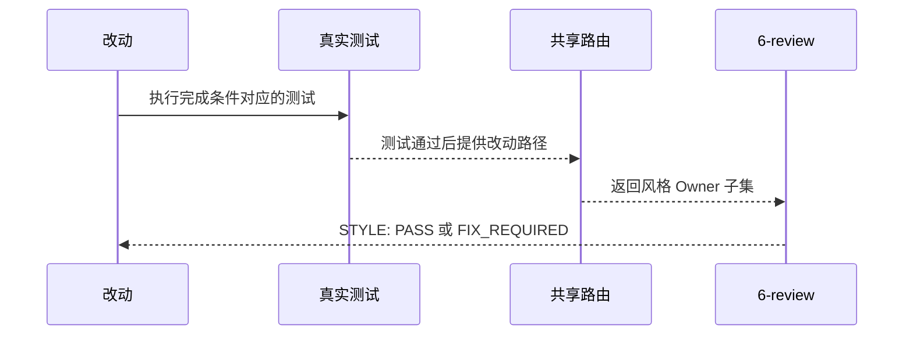

# 6-review 共享 Owner 路由实施总览

结论：共享静态 Owner 路由已由 `code-style-consistency-rules` 唯一持有，持续监控已迁移为可选消费者；影响：`6-review` 和监控使用同一套路径与来源判断；范围：两个 Skill、监控测试、活动文档、字典和本地回归；非范围：业务项目、历史归档、数据库、外部服务和 Git 历史；变化：监控删除重复路由与旧 source map；完成标准：三个周期均已完成实现、真实测试和 `6-review`；术语说明：共享 Owner 路由是两个质量消费者共同读取的静态路径规则；验证状态：共享路由单元测试 `7/7`、监控消费者单元测试 `17/17` 与跨域专项脚本均通过。

## 当前计划最终方案简要说明

以 `code-style-consistency-rules` 的 `static_owner_router.py` 作为唯一 Owner 路由和来源映射 Owner，监控只消费完整路由，`6-review` 只消费风格子集。选择该方案是因为它保留监控的状态与通知能力，同时消除重复规则和路由分叉。

## Agent 对当前问题的理解

- 问题/目标：监控 Skill 的 Owner 路由与 `6-review` 风格入口重复维护，需要共享而不互相复制。
- 本轮范围：共享模块、监控迁移、文档、测试、字典和四件套。
- 非范围：恢复业务审查或验收，改写历史归档，执行 Git 历史写入。
- 当前优先闭环：共享路由 -> 监控迁移 -> 活动文档 -> 真实测试 -> `6-review`。
- 关键假设：Python 标准库可满足路由实现；`supervisor_state.py` 的公开函数和状态 schema 保持兼容；`unresolved_decisions`：无。
- 固定边界：`continuous-code-quality-supervisor-rules` 只在 Goal active 且用户明确要求“监控代码”时消费完整路由，保留扫描、脱敏、finding 指纹、去重和通知；它不是测试后的 `6-review` Gate。

## 图片资产决策与边界

图片资产决策：N/A + 原因：本任务是规则、代码、测试和文档路由，流程和时序用 Mermaid 足够表达 + 证据：`REQ-6ROUTE-01..05`。

## 现状与落点

```text
F:\luode-skills\
├── code-style-consistency-rules\scripts\static_owner_router.py       # 共享路由 Owner
├── code-style-consistency-rules\references\static-owner-source-map.json # 唯一来源映射
├── continuous-code-quality-supervisor-rules\scripts\supervisor_state.py # 监控消费者
├── continuous-code-quality-supervisor-rules\tests\test_supervisor_state.py # 兼容回归
└── doc\5-tests\2026-08-01_000000_6-review共享Owner路由\validate_6review_shared_owner_routing.py # 专项脚本
```

## 实施周期总览

| 顺序 | 周期 ID | 目标 | 进入条件 | 收口条件 | 依赖 |
| --- | --- | --- | --- | --- | --- |
| 1 | `CYCLE-6ROUTE-01` | 建立共享路由契约 | 代码风格契约已冻结 | `AC-6ROUTE-01`、共享单测和 `STYLE` 通过 | 无 |
| 2 | `CYCLE-6ROUTE-02` | 迁移监控消费者 | 周期 01 已收口 | `AC-6ROUTE-02..03`、监控单测和 `STYLE` 通过 | `CYCLE-6ROUTE-01` |
| 3 | `CYCLE-6ROUTE-03` | 同步文档、字典并全链路回归 | 周期 02 已收口 | `AC-6ROUTE-04..05`、严格 profile、专项脚本和最终 `STYLE` 通过 | `CYCLE-6ROUTE-02` |

图形目的：表达周期依赖和失败停止边界。关联 ID：`CYCLE-6ROUTE-01..03`。



图形目的：说明共享模块与两个消费者之间的职责边界。关联 ID：`REQ-6ROUTE-01..04`、`TASK-6ROUTE-01..02`。



图形目的：说明代码改动完成后的共享路由调用顺序。关联 ID：`TASK-6ROUTE-01..03`、`TEST-6ROUTE-01..04`。



## 阶段计划

| 阶段 | 周期 | 唯一目标 | 输入 | 输出 | 验证门槛 |
| --- | --- | --- | --- | --- | --- |
| `PHASE-6ROUTE-01` | `CYCLE-6ROUTE-01` | 冻结共享 Owner 路由 | 现有监控路由和风格契约 | 共享模块、来源映射、单元测试 | `TEST-6ROUTE-01` |
| `PHASE-6ROUTE-02` | `CYCLE-6ROUTE-02` | 移除监控重复实现 | 共享模块 | 监控导入、兼容导出、旧映射删除 | `TEST-6ROUTE-02` |
| `PHASE-6ROUTE-03` | `CYCLE-6ROUTE-03` | 完成活动证据和全链路回归 | 代码与监控改动 | 需求/实施/测试/6-review、字典 | `TEST-6ROUTE-03..04` |

## 最小任务清单

| 顺序 | 任务 ID | 垂直切片目标 | 文件数 | 文件/符号 | 测试 | 完成条件 | 停止条件 |
| --- | --- | --- | ---: | --- | --- | --- | --- |
| 1 | `TASK-6ROUTE-01` | 共享路由可被两个消费者导入 | 4 | `static_owner_router.py`、共享契约、source map、单测 | `TEST-6ROUTE-01` | `AC-6ROUTE-01` | Owner 或来源无法确认 |
| 2 | `TASK-6ROUTE-02` | 监控不再复制路由并保持状态兼容 | 5 | `supervisor_state.py`、监控 Skill、矩阵、agent、监控测试 | `TEST-6ROUTE-02` | `AC-6ROUTE-02..03` | 状态 schema、脱敏或公开导入变化 |
| 3 | `TASK-6ROUTE-03` | 活动文档和回归资产完整 | 8 | 需求、实施、测试、专项脚本、6-review、四件套 | `TEST-6ROUTE-03..04` | `AC-6ROUTE-04..05` | profile 或历史归档边界失败 |

## 追踪矩阵

| 来源/规则 | AC | 周期 | 任务 | 文件/符号 | 实现证据 | TEST | STYLE |
| --- | --- | --- | --- | --- | --- | --- | --- |
| `REQ-6ROUTE-01` | `AC-6ROUTE-01` | `CYCLE-6ROUTE-01` | `TASK-6ROUTE-01` | `static_owner_router.py` | `EVD-TASK-6ROUTE-01-IMPL-01` | `TEST-6ROUTE-01` | `STYLE-6ROUTE-STYLE-01` |
| `REQ-6ROUTE-02..03` | `AC-6ROUTE-02..03` | `CYCLE-6ROUTE-02` | `TASK-6ROUTE-02` | `supervisor_state.py` | `EVD-TASK-6ROUTE-02-IMPL-01` | `TEST-6ROUTE-02` | `STYLE-6ROUTE-STYLE-02` |
| `REQ-6ROUTE-04..05` | `AC-6ROUTE-04..05` | `CYCLE-6ROUTE-03` | `TASK-6ROUTE-03` | 活动文档与专项脚本 | `EVD-TASK-6ROUTE-03-IMPL-01` | `TEST-6ROUTE-03..04` | `STYLE-6ROUTE-STYLE-03` |

## 真实测试安排

| ID | 命令/入口 | local 环境与样本 | 断言 | 失败预期 | 清理 |
| --- | --- | --- | --- | --- | --- |
| `TEST-6ROUTE-01` | `python -X utf8 -B -m unittest discover -s code-style-consistency-rules/tests -p "test_*.py"` | 本地 Python、路径和信号样本 | 共享 Owner 顺序稳定、来源路径完整；实际 `7/7` 通过 | 非零退出 | `-B` 不产生字节码 |
| `TEST-6ROUTE-02` | `python -X utf8 -B -m unittest discover -s continuous-code-quality-supervisor-rules/tests -p "test_*.py"` | 本地临时状态目录 | 17 项监控测试通过且共享 source map 生效；实际 `17/17` 通过 | 状态或路由回归失败 | unittest 临时目录自动清理 |
| `TEST-6ROUTE-03` | `python -X utf8 -B doc/5-tests/2026-08-01_000000_6-review共享Owner路由/validate_6review_shared_owner_routing.py` | 本地工作树 | 旧映射、重复算法和错误路由负例失败；实际输出 `PASS` | 非零退出 | 只读，无持久化数据 |
| `TEST-6ROUTE-04` | `validate_engineering_docs.py` 五个 profile | 本地 UTF-8 活动文档 | ID、图示、追踪和 STYLE 结构通过 | profile 非零即停止 | 无外部数据 |

## 风险与阻断项

| ID | 风险/阻断 | 证据 | 恢复路径 | 禁止动作 |
| --- | --- | --- | --- | --- |
| `GAP-6ROUTE-01` | 共享来源缺失或越界 | source map 校验和 limited finding | 回到 `TASK-6ROUTE-01` | 猜测替代来源 |
| `GAP-6ROUTE-02` | 监控公开导入或状态变化 | 监控单元测试 | 回到 `TASK-6ROUTE-02` | 改写状态 schema |
| `ROLLBACK-6ROUTE-01` | 迁移失败 | 当前 diff 和测试输出 | 恢复监控导入、保留共享模块待复核 | 批量格式化、改历史正文 |

- 任务完成条件：`AC-6ROUTE-01..05` 均有真实测试与 `STYLE` 证据；活动引用、来源映射和字典一致。
- 任务停止/结束条件：任一真实测试、文档 profile 或风格回归失败；历史归档发生正文变化；产生非计划外部连接。
- 当前 agent 最大推进边界：只改本仓库规则、活动文档、测试资产和字典，不执行 Git 历史写入。
- 是否已获得开始实施授权：是（用户当前轮明确“按照计划执行。允许多 agent 并行”）。

## 自审结论

- `unresolved_decisions`：无；架构、落点、命名、测试和回滚均已冻结。
- 每个任务均有唯一周期、文件/符号、真实测试和测试后 `6-review`。
- 活动文档不新增 `REVIEW`、`ACCEPT` 或 `FINAL_ACCEPTANCE` 证据。
- 图片资产决策：N/A + 原因：本任务没有界面、视觉产物或截图证据需求，Mermaid 已表达流程、依赖和交接 + 证据：本总览的三张 Mermaid 图。

## 执行附录

精确命令、样本、清理和回滚见 `doc/5-tests/2026-08-01_000000_6-review共享Owner路由/README.md`。

## 追踪附录

`REQ-6ROUTE-20260801` -> `AC-6ROUTE-01..05` -> `CYCLE-6ROUTE-01..03` -> `TASK-6ROUTE-01..03` -> `TEST-6ROUTE-01..04` -> `STYLE-6ROUTE-STYLE-01..03` -> `EVIDENCE-6ROUTE-01..03`。
