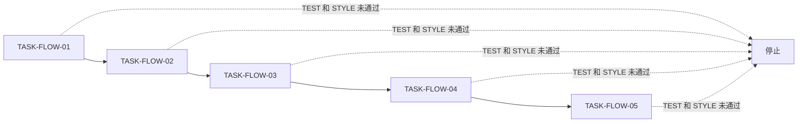
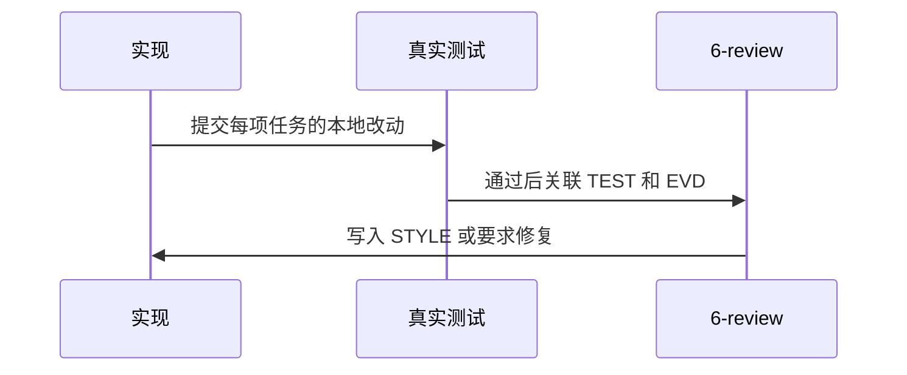

# 研发流程收敛实施周期01：全链路闭环

结论：本周期顺序完成流程契约、风格回归、退役路由删除、项目文档同步和字典回归；影响：新任务统一通过实施计划、真实测试和 `6-review` 收口；范围：五项周期内最小任务；非范围：历史审查验收正文和业务代码；变化：旧 Skill 与默认后置审查验收分支退出活动路由；完成标准：每项任务均具备实施计划完成条件、实现、真实测试和 STYLE 证据；术语说明：STYLE 是风格回归结果；验证状态：本地验证命令与证据见执行附录。

## 周期图片资产决策与边界

- 图片资产决策：`N/A + 原因：本周期仅修改文本规则、脚本与 Markdown，不需要 UI、截图或视觉资产 + 证据：执行附录中的本地验证命令`。
- Mermaid 边界：周期依赖和执行时序继续使用 Mermaid 表达，图片不替代流程图或时序图。

## 当前代码/文档基线

- 基线：已存在的流程 Skill、根文档和历史归档资料。
- 变更基线：`IMP-FLOW-STREAMLINING-20260801` 冻结活动流程与五项任务。
- 历史边界：`doc/6-审查/` 与 `doc/7-验收/` 只读；N/A + 原因：不迁移旧正文 + 证据：`BOUND-FLOW-01`。

## 当前周期目标、边界与进入条件

- 目标：完成 `CYCLE-FLOW-01..05` 的连续最小闭环。
- 进入条件：`REQ-FLOW-01`、`AC-FLOW-01..05` 和实施总览均已冻结。
- 收口条件：`EVD-TASK-FLOW-01-IMPL/TEST/STYLE` 至 `EVD-TASK-FLOW-05-IMPL/TEST/STYLE` 均可追踪。

## 周期内最小任务执行顺序

图形目的：说明每个任务必须在真实测试和风格回归后才进入下一项。关联 ID：`TASK-FLOW-01..05`。

图形目的：说明测试与风格证据写入的时序。关联 ID：`TEST-FLOW-01..05`、`STYLE-FLOW-20260801`。

| 任务 | 依赖 | 实现产物 | 真实测试 | 6-review | 停止条件 |
| --- | --- | --- | --- | --- | --- |
| `TASK-FLOW-01` | 无 | 实施计划与文档 profile 契约 | `TEST-FLOW-01` | `EVD-TASK-FLOW-01-STYLE` | 实施文档不能独立表达 AC |
| `TASK-FLOW-02` | `TASK-FLOW-01` | `6-review` 唯一入口 | `TEST-FLOW-02` | `EVD-TASK-FLOW-02-STYLE` | 风格规则判断业务正确性 |
| `TASK-FLOW-03` | `TASK-FLOW-02` | 五个目录删除、活动路由迁移 | `TEST-FLOW-03` | `EVD-TASK-FLOW-03-STYLE` | 活动引用残留或历史资料改写 |
| `TASK-FLOW-04` | `TASK-FLOW-03` | 根文档和项目记忆更新 | `TEST-FLOW-04` | `EVD-TASK-FLOW-04-STYLE` | 当前文档仍把旧目录当活动入口 |
| `TASK-FLOW-05` | `TASK-FLOW-04` | 字典生成与专项脚本 | `TEST-FLOW-05` | `EVD-TASK-FLOW-05-STYLE` | 生成、测试或差异检查失败 |

## 文件/符号操作契约

| 任务 | 文件/符号 | 操作 | 预期结果 |
| --- | --- | --- | --- |
| `TASK-FLOW-01` | `implementation-planning-rules/**`、`validate_engineering_docs.py` | 合并完成条件和 `style_regression` profile | `AC` 与测试映射不再依赖独立验收 |
| `TASK-FLOW-02` | `code-style-consistency-rules/**` | 固定 `STYLE: PASS/FIX_REQUIRED` | 风格回归不越界 |
| `TASK-FLOW-03` | 五个退役 Skill 目录、活动路由文件 | 删除目录并替换路由 | 默认链路无审查验收分支 |
| `TASK-FLOW-04` | `README.md`、`项目设计.md`、项目四件套 | 同步新流程定义 | 历史资料只读说明明确 |
| `TASK-FLOW-05` | `generate_dictionary.py`、专项脚本 | 生成并验证 | 字典和专项回归一致 |

## 最小任务闭环

- `TASK-FLOW-01`：实现为实施计划与文档 profile 的收敛；真实测试为 `TEST-FLOW-01`；风格证据为 `EVD-TASK-FLOW-01-STYLE`；停止条件为严格 profile 失败。
- `TASK-FLOW-02`：实现为 `6-review` 范围与输出约束；真实测试为 `TEST-FLOW-02`；风格证据为 `EVD-TASK-FLOW-02-STYLE`；停止条件为出现业务放行语义。
- `TASK-FLOW-03`：实现为退役目录删除和活动路由清理；真实测试为 `TEST-FLOW-03`；风格证据为 `EVD-TASK-FLOW-03-STYLE`；停止条件为活动引用扫描非零。
- `TASK-FLOW-04`：实现为根文档和记忆同步；真实测试为 `TEST-FLOW-04`；风格证据为 `EVD-TASK-FLOW-04-STYLE`；停止条件为历史目录发生正文变更。
- `TASK-FLOW-05`：实现为字典和专项回归维护；真实测试为 `TEST-FLOW-05`；风格证据为 `EVD-TASK-FLOW-05-STYLE`；停止条件为本地命令失败。

## 当前周期验证矩阵

| 任务 | 实现证据 | 测试证据 | STYLE 证据 | 通过断言 |
| --- | --- | --- | --- | --- |
| `TASK-FLOW-01` | `EVD-TASK-FLOW-01-IMPL` | `EVD-TASK-FLOW-01-TEST` | `EVD-TASK-FLOW-01-STYLE` | 实施计划和 profile 可校验 |
| `TASK-FLOW-02` | `EVD-TASK-FLOW-02-IMPL` | `EVD-TASK-FLOW-02-TEST` | `EVD-TASK-FLOW-02-STYLE` | 唯一 STYLE 输出与负向边界成立 |
| `TASK-FLOW-03` | `EVD-TASK-FLOW-03-IMPL` | `EVD-TASK-FLOW-03-TEST` | `EVD-TASK-FLOW-03-STYLE` | 退役目录不存在且活动引用为零 |
| `TASK-FLOW-04` | `EVD-TASK-FLOW-04-IMPL` | `EVD-TASK-FLOW-04-TEST` | `EVD-TASK-FLOW-04-STYLE` | 当前文档描述新流程 |
| `TASK-FLOW-05` | `EVD-TASK-FLOW-05-IMPL` | `EVD-TASK-FLOW-05-TEST` | `EVD-TASK-FLOW-05-STYLE` | 生成、专项回归和差异检查通过 |

## 周期阻断、停止与回滚

- 停止条件：任一真实测试或 `6-review` 返回失败；任何活动引用残留；历史资料发生写入。
- 回滚：`ROLLBACK-FLOW-01` 按任务批次恢复退役 Skill 与旧路由；不得把历史归档作为回滚对象。
- 最大推进边界：仅修改本仓库流程资产；不连接外部服务、不修改业务项目、不写入 Git 历史。

## 自审结论

本周期的每个任务均有文件/符号落点、真实测试、停止条件和 STYLE 证据。`unresolved_decisions`：无；N/A + 原因：不需要外部环境或图片资产 + 证据：测试均为本地命令。

## 执行附录

执行入口、样本、断言和结果记录在 `doc/5-tests/2026-08-01_000000_流程收敛/README.md`。运行时只使用 local 本地文件和 Python，不连接数据库、缓存、消息队列或 HTTP 服务。

## 追踪附录

| 来源 | 需求 | 完成条件 | 任务 | 测试 | 证据 |
| --- | --- | --- | --- | --- | --- |
| `SRC-FLOW-STREAMLINING-20260801` | `REQ-FLOW-01` | `AC-FLOW-01..05` | `TASK-FLOW-01..05` | `TEST-FLOW-01..05` | `EVIDENCE-FLOW-TEST-01`、`EVD-TASK-FLOW-01-IMPL..EVD-TASK-FLOW-05-STYLE` |
