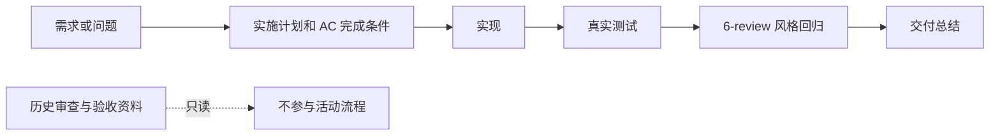
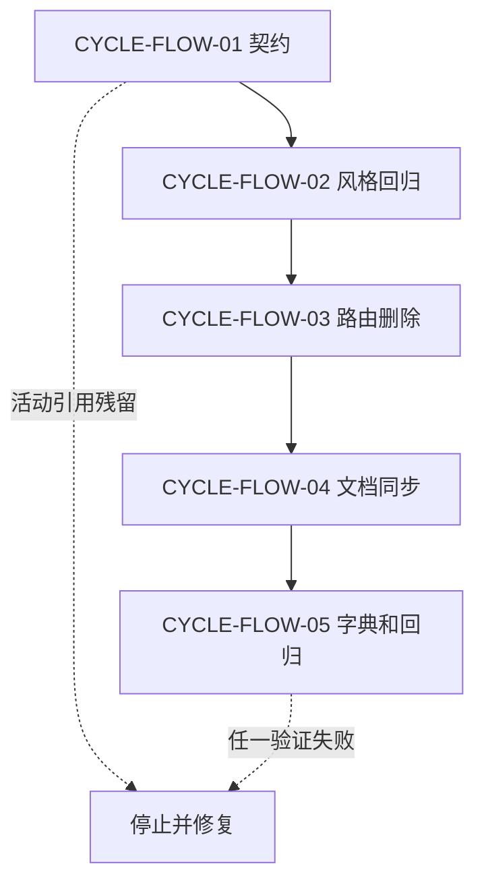
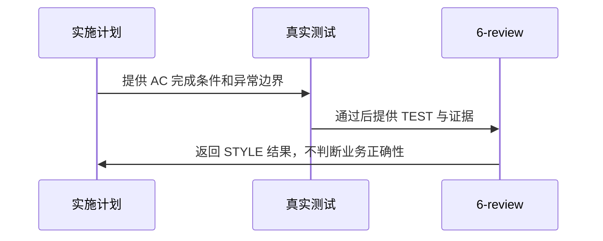

# 研发流程收敛实施总览

结论：研发流程收敛为实施计划、真实测试、一次 `6-review` 风格回归和交付总结；影响：新任务不再新增独立审查或验收文档；范围：规则、文档契约、字典、回归脚本和项目记忆；非范围：业务项目、历史归档、外部服务和 Git 历史；变化：完成条件进入实施计划，测试负责行为正确性，风格回归只负责写法和归位；完成标准：五个退役 Skill 删除、活动路由为零、文档和专项回归通过；术语说明：`6-review` 是测试后的代码风格检查；验证状态：本地回归与严格文档校验记录在本任务测试文档中。

## 当前计划最终方案简要说明

将独立审查和验收收敛到实施计划与真实测试，保留 `code-style-consistency-rules` 作为唯一活动 `6-review` 入口。主落点是流程 Skill、文档校验器、字典与活动文档路径，原因是这些入口共同决定新任务的默认执行链。

## Agent 对当前问题的理解

- 问题 / 目标：删除“实现后业务审查、最终验收”的重复环节，并保证完成条件和测试证据仍然可追踪。
- 本轮范围：流程规则、Skill 路由、文档 profile、字典、专项回归、项目四件套。
- 非范围：业务项目代码、`doc/6-审查/` 与 `doc/7-验收/` 的历史正文、数据库、网络服务和 Git 历史。
- 当前优先闭环：`REQ-FLOW-01 -> AC-FLOW-01..05 -> CYCLE-FLOW-01 -> TASK-FLOW-01..05 -> TEST-FLOW-STREAMLINING-001 -> STYLE-FLOW-20260801`。
- 关键假设 / 待确认点：历史资料允许只读兼容；`unresolved_decisions`：无。

## 图片资产决策与实施边界

图片资产决策：N/A + 原因：本任务仅调整文字规则、脚本和 Mermaid 流程，位图不能增加可执行信息 + 证据：`REQ-FLOW-01` 的流程关系由下列 Mermaid 图表达。

## 实施周期总览

| 周期 | 目标 | 最小任务 | 进入条件 | 收口条件 |
| --- | --- | --- | --- | --- |
| `CYCLE-FLOW-01` | 合并实施计划完成条件和文档契约 | `TASK-FLOW-01` | 已确认流程方案 | `EVD-TASK-FLOW-01-IMPL/TEST/STYLE` 齐全 |
| `CYCLE-FLOW-02` | 建立唯一 `6-review` 风格回归 | `TASK-FLOW-02` | `TASK-FLOW-01` 已收口 | `EVD-TASK-FLOW-02-IMPL/TEST/STYLE` 齐全 |
| `CYCLE-FLOW-03` | 删除退役 Skill 并迁移活动路由 | `TASK-FLOW-03` | `TASK-FLOW-02` 已收口 | `EVD-TASK-FLOW-03-IMPL/TEST/STYLE` 齐全 |
| `CYCLE-FLOW-04` | 同步根文档与项目四件套 | `TASK-FLOW-04` | `TASK-FLOW-03` 已收口 | `EVD-TASK-FLOW-04-IMPL/TEST/STYLE` 齐全 |
| `CYCLE-FLOW-05` | 生成字典并完成全链路回归 | `TASK-FLOW-05` | `TASK-FLOW-04` 已收口 | `EVD-TASK-FLOW-05-IMPL/TEST/STYLE` 齐全 |

图形目的：说明新流程的活动链路和历史归档边界。关联 ID：`REQ-FLOW-01`、`AC-FLOW-01`。



图形目的：说明五个实施周期的顺序和停止边界。关联 ID：`CYCLE-FLOW-01` 至 `CYCLE-FLOW-05`。



图形目的：说明真实测试与风格回归的职责交接。关联 ID：`TEST-FLOW-STREAMLINING-001`、`STYLE-FLOW-20260801`。



## 阶段计划

| 阶段 | 变化 | 完成条件 | 异常与边界 | 测试映射 |
| --- | --- | --- | --- | --- |
| 契约 | 将 `AC-*`、异常、停止和测试映射纳入实施计划 | 新计划不依赖 `doc/7-验收/` | 历史 profile 保持只读兼容 | `TEST-FLOW-01` |
| 风格回归 | `6-review` 只输出 `STYLE: PASS/FIX_REQUIRED` | 真实测试后只执行一次 | 不判断业务正确性 | `TEST-FLOW-02` |
| 路由 | 删除五个 Skill 与默认审查、验收分支 | 活动引用为零 | 历史目录不改写 | `TEST-FLOW-03` |
| 文档 | 同步根文档和项目记忆 | 活动文档描述新链路 | 历史记录只追加 | `TEST-FLOW-04` |
| 生成 | 刷新字典并做全链路校验 | 生成结果和回归通过 | 不产生临时文件 | `TEST-FLOW-05` |

## 最小任务清单

| 任务 | 文件/符号 | 实现产物 | 真实测试 | 完成条件 | 停止条件 |
| --- | --- | --- | --- | --- | --- |
| `TASK-FLOW-01` | `implementation-planning-rules/**`、文档 profile | AC 与停止条件进入实施计划 | `TEST-FLOW-01` | 新计划独立表达完成标准 | 兼容读取失败 |
| `TASK-FLOW-02` | `code-style-consistency-rules/**` | `6-review` 契约 | `TEST-FLOW-02` | 只输出 STYLE 结果 | 出现业务放行判断 |
| `TASK-FLOW-03` | 五个退役目录、活动路由 | 退役目录删除 | `TEST-FLOW-03` | 活动引用为零 | 历史正文被改写 |
| `TASK-FLOW-04` | 根文档、`PROJECT_MEMORY.md` | 新流程说明 | `TEST-FLOW-04` | 历史路径只读 | 活动文档仍路由旧流程 |
| `TASK-FLOW-05` | `skill-dictionary/**`、专项脚本 | 新字典与回归脚本 | `TEST-FLOW-05` | 所有本地验证通过 | 生成或风格回归失败 |

## 现状与落点

```text
F:\luode-skills\
|- implementation-planning-rules\       实施计划完成条件和测试映射
|- code-style-consistency-rules\        唯一 6-review 风格回归入口
|- artifact-delivery-gate-rules\        style_regression 文档 profile
|- artifact-storage-rules\              活动目录与历史只读边界
|- skill-dictionary\                    风格回归域生成资产
|- doc\5-tests\2026-08-01_000000_流程收敛\  真实测试记录和专项脚本
|- doc\6-review\                        风格回归记录
|- doc\6-审查\                          历史只读归档
`- doc\7-验收\                          历史只读归档
```

## 真实测试安排

| 测试 | 入口 | 环境与样本 | 通过标准 | 对应 AC |
| --- | --- | --- | --- | --- |
| `TEST-FLOW-01` | 文档校验器 implementation profile | 本地仓库文档 | 结构、ID 和追踪通过 | `AC-FLOW-01` |
| `TEST-FLOW-02` | 文档校验器 style profile | 本地 `6-review` 记录 | STYLE 字段和边界通过 | `AC-FLOW-02` |
| `TEST-FLOW-03` | `validate_workflow_streamlining.py` | 本地工作树 | 退役目录与活动引用为零 | `AC-FLOW-03` |
| `TEST-FLOW-04` | 字典生成器 | 本地 Skill 目录 | 风格回归域进入生成结果 | `AC-FLOW-04` |
| `TEST-FLOW-05` | 单元测试与 `git diff --check` | 本地工作树 | 测试和差异检查通过 | `AC-FLOW-05` |

## 风险与阻断项

| 风险 | 判定 | 处理 | 证据 |
| --- | --- | --- | --- |
| 历史资料兼容 | 允许只读 | 保留旧 profile 和归档目录 | `BOUND-FLOW-01` |
| 外部环境 | N/A + 原因：本任务没有外部连接 + 证据：测试入口均为本地文件与 Python | 不连接数据库或服务 | `BOUND-FLOW-02` |
| Obsidian 沉淀 | 阻断 | vault 未注册时不使用文件系统替代 | `BOUND-FLOW-03` |

## 任务完成、停止与最大推进边界

- 任务完成：`AC-FLOW-01` 至 `AC-FLOW-05` 均有 `TEST` 和 `STYLE` 证据，退役 Skill 不存在，活动引用为零。
- 停止条件：文档 profile、专项回归或风格回归失败；活动路由残留；任何历史归档正文被修改。
- 回滚：`ROLLBACK-FLOW-01` 为按任务批次恢复退役 Skill 与旧路由契约；历史归档不作为回滚对象。
- 最大推进边界：不修改业务项目，不连接外部服务，不删除历史审查或验收资料，不写入 Git 历史。

## 自审结论

结论：实施顺序、文件/符号、完成条件、异常边界、真实测试和 `6-review` 边界已冻结；`unresolved_decisions` 为零。后续执行只能按 `TASK-FLOW-01` 至 `TASK-FLOW-05` 的顺序闭环。

## 执行附录

本任务只使用本地 Python、仓库文件和 Git 只读/差异检查；具体命令、样本与结果见 `doc/5-tests/2026-08-01_000000_流程收敛/README.md`。

## 追踪附录

| 来源 | 决策与需求 | AC | 周期与任务 | 测试与风格证据 |
| --- | --- | --- | --- | --- |
| `SRC-FLOW-STREAMLINING-20260801` | `DEC-FLOW-01`、`REQ-FLOW-01`、`RULE-FLOW-01` | `AC-FLOW-01..05` | `CYCLE-FLOW-01..05`、`TASK-FLOW-01..05` | `TEST-FLOW-01..05`、`EVIDENCE-FLOW-TEST-01`、`STYLE-FLOW-20260801` |
