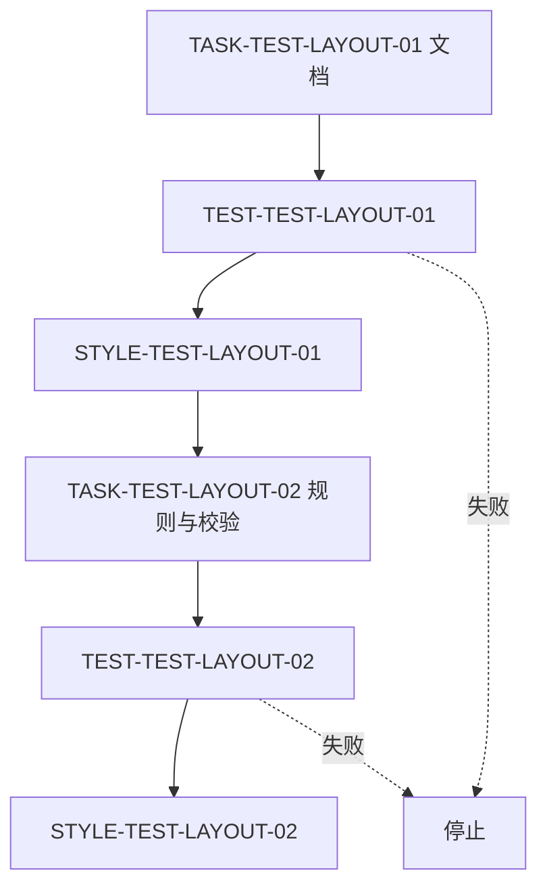
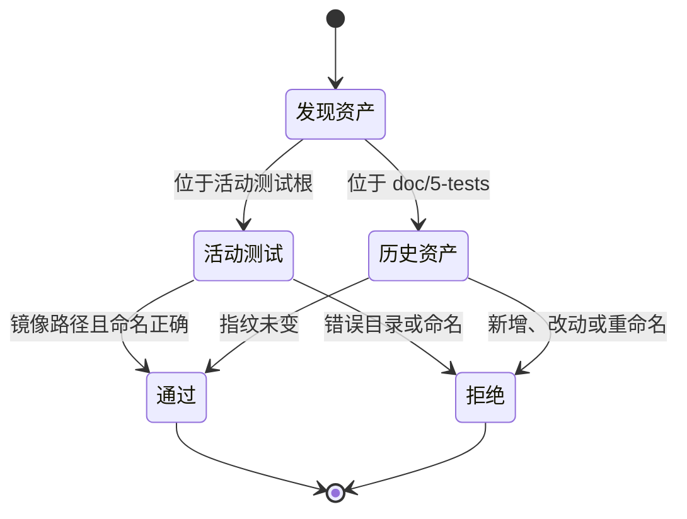

# 根 test 目录统一实施周期 01：测试资产契约

结论：本周期先建立文档、规则、历史豁免和路径校验，再允许迁移活动测试；影响：后续迁移不会重写历史证据或产生多个测试根；范围：计划文档、测试资产规则、布局校验和清单；非范围：七组测试文件的实际迁移；变化：测试代码和证据文档开始分根管理；完成标准：每项任务均有文档/规则落盘、真实测试和 `STYLE`；术语说明：历史豁免清单记录原有可执行文件的指纹，防止静默改写；验证状态：当前执行周期中的首项文档任务。

## 当前代码/文档基线

- 双根规则已明确根 `test/` 为活动代码根，`doc/5-tests/` 为说明与证据根。
- 路径校验、历史指纹清单和 Python/Go 正负例已建立，后续迁移可依赖同一入口。
- 历史 `doc/5-tests/**` 含可执行资产，仍只能读取并按指纹校验，未批量迁移。

## 当前周期目标

| 周期 | 目标 | 进入条件 | 收口条件 |
| --- | --- | --- | --- |
| `CYCLE-TEST-LAYOUT-01` | 冻结位置、命名和历史兼容契约 | 需求和实施总览已落盘 | `TASK-TEST-LAYOUT-01..02` 的 TEST 与 STYLE 通过 |

## 进入条件与收口条件

- 进入条件：`REQ-TEST-LAYOUT-20260801` 与本实施总览已通过严格 profile，未产生历史正文改动。
- 收口条件：根 `test/` 路径校验可以拒绝错误目录、旧 Python 命名、源码 Go 测试和历史资产篡改。
- 停止条件：无法辨别历史资产、文档 profile 失败、历史正文被改写或风格回归要求修复。

图形目的：固定周期内任务只能逐个闭环。关联 ID：`TASK-TEST-LAYOUT-01..02`。

图形目的：明确路径校验对活动、历史和错误资产的分流。关联 ID：`AC-TEST-LAYOUT-001..004`。

## 周期内最小任务执行顺序

| 顺序 | 任务 | 允许文件 | 禁止触碰区 | 实现 | 真实测试 | 6-review |
| --- | --- | --- | --- | --- | --- |
| 1 | `TASK-TEST-LAYOUT-01` | 本轮需求、实施、README | 历史文档正文 | 创建文档 | 严格 profile | `STYLE-TEST-LAYOUT-01` |
| 2 | `TASK-TEST-LAYOUT-02` | 路径映射、活动测试规则、清单与治理测试 | 历史文档正文 | 建立双根契约和校验 | `TEST-TEST-LAYOUT-02` | `STYLE-TEST-LAYOUT-02` |

## 最小任务闭环

| 任务 | 实现证据 | 真实测试证据 | 风格回归证据 | 停止条件 |
| --- | --- | --- | --- | --- |
| `TASK-TEST-LAYOUT-01` | `EVD-TASK-TEST-LAYOUT-01-IMPL-01` | `EVD-TASK-TEST-LAYOUT-01-TEST-01` | `EVD-TASK-TEST-LAYOUT-01-STYLE-01` | 任一文档 profile 失败 |
| `TASK-TEST-LAYOUT-02` | `EVD-TASK-TEST-LAYOUT-02-IMPL-01` | `EVD-TASK-TEST-LAYOUT-02-TEST-01` | `EVD-TASK-TEST-LAYOUT-02-STYLE-01` | 治理测试非零或历史指纹变化 |

## 文件与符号操作契约

| 任务 | 文件/符号 | 操作 | 兼容要求 |
| --- | --- | --- | --- |
| `TASK-TEST-LAYOUT-01` | 本轮 4 份活动文档 | 新建 | 使用实际时间戳；历史文档不改 |
| `TASK-TEST-LAYOUT-02` | `test/shared/layout_policy.py`、指纹清单、活动测试规则 | 更新/新增 | 新测试只能在根 `test/`；历史清单只读 |

## 当前周期验证矩阵

| TEST | 精确命令 | 样本 | 断言 | 失败预期 | 清理 |
| --- | --- | --- | --- | --- | --- |
| `TEST-TEST-LAYOUT-01` | `validate_engineering_docs.py --profile requirement|implementation_overview|implementation_cycle|test --strict` | 本轮 4 份文档 | 结构、图示、追踪、UTF-8 | 非零停止 | 无外部状态 |
| `TEST-TEST-LAYOUT-02` | `python -X utf8 -B -m unittest discover -s test/test-asset-governance -p "*_test.py" -v` | 路径、命名、历史清单和临时 Go 模块 | 正例通过，负例被拒绝 | 非零停止 | 临时目录自动清理 |

## 回滚与停止条件

- `ROLLBACK-TEST-LAYOUT-01`：文档校验不通过时只修复本轮活动文档，不触碰历史包。
- `ROLLBACK-TEST-LAYOUT-02`：校验器与规则不一致时恢复本任务改动，再重新冻结单一契约。
- 图片资产决策：N/A + 原因：本周期不产生视觉证据，Mermaid 已表达任务依赖和状态 + 证据：本文件两张图。

## 周期追踪矩阵

| REQ | AC | CYCLE | TASK | TEST | STYLE | EVIDENCE |
| --- | --- | --- | --- | --- | --- | --- |
| `REQ-TEST-LAYOUT-01` | `AC-TEST-LAYOUT-001` | `CYCLE-TEST-LAYOUT-01` | `TASK-TEST-LAYOUT-01` | `TEST-TEST-LAYOUT-01` | `STYLE-TEST-LAYOUT-01` | `EVD-TASK-TEST-LAYOUT-01-*` |
| `REQ-TEST-LAYOUT-02..04` | `AC-TEST-LAYOUT-002..004` | `CYCLE-TEST-LAYOUT-01` | `TASK-TEST-LAYOUT-02` | `TEST-TEST-LAYOUT-02` | `STYLE-TEST-LAYOUT-02` | `EVD-TASK-TEST-LAYOUT-02-IMPL/TEST/STYLE-01` |

## 自审结论

- 两项任务均先实现、再真实测试、再 `6-review`，已达到进入活动测试迁移的条件。
- 文件/符号、样本、失败预期、清理、回滚和停止边界均已冻结。
- unresolved_decisions：无；历史路径、Python 命名、Go 黑盒和清单策略均无待确认项。

## 执行附录

本周期的完整命令和证据登记入口为 `doc/5-tests/2026-08-01_191658_根test目录统一/README.md`。

## 追踪附录

`REQ-TEST-LAYOUT-20260801` -> `AC-TEST-LAYOUT-001..004` -> `CYCLE-TEST-LAYOUT-01` -> `TASK-TEST-LAYOUT-01..02` -> `TEST-TEST-LAYOUT-01..02` -> `EVD-TASK-TEST-LAYOUT-01..02-IMPL/TEST/STYLE-01`。
