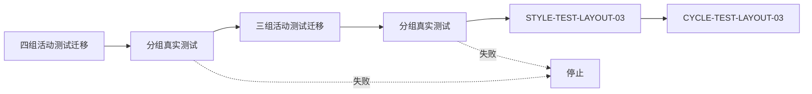
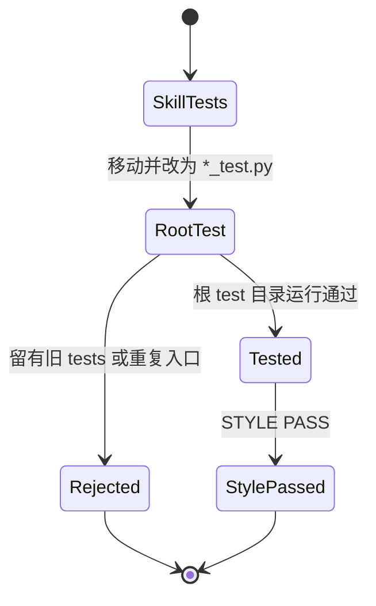

# 根 test 目录统一实施周期 02：活动测试迁移

结论：七组活动 Python 测试已从各 Skill 的 `tests/` 迁至根 `test/` 对应镜像目录；影响：测试入口统一且原有断言继续执行；范围：七组活动测试文件和根测试发现入口；非范围：历史 `doc/5-tests/` 可执行资产、业务源码和外部服务；变化：文件名改为 `*_test.py`，旧 `tests/` 不再保留活动测试；完成标准：七组分组测试均通过并完成 `STYLE: PASS`；术语说明：镜像目录是指根 `test/` 下使用被测 Skill 的同名目录；验证状态：根测试全量入口已通过。

## 当前代码/文档基线

- 周期 01 已冻结双根契约，历史 `doc/5-tests/` 可执行资产仍由指纹清单只读保护。
- 七组活动测试已仅存在于根 `test/`，原 `*/tests/` 路径不再保留跟踪测试文件。
- 每个迁移文件沿用原测试断言，只调整位置、统一命名和必要的导入根。

## 当前周期目标

| 周期 | 目标 | 进入条件 | 收口条件 |
| --- | --- | --- | --- |
| `CYCLE-TEST-LAYOUT-02` | 迁移七组活动测试 | `CYCLE-TEST-LAYOUT-01` 的测试与风格证据存在 | 七组测试在根 `test/` 通过，旧路径无重复入口 |

## 进入条件与收口条件

- 进入条件：`AC-TEST-LAYOUT-002..004` 已由根测试治理校验覆盖。
- 收口条件：`TEST-TEST-LAYOUT-03` 对七组目录的运行均为零退出码，`STYLE-TEST-LAYOUT-03` 为 PASS。
- 停止条件：任一迁移后的断言失败、出现重复入口、产生 `__pycache__` 或历史目录被改写。

图形目的：展示两组迁移在同一周期中的先后验证顺序。关联 ID：`TASK-TEST-LAYOUT-03`。

图形目的：明确单组迁移不产生旧新双入口。关联 ID：`AC-TEST-LAYOUT-005`。

## 周期内最小任务执行顺序

| 顺序 | 任务 | 允许文件 | 禁止触碰区 | 实现 | 真实测试 | 6-review |
| --- | --- | --- | --- | --- | --- |
| 1 | `TASK-TEST-LAYOUT-03` 第一组 | 四个源 `tests/` 与四个根 `test/` 目标 | 历史 `doc/5-tests/` | 迁移并改名 | 四个目录发现命令 | `STYLE-TEST-LAYOUT-03` |
| 2 | `TASK-TEST-LAYOUT-03` 第二组 | 三个源 `tests/` 与三个根 `test/` 目标 | 业务源码和历史归档 | 迁移并改名 | 三个目录发现命令 | `STYLE-TEST-LAYOUT-03` |

## 最小任务闭环

| 任务 | 实现证据 | 真实测试证据 | 风格回归证据 | 停止条件 |
| --- | --- | --- | --- | --- |
| `TASK-TEST-LAYOUT-03` | `EVD-TASK-TEST-LAYOUT-03-IMPL-01` | `EVD-TASK-TEST-LAYOUT-03-TEST-01` | `EVD-TASK-TEST-LAYOUT-03-STYLE-01` | 任一组测试非零退出 |

## 文件与符号操作契约

| 任务 | 文件/符号 | 操作 | 兼容要求 |
| --- | --- | --- | --- |
| `TASK-TEST-LAYOUT-03` | 七个 `test/<skill>/..._test.py` | 从对应 `tests/` 迁移 | 保留原断言，禁止复制双入口 |
| `TASK-TEST-LAYOUT-03` | `test/run_python_tests.py` | 递归发现根目录 | 只匹配 `*_test.py`，不扫描文档目录 |

## 当前周期验证矩阵

| TEST | 精确命令 | 样本 | 断言 | 失败预期 | 清理 |
| --- | --- | --- | --- | --- | --- |
| `TEST-TEST-LAYOUT-03` | `python -X utf8 -B test/run_python_tests.py` | 七组根测试目录 | 七组迁移断言及其它根测试均通过 | 非零停止 | `-B` 不产生字节码 |
| `TEST-TEST-LAYOUT-02` | `python -X utf8 -B -m unittest discover -s test/test-asset-governance -p "*_test.py" -v` | 位置与命名负例 | 旧路径、旧命名和重复风险被拒绝 | 断言失败 | 临时目录自动清理 |

## 回滚与停止条件

- `ROLLBACK-TEST-LAYOUT-02`：单组迁移失败时只恢复该组的源路径与名称，再修正导入根并复验。
- 停止条件：历史文件变化、根目录发现到旧命名、任一组测试失败或 `STYLE: FIX_REQUIRED`。
- 图片资产决策：N/A + 原因：迁移的是文本测试文件，依赖关系已由 Mermaid 表达 + 证据：本文件两张图。

## 周期追踪矩阵

| REQ | AC | CYCLE | TASK | TEST | STYLE | EVIDENCE |
| --- | --- | --- | --- | --- | --- | --- |
| `REQ-TEST-LAYOUT-05` | `AC-TEST-LAYOUT-005` | `CYCLE-TEST-LAYOUT-02` | `TASK-TEST-LAYOUT-03` | `TEST-TEST-LAYOUT-03` | `STYLE-TEST-LAYOUT-03` | `EVD-TASK-TEST-LAYOUT-03-IMPL/TEST/STYLE-01` |

## 自审结论

- 七组测试均已归位，根目录之外没有活动 `*/tests/` 测试文件。
- 真实测试和 `6-review` 只判断各自职责，未把风格结果写成业务放行。
- unresolved_decisions：无；每个迁移路径、命名、测试入口和回滚边界已冻结。

## 执行附录

分组命令、全量入口、样本、清理和结果统一记录在 `doc/5-tests/2026-08-01_191658_根test目录统一/README.md`。

## 追踪附录

`REQ-TEST-LAYOUT-20260801` -> `AC-TEST-LAYOUT-005` -> `CYCLE-TEST-LAYOUT-02` -> `TASK-TEST-LAYOUT-03` -> `TEST-TEST-LAYOUT-03` -> `EVD-TASK-TEST-LAYOUT-03-IMPL/TEST/STYLE-01`。
