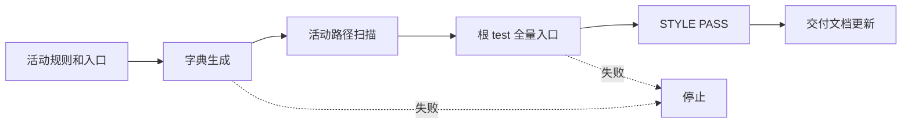
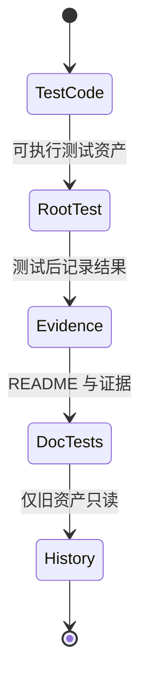

# 根 test 目录统一实施周期 03：消费者同步与全链路回归

结论：活动规则、项目入口、目录树和项目四件套已统一说明根 `test/` 与 `doc/5-tests/` 的双根职责；影响：后续测试不会把可执行资产写回文档目录；范围：活动消费者、索引、字典、当前状态和全链路回归；非范围：历史文档正文、外部服务和 Git 历史；变化：生成字典并运行根测试全量入口；完成标准：活动旧路径扫描为零、测试与 `STYLE: PASS` 全部通过；术语说明：活动消费者是会指导后续任务写入路径的规则和入口文档；验证状态：全量 Python 测试 `187/187` 已通过。

## 当前代码/文档基线

- `artifact-storage-rules` 是测试代码与证据双根的路径单一真相。
- `README.md`、`项目设计.md`、`编码skill.md`、`AGENTS.md`、`CLAUDE.md` 与相邻测试规则已使用根 `test/` 口径。
- `PROJECT_CURRENT.md` 保留多会话投影托管区，普通当前状态与稳定记忆分别维护。

## 当前周期目标

| 周期 | 目标 | 进入条件 | 收口条件 |
| --- | --- | --- | --- |
| `CYCLE-TEST-LAYOUT-03` | 同步活动消费者并完成全链路回归 | `CYCLE-TEST-LAYOUT-02` 的迁移测试通过 | 字典、路径扫描、严格 profile、差异检查和 STYLE 全部通过 |

## 进入条件与收口条件

- 进入条件：七组活动测试已位于根 `test/`，历史可执行资产指纹未变化。
- 收口条件：`TEST-TEST-LAYOUT-04..05` 通过，`STYLE-TEST-LAYOUT-04..05` 为 PASS。
- 停止条件：活动文件将可执行资产指向 `doc/5-tests/`、出现旧 `*/tests/` 入口、字典生成失败或差异检查非零。

图形目的：展示消费者同步、全量测试和风格回归的收口顺序。关联 ID：`TASK-TEST-LAYOUT-04..05`。

图形目的：明确代码、证据和历史资产的最终职责。关联 ID：`DEC-TEST-LAYOUT-01`。

## 周期内最小任务执行顺序

| 顺序 | 任务 | 允许文件 | 禁止触碰区 | 实现 | 真实测试 | 6-review |
| --- | --- | --- | --- | --- | --- |
| 1 | `TASK-TEST-LAYOUT-04` | 活动规则、入口文档、四件套与索引 | 历史归档正文 | 统一双根口径 | 活动路径扫描和字典生成 | `STYLE-TEST-LAYOUT-04` |
| 2 | `TASK-TEST-LAYOUT-05` | 根测试入口、测试 README 和风格记录 | Git 历史与外部服务 | 全链路收口 | 全量入口、严格 profile、差异检查 | `STYLE-TEST-LAYOUT-05` |

## 最小任务闭环

| 任务 | 实现证据 | 真实测试证据 | 风格回归证据 | 停止条件 |
| --- | --- | --- | --- | --- |
| `TASK-TEST-LAYOUT-04` | `EVD-TASK-TEST-LAYOUT-04-IMPL-01` | `EVD-TASK-TEST-LAYOUT-04-TEST-01` | `EVD-TASK-TEST-LAYOUT-04-STYLE-01` | 活动旧路径扫描有命中 |
| `TASK-TEST-LAYOUT-05` | `EVD-TASK-TEST-LAYOUT-05-IMPL-01` | `EVD-TASK-TEST-LAYOUT-05-TEST-01` | `EVD-TASK-TEST-LAYOUT-05-STYLE-01` | 任一全链路命令失败 |

## 文件与符号操作契约

| 任务 | 文件/符号 | 操作 | 兼容要求 |
| --- | --- | --- | --- |
| `TASK-TEST-LAYOUT-04` | 活动 `SKILL.md`、根入口和四件套 | 引用双根规则 | 历史 `doc/5-tests/**` 仅说明为只读 |
| `TASK-TEST-LAYOUT-05` | `test/run_python_tests.py`、`字典.md`、`skill-dictionary/data.js` | 运行和生成 | 不生成临时可执行资产到文档目录 |

## 当前周期验证矩阵

| TEST | 精确命令 | 样本 | 断言 | 失败预期 | 清理 |
| --- | --- | --- | --- | --- | --- |
| `TEST-TEST-LAYOUT-04` | `python -X utf8 -B test/run_python_tests.py` | 根 `test/` | 只发现 `*_test.py`，共 `187/187` 通过 | 非零停止 | `-B` 不生成字节码 |
| `TEST-TEST-LAYOUT-05` | `python -X utf8 -B skill-dictionary/generate_dictionary.py`、严格 profile、`git diff --check` | 活动规则与文档 | 字典和路径口径一致 | 非零停止 | 无外部状态 |

## 回滚与停止条件

- `ROLLBACK-TEST-LAYOUT-03`：消费者出现旧路径时，只恢复受影响规则到中央路径引用后重跑扫描。
- 停止条件：历史正文改变、活动可执行资产进入 `doc/5-tests/`、测试失败、字典或差异检查失败。
- 图片资产决策：N/A + 原因：本周期只验证路径和文本产物，关系由 Mermaid 表达 + 证据：本文件两张图。

## 周期追踪矩阵

| REQ | AC | CYCLE | TASK | TEST | STYLE | EVIDENCE |
| --- | --- | --- | --- | --- | --- | --- |
| `REQ-TEST-LAYOUT-01..05` | `AC-TEST-LAYOUT-001..005` | `CYCLE-TEST-LAYOUT-03` | `TASK-TEST-LAYOUT-04` | `TEST-TEST-LAYOUT-04` | `STYLE-TEST-LAYOUT-04` | `EVD-TASK-TEST-LAYOUT-04-IMPL/TEST/STYLE-01` |
| `REQ-TEST-LAYOUT-01..05` | `AC-TEST-LAYOUT-001..005` | `CYCLE-TEST-LAYOUT-03` | `TASK-TEST-LAYOUT-05` | `TEST-TEST-LAYOUT-05` | `STYLE-TEST-LAYOUT-05` | `EVD-TASK-TEST-LAYOUT-05-IMPL/TEST/STYLE-01` |

## 自审结论

- 活动消费者只把可执行测试指向根 `test/`，测试说明和证据保留在 `doc/5-tests/`。
- 真实测试、字典生成和 `6-review` 各自独立，未产生业务审查或发布放行步骤。
- unresolved_decisions：无；路径、历史边界、生成入口和停止条件均已验证。

## 执行附录

执行根测试、严格 profile、字典生成、活动路径扫描和差异检查；不连接外部服务，不写 Git 历史。

## 追踪附录

`REQ-TEST-LAYOUT-20260801` -> `AC-TEST-LAYOUT-001..005` -> `CYCLE-TEST-LAYOUT-03` -> `TASK-TEST-LAYOUT-04..05` -> `TEST-TEST-LAYOUT-04..05` -> `EVD-TASK-TEST-LAYOUT-04..05-IMPL/TEST/STYLE-01`。
