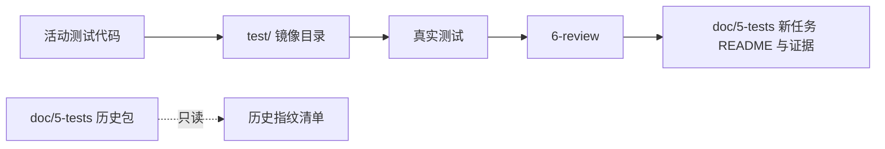
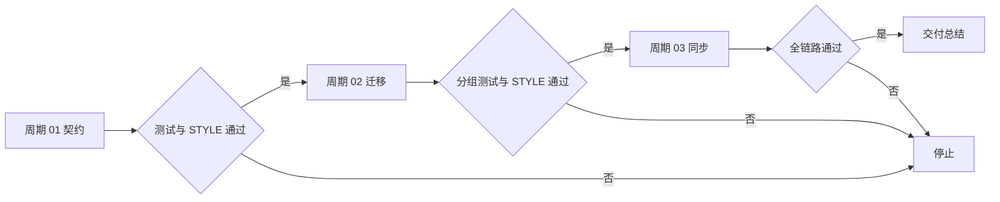
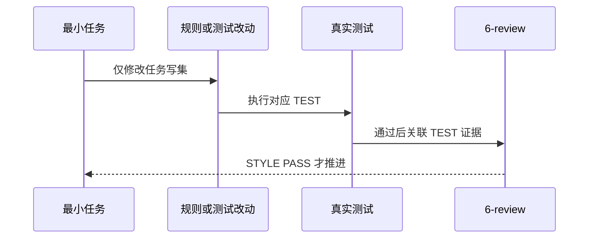

# 根 test 目录统一实施总览

结论：以根 `test/` 承载唯一活动测试代码，以 `doc/5-tests/` 承载本轮说明和证据；影响：新测试可按被测路径直接定位，历史包保持可读；范围：规则、根测试入口、七组活动测试、索引和项目四件套；非范围：历史包批量迁移、业务代码和 Git 历史；变化：新增路径校验与历史资产豁免清单；完成标准：所有任务各自完成实现、真实测试与 `6-review`；术语说明：`6-review` 是测试后只检查写法和归位的风格回归；验证状态：计划已冻结，当前进入文档与契约任务。

## 当前计划最终方案简要说明

采用“双根分工”：根 `test/` 是唯一活动测试代码根，按被测路径镜像；`doc/5-tests/` 仅留中文说明、日志、报告和非可执行证据。这样既不破坏历史资料，又能让后续测试位置、命名和执行入口保持单一事实。

## Agent 对当前问题的理解

- 问题/目标：活动测试分散在 Skill 内 `tests/` 和文档目录，需要收敛到可预测的根测试树。
- 本轮范围：七组活动测试迁移、测试资产契约、位置校验、入口、活动文档与索引同步。
- 非范围：历史 `doc/5-tests/**` 批量搬迁、历史正文改写、业务项目和外部服务。
- 当前优先闭环：双根契约、活动测试迁移、消费者同步和全链路回归均已完成，现收口测试与风格证据。
- 关键假设：现有七组 Python 测试仍可从新路径运行；Go 黑盒规则通过临时模块验证，不接触业务仓库。

## 现状与落点

```text
test/
├── agent-runtime-recovery-rules/blocker_fact_test.py
├── artifact-delivery-gate-rules/validate_engineering_docs_test.py
├── browser-use-cloud-rules/browser_use_cloud_preflight_test.py
├── code-style-consistency-rules/static_owner_router_test.py
├── continuous-code-quality-supervisor-rules/supervisor_state_test.py
├── parallel-task-dispatch-rules/subagent_lifecycle_contract_test.py
├── task-plan-rehydration-rules/task_plan_projection_test.py
├── test-asset-governance/
│   ├── asset_location_test.py
│   ├── python_discovery_test.py
│   └── go_blackbox_layout_test.py
└── shared/
    ├── layout_policy.py
    └── legacy_doc5_tests_manifest.json

doc/5-tests/
└── 2026-08-01_191658_根test目录统一/
    ├── README.md
    ├── evidence/
    └── artifacts/
```

## 实施周期总览

| 周期 | 目标 | 进入条件 | 收口条件 | 依赖 |
| --- | --- | --- | --- | --- |
| `CYCLE-TEST-LAYOUT-01` | 冻结路径契约并建立校验 | 需求已确认 | 文档 profile、位置正负例、`STYLE` 通过 | 无 |
| `CYCLE-TEST-LAYOUT-02` | 迁移七组活动测试 | 周期 01 收口 | 每组真实测试和 `STYLE` 通过 | 周期 01 |
| `CYCLE-TEST-LAYOUT-03` | 同步消费者、索引并全链路回归 | 周期 02 收口 | 根入口、文档、字典和最终 `STYLE` 通过 | 周期 02 |

图形目的：展示代码根、证据根和历史归档的边界。关联 ID：`DEC-TEST-LAYOUT-01`。



图形目的：限制周期的推进顺序和失败停止点。关联 ID：`CYCLE-TEST-LAYOUT-01..03`。



图形目的：展示单个最小任务的实现、测试和风格回归顺序。关联 ID：`TASK-TEST-LAYOUT-01..05`。



## 阶段计划

| 阶段 | 周期 | 唯一目标 | 输出 | 验证 |
| --- | --- | --- | --- | --- |
| `PHASE-TEST-LAYOUT-01` | 01 | 冻结文档和位置契约 | 需求、实施、README、规则口径 | 文档 profile |
| `PHASE-TEST-LAYOUT-02` | 01 | 建立布局校验 | 共享辅助、清单、正负例 | `TEST-TEST-LAYOUT-01..02` |
| `PHASE-TEST-LAYOUT-03` | 02 | 迁移活动 Python 测试 | 七组 `*_test.py` | `TEST-TEST-LAYOUT-03` |
| `PHASE-TEST-LAYOUT-04` | 03 | 同步入口和项目状态 | 根文档、四件套、字典 | `TEST-TEST-LAYOUT-04..05` |

## 最小任务清单

| 任务 | 垂直切片 | 文件/符号 | 真实测试 | 完成条件 | 停止条件 |
| --- | --- | --- | --- | --- | --- |
| `TASK-TEST-LAYOUT-01` | 文档和证据契约 | 需求、总览、周期、README | `TEST-TEST-LAYOUT-01` | `AC-TEST-LAYOUT-001` | profile 失败或历史正文变化 |
| `TASK-TEST-LAYOUT-02` | 规则与路径校验 | path map、catalog、测试规则、布局校验 | `TEST-TEST-LAYOUT-02` | `AC-TEST-LAYOUT-002..004` | 无法识别历史可执行资产 |
| `TASK-TEST-LAYOUT-03` | 七组活动测试迁移 | 七个源 `tests/` 与七个根 `test/` 目标 | `TEST-TEST-LAYOUT-03` | `AC-TEST-LAYOUT-005` | 任一组不等价通过 |
| `TASK-TEST-LAYOUT-04` | 消费者和索引同步 | 根入口、目录树、四件套、字典 | `TEST-TEST-LAYOUT-04` | 活动引用为零 | 历史目录被写入 |
| `TASK-TEST-LAYOUT-05` | 全链路收口 | 根入口和风格记录 | `TEST-TEST-LAYOUT-05` | 全部 TEST 与 STYLE 通过 | 任一命令失败 |

## 实际执行状态

| 任务 | 实现状态 | 真实测试 | 风格回归 | 结论 |
| --- | --- | --- | --- | --- |
| `TASK-TEST-LAYOUT-01` | 已完成 | `EVD-TASK-TEST-LAYOUT-01-TEST-01` | `EVD-TASK-TEST-LAYOUT-01-STYLE-01` | 通过 |
| `TASK-TEST-LAYOUT-02` | 已完成 | `EVD-TASK-TEST-LAYOUT-02-TEST-01` | `EVD-TASK-TEST-LAYOUT-02-STYLE-01` | 通过 |
| `TASK-TEST-LAYOUT-03` | 已完成 | `EVD-TASK-TEST-LAYOUT-03-TEST-01` | `EVD-TASK-TEST-LAYOUT-03-STYLE-01` | 七组迁移测试通过 |
| `TASK-TEST-LAYOUT-04` | 已完成 | `EVD-TASK-TEST-LAYOUT-04-TEST-01` | `EVD-TASK-TEST-LAYOUT-04-STYLE-01` | 活动消费者与索引已同步 |
| `TASK-TEST-LAYOUT-05` | 已完成 | `EVD-TASK-TEST-LAYOUT-05-TEST-01` | `EVD-TASK-TEST-LAYOUT-05-STYLE-01` | 全链路回归通过 |

## 追踪矩阵

| REQ | AC | CYCLE | TASK | 文件/符号 | TEST | STYLE |
| --- | --- | --- | --- | --- | --- |
| `REQ-TEST-LAYOUT-01` | `AC-TEST-LAYOUT-001` | `CYCLE-TEST-LAYOUT-01` | `TASK-TEST-LAYOUT-01` | 文档和 README | `TEST-TEST-LAYOUT-01` | `STYLE-TEST-LAYOUT-01` |
| `REQ-TEST-LAYOUT-02..04` | `AC-TEST-LAYOUT-002..004` | `CYCLE-TEST-LAYOUT-01` | `TASK-TEST-LAYOUT-02` | 规则、清单、布局校验 | `TEST-TEST-LAYOUT-02` | `STYLE-TEST-LAYOUT-02` |
| `REQ-TEST-LAYOUT-05` | `AC-TEST-LAYOUT-005` | `CYCLE-TEST-LAYOUT-02` | `TASK-TEST-LAYOUT-03` | 七组活动测试 | `TEST-TEST-LAYOUT-03` | `STYLE-TEST-LAYOUT-03` |
| `REQ-TEST-LAYOUT-01..05` | `AC-TEST-LAYOUT-001..005` | `CYCLE-TEST-LAYOUT-03` | `TASK-TEST-LAYOUT-04..05` | 入口、索引和字典 | `TEST-TEST-LAYOUT-04..05` | `STYLE-TEST-LAYOUT-04` |

## 真实测试安排

| TEST | 命令/入口 | 样本与断言 | 失败预期 | 清理 |
| --- | --- | --- | --- | --- |
| `TEST-TEST-LAYOUT-01` | 严格文档 profile | 本轮需求、总览、周期、README | 任一 profile 非零 | 无外部状态 |
| `TEST-TEST-LAYOUT-02` | `unittest discover -s test/test-asset-governance` | 正确镜像、错误目录、错误命名、历史篡改、Go 黑盒 | 负例必须失败 | 临时模块自动清理 |
| `TEST-TEST-LAYOUT-03` | 七个 `unittest discover -s test/<目录>` | 原活动测试的行为断言 | 任一组非零停止 | `-B` 不产生字节码 |
| `TEST-TEST-LAYOUT-04` | `python -X utf8 -B test/run_python_tests.py` | 递归发现根 `test/` | 历史文档目录不得被扫描 | 临时目录清理 |
| `TEST-TEST-LAYOUT-05` | 字典生成、路径扫描、`git diff --check` | 活动引用、编码、空白和路径 | 任一异常停止 | 不连接外部服务 |

## 风险与阻断项

| ID | 风险 | 恢复路径 | 禁止动作 |
| --- | --- | --- | --- |
| `ROLLBACK-TEST-LAYOUT-01` | 契约校验误判历史资产 | 调整清单与只读边界后复验 | 批量迁移历史目录 |
| `ROLLBACK-TEST-LAYOUT-02` | 迁移后测试不能导入 | 恢复单组路径并修正导入根 | 复制形成双入口 |
| `ROLLBACK-TEST-LAYOUT-03` | 规则消费者仍写旧路径 | 同步唯一事实源后重跑扫描 | 在各 Skill 复制新口径 |

## 任务完成、停止与最大推进边界

- 完成条件：`AC-TEST-LAYOUT-001..005` 都有实现、`TEST` 和 `STYLE` 证据；七组活动测试不再留在 `*/tests/`；没有新的 `doc/5-tests/` 可执行资产。
- 停止条件：历史正文变化、历史资产指纹无迁移记录而变化、任一真实测试失败、活动路径扫描残留旧代码根或 `STYLE: FIX_REQUIRED`。
- 最大推进边界：仅修改 `F:\luode-skills` 的测试治理、活动测试、必要入口和索引；不连接外部服务，不写 Git 历史。

## 自审结论

- unresolved_decisions：无；目录、命名、Go 黑盒、历史豁免和测试入口已冻结。
- 每个任务都规定了实现 -> 真实测试 -> `6-review` 的顺序，未引入业务审查或最终验收分支。
- 图片资产决策：N/A + 原因：本任务是目录和规则收敛，Mermaid 已表达关系 + 证据：本总览三张图。

## 执行附录

精确本地命令、样本、失败预期、清理、回滚和实际结果写入 `doc/5-tests/2026-08-01_191658_根test目录统一/README.md`；周期 02、03 的任务记录分别位于 `doc/3-实施/2026-08-01_191658_根test目录统一_实施周期02_活动测试迁移.md` 和 `doc/3-实施/2026-08-01_191658_根test目录统一_实施周期03_消费者同步与全链路回归.md`。

## 追踪附录

`REQ-TEST-LAYOUT-20260801` -> `AC-TEST-LAYOUT-001..005` -> `CYCLE-TEST-LAYOUT-01..03` -> `TASK-TEST-LAYOUT-01..05` -> `TEST-TEST-LAYOUT-01..05` -> `STYLE-TEST-LAYOUT-01..05`。
