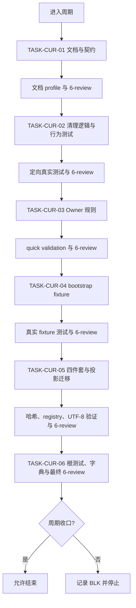
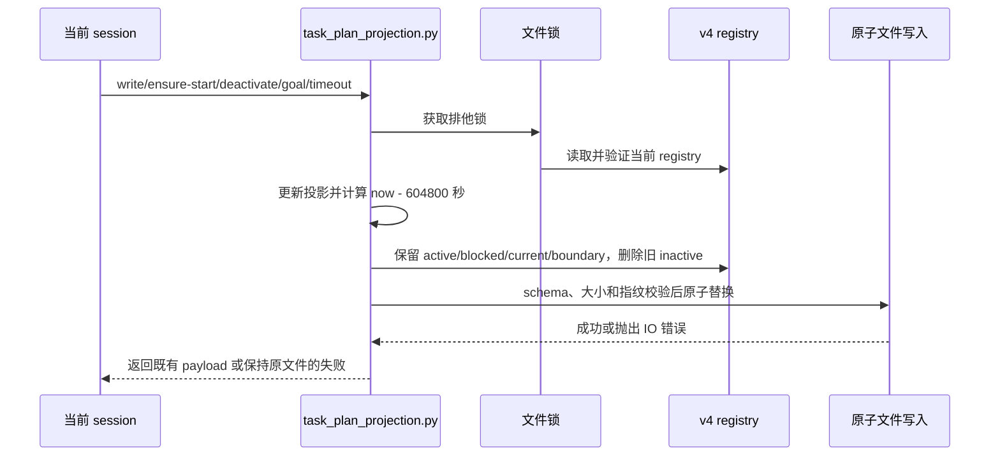

# 实施周期01：PROJECT_CURRENT 七天保留与自动清理

结论：本周期把七天保留规则落实到机器 registry 和项目状态维护规则中；影响：过期的非当前完成投影自动消失，当前会话、未完成投影和近期完成记录仍可交接；范围：需求契约、投影脚本、行为测试、两个 Owner、bootstrap、四件套、字典和风格证据；非范围：不改 Desktop、不猜会话归档、不连接外部服务、不写 Git 历史；变化：清理在锁内共享写入路径执行，普通正文使用 UTC 时间和覆盖维护；完成标准：六个任务分别完成实现/文档更新、真实测试和 `6-review`，并通过周期验证矩阵；术语说明：完成态表示任务已结束，更新时间字段作为完成时间；验证状态：周期已进入首个文档任务。

## 当前周期目标、边界与进入条件

- 周期 ID / 期次定位：`CYCLE-CUR-01` / 第一期。
- 只做这一件事：让 `PROJECT_CURRENT.md` 只保留七天内的完成状态，同时确保当前执行和未完成会话可恢复。
- 对应需求、验收和实施总览：`REQ-CUR-20260802-001`、`AC-CUR-001..007`、`IMP-CUR-20260802-001`。
- 本周期不做：独立清理 CLI、自由文本日期解析、归档状态查询、schema 升级、数据库和 Git 历史。

## 周期图片资产决策与边界

- 图片资产决策：`N/A + 原因 + 证据`。本周期没有 UI、截图或位图产物，流程、依赖和失败边界由 Mermaid 表达。
- Mermaid 边界：任务依赖和写入时序必须使用 Mermaid，图片不能替代这些图。

## 进入条件与收口条件

| 类型 | 条件 | 证据/命令 | 状态 |
| --- | --- | --- | --- |
| 进入 | 需求、Owner、窗口、状态边界和 `AC-CUR-001..007` 已确认 | 需求主文档和实施总览 | 已满足 |
| 进入 | 当前 session projection 已持久化并完成 `update_plan` 同步 | `ensure-start` 返回 payload、悬浮任务列表同步 | 已满足 |
| 收口 | 六个任务均完成实现/文档更新、真实测试和 `STYLE: PASS` | 周期验证矩阵、`doc/6-review/` | 待执行 |
| 收口 | 文档 profile、根测试、字典生成和 `git diff --check` 全部通过 | 本周期命令记录 | 待执行 |

图形目的：说明本周期按任务顺序逐项闭环，任何一步失败即停止。关联 ID：`CYCLE-CUR-01`、`TASK-CUR-01..06`。

图形目的：说明 `TASK-CUR-02` 的时间清理、保护状态和原子写入顺序。关联 ID：`RULE-CUR-001..004`、`AC-CUR-001..006`、`TEST-CUR-001..006`。

## 当前代码/文档基线

- 分支 / 提交：`main` / `3237bee84fbf2d751393340691aa1980c50408a3`；工作树已有用户未提交改动，实施中不得回滚。
- 已核实文件和符号：`task-plan-rehydration-rules/scripts/task_plan_projection.py` 的 `_upsert_projection_while_locked`、`upsert_projection`、`ensure_start_projection`、`_deactivate_projection_with_payload`、`handle_goal_event`、`ensure_timeout_projection`；对应契约和根测试已存在。
- 当前 registry：v4，多会话投影并存；清理前最早 `inactive` 已超过八天，当前 session 由显式 `session_id` 保护。
- 依赖版本与 local 配置：仅 Python 3 标准库、临时目录和本地文件；无数据库、缓存、HTTP/RPC 或外部服务依赖。
- 不一致停止规则：发现符号不存在、接口变化、registry 无法校验或用户非托管正文发生并发变化，立即停止并记录阻断，不猜测替代落点。

## 周期内最小任务执行顺序

| 顺序 | 任务 ID | 唯一目标 | 前置依赖 | 允许文件 | 禁止触碰区 | 状态 |
| ---: | --- | --- | --- | --- | --- | --- |
| 1 | `TASK-CUR-01` | 落盘需求、总览和周期契约 | 已确认计划 | 三份 `doc/` 文档 | 代码、规则、测试、四件套 | in_progress |
| 2 | `TASK-CUR-02` | 共享锁内清理逻辑与行为测试 | `TASK-CUR-01` profile 通过 | 脚本、契约、定向测试 | Owner、模板、真实项目状态 | pending |
| 3 | `TASK-CUR-03` | 两个 Owner Skill 口径同步 | `TASK-CUR-02` 测试和风格通过 | Owner `SKILL.md`、`agents/openai.yaml`、memory 模板 | bootstrap 生成逻辑、真实投影 | pending |
| 4 | `TASK-CUR-04` | bootstrap 模板和生成规则同步 | `TASK-CUR-03` 通过 | bootstrap Skill、脚本、模板、AGENTS/CLAUDE | registry 业务逻辑、测试实现 | pending |
| 5 | `TASK-CUR-05` | 四件套更新和真实旧投影清理 | `TASK-CUR-04` fixture 通过 | `PROJECT_CURRENT.md`、`PROJECT_MEMORY.md`、`PROJECT_HISTORY.md` | 用户其它文件、Git 历史 | pending |
| 6 | `TASK-CUR-06` | 字典、根测试、文档和最终风格收口 | `TASK-CUR-05` 通过 | 字典、`doc/6-review/`、必要证据 | 计划外优化 | pending |

## 最小任务闭环

| 任务 | 实现/文档更新 | 真实测试 | 6-review 风格回归 | 完成/停止条件 |
| --- | --- | --- | --- | --- |
| `TASK-CUR-01` | 三份活动文档和追踪矩阵落盘 | 三个 profile 命令 | `STYLE: PASS`；文档中文、章节、图和 ID | profile 失败则停止，不进入代码 |
| `TASK-CUR-02` | 新增保留常量/清理辅助逻辑，更新契约和测试 | 定向 Python 测试及失败不变 fixture | `STYLE: PASS`；UTC、命名、注释和锁边界 | 当前 session/active/blocked 被删或 schema 漂移即停止 |
| `TASK-CUR-03` | Owner、agent 配置和模板规则同步 | 两个 quick validation、文本契约测试 | `STYLE: PASS`；职责无重复冲突 | 规则要求自由文本解析或越权时停止 |
| `TASK-CUR-04` | bootstrap 源和生成受管章节同步 | 临时仓库 `bootstrap_agents.sh --repo <fixture> --target both` | `STYLE: PASS`；UTF-8、幂等、用户内容保护 | 覆盖正文、重复章节或漂移即停止 |
| `TASK-CUR-05` | 四件套写入、历史追加和 registry 真实迁移 | 临时副本、哈希、大小、session 保护 | `STYLE: PASS`；四件套职责和最小变更 | 非托管哈希变化或归属不明即停止 |
| `TASK-CUR-06` | 字典刷新、最终证据和周期文档更新 | 根测试、字典生成、文档 profile、diff check | `STYLE: PASS`；只查风格不替代行为验收 | 任一失败保留证据并停止 |

## 文件/符号操作契约

| 任务 | 文件路径 | 文件/符号 | 操作 | 修改前职责 | 修改后职责 | 调用方影响 | 兼容要求 |
| --- | --- | --- | --- | --- | --- | --- | --- |
| `TASK-CUR-02` | `task-plan-rehydration-rules/scripts/task_plan_projection.py` | `_upsert_projection_while_locked` | 修改 | 锁内更新并原子写入 registry | 更新后清理过期 inactive，再统一校验和写入 | 所有写入口自动获得清理 | v4 字段、CLI payload 和 v1-v3 读取不变 |
| `TASK-CUR-02` | `task-plan-rehydration-rules/references/task-plan-projection-contract.md` | 保留策略章节 | 新增规则 | 说明写入和状态契约 | 明确七天、边界和保护状态 | Owner 与实现一致 | 不增加 schema |
| `TASK-CUR-02` | `test/task-plan-rehydration-rules/task_plan_projection_test.py` | 清理行为用例 | 新增测试 | 覆盖既有写入与兼容 | 覆盖时间、会话、失败和 CLI | 根测试可发现 | 只用临时目录 |
| `TASK-CUR-03` | 两个 Owner `SKILL.md`、`agents/openai.yaml`、`project-memory-template.md` | 保留规则章节/默认提示 | 同步规则 | 定义 current/memory 和投影边界 | 增加七天近期状态语义 | 自动触发不变 | Plan Mode 不写投影 |
| `TASK-CUR-04` | `project-rule-file-bootstrap-rules/scripts/bootstrap_agents.sh`、四件套模板、AGENTS/CLAUDE | 受管章节和模板 | 同步生成源 | 初始化四件套和平台规则 | 表达近期状态、时间和正文保护 | bootstrap 幂等 | 不覆盖非受管正文 |
| `TASK-CUR-05` | `PROJECT_CURRENT.md`、`PROJECT_MEMORY.md`、`PROJECT_HISTORY.md` | 当前状态、稳定规则、事件 | 覆盖/合并/追加 | 四件套职责分离 | 清理旧投影并留下近期执行记录 | 当前 session 保护 | UTF-8、<= 51,200 bytes |
| `TASK-CUR-06` | `编码skill.md`、`字典.md`、`skill-dictionary/data.js`、`doc/6-review/` | 字典和风格证据 | 生成/新增 | 记录既有 skill 索引 | 反映 Owner 描述与最终证据 | 生成器为唯一源 | 不手工改统计 |

## 当前周期验证矩阵

| 测试 ID | 对应任务 | 精确命令 | local 依赖 | fixture/样本 | 断言 | 失败预期 | 清理 |
| --- | --- | --- | --- | --- | --- | --- | --- |
| `TEST-CUR-001` | `TASK-CUR-02` | `python -X utf8 -B test/task-plan-rehydration-rules/task_plan_projection_test.py` | Python 标准库 | 旧 inactive、近期 inactive、边界 inactive、未来时间 | 旧删除，其他 inactive 保留 | 退出码非 0，停止 | `TemporaryDirectory` |
| `TEST-CUR-002` | `TASK-CUR-02` | 同上 | Python 标准库 | 旧 active、旧 blocked、当前 session 旧 inactive | 三类均保留 | 任一缺失即停止 | 临时目录 |
| `TEST-CUR-003` | `TASK-CUR-02` | 同上 | Python 标准库 | 多会话交错 write/ensure/deactivate/goal/timeout | 只清理符合条件项 | 跨会话覆盖即停止 | 临时目录 |
| `TEST-CUR-004` | `TASK-CUR-02` | 同上 | Python 标准库 | v1-v3 legacy | 读取/迁移仍通过 | 兼容失败即停止 | 临时目录 |
| `TEST-CUR-005` | `TASK-CUR-02` | 同上 | Python 标准库 | 清理后 schema、大小、原子写 | v4 合法且非托管正文不变 | 校验或原子写失败即停止 | 临时目录 |
| `TEST-CUR-006` | `TASK-CUR-02` | 同上 | Python 标准库 | 损坏 UTF-8、未知字段、超限、写入失败 | 原文件字节哈希不变 | 任何变化即停止 | 临时目录 |
| `TEST-CUR-007` | `TASK-CUR-03..04` | 两个 `quick_validate.py` + bootstrap fixture | 本地 Python、临时仓库 | Owner、模板、生成规则同口径 | 缺规则/漂移即失败 | 不继续真实项目迁移 | 临时仓库删除 |
| `TEST-CUR-008` | `TASK-CUR-05..06` | 根测试、字典生成、文档 profile、`git diff --check` | 本地仓库和 Python | 四件套、字典、文档、编码 | 全部通过并有证据 | 不宣称收口 | 保留失败证据 |

## 回滚与停止条件

- `ROLLBACK-CUR-001`：先记录工作树差异，再逐项撤销本周期新增或修改的规则、脚本、测试、模板、项目记忆和文档；不动用户其它未提交文件。
- 停止条件：需求决策变化、当前 session 不明确、清理结果不确定、原子写失败、当前会话被删除、schema/CLI 漂移、测试/profile/风格失败、非托管正文哈希变化。
- 恢复路径：代码回到 `TASK-CUR-02`；Owner 规则回到 `TASK-CUR-03`；bootstrap 回到 `TASK-CUR-04`；四件套回到 `TASK-CUR-05`；最终证据回到 `TASK-CUR-06`。
- 当前 agent 最大推进边界：只按 `TASK-CUR-01 -> TASK-CUR-06` 执行，不增加自动归档工具、历史批量整理或其它优化目标。

## 周期追踪矩阵

| REQ/RULE | AC | TASK | 文件/符号 | TEST | STYLE | EVIDENCE | 闭环状态 |
| --- | --- | --- | --- | --- | --- | --- | --- |
| `REQ-CUR-001`、`RULE-CUR-001` | `AC-CUR-001..002` | `TASK-CUR-02` | `_upsert_projection_while_locked` | `TEST-CUR-001..005` | `STYLE-CUR-02` | `EVIDENCE-CUR-001..005` | pending |
| `REQ-CUR-002`、`RULE-CUR-002` | `AC-CUR-003` | `TASK-CUR-02` | `inactive.updated_at` 比较 | `TEST-CUR-001` | `STYLE-CUR-02` | `EVIDENCE-CUR-001` | pending |
| `REQ-CUR-003`、`RULE-CUR-003` | `AC-CUR-004..005` | `TASK-CUR-02` | session/status 保护 | `TEST-CUR-002..003` | `STYLE-CUR-02` | `EVIDENCE-CUR-002..003` | pending |
| `REQ-CUR-004`、`RULE-CUR-004` | `AC-CUR-006` | `TASK-CUR-02` | v4 校验与原子写 | `TEST-CUR-005..006` | `STYLE-CUR-02` | `EVIDENCE-CUR-005..006` | pending |
| `REQ-CUR-005`、`RULE-CUR-005` | `AC-CUR-007` | `TASK-CUR-03..05` | Owner、模板、四件套 | `TEST-CUR-007..008` | `STYLE-CUR-03..05` | `EVIDENCE-CUR-007..008` | pending |

## 自审结论

- 当前周期是否只包含一个目标：是，均围绕七天保留与自动清理。
- 是否按实现/文档更新 -> 真实测试 -> `6-review` 逐任务闭环：是，任务表已冻结顺序和证据字段。
- 是否存在未决决策或模糊落点：否；`unresolved_decisions` 为零个 P0/P1。
- 图形、表格和正文术语是否一致：是，`inactive`、`updated_at`、当前 session、active、blocked 与 `604800` 秒统一。
- 当前周期状态：首个文档任务正在落盘，未满足周期收口条件。

## 执行附录

- 文档测试命令：按 `requirement`、`implementation_overview`、`implementation_cycle` profile 校验三份文档。
- 代码测试命令：`python -X utf8 -B test/task-plan-rehydration-rules/task_plan_projection_test.py`。
- 最终测试命令：`python -X utf8 -B test/run_python_tests.py`、`python -X utf8 -B skill-dictionary/generate_dictionary.py`、`git diff --check`。
- 图片资产决策：`N/A + 原因 + 证据`；无图片文件或 Markdown 图片引用。

## 追踪附录

`REQ-CUR-001..005` / `RULE-CUR-001..005` -> `AC-CUR-001..007` -> `CYCLE-CUR-01` -> `TASK-CUR-01..06` -> `TEST-CUR-001..008` -> `EVIDENCE-CUR-001..008`。

任务证据锚点（活动任务必须分别补齐实现、测试和风格三类）：

| 任务 | 实现证据 | 测试证据 | 风格证据 |
| --- | --- | --- | --- |
| `TASK-CUR-01` | `EVD-TASK-CUR-01-IMPL-01` | `EVD-TASK-CUR-01-TEST-01` | `EVD-TASK-CUR-01-STYLE-01` |
| `TASK-CUR-02` | `EVD-TASK-CUR-02-IMPL-01` | `EVD-TASK-CUR-02-TEST-01` | `EVD-TASK-CUR-02-STYLE-01` |
| `TASK-CUR-03` | `EVD-TASK-CUR-03-IMPL-01` | `EVD-TASK-CUR-03-TEST-01` | `EVD-TASK-CUR-03-STYLE-01` |
| `TASK-CUR-04` | `EVD-TASK-CUR-04-IMPL-01` | `EVD-TASK-CUR-04-TEST-01` | `EVD-TASK-CUR-04-STYLE-01` |
| `TASK-CUR-05` | `EVD-TASK-CUR-05-IMPL-01` | `EVD-TASK-CUR-05-TEST-01` | `EVD-TASK-CUR-05-STYLE-01` |
| `TASK-CUR-06` | `EVD-TASK-CUR-06-IMPL-01` | `EVD-TASK-CUR-06-TEST-01` | `EVD-TASK-CUR-06-STYLE-01` |
