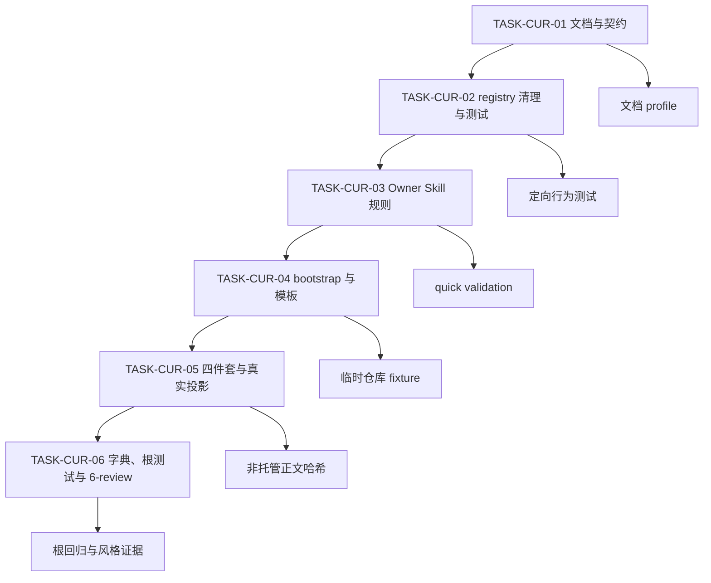
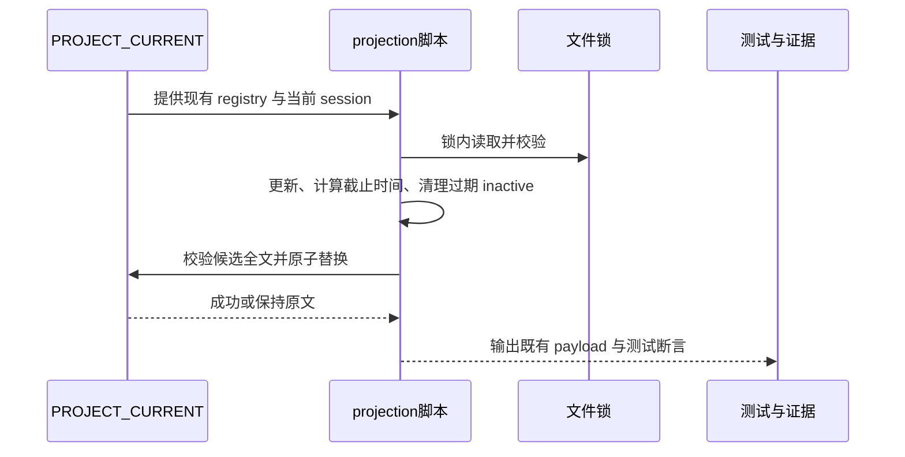

# PROJECT_CURRENT 任务记录七天保留与过期清理实施总览

结论：复用现有 v4 registry 的完成态更新时间，在锁内共享写入路径自动删除超过七天的非当前完成投影，并同步两个 Owner Skill、模板和项目记忆规则；影响：机器投影和普通正文都以近期状态为主，当前会话和未完成任务不会被清理；范围：`task-plan-rehydration-rules`、`project-memory-rules`、`project-rule-file-bootstrap-rules`、根测试、项目四件套和字典；非范围：不升级 v4 schema、不查询归档状态、不接入外部系统、不提交 Git；变化：增加七天时间边界、会话保护和正文时间记录规则；完成标准：六个最小任务逐个完成实现/文档更新、真实测试和 `6-review`，文档 profile、根测试和字典生成全部通过；术语说明：完成态是已完成且不再参与悬浮窗恢复的投影；验证状态：本周期文档正在落盘，后续按既定顺序推进。

## 当前计划最终方案简要说明

在 `_upsert_projection_while_locked` 内完成“更新当前投影 -> 清理过期 inactive -> 统一校验 -> 原子替换”，所有现有写入口复用该路径。普通 Markdown 由 `project-memory-rules` 规定 UTC 完成时间和当前会话执行点，但不增加自由文本解析器；这样可以压缩长期状态，同时保留当前执行和未完成任务的交接能力。

## Agent 对当前问题的理解

- 来源对象：`SRC-CUR-20260802-001`，需求主文档为 `REQ-CUR-20260802-001`。
- 问题：已完成很久的任务和已经失去当前价值的旧会话投影持续占用 `PROJECT_CURRENT.md`。
- 当前优先闭环：先落盘规则与 AC，再实现 registry 清理和行为测试，最后同步 Owner、模板、四件套、字典和风格证据。
- 已冻结：严格 `7×24` 小时；只删非当前 `inactive`；current session、active、blocked 永久保护；不猜测归档状态；复用 `updated_at`，不改 schema。
- `unresolved_decisions`：无。

## 范围、非范围与最大推进边界

| 分类 | 内容 |
| --- | --- |
| 本轮范围 | 计划列出的 Skill、Python 脚本、契约、测试、模板、自举脚本、生成规则文件、项目四件套、字典和 `doc/` 证据。 |
| 非范围 | Codex Desktop 产品源码、数据库、网络服务、外部 API、宿主归档状态、Git 历史写入。 |
| 最大推进边界 | 只修改计划列出的文件；发现非计划写集、当前 session 无法可靠识别、非托管正文并发变化或真实测试失败时停止。 |

## 实施周期总览

| 周期 | 期次定位 | 目标 | 进入条件 | 收口条件 | 状态 |
| --- | --- | --- | --- | --- | --- |
| `CYCLE-CUR-01` | 第一期 | 七天保留、自动清理与正文规则同步 | `REQ-CUR-20260802-001`、`AC-CUR-001..007` 已确认 | `TASK-CUR-01..06` 均通过真实测试和 `6-review`，追踪与字典同步 | in_progress |

## 阶段计划

| 阶段 | 内容 | 对应任务 | 通过标准 |
| --- | --- | --- | --- |
| 阶段1 | 需求与契约冻结 | `TASK-CUR-01` | 三份文档 profile 通过，所有 P0/P1 决策已冻结 |
| 阶段2 | 机器 registry 清理闭环 | `TASK-CUR-02` | 边界、保护、旧版本和失败不变测试通过 |
| 阶段3 | Owner、模板和 bootstrap 同步 | `TASK-CUR-03..04` | 源文件、受管章节、模板和生成规则一致 |
| 阶段4 | 四件套、字典、测试与风格收口 | `TASK-CUR-05..06` | 旧投影清理可证明，根测试、文档 profile 和 `STYLE: PASS` 通过 |

图形目的：说明单一周期的任务依赖和逐任务闭环。关联 ID：`CYCLE-CUR-01`、`TASK-CUR-01..06`、`AC-CUR-001..007`。



图形目的：说明从来源、需求、验收、周期到文件和测试证据的垂直追踪。关联 ID：`SRC-CUR-20260802-001`、`REQ-CUR-001..005`、`AC-CUR-001..007`。


图形目的：说明清理路径的执行顺序和失败保护点。关联 ID：`RULE-CUR-001..004`、`AC-CUR-001..006`、`TASK-CUR-02`。



## 最小任务清单

| 顺序 | 任务 | 唯一目标 | 文件/符号 | 真实测试 | 风格回归 | 状态 |
| ---: | --- | --- | --- | --- | --- | --- |
| 1 | `TASK-CUR-01` | 落盘需求、实施总览和周期契约 | 三份 `doc/` 文档 | 三个文档 profile | 文档结构检查 | in_progress |
| 2 | `TASK-CUR-02` | 实现自动清理并补齐行为测试 | `_upsert_projection_while_locked`、契约、测试 | `python -X utf8 -B test/task-plan-rehydration-rules/task_plan_projection_test.py` | `6-review` | pending |
| 3 | `TASK-CUR-03` | 同步两个 Owner Skill 和模板规则 | 两个 `SKILL.md`、两个 `agents/openai.yaml`、project-memory 模板 | 两个 Owner quick validation 和文本契约 | `6-review` | pending |
| 4 | `TASK-CUR-04` | 同步 bootstrap 与生成规则 | bootstrap `SKILL.md`、`bootstrap_agents.sh`、四件套模板、AGENTS/CLAUDE | 临时仓库 bootstrap fixture | `6-review` | pending |
| 5 | `TASK-CUR-05` | 更新四件套并清理真实旧投影 | `PROJECT_CURRENT.md`、`PROJECT_MEMORY.md`、`PROJECT_HISTORY.md` | 临时副本写入、正文哈希、registry 校验 | `6-review` | pending |
| 6 | `TASK-CUR-06` | 刷新字典并完成全量收口 | `编码skill.md`、`字典.md`、`skill-dictionary/data.js`、`doc/6-review/` | 根测试、字典生成、`git diff --check`、文档 profile | `STYLE: PASS` | pending |

## 现状与落点

当前代码和文档落点：

```text
F:/luode-skills/
├─ task-plan-rehydration-rules/
│  ├─ SKILL.md
│  ├─ agents/openai.yaml
│  ├─ references/task-plan-projection-contract.md
│  └─ scripts/task_plan_projection.py
├─ project-memory-rules/
│  ├─ SKILL.md
│  ├─ agents/openai.yaml
│  └─ references/project-memory-template.md
├─ project-rule-file-bootstrap-rules/
│  ├─ SKILL.md
│  ├─ scripts/bootstrap_agents.sh
│  └─ references/项目记忆模板/四件套模板.md
├─ test/task-plan-rehydration-rules/task_plan_projection_test.py
├─ PROJECT_CURRENT.md
├─ PROJECT_MEMORY.md
└─ PROJECT_HISTORY.md
```

| 任务 | 文件/符号 | 修改后职责 | 兼容要求 |
| --- | --- | --- | --- |
| `TASK-CUR-02` | `task_plan_projection.py:_upsert_projection_while_locked` | 在锁内写入候选 registry 前清理过期 `inactive` | v4 字段、v1-v3 读取、CLI JSON 不变 |
| `TASK-CUR-02` | `task_plan_projection_test.py` | 覆盖时间边界、状态保护、失败不变和 CLI 入口 | 仅临时目录，不连接外部服务 |
| `TASK-CUR-03` | 两个 Owner `SKILL.md` / `agents/openai.yaml` | 明确 registry 和普通正文的七天维护边界 | Owner 不越权、不猜归档状态 |
| `TASK-CUR-04` | `bootstrap_agents.sh` 与四件套模板 | 新项目初始化时提供近期状态规则 | 不覆盖用户正文、不重复受管章节 |
| `TASK-CUR-05` | 项目四件套 | 保存稳定规则、近期状态和关键历史 | registry 托管区原样保护 |

## 方案选择

| 方案 | 结论 | 原因 |
| --- | --- | --- |
| A：每次锁内写入自动清理 registry | 采用 | 与现有原子写入、会话隔离和失败不变契约一致，调用方无需记忆额外命令。 |
| B：新增独立清理命令 | 不采用 | 容易忘记调用，不能保证所有写入入口都得到治理。 |
| C：脚本解析普通 Markdown 删除 | 不采用 | 自由文本缺少稳定 schema，误删风险不可接受。 |

## 真实测试安排

| 测试 | 对应任务 | 精确命令/入口 | fixture 与断言 | 失败预期与清理 |
| --- | --- | --- | --- | --- |
| `TEST-CUR-001..006` | `TASK-CUR-02` | `python -X utf8 -B test/task-plan-rehydration-rules/task_plan_projection_test.py` | 临时 `PROJECT_CURRENT.md`；旧/边界/近期 inactive，旧 active/blocked，当前 session，损坏和写入失败；断言投影集合、文件哈希和 v4 合法性。 | 任一失败停止后续任务；`TemporaryDirectory` 自动清理。 |
| `TEST-CUR-007` | `TASK-CUR-03..04` | 两个 Owner `scripts/quick_validate.py`；bootstrap fixture | 检查七天、UTC、当前会话、active/blocked、归档不猜测和 Plan Mode 口径一致。 | 文本缺失或生成漂移即停止；删除临时仓库。 |
| `TEST-CUR-008` | `TASK-CUR-05..06` | `python -X utf8 -B test/run_python_tests.py`、字典生成和文档 profile | 根测试、字典、文档 profile、UTF-8、大小和 diff check。 | 失败保留证据，不写 Git 历史。 |

所有测试只使用本地仓库、Python、临时目录和 local fixture，不连接数据库、缓存、消息队列、HTTP/RPC 上游或外部服务。

## 风险与阻断项

| 阻断 ID | 条件 | 处理 |
| --- | --- | --- |
| `BLK-CUR-001` | 当前 `session_id` 缺失、冲突或无法唯一绑定 | 拒绝清理，保留文件，停止当前任务。 |
| `BLK-CUR-002` | registry 损坏、原子替换失败或候选全文超限 | 证明原文件字节不变，回流 `TASK-CUR-02`。 |
| `BLK-CUR-003` | 文档 profile、行为测试、根测试或字典生成失败 | 保留失败证据，停止后续收口，不宣称完成。 |
| `BLK-CUR-004` | 发现非计划文件被改动或用户非托管正文发生并发变化 | 停止真实迁移，回流项目记忆 Owner 核对。 |

## 回滚与停止条件

- `ROLLBACK-CUR-001`：撤销本周期新增规则、脚本逻辑、测试、模板和文档；恢复前先保存当前工作树差异，不使用 `reset`、`checkout`、`rebase` 或覆盖其它会话 projection。
- 停止条件：任一 P0/P1 决策重新打开、session_id 不明确、schema 漂移、当前会话被删除、原子写失败、测试失败、文档 profile 失败或出现非范围写入。
- 恢复路径：若代码失败，回到 `TASK-CUR-02` 的最小 fixture；若规则冲突，回到 `TASK-CUR-03`；若正文/投影迁移不确定，回到 `TASK-CUR-05`，不得猜测继续。
- 最大推进边界：只执行本总览列出的六个任务；不把优化建议、归档工具或历史压缩扩展为新目标。

## 自审结论

- 任务是否垂直切片：是，每项均绑定目标、文件/符号、真实测试和风格回归。
- 是否存在未决决策：否；`unresolved_decisions` 为零个 P0/P1。
- 是否有文件/符号精确落点：是，详见“现状与落点”和周期任务契约。
- 是否包含真实测试：是，所有代码/脚本变更均绑定本地真实命令；纯文档任务只按 profile 校验。
- 是否保留最大推进边界、停止条件、回滚和失败不变：是。
- 当前收口结论：首个文档任务正在执行，尚未允许宣称本需求完成。

## 周期收口规则

每个任务必须逐个完成“实现/文档更新 -> 对应真实测试 -> `6-review` 风格回归”，再允许下一个任务进入 `in_progress`。周期只有在所有任务闭环、项目四件套职责一致、字典由生成器刷新、文档 profile 全通过且无阻断记录未关闭时才可标记完成。

## 执行附录

- 文档 profile：需求用 `requirement`，总览用 `implementation_overview`，周期用 `implementation_cycle`，收口用 `style_regression`。
- 真实代码测试：`python -X utf8 -B test/task-plan-rehydration-rules/task_plan_projection_test.py`；最终根测试：`python -X utf8 -B test/run_python_tests.py`。
- 图片资产决策：`N/A + 原因 + 证据`。本变更没有图片产物，三张 Mermaid 图足以表达流程、依赖和时序。

## 追踪附录

| SRC | DEC | REQ/RULE | AC | CYCLE | TASK | TEST | EVIDENCE |
| --- | --- | --- | --- | --- | --- | --- | --- |
| `SRC-CUR-20260802-001` | `DEC-CUR-001..006` | `REQ-CUR-001..005`、`RULE-CUR-001..005` | `AC-CUR-001..007` | `CYCLE-CUR-01` | `TASK-CUR-01..06` | `TEST-CUR-001..008` | `EVIDENCE-CUR-001..008` |
