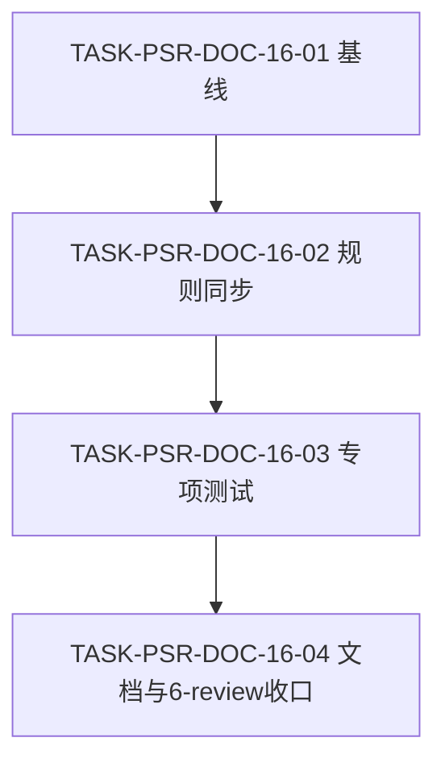
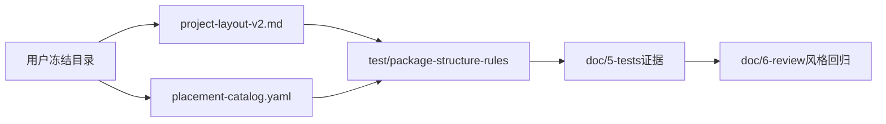

# 代码位置目录规则 V2 实施周期 16：三类项目 doc 目录收敛

结论：本周期把 fullstack、backend、frontend 的活动研发目录统一为 `doc/1-架构/` 至 `doc/6-review/`，按需保留 `doc/data/images/`。影响：三类项目初始化骨架和人工目录树统一，后端独立项目补齐完整研发文档子树。范围：目录规则、Catalog skeleton、根专项测试和研发文档。非范围：真实项目迁移、历史目录清理、源码域 data、CLI 行为重构和外部服务。变化：`doc/6-review/` 成为活动风格回归入口，旧 `doc/6-审查/`、`doc/7-验收/` 仅只读保留。术语说明：`skeleton` 指初始化时生成的目录骨架，`6-review` 指测试后的代码习惯风格回归。验证状态：目录专项测试、入口回归、四份文档 profile、根测试和差异检查按周期任务执行。完成标准：人工目录树、Catalog skeleton、初始化骨架和根目录专项测试一致。

## 图片资产决策

图片资产决策：N/A + 原因：本周期只有文本目录契约，没有视觉验收对象；证据：`TEST-PSR-DOC-LAYOUT-001`。

## 当前计划最终方案的简要说明

采用垂直切片：先冻结 CYCLE-15 基线，再同步人工目录树和 Catalog，随后以根 `test/` 的单一专项测试验证三类初始化输出，最后执行文档门禁和 `6-review`。不修改 `placement_catalog.py` 的数据驱动行为，不删除真实项目历史目录。

## Agent 对当前问题的理解

| 项目 | 结论 |
|---|---|
| 问题 | frontend 人工目录树仍保留根 `data/business/project`，三类 doc 树仍混入旧 `6-审查/7-验收`，backend 的 `doc/` 只有空节点。 |
| 目标 | 三类项目统一活动 doc 目录，保留条件 `doc/data/images`，删除多余前端根 data 事实。 |
| 范围 | `project-layout-v2.md`、`placement-catalog.yaml`、V2 需求/实施文档、根目录专项测试、测试 README、`6-review` 和项目记忆。 |
| 非范围 | 真实项目迁移、历史目录清理、源码域 data、CLI 行为重构、Git 历史写入和外部服务。 |
| 未决项 | `[]`；用户已确认后端注释使用“后端”，同仓使用工作区语义。 |

## 当前代码/文档基线

当前基线显示 frontend 人工目录树仍声明根 `data/business/project`，三类 doc 树仍混入旧活动目录，backend 的 `doc/` 目录事实不完整；CYCLE-15 二进制入口回归已通过 5/5。周期落点为 `project-layout-v2.md`、`placement-catalog.yaml`、根 `test/package-structure-rules/` 和活动研发文档。

## 当前周期目标、边界与进入条件

| 字段 | 内容 |
|---|---|
| 周期目标 | 三类人工目录树、Catalog skeleton 和 init 输出对活动 doc 目录给出同一结论。 |
| 进入条件 | `REQ-PSR-DOC-LAYOUT-001` 已确认；当前工作树保留 CYCLE-15 改动。 |
| 停止条件 | CYCLE-15 基线非 50/50、Catalog 与人工树冲突、测试需非 local 环境，或出现删除历史目录要求。 |
| 最大推进边界 | 仅修改目录契约、文档、根专项测试和证据；不改写真实项目。 |

## 任务依赖图

图形目的：保证基线、规则同步、专项测试和收口按顺序执行。关联 ID：`TASK-PSR-DOC-16-01` 至 `TASK-PSR-DOC-16-04`。

## 领域匹配图

图形目的：说明同一目录事实在人工树、Catalog、测试和研发产物中的垂直落点。关联 ID：`REQ-PSR-DOC-LAYOUT-001`、`AC-PSR-DOC-LAYOUT-001`、`AC-PSR-DOC-LAYOUT-002`。

## 周期内最小任务执行顺序

固定顺序：`TASK-PSR-DOC-16-01 -> TASK-PSR-DOC-16-02 -> TASK-PSR-DOC-16-03 -> TASK-PSR-DOC-16-04`；每个任务必须先完成实现、真实测试和 6-review 风格回归，才允许进入下一任务。

## 最小任务闭环

固定顺序：`TASK-PSR-DOC-16-01 -> TASK-PSR-DOC-16-02 -> TASK-PSR-DOC-16-03 -> TASK-PSR-DOC-16-04`。每个任务必须先完成实现、真实测试和 6-review 风格回归，才允许进入下一任务。

### TASK-PSR-DOC-16-01：冻结 CYCLE-15 基线

- 实现：核对二进制入口测试和当前 CYCLE-15 改动；若出现误判，仅修复入口规则边界，不扩展目录范围。
- 真实测试：`python -X utf8 -B test/package-structure-rules/entrypoint_layout_test.py`；通过标准为 5/5，作为当前 50/50 基线的一部分。
- 失败预期：合法入口被拒、非法入口放行或测试出现非本周期失败时停止。
- 清理：测试仅使用临时目录，仓库不保留运行产物。
- 完成条件：CYCLE-15 入口专项测试通过且 `git diff` 未混入无关改动。
- 6-review：记录路径归位、中文说明、UTF-8 和无临时文件。

### TASK-PSR-DOC-16-02：同步三类目录事实

- 实现：更新 `project-layout-v2.md`、`placement-catalog.yaml`、V2 需求和实施总览；删除 frontend 根 `data/business/project`，三类 doc 树统一到 `6-review` 并补齐 backend 子树。
- 真实测试：执行 Catalog `render --project-kind fullstack|backend|frontend` 并运行专项测试的 Catalog 断言。
- 失败预期：任一渲染出现 `6-审查`、`7-验收` 或 frontend 根 data，或 backend doc 仍为空时停止。
- 清理：不写入真实项目目录；仅保留规则文档变更。
- 完成条件：人工树与 skeleton 路径及注释语义一致。
- 6-review：检查目录混合命名、注释主体和旧目录只读边界。

### TASK-PSR-DOC-16-03：补充目录契约测试与证据

- 实现：新增 `test/package-structure-rules/project_layout_contract_test.py` 与 `doc/5-tests/2026-08-02_192314_三类项目doc目录收敛/README.md`。
- 真实测试：`python -X utf8 -B test/package-structure-rules/project_layout_contract_test.py`；三类 init 均创建六个活动 doc 节点和 `doc/data/images`，不创建旧目录。
- 失败预期：退出码非 0、目录缺失、旧目录出现或 frontend 根 data 出现时停止。
- 清理：测试上下文自动删除临时 fixture；不修改历史测试代码。
- 完成条件：专项测试 2/2 通过，README 记录命令、样本、断言和失败预期。
- 6-review：确认可执行测试只在根 `test/`，`doc/5-tests` 仅保存证据。

### TASK-PSR-DOC-16-04：文档门禁、记忆与全量验证

- 实现：新增 `doc/6-review/2026-08-02_192314_REQ-PSR-DOC-LAYOUT-001_6-review.md`，同步 `PROJECT_CURRENT.md`、`PROJECT_MEMORY.md`、`PROJECT_HISTORY.md`。
- 真实测试：运行需求、实施总览、实施周期和 `6-review` profile；运行专项测试、入口回归、根 `test/` 和 `git diff --check`。
- 失败预期：任一 profile 非 `valid: true`、测试失败、UTF-8/尾随空格错误或追踪 ID 孤立时停止。
- 清理：删除临时投影输入和运行产物；保留正式证据文档。
- 完成条件：所有声明均有命令和证据；6-review 输出 `STYLE: PASS`。
- 6-review：仅判断风格、格式、位置、注释、日志、可读性，不替代业务验收。

## 文件与符号操作契约

| 任务 | 文件/符号 | 修改内容 |
|---|---|---|
| 16-01 | `test/package-structure-rules/entrypoint_layout_test.py`、CYCLE-15 规则 | 只读确认基线，不扩散修复。 |
| 16-02 | `package-structure-rules/references/project-layout-v2.md`、`placement-catalog.yaml` | 三类活动 doc 树与 frontend 根 data 边界。 |
| 16-02 | V2 需求/实施总览 | 增补 `REQ-PSR-DOC-LAYOUT-001` 与周期追踪。 |
| 16-03 | `test/package-structure-rules/project_layout_contract_test.py`、测试 README | 三类 init/render 正反向断言和证据入口。 |
| 16-04 | `doc/6-review/`、项目记忆四件套 | 风格回归、当前状态、稳定规则和历史事件。 |

## 当前周期验证矩阵

| 测试 ID | 样本 | 命令/断言 | 通过标准 |
|---|---|---|---|
| `TEST-PSR-DOC-LAYOUT-001` | 临时 fullstack/backend/frontend 初始化目录 | `python -X utf8 -B test/package-structure-rules/project_layout_contract_test.py` | 2/2 通过；六个活动 doc 与 `doc/data/images` 均存在，旧目录和 frontend 根 data 不存在。 |
| `TEST-PSR-BINARY-BASELINE-001` | 当前 CYCLE-15 二进制入口 fixture | `python -X utf8 -B test/package-structure-rules/entrypoint_layout_test.py` | 5/5 通过；不归因于本周期。 |
| `TEST-PSR-DOC-DOCS-001` | 四份活动研发文档 | `validate_engineering_docs.py --profile ...` | 每份返回 `valid: true`。 |

## 回滚与停止条件

| 风险 | 影响 | 防护 |
|---|---|---|
| skeleton 与人工树不一致 | 初始化项目缺目录或生成旧目录。 | 先改 Catalog 与人工树，再跑专项测试。 |
| 把旧目录当活动目录删除 | 破坏历史证据。 | 只移除规则事实，不删除历史目录。 |
| 根测试资产落入 `doc/5-tests` | 活动测试不可发现。 | 可执行文件固定根 `test/`，README 只保存证据。 |
| CYCLE-15 失败混入本周期 | 误判本周期结果。 | 先独立运行入口专项并记录基线。 |

回滚：仅撤销本周期未提交的规则、文档和测试增量；不执行 `git reset --hard`、不删除真实项目目录、不连接非 local 环境。

## 周期追踪矩阵

| SRC/DEC | REQ/RULE | AC | TASK | 文件/符号 | TEST | EVIDENCE | 状态 |
|---|---|---|---|---|---|---|---|
| `SRC-PSR-DOC-LAYOUT-001`、`DEC-PSR-DOC-LAYOUT-001` | `REQ-PSR-DOC-LAYOUT-001` | `AC-PSR-DOC-LAYOUT-001` | `TASK-PSR-DOC-16-02` | `project-layout-v2.md`、`placement-catalog.yaml` | `TEST-PSR-DOC-LAYOUT-001` | `EVD-PSR-DOC-16-02` | completed |
| `SRC-PSR-DOC-LAYOUT-001` | `RULE-PSR-DOC-LAYOUT-002` | `AC-PSR-DOC-LAYOUT-001` | `TASK-PSR-DOC-16-02`、`16-04` | 活动 doc 树、6-review 文档 | `TEST-PSR-DOC-DOCS-001` | `EVD-PSR-DOC-16-04` | completed |
| `SRC-PSR-DOC-LAYOUT-001` | `RULE-PSR-FRONTEND-DATA-003` | `AC-PSR-DOC-LAYOUT-002` | `TASK-PSR-DOC-16-02`、`16-03` | frontend layout、Catalog skeleton、专项测试 | `TEST-PSR-DOC-LAYOUT-001` | `EVD-PSR-DOC-16-03` | completed |

## 自审结论

| 检查项 | 结论 | 证据 |
|---|---|---|
| 目录事实一致性 | 已通过 | `TEST-PSR-DOC-LAYOUT-001`，专项测试 2/2 |
| 基线保护 | 已通过 | `TEST-PSR-BINARY-BASELINE-001`，5/5 |
| 文档与追踪 | 已通过 | `TEST-PSR-DOC-DOCS-001`，四份 profile 与 6-review 均通过 |

## 状态、完成条件与最大推进边界

- 当前状态：`accepted`；四个最小任务均已完成实现、真实测试和 6-review 风格回归。
- 完成条件：规则、Catalog、专项测试、研发文档和 6-review 全部一致；所有验证命令通过；无未决 P0/P1。
- 停止条件：任一门禁失败、发现需要修改 CLI 行为、或用户范围扩大到真实项目迁移。
- 最大推进边界：本周期只处理规则仓库和本地测试证据，不执行 Git 提交、推送或外部服务操作。
