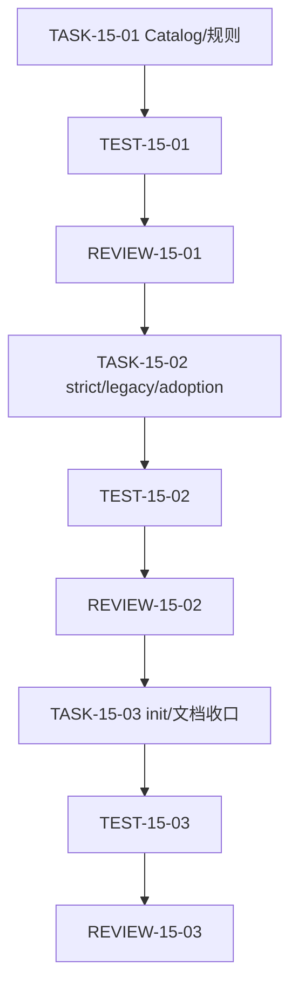

# 代码位置目录规则 V2 实施周期 15：二进制入口与 cmd 收敛

结论：本周期将独立后端的默认二进制入口收回根目录，并将同仓后端入口固定在 `backend/`；`cmd/` 只接受额外二进制目录。影响：query、render、init 和 check 使用同一入口事实；范围：规则、Catalog、Schema、CLI、根测试与活动文档；非范围：真实项目迁移、入口源码生成、构建发布和外部服务；变化：增加 pattern 节点、路径策略检查与动态 init 拒绝；完成标准：五项 AC 通过，根测试、文档门禁和 6-review 全部有证据；术语说明：主入口表示默认启动文件，额外入口表示其他 binary 的启动文件；验证状态：专项入口测试 `5/5`、目录契约测试 `2/2`、全量 Python 入口、文档 profile 与 `6-review` 已通过。

## 图片资产决策

图片资产决策：N/A + 原因：目录位置和执行关系由 Mermaid 可完整表达；证据：本周期无 UI、截图或视觉验收资产。

## 当前计划最终方案的简要说明

Catalog 增加 `node_kind: pattern` 的 `binary-entrypoint` 条目；CLI 根据项目类型和语言校验入口路径。pattern 不参与骨架初始化，显式启用直接退出 `2`，避免落盘 `<binary>` 或 `<ext>` 占位路径。

## Agent 对当前问题的理解

| 项目 | 结论 |
| --- | --- |
| 问题 | 现行后端树把 `cmd/` 描述成多二进制入口，但没有根主入口、同仓 `backend/` 前缀和非法入口检查。 |
| 范围 | 目录规则、Catalog、Schema、CLI、根测试和活动文档。 |
| 非范围 | 真实项目文件、源码正文、构建/发布、前端、网络和 Git 历史。 |
| 进入条件 | 用户确认入口四种合法路径和 `init` 不创建动态入口。 |
| 收口条件 | 每个任务先实现再测试、审查；所有 AC 和追踪矩阵可由真实证据回读。 |
| 未决项 | `[]`。 |

## 当前周期目标、边界与进入条件

| 字段 | 内容 |
| --- | --- |
| 周期目标 | 让四条合法入口、三种策略和动态 init 在同一 Catalog 事实下工作。 |
| 进入条件 | `REQ-PSR-BINARY-ENTRY-001` 已确认，用户已授权按计划执行。 |
| 范围 | `package-structure-rules`、根 `test/`、需求/实施/测试/6-review 文档。 |
| 非范围 | N/A + 原因：不迁移真实业务项目或连接外部服务；证据：测试仅用 tempfile。 |
| 当前优先闭环 | `TASK-15-03` 的 init、文档 profile 与 6-review。 |

## 任务依赖图

图形目的：保证入口事实、检查行为和初始化边界按顺序收口。
关联 ID：`TASK-15-01`、`TASK-15-02`、`TASK-15-03`。

## 领域匹配图

图形目的：说明同一入口规则在规则文件、Catalog、CLI 和测试中的垂直切片落点。
关联 ID：`RULE-PSR-BINARY-ENTRY-001` 至 `RULE-PSR-BINARY-ENTRY-003`。

## 周期内最小任务执行顺序

`TASK-15-01 -> TASK-15-02 -> TASK-15-03`，每一项都必须先完成真实测试和 6-review 才能推进；当前前两项已完成，第三项进行中。

## 最小任务清单

| 任务 | 已实现证据 | 真实测试证据 | 风格证据 | 状态 |
| --- | --- | --- | --- | --- |
| `TASK-15-01` | `EVD-TASK-15-01-IMPL-01` | `EVD-TASK-15-01-TEST-01` | `EVD-TASK-15-01-STYLE-01` | 已完成 |
| `TASK-15-02` | `EVD-TASK-15-02-IMPL-01` | `EVD-TASK-15-02-TEST-01` | `EVD-TASK-15-02-STYLE-01` | 已完成 |
| `TASK-15-03` | `EVD-TASK-15-03-IMPL-01` | `EVD-TASK-15-03-TEST-01` | `EVD-TASK-15-03-STYLE-01` | 已完成 |

## 最小任务闭环

### TASK-15-01：入口事实与 pattern Catalog

- 实现：更新 Skill、目录树、Go/通用结构和引用契约；增加 fullstack/backend 的 primary/additional pattern；扩展 Schema 的 `pattern` 节点字段。
- 真实测试：`python -X utf8 -B test/package-structure-rules/entrypoint_layout_test.py`；断言 query、render 和 Schema 条件。
- 失败预期：query 多匹配、render 缺入口或 pattern Schema 约束缺失时退出失败。
- 清理：测试仅使用临时目录；不生成仓库占位入口。
- 完成条件：AC-PSR-BINARY-001 通过，目录树和 Catalog 术语一致。
- 停止条件：任一项目类型返回错误路径或新增条目被 init 当目录处理。

### TASK-15-02：check 策略与非法路径失败关闭

- 实现：新增 `check_binary_entrypoint_path`，覆盖 backend/fullstack 的合法主/额外入口、非法 `main.<ext>`、非法 `cmd` 形状和语言扩展。
- 真实测试：临时 fixture 分别执行 strict、legacy、adoption；比较 `hash` 前后值；验证退出码和稳定错误/告警。
- 失败预期：非法入口 strict 返回 `2`，legacy 返回 `0` 且 warnings 非空；任何策略改写 fixture 均失败。
- 清理：上下文管理器删除临时 fixture；不使用真实项目目录。
- 完成条件：AC-PSR-BINARY-002、004、005 通过。
- 停止条件：合法入口被拒、非法入口被放行或哈希变化。

### TASK-15-03：init 动态入口边界与文档收口

- 实现：`command_init` 对 pattern 入口显式失败；补齐 Schema/测试/需求与实施追踪、测试证据和 6-review。
- 真实测试：执行 `init --enable` 的 primary/additional 负向样本，确认退出码 `2`、目标文件/目录不存在；再执行根 Python 测试、文档 profile、Skill 校验和差异检查。
- 失败预期：创建 `<binary>`、`<ext>` 或 `main.<ext>` 占位路径均失败；任何门禁非 `valid: true` 均停止收口。
- 清理：测试临时目录自动删除；工作树不保留运行产物。
- 完成条件：AC-PSR-BINARY-003、005 和本周期交付门禁通过。
- 停止条件：动态入口发生写入、文档追踪孤立或存在未决 P0/P1。

## 文件与符号落点

| 任务 | 文件/符号 | 修改内容 |
| --- | --- | --- |
| 15-01 | `package-structure-rules/SKILL.md`、五份 reference | 冻结入口位置、职责和引用边界。 |
| 15-01 | `placement-catalog.yaml`、`placement-catalog.schema.json` | 增加 pattern 节点与 primary/additional 条目。 |
| 15-02 | `scripts/placement_catalog.py:check_path`、`check_binary_entrypoint_path` | 增加入口结构检查和策略分流。 |
| 15-03 | `scripts/placement_catalog.py:command_init` | 动态 pattern 显式失败，不创建占位路径。 |
| 15-01..03 | `test/package-structure-rules/entrypoint_layout_test.py`、活动文档 | 正反向行为、哈希、追踪和风格证据。 |

## 当前周期验证矩阵

| 测试 ID | 样本 | 命令/断言 | 通过标准 |
| --- | --- | --- | --- |
| `TEST-PSR-BINARY-001` | backend/fullstack query/render | CLI 返回唯一 pattern；渲染包含根入口与额外入口职责。 | AC-001 通过。 |
| `TEST-PSR-BINARY-002` | 四种合法入口与五类非法入口 | strict 合法返回 `0`，非法返回 `2`；语言扩展受限。 | AC-002 通过。 |
| `TEST-PSR-BINARY-003` | strict/legacy/adoption fixture | 退出码、errors/warnings 与哈希保持契约。 | AC-004/005 通过。 |
| `TEST-PSR-BINARY-004` | init primary/additional | 退出 `2`，无占位路径。 | AC-003 通过。 |

## 风险、回滚与最大边界

- 风险：pattern 被当成普通目录初始化。回滚：保留现有文件内容，修正 `command_init` 前置错误后重跑 init 负向测试。
- 风险：fullstack 根 `main.go` 误放行。回滚：只调整本周期 `check_binary_entrypoint_path`，不改变前端规则。
- 风险：历史 `doc/5-tests/` 资产被批量迁移。回滚：新测试只落根 `test/`，历史文件只读不改。
- 最大推进边界：本周期结束于本 Skill 的本地验证和文档收口，不提交 Git、不连接外部服务。

## 回滚与停止条件

| 场景 | 停止条件 | 回滚/清理 |
| --- | --- | --- |
| 规则误判 | 合法入口被拒或非法入口放行。 | 只撤销本轮未提交规则增量，重跑同一 local fixture。 |
| 写入副作用 | check 或 init 生成意外路径。 | 停止放行，删除临时 fixture，不触碰真实项目。 |
| 文档门禁 | profile 非 `valid: true`。 | 补齐当前文档字段后复验，不以口头说明替代。 |

## 周期追踪矩阵

| SRC/DEC | REQ/RULE | AC | TASK | 文件/符号 | TEST | EVIDENCE | 状态 |
| --- | --- | --- | --- | --- | --- | --- | --- |
| `SRC-PSR-BINARY-ENTRY-001`、`DEC-PSR-BINARY-ENTRY-001` | `RULE-PSR-BINARY-ENTRY-001` | `AC-PSR-BINARY-001` | `TASK-15-01` | reference、Catalog、Schema | `TEST-PSR-BINARY-001` | `EVD-TASK-15-01-IMPL-01`、`EVD-TASK-15-01-TEST-01`、`EVD-TASK-15-01-STYLE-01` | 已完成 |
| 同上 | `RULE-PSR-BINARY-ENTRY-002` | `AC-PSR-BINARY-002`、`004` | `TASK-15-02` | `check_binary_entrypoint_path` | `TEST-PSR-BINARY-002`、`003` | `EVD-TASK-15-02-IMPL-01`、`EVD-TASK-15-02-TEST-01`、`EVD-TASK-15-02-STYLE-01` | 已完成 |
| `DEC-PSR-BINARY-ENTRY-001` | `RULE-PSR-BINARY-ENTRY-003` | `AC-PSR-BINARY-003`、`005` | `TASK-15-03` | `command_init`、文档门禁 | `TEST-PSR-BINARY-004` | `EVD-TASK-15-03-IMPL-01`、`EVD-TASK-15-03-TEST-01`、`EVD-TASK-15-03-STYLE-01` | 已完成 |

## 状态与验收

- 当前状态：`accepted`；`TASK-15-01 -> TASK-15-02 -> TASK-15-03` 均已完成。
- 验收：每个任务实现、真实测试、6-review 完成后才推进下一任务；周期末所有证据 ID 可回读且无孤立 ID。
- 阻断：当前无真实外部阻断；若出现工具失败，先按执行失败学习规则分类，不无变化重试。

## 当前代码/文档基线

- 开始基线：Catalog 无二进制入口 pattern，目录树只描述 `cmd/`，CLI 不识别主入口与非法入口。
- 当前落点：`package-structure-rules` 的五份 reference、Catalog、Schema、`placement_catalog.py` 和根 `test/package-structure-rules/entrypoint_layout_test.py`。
- 保护边界：历史 `doc/5-tests/` 测试资产只读运行，不迁移、不改写；真实业务项目和外部服务均不访问。

## 自审结论

- 目录事实：已核对独立后端根入口、额外 cmd 入口及同仓 backend 前缀。
- 行为边界：strict、legacy、adoption 和 init 均有 local 测试；历史 package-structure 回归通过。
- 图片资产：N/A + 原因和证据见“图片资产决策”。
- 未决项：`[]`；文档 profile、测试证据与 6-review 均已完成。
