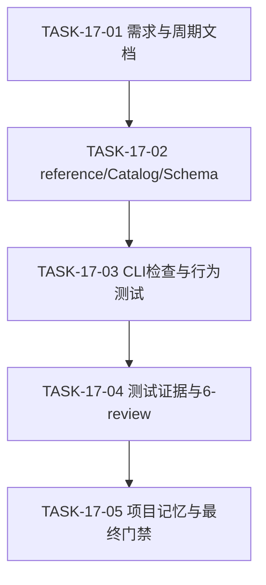
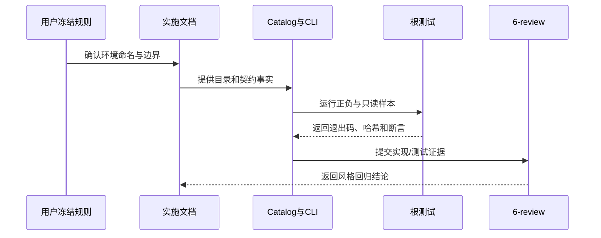

# 代码位置目录规则 V2 实施周期 17：环境配置文件命名收敛

结论：本周期把配置目录从目录级说明细化为环境文件命名契约。影响：独立后端使用 `config/`，同仓后端使用 `backend/config/`；范围：配置 reference、Catalog、Schema、CLI、测试和研发文档；非范围：真实项目迁移、配置加载、秘密原值和非 Go embedded 命名；变化：新增 `config_<env>` 文件规则和策略检查；完成标准：八项 AC、六类测试、文档 profile 和 6-review 全部通过；术语说明：标准环境是 `local/test/prod`，扩展环境是符合小写标识符的其他环境；验证状态：本周期全部实现、真实测试、文档门禁和风格回归已通过。

## 当前周期最终方案简要说明

本周期在现有配置目录事实之上增加环境文件契约，以 Catalog 元数据驱动人工目录树、query、render、init 和三种策略检查。主落点是 backend/fullstack 配置目录、`placement_catalog.py` 和根 `test/package-structure-rules/`，原因是这些入口共同决定“文件放哪里、怎么查、怎么验”。

## Agent 对当前问题的理解

| 项目 | 结论 |
|---|---|
| 问题/目标 | 当前只规定 `yaml/` 与 `embedded/` 的职责和扩展名，未表达按环境拆分的 `config_<env>` 命名。 |
| 本周期范围 | 配置 reference、目录树、Catalog/Schema、CLI、根测试、需求/实施/测试/6-review 和项目记忆。 |
| 非范围 | 真实项目迁移、配置加载、秘密原值、非 Go embedded 命名、Git 历史。 |
| 优先闭环 | 先冻结 `local/test/prod` 标准环境和可扩展命名，再实现只读检查与测试。 |
| 当前状态 | `TASK-17-01..05` 已完成；前置决策已由用户全部确认。 |
| 最大边界 | 只完成 CYCLE-17，不覆盖 CYCLE-15/CYCLE-16 的既有改动。 |

## 周期目标、进入条件与收口条件

- 周期目标：独立后端 `config/` 和同仓后端 `backend/config/` 使用同一环境文件契约。
- 进入条件：`REQ-PSR-CONFIG-ENV-001` 已确认；当前 session 投影已同步；无未决实现层选择。
- 收口条件：`AC-PSR-CONFIG-001..008`、根测试、文档 profile、6-review 和 Skill 合规全部通过。
- 图片资产决策：N/A + 原因：无 UI/视觉资产；证据：Mermaid 依赖图和测试矩阵足以表达关系。

## 当前周期目标、边界与进入条件

| 项目 | 冻结内容 |
|---|---|
| 周期目标 | 让独立后端 `config/` 与同仓后端 `backend/config/` 的环境文件命名、查询和检查结论一致。 |
| 范围 | `configuration-layout.md`、`project-layout-v2.md`、Catalog、Schema、`placement_catalog.py`、根测试和本周期研发文档。 |
| 非范围 | 真实业务仓库迁移、配置加载实现、秘密检测算法、其他语言 embedded 命名和 Git 历史。 |
| 进入条件 | 需求决策已冻结，当前 session 投影已同步，CYCLE-15/CYCLE-16 既有改动保留。 |
| 收口条件 | CYCLE-17 任务逐项实现、真实测试、6-review、文档 profile 和最终项目状态同步完成。 |

## 当前代码/文档基线

当前工作树保留 CYCLE-15 二进制入口、CYCLE-16 doc 目录收敛及其测试/文档未提交改动；本周期已将配置 reference、Catalog、Schema、CLI 和根测试同步为环境文件契约。本周期只做窄增量，不删除或重写既有周期证据。

## 周期依赖图

图形目的：保证需求文档先于规则实现，规则实现先于 CLI 测试，测试后再回写证据。关联 ID：`TASK-17-01..05`。

## 任务执行顺序与闭环契约

顺序固定为 `TASK-17-01 -> TASK-17-02 -> TASK-17-03 -> TASK-17-04 -> TASK-17-05`。每个任务必须完成“实现/文档落盘 → 精确 local 真实测试 → 清理临时产物 → 6-review 风格回归”，未完成前不得进入下一个任务。

| 任务 | 文件/符号落点 | 垂直切片 | 测试与断言 | 完成条件 | 停止条件 |
|---|---|---|---|---|---|
| `TASK-17-01` | 本需求、V2 总览、CYCLE-17、6-review | 需求冻结 → 文档 profile → 风格回归 | 四类文档 profile 为 `valid: true` | 需求、边界、AC、周期和追踪 ID 完整 | 仍有 P0/P1 或周期目标不唯一 |
| `TASK-17-02` | `configuration-layout.md`、`project-layout-v2.md`、Catalog、Schema | 人工树 → Catalog contract → query/render | backend/fullstack config query 唯一，render 含示例 | 人工树、Catalog、Schema 一致 | 需要修改其他 Owner 的职责 |
| `TASK-17-03` | `check_environment_config_path`、`command_check`、`command_init`、根配置测试 | 合法/非法文件 → 策略检查 → init 只读验证 | 正负 fixture、三策略、init、哈希全部通过 | AC-003..008 通过且旧测试不回归 | strict 写入、adoption 破坏或动态文件被创建 |
| `TASK-17-04` | 测试 README、周期追踪、6-review | 测试结果 → EVIDENCE → STYLE | test/style profile 严格通过 | 所有 EVIDENCE 可回读且无孤立 ID | profile 失败或证据与结果不一致 |
| `TASK-17-05` | `PROJECT_CURRENT.md`、`PROJECT_MEMORY.md`、`PROJECT_HISTORY.md` | 项目状态 → 稳定规则 → 最终门禁 | 根测试、quick_validate、diff check | 当前状态和长期规则职责分离，投影可失活 | 发现状态覆盖历史或仍有必需门禁未完成 |

## 周期内最小任务执行顺序

`TASK-17-01 → TASK-17-02 → TASK-17-03 → TASK-17-04 → TASK-17-05`。每个任务必须先完成自身实现或文档落盘、真实测试和 6-review；未完成前禁止推进后续任务。

## 最小任务闭环

### TASK-17-01：冻结需求与周期文档

- 实现：新增本需求、CYCLE-17 和 6-review，更新 V2 实施总览。
- 测试：运行 requirement、implementation_cycle、style_regression 严格 profile 和 `git diff --check`。
- 完成：文档 `valid: true`，追踪 ID 可解析，当前周期目标和边界无歧义。
- 停止：任一 profile 失败、追踪 ID 孤立或覆盖 CYCLE-15/CYCLE-16 状态。
- 回滚：只撤销本任务新增/修改文档，不触碰既有周期文件正文。

### TASK-17-02：同步 reference、Catalog 与 Schema

- 实现：补齐标准环境示例、fullstack backend config 条目和环境文件契约字段。
- 测试：query、render 和 Schema 读取断言唯一位置、扩展名和环境契约。
- 完成：人工树与 Catalog 一致，四个 config 查询各返回唯一条目。
- 停止：出现重复 Catalog 条目、fullstack 前缀错误或需要改动其他 Owner。
- 回滚：只回滚本任务 reference/Catalog/Schema 增量。

### TASK-17-03：实现 CLI 检查与行为测试

- 实现：新增 `check_environment_config_path`，接入 `check_path`、strict/adoption/legacy 和 init 验证。
- 测试：运行配置行为测试，覆盖合法、非法、策略、哈希、init 和旧测试回归。
- 完成：`AC-PSR-CONFIG-003..008` 全部通过。
- 停止：检查写入 fixture、legacy 退出码变化或非 Go embedded 行为回归。
- 回滚：只回滚 `placement_catalog.py` 和配置测试文件。

### TASK-17-04：回写测试证据与 6-review

- 实现：更新测试 README、周期矩阵和 6-review 的 IMPL/TEST/STYLE 证据。
- 测试：运行 test/style profile 和全量根测试。
- 完成：每个任务均有三类证据，证据 ID 无孤立项。
- 停止：证据结果与命令输出不一致，或 profile 失败。
- 回滚：只回滚本周期证据文档，不删除可执行测试。

### TASK-17-05：项目记忆与最终门禁

- 实现：分离更新 `PROJECT_CURRENT.md` 当前状态、`PROJECT_MEMORY.md` 稳定规则和 `PROJECT_HISTORY.md` 历史事件；失活 CYCLE-17 投影。
- 测试：根测试、quick_validate、文档 profile、UTF-8 回读和 `git diff --check`。
- 完成：所有 AC、证据、项目状态和 Skill 合规均通过。
- 停止：仍有未完成必需门禁、活动投影来源不一致或需要 Git 提交。
- 回滚：只撤销 CYCLE-17 状态收口增量。

## 文件与符号操作契约

| 文件/符号 | 允许操作 | 禁止操作 |
|---|---|---|
| `configuration-layout.md` | 增加环境示例和命名/安全说明 | 删除 secret policy 或引入第二配置根 |
| `project-layout-v2.md` | 展开 backend/fullstack 配置树 | 改变源码根、cmd 或历史 doc 规则 |
| `placement-catalog.yaml` / Schema | 增加唯一 config 条目和契约字段 | 重复 ID、放宽扩展名、改变其他 artifact |
| `check_environment_config_path` | 只读判断环境文件路径 | 移动、重命名、自动补齐用户文件 |
| `configuration_layout_test.py` | 使用临时 fixture 验证 CLI | 连接外部服务或写入真实项目 |

## 真实测试与断言

每个测试都使用 UTF-8 Python 和临时目录。正向断言退出码为 `0`；strict/adoption 负向断言退出码为 `2`；legacy 负向断言退出码为 `0` 且 warnings 非空；所有策略检查前后目录哈希相同；init 后环境文件数量为 `0`。

## 真实测试安排

所有测试只使用本地 Python、仓库文件和 `tempfile`；禁止数据库、缓存、消息队列、HTTP/RPC 上游和 test/prod 配置。

| 测试 ID | 入口 | 样本与通过标准 |
|---|---|---|
| `TEST-PSR-CONFIG-001` | `test/package-structure-rules/configuration_layout_test.py` | query/render/schema、合法标准/扩展环境、backend/fullstack 正向样本通过。 |
| `TEST-PSR-CONFIG-002` | 同上 | 非法命名、错误目录、嵌套目录、Go 旧命名 strict 失败。 |
| `TEST-PSR-CONFIG-003` | 同上 | 单文件、不配对、`.yml`、非 Go embedded 兼容通过。 |
| `TEST-PSR-CONFIG-004` | 同上 | strict/adoption 退出码 `2`；legacy 退出码 `0` 且 warning；哈希不变。 |
| `TEST-PSR-CONFIG-005` | 同上 | init 创建目录但不生成任何环境文件。 |
| `TEST-PSR-CONFIG-006` | 三个现有根测试入口 | CYCLE-15/CYCLE-16 入口和目录契约不回归。 |

## 回滚、清理与最大推进边界

- 回滚：只撤销 CYCLE-17 未提交增量；不使用 destructive Git 命令，不删除用户历史目录。
- 清理：fixture 由 `TemporaryDirectory` 管理；删除临时 JSON 投影输入，不在仓库留下运行产物。
- 停止：Catalog、人工树、CLI、测试任一事实冲突，或文档门禁失败即停止。
- 最大推进边界：规则、测试、研发文档和项目记忆收口；不提交 Git、不迁移真实项目、不连接外部环境。

## 回滚与停止条件

- 停止条件：Catalog、人工树、CLI、测试任一结论不一致；strict/adoption 发生写入；legacy 退出码或 warning 语义改变；文档 profile 失败；或当前工作树已有改动无法安全区分。
- 清理条件：所有 fixture 使用上下文管理器清理；临时投影输入在 CYCLE-17 收口时删除；不得保留 `__pycache__`、临时 JSON 或测试输出。
- 回滚条件：只撤销 CYCLE-17 当前任务未提交增量，不使用 `git reset --hard`、`git checkout --` 或删除用户历史目录。

## 周期追踪矩阵

| SRC/DEC | REQ/RULE | AC | TASK | 文件/符号 | TEST | EVIDENCE |
|---|---|---|---|---|---|---|
| `SRC-PSR-CONFIG-ENV-001`、`DEC-PSR-CONFIG-ENV-001..005` | `REQ/RULE-PSR-CONFIG-ENV-001..005` | `AC-PSR-CONFIG-001..002` | `TASK-17-01..02` | 两份配置 reference、Catalog、Schema | `TEST-PSR-CONFIG-001` | `EVD-TASK-17-01/02` |
| 同上 | `RULE-PSR-CONFIG-ENV-001..003` | `AC-PSR-CONFIG-003..005` | `TASK-17-03` | `check_environment_config_path`、`command_check` | `TEST-PSR-CONFIG-002/003` | `EVD-TASK-17-03` |
| 同上 | `RULE-PSR-CONFIG-ENV-004..005` | `AC-PSR-CONFIG-006..008` | `TASK-17-03..05` | `command_init`、策略分流、项目状态 | `TEST-PSR-CONFIG-004..006` | `EVD-TASK-17-04/05` |

## 当前周期验证矩阵

| 测试 ID | 入口/样本 | 通过标准 |
|---|---|---|
| `TEST-PSR-CONFIG-001` | query/render/schema 与 backend/fullstack 正向 fixture | 四个查询唯一，目录树包含环境示例，契约字段可解析。 |
| `TEST-PSR-CONFIG-002` | 非法 YAML/Go 文件名、错误位置和嵌套目录 fixture | strict 返回 `2`，错误信息稳定。 |
| `TEST-PSR-CONFIG-003` | 单文件、不配对、`.yml` 和非 Go embedded fixture | strict 返回 `0`，兼容行为保持。 |
| `TEST-PSR-CONFIG-004` | strict/adoption/legacy 临时项目 | strict/adoption 失败关闭，legacy warning，哈希不变。 |
| `TEST-PSR-CONFIG-005` | backend/fullstack init 临时项目 | 创建目录但不生成环境文件。 |
| `TEST-PSR-CONFIG-006` | CYCLE-15/CYCLE-16 根测试 | 既有入口与目录契约不回归。 |

## 证据登记

| 任务 | IMPL | TEST | STYLE |
|---|---|---|---|
| `TASK-17-01` | `EVD-TASK-17-01-IMPL-01` | `EVD-TASK-17-01-TEST-01` | `EVD-TASK-17-01-STYLE-01` |
| `TASK-17-02` | `EVD-TASK-17-02-IMPL-01` | `EVD-TASK-17-02-TEST-01` | `EVD-TASK-17-02-STYLE-01` |
| `TASK-17-03` | `EVD-TASK-17-03-IMPL-01` | `EVD-TASK-17-03-TEST-01` | `EVD-TASK-17-03-STYLE-01` |
| `TASK-17-04` | `EVD-TASK-17-04-IMPL-01` | `EVD-TASK-17-04-TEST-01` | `EVD-TASK-17-04-STYLE-01` |
| `TASK-17-05` | `EVD-TASK-17-05-IMPL-01` | `EVD-TASK-17-05-TEST-01` | `EVD-TASK-17-05-STYLE-01` |

## 端到端时序图

图形目的：说明实施模型从规则读取到证据收口的顺序，避免先实现多个任务再统一测试。关联 ID：`TASK-17-01..05`、`TEST-PSR-CONFIG-001..006`。

## 自审结论

当前计划无未决决策；任务按依赖和垂直闭环拆分；所有行为任务都有 local 真实测试、清理、回滚、完成和停止条件。当前状态为 `accepted`，CYCLE-17 已完成且未进入其他来源对象。
