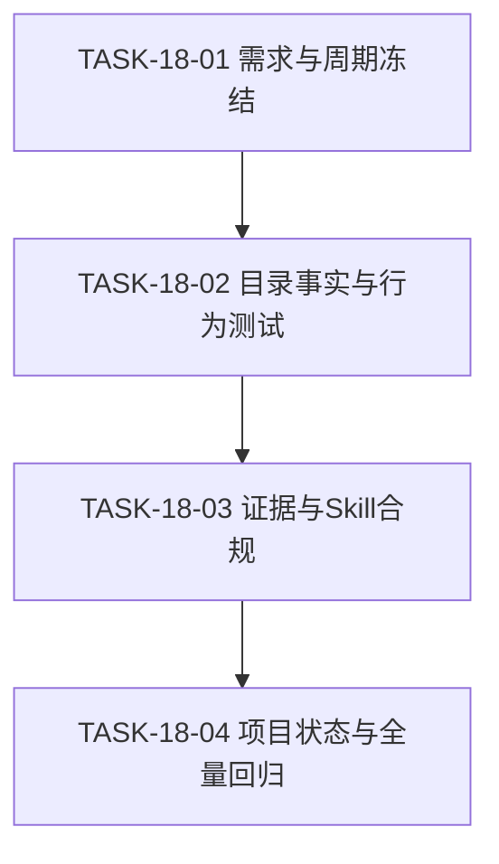
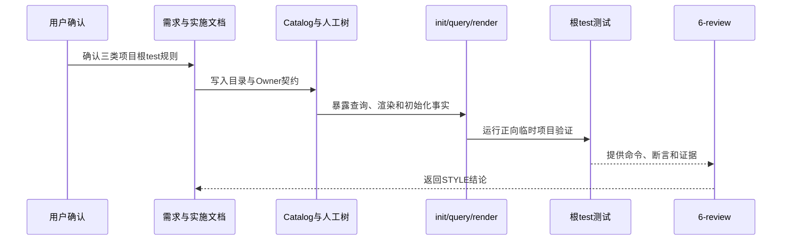

# 代码位置目录规则 V2 实施周期 18：三类项目根 test 目录统一

结论：把三类项目根的活动测试代码位置统一到 `test/`。影响：人工目录树、Catalog skeleton、query、render、init 和目录契约测试统一。范围：三类项目目录树、Catalog、skeleton、query、render、init、目录契约测试和研发证据。非范围：真实项目迁移、测试程序创建、CLI/Schema 重构和 Git 历史。变化：三类项目显式增加 `[必需·提交] test/`。完成标准：需求验收、真实测试、文档门禁、Skill 合规和风格回归全部通过。术语说明：`test/` 是活动测试代码根，`doc/5-tests/` 是测试说明和证据根。验证状态：周期已完成；专项测试 `4/4`、入口回归 `5/5`、配置回归 `7/7`、根 Python 测试 `212/212`、文档 profile、Skill 校验和风格回归均通过。

## 当前周期最终方案简要说明

沿用现有数据驱动 Catalog：为三类项目登记唯一 `artifact_kind=test` 目录条目，并把 `test/` 加入三类 skeleton 与人工树；扩展已有 `project_layout_contract_test.py` 覆盖 query/render/init。这样测试 Skill 负责根目录内部治理，package-structure-rules 只负责物理位置，不重复测试命名和证据规则。

## Agent 对当前问题的理解

| 项目 | 结论 |
|---|---|
| 问题/目标 | 测试 Skill 已规定根 `test/` 是唯一活动测试代码根，但 package-structure-rules 的三类人工树和 Catalog skeleton 没有完整体现。 |
| 本周期范围 | V2 需求变更、实施总览、目录树、Catalog、现有目录契约测试、测试 README、6-review 和项目四件套。 |
| 非范围 | 不新增测试程序、mock、fixture、runner、`.gitkeep`；不修改真实业务项目、`placement_catalog.py`、Catalog Schema、Skill description、字典和 Git 历史。 |
| 优先闭环 | 让三类 query/render/init 都能表达根 `test/`，并证明现有入口和配置规则不回归。 |
| 用户决策 | 已确认三类项目统一；已确认 strict 不单独检查缺失目录，保持现有 skeleton 语义。 |
| 最大边界 | 只完成 CYCLE-18，不覆盖 CYCLE-15/CYCLE-16/CYCLE-17 已完成结论。 |

## 周期目标、进入条件与收口条件

- 周期目标：三类项目均有根 `test/`，且该位置与测试 Skill 的双根规则一致。
- 进入条件：`REQ-PSR-TEST-ROOT-001`、`CHG-PSR-TEST-ROOT-009` 已冻结；当前 session 投影已同步；无未决实现选择。
- 收口条件：`AC-PSR-TEST-ROOT-001..004`、专项测试、根回归、文档 profile、Skill 合规和 6-review 全部通过。
- 图片资产决策：N/A + 原因：目录契约属于文本和机器接口；Mermaid 依赖图足够表达执行关系。

## 当前代码/文档基线

当前工作树保留 CYCLE-15 二进制入口、CYCLE-16 doc 目录收敛、CYCLE-17 配置命名及其未提交测试/文档改动。本周期只补根 `test/` 的位置事实，不删除历史测试证据，不迁移真实项目，不修改 CLI/Schema 实现。

## 当前周期目标、边界与进入条件

| 项目 | 冻结内容 |
|---|---|
| 周期目标 | 三类项目的人工树、Catalog、query/render/init 与根测试共同承载唯一 `test/`。 |
| 范围 | V2 需求、V2 总览、CYCLE-18、`project-layout-v2.md`、Catalog、目录契约测试、测试 README、6-review 和项目四件套。 |
| 非范围 | 测试程序/fixture 创建、真实项目迁移、CLI/Schema 重构、strict 缺失目录校验、Git 历史。 |
| 进入条件 | 用户已选择三类统一和沿用 skeleton strict 语义；当前 session CYCLE-18 投影已 active。 |
| 收口条件 | 四项 AC、四个周期任务、根回归、文档 profile、Skill 合规、6-review 和 `git diff --check` 全部通过。 |

## 进入条件与收口条件

- 进入条件：需求变更已登记，CYCLE-17 已完成，CYCLE-18 投影已同步，当前工作树的前序改动已盘点。
- 收口条件：所有任务均完成“实现/落盘 -> 真实测试 -> 6-review”，证据和项目状态分层正确，周期状态改为 `accepted`。

## 新增文件目录树

```text
doc/3-实施/2026-08-02_代码位置目录规则V2_实施周期18_三类项目根test目录统一.md  # CYCLE-18 实施周期
doc/5-tests/<执行时间>_三类项目根test目录统一/README.md                     # 本轮测试说明和证据入口
doc/6-review/<执行时间>_REQ-PSR-TEST-ROOT-001_6-review.md                  # 测试后的风格回归
```

不新增活动测试文件；`test/package-structure-rules/project_layout_contract_test.py` 为已有根测试文件，本周期只扩展其契约断言。

## 周期依赖图

图形目的：保证需求变更先冻结，目录事实再同步，行为测试随后执行，最后完成状态与全量回归。关联 ID：`TASK-18-01..04`。



## 任务执行顺序与闭环契约

顺序固定为 `TASK-18-01 -> TASK-18-02 -> TASK-18-03 -> TASK-18-04`。每个任务必须完成“落盘/实现 -> local 真实测试 -> 清理临时产物 -> 6-review”后才能推进。

## 周期内最小任务执行顺序

`TASK-18-01 -> TASK-18-02 -> TASK-18-03 -> TASK-18-04`。当前未完成任务前不得跳到后续任务；每项任务均需先完成自己的测试和 6-review。

| 任务 | 周期内顺序 | 文件/符号落点 | 垂直切片 | 预计文件数 | 完成条件 | 停止条件 |
|---|---:|---|---|---:|---|---|
| `TASK-18-01` | 01 | V2 需求、V2 总览、CYCLE-18 | 需求变更 -> AC -> 周期入口 | 3 | 需求和周期 profile 通过，追踪关系完整 | 需求需覆盖旧周期或存在未决 P0/P1 |
| `TASK-18-02` | 02 | `project-layout-v2.md`、Catalog、`project_layout_contract_test.py` | 人工树 -> Catalog -> query/render/init | 3 | 三类根 test 契约测试通过 | 需要 CLI/Schema 重构或出现竞争测试根 |
| `TASK-18-03` | 03 | 测试 README、CYCLE-18、6-review | 测试输出 -> EVIDENCE -> STYLE | 3 | test/style profile 和 Skill 合规通过 | 证据与命令输出不一致 |
| `TASK-18-04` | 04 | `PROJECT_CURRENT.md`、`PROJECT_MEMORY.md`、`PROJECT_HISTORY.md`、6-review | 当前状态 -> 稳定决策 -> 全量回归 | 4 | 根测试、既有专项、文档门禁和 diff check 通过 | 非本周期回归或状态投影无法收口 |

## 最小任务闭环

### TASK-18-01：冻结需求变更与实施周期

- 实现：在 V2 需求中登记 `CHG-PSR-TEST-ROOT-009`、`REQ-PSR-TEST-ROOT-001`、`RULE-PSR-TEST-ROOT-001..003`、`AC-PSR-TEST-ROOT-001..004`；更新 V2 总览并新增本周期文档。
- 真实测试：执行 requirement、implementation_overview、implementation_cycle 严格 profile；每份返回 `valid: true`。
- 清理：不产生 fixture 或运行产物；失败时保留文档 diff 供定位。
- 6-review：检查 ID、普通中文、目录归位、Mermaid 语法和本周期边界。
- 完成：需求变更、影响面、AC、周期和最大边界可追踪。
- 停止/回滚：若需新建第二份 V2 需求入口或覆盖 CYCLE-15/16/17，则停止并只撤销本任务增量。

### TASK-18-02：同步三类目录事实并扩展测试

- 实现：三类人工树增加根 `test/`；Catalog 增加三条唯一测试根记录和三类 skeleton 路径；扩展现有目录契约测试。
- 真实测试：运行 `python -X utf8 -B test/package-structure-rules/project_layout_contract_test.py`，覆盖 Catalog/人工树一致、三类 query、三类 render、三类 init，预期 `4/4`。
- 样本：只使用本地 Catalog、reference、Python 标准库和 `tempfile`；不连接数据库、缓存、消息队列、HTTP/RPC 或 test/prod 环境。
- 清理：所有临时项目由 `TemporaryDirectory` 清理；不生成真实项目文件。
- 6-review：检查测试位于根 `test/`、中文注释、断言粒度和 Catalog Owner 归属。
- 完成：三类 query 唯一返回，render 各有一个根节点，init 创建根目录且不创建测试文件。
- 停止/回滚：若需改动 CLI/Schema 或发现 `backend/test`、`frontend/test` 竞争路径，则停止并只回滚本任务增量。

### TASK-18-03：形成测试证据并执行 Skill 合规门禁

- 实现：写入测试 README、CYCLE-18 追踪矩阵和 6-review 证据。
- 真实测试：执行 `quick_validate.py package-structure-rules`、test profile、style_regression profile 和三类 CLI 直接探针。
- 样本：本地仓库文件与临时目录；命令输出脱敏后写入证据，不写入密钥、token、密码或连接串。
- 清理：删除临时投影输入、Python 缓存和临时 JSON；保留 README、日志、报告等非可执行证据。
- 6-review：最终结果只能是 `STYLE: PASS` 或 `STYLE: FIX_REQUIRED`。
- 完成：所有 EVIDENCE 可回读，Skill 合规结论为 PASS。
- 停止/回滚：证据与输出不一致或 profile 失败时停止，不口头替代机器校验。
- 实测结果：测试 README 的 `test` profile 返回 `valid: true`；`quick_validate.py package-structure-rules` 返回 `Skill is valid!`；测试结果已回写并可由命令复验。

### TASK-18-04：同步项目状态并完成全量回归

- 实现：覆盖更新 `PROJECT_CURRENT.md`；合并稳定规则到 `PROJECT_MEMORY.md`；追加 CYCLE-18 事件到 `PROJECT_HISTORY.md`；完成 6-review。
- 真实测试：专项目录、二进制入口、配置、根 Python 测试、全部适用文档 profile、Skill 校验和 `git diff --check`。
- 清理：确认无 `__pycache__`、临时 JSON、临时项目或非证据运行产物。
- 6-review：核对目录位置、中文编码、换行、注释和已有工作树改动保护。
- 完成：所有 AC、测试、文档、状态和合规证据齐全，CYCLE-18 可标记 accepted，当前投影可失活。
- 停止/回滚：任何非本周期回归、乱码、整文件伪变更或需要 Git 历史写入时停止。
- 实测结果：入口回归 `5/5`、配置回归 `7/7`、根目录专项 `4/4`、根 Python 测试 `212/212` 全部通过；项目状态已区分当前 CYCLE-19 与已完成 CYCLE-18，未执行 Git 历史写入。

## 文件与符号操作契约

| 文件 | 允许操作 | 禁止操作 |
|---|---|---|
| `project-layout-v2.md` | 三类根级目录树增加 `test/` 和职责说明 | 改变 cmd、config、源码根或历史 doc 规则 |
| `placement-catalog.yaml` | 增加三条唯一 test 目录条目和 skeleton 路径 | 增加嵌套测试根、重复 ID、放宽禁止路径 |
| `project_layout_contract_test.py` | 增加 query/render/init 正向断言 | 把测试移入 `doc/5-tests/`、访问外部服务或修改 CLI |
| `placement_catalog.py`、Schema、`SKILL.md` description | 只读核对 | 本周期不修改 |

## 真实测试与断言

所有测试只使用 UTF-8 Python、仓库文件和临时目录。正向 CLI 退出码为 `0`；query 必须返回唯一条目；render 每种项目类型只显示根 `test/`；init 必须创建目录、不创建测试文件；测试执行前后工作树不得出现非预期文件。

## 真实测试安排

| 测试 ID | 入口 | 样本与通过标准 |
|---|---|---|
| `TEST-PSR-TEST-ROOT-001` | `project_layout_contract_test.py` | Catalog 与三类人工树/skeleton 均包含根 `test/`，无旧活动目录回归。 |
| `TEST-PSR-TEST-ROOT-002` | 同上 | 三类 query 唯一返回 `artifact_kind=test` 和 `canonical_path=test`。 |
| `TEST-PSR-TEST-ROOT-003` | 同上 | 三类 render 各出现一次 `test/`，不出现 nested test 根。 |
| `TEST-PSR-TEST-ROOT-004` | 同上 | 三类 init 创建 `test/`，不创建动态测试文件。 |
| `TEST-PSR-TEST-ROOT-005` | `entrypoint_layout_test.py`、`configuration_layout_test.py` | CYCLE-15 二进制入口和 CYCLE-17 配置契约不回归。 |
| `TEST-PSR-TEST-ROOT-006` | `test/run_python_tests.py` | 根 `test/` 下全部 Python 测试通过，历史 `doc/5-tests` 不被发现为活动测试。 |

## 当前周期验证矩阵

| 测试 ID | 入口/样本 | 通过标准 |
|---|---|---|
| `TEST-PSR-TEST-ROOT-001` | 三类 Catalog、人工树和 skeleton | 三类均有唯一根 `test/`，旧目录不回归。 |
| `TEST-PSR-TEST-ROOT-002` | 三类 query 临时调用 | 每个项目类型返回一个 `artifact_kind=test` 条目。 |
| `TEST-PSR-TEST-ROOT-003` | 三类 render 输出 | 每种输出仅出现根 `test/`，无 nested test。 |
| `TEST-PSR-TEST-ROOT-004` | 三类 init 临时目录 | 创建 `test/`，不创建动态测试文件。 |
| `TEST-PSR-TEST-ROOT-005` | CYCLE-15/17 专项测试 | 二进制入口和配置契约不回归。 |
| `TEST-PSR-TEST-ROOT-006` | 根 Python 测试入口 | 根 `test/` 测试全部通过。 |

## 周期证据矩阵

| 任务 | IMPL 证据 | TEST 证据 | STYLE 证据 |
|---|---|---|---|
| `TASK-18-01` | `EVD-TASK-18-01-IMPL` | `EVD-TASK-18-01-TEST` | `EVD-TASK-18-01-STYLE` |
| `TASK-18-02` | `EVD-TASK-18-02-IMPL` | `EVD-TASK-18-02-TEST` | `EVD-TASK-18-02-STYLE` |
| `TASK-18-03` | `EVD-TASK-18-03-IMPL` | `EVD-TASK-18-03-TEST` | `EVD-TASK-18-03-STYLE` |
| `TASK-18-04` | `EVD-TASK-18-04-IMPL` | `EVD-TASK-18-04-TEST` | `EVD-TASK-18-04-STYLE` |

## 追踪矩阵

| SRC/DEC | REQ/RULE | AC | CYCLE/TASK | 文件/符号 | TEST | EVIDENCE |
|---|---|---|---|---|---|---|
| `SRC-PSR-TEST-ROOT-001`、`DEC-PSR-TEST-ROOT-001` | `REQ-PSR-TEST-ROOT-001`、`RULE-PSR-TEST-ROOT-001..002` | `AC-PSR-TEST-ROOT-001..002` | `CYCLE-18/TASK-18-01..02` | V2 需求、目录树、Catalog | `TEST-PSR-TEST-ROOT-001..003` | `EVD-PSR-TEST-ROOT-18-01/02` |
| 同上 | `RULE-PSR-TEST-ROOT-003` | `AC-PSR-TEST-ROOT-003` | `CYCLE-18/TASK-18-02` | Catalog skeleton、`command_init` | `TEST-PSR-TEST-ROOT-004` | `EVD-PSR-TEST-ROOT-18-02` |
| 同上 | 测试 Skill 双根规则 | `AC-PSR-TEST-ROOT-004` | `CYCLE-18/TASK-18-03..04` | 测试 README、项目记忆、6-review | `TEST-PSR-TEST-ROOT-005..006` | `EVD-PSR-TEST-ROOT-18-03/04` |

## 回滚、清理与最大推进边界

- 回滚：只撤销 CYCLE-18 未提交增量，不使用 `git reset --hard`、`git checkout --` 或删除用户目录。
- 清理：所有 fixture 使用 `TemporaryDirectory`；删除临时投影输入、缓存和非证据输出。
- 停止：Catalog、人工树、CLI 输出、测试结果或文档 profile 任一冲突即停止。
- 最大推进边界：规则、测试、证据、项目记忆和 6-review；不提交、不推送、不迁移真实项目、不连接外部环境。

## 回滚与停止条件

- 立即停止：目录树、Catalog、CLI 输出、测试结果或文档 profile 任一不一致；出现非本周期回归；或需要连接非 local 环境。
- 回滚：只撤销 CYCLE-18 未提交增量，不使用 destructive Git 命令，不删除既有用户目录和历史证据。
- 清理：删除临时投影输入、fixture、缓存和非证据输出；保留测试 README、日志、报告和 6-review。

## 端到端时序图

图形目的：表达从用户规则变更到目录查询、初始化、测试和风格回归的完整链路。关联 ID：`REQ-PSR-TEST-ROOT-001`、`AC-PSR-TEST-ROOT-001..004`。



## 自审结论

计划无未决决策；任务按周期内顺序拆分，每个任务均有文件边界、真实测试、清理、回滚、完成和停止条件。周期状态为 `accepted`，全部测试、文档门禁、6-review 和项目状态同步均已完成。
