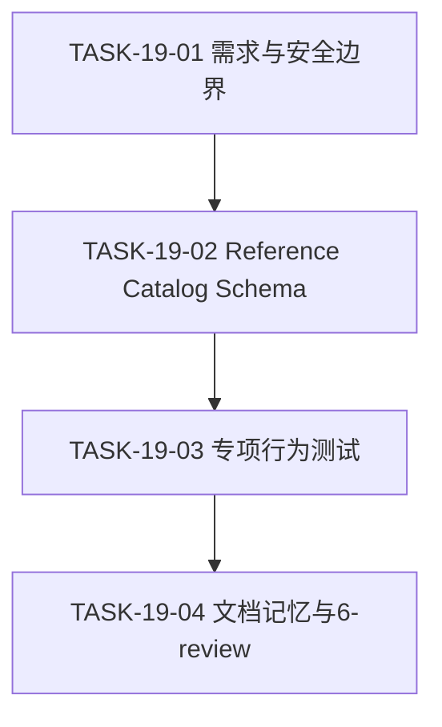
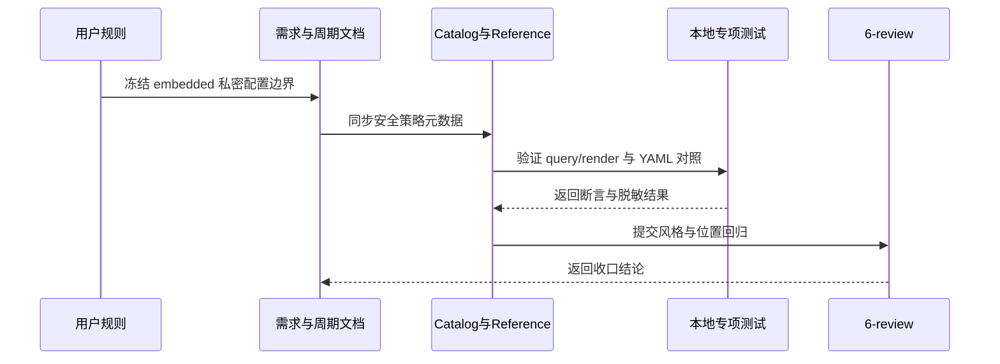

# 代码位置目录规则 V2 实施周期 19：embedded 私密配置边界收敛

结论：本周期同步 embedded 源码配置的安全契约。影响：独立后端 `config/embedded/` 与同仓后端 `backend/config/embedded/` 允许源码内 API key、密钥、密码等私密值。范围：Reference、Catalog、Schema、测试和研发文档；非范围：具体后端加载器和真实项目迁移。变化：源码配置为主且默认不依赖环境变量，YAML 与所有外部输出继续禁止秘密原值。完成标准：策略字段、专项测试、文档 profile 和 6-review 全部通过。术语说明：embedded 是源码内 YAML 字符串配置。验证状态：本地回归、文档门禁、静态检查和 6-review 均通过，周期完成。

## 当前周期最终方案简要说明

主落点是配置 Reference、Catalog/Schema 与根专项测试，因为这些文件共同决定目录职责、机器查询结果和回归证据；使用元数据表达安全策略，不新增通用运行时加载器。

## Agent 对当前问题的理解

| 项目 | 结论 |
|---|---|
| 问题/目标 | 现行 embedded 仍要求授权后编译秘密，与用户确认的源码配置口径不一致。 |
| 本周期范围 | 配置 reference、目录树、Catalog/Schema、专项测试、需求/周期文档、项目记忆和 6-review。 |
| 非范围 | 真实后端迁移、配置加载器、真实密钥、外部服务、Git 历史。 |
| 优先闭环 | 先冻结 embedded/YAML 差异，再验证 query/render 与文档一致。 |
| 最大边界 | CYCLE-19 完成后停止，不进入具体业务项目运行时改造。 |

## 周期目标、进入条件与收口条件

- 周期目标：两类后端 embedded 安全策略统一为 `allow_plain_secret`、源码优先、环境变量非默认；两类 YAML 继续 `forbid_plain_secret`。
- 进入条件：`REQ-PSR-CONFIG-SECRET-001` 已确认；CYCLE-17 命名契约和现有工作树改动保留。
- 收口条件：`AC-PSR-CONFIG-SECRET-001..006`、专项测试、文档 profile、Skill 合规和 6-review 全部通过。
- 图片资产决策：N/A + 原因：纯规则、元数据和测试变更；Mermaid 足以表达流程。

## 当前代码/文档基线

当前工作树已包含 CYCLE-17 环境文件命名契约及其他会话未提交改动；本周期只在现有配置 reference、Catalog/Schema 和根专项测试上追加安全策略字段与断言，不删除或重写既有周期证据。

## 当前周期目标、边界与进入条件

| 项目 | 冻结内容 |
|---|---|
| 周期目标 | 统一 backend/fullstack embedded 的源码秘密和来源策略。 |
| 范围 | 配置 reference、目录树、Catalog/Schema、专项测试、需求/周期文档、项目记忆和 6-review。 |
| 非范围 | 真实后端加载器、真实密钥、外部服务、Git 历史。 |
| 进入条件 | 用户决策已冻结，CYCLE-17 命名契约可复用。 |
| 收口条件 | `AC-PSR-CONFIG-SECRET-001..006` 与所有本地门禁通过。 |
| 最大推进边界 | CYCLE-19 收口后停止。 |

## 周期依赖图

图形目的：表达需求冻结、规则同步、测试与收口顺序。关联 ID：`TASK-19-01..04`。

## 任务执行顺序与闭环契约

顺序固定为 `TASK-19-01 -> TASK-19-02 -> TASK-19-03 -> TASK-19-04`。每个任务必须完成文档/实现、local 真实测试、清理和 6-review 后才能推进。

## 周期内最小任务执行顺序

`TASK-19-01 → TASK-19-02 → TASK-19-03 → TASK-19-04`；每个任务必须先完成自身实现、测试和 `6-review`，不得跨任务合并验证。

## 最小任务闭环

- `TASK-19-01`：新增需求与周期索引；运行 requirement profile；STYLE 检查章节、ID 和中文表达；通过后进入 TASK-19-02。
- `TASK-19-02`：同步 Reference/Catalog/Schema；运行 query、render、Schema 解析；STYLE 检查字段命名和目录归位；通过后进入 TASK-19-03。
- `TASK-19-03`：补专项策略断言；运行配置测试和脱敏检查；STYLE 检查测试隔离与命名；通过后进入 TASK-19-04。
- `TASK-19-04`：同步证据、项目记忆和审查记录；运行根回归、文档 profile、quick validation、diff check；STYLE 检查收口文档；全部通过后周期结束。

## 文件与符号操作契约

| 文件/符号 | 允许操作 | 禁止操作 |
|---|---|---|
| `configuration-layout.md`、`project-layout-v2.md` | 同步 embedded/YAML 安全文字 | 删除配置根或放宽 YAML 秘密边界 |
| `placement-catalog.yaml`、Schema | 增加并约束策略字段 | 修改无关 artifact 或重复 ID |
| `configuration_layout_test.py` | 使用脱敏 fixture 增加断言 | 读取真实密钥、连接外部服务 |
| 项目四件套与 CYCLE-19 文档 | 写入当前状态、稳定决策和证据 | 覆盖其他周期历史或写入秘密原值 |

| 任务 | 文件/符号落点 | 垂直切片 | 真实测试与断言 | 完成/停止条件 |
|---|---|---|---|---|
| `TASK-19-01` | 新增需求文档、总览索引 | 用户规则 -> 需求/AC | 需求 profile、Mermaid、UTF-8 | 需求边界完整；若出现未决 P0/P1 停止 |
| `TASK-19-02` | 两份 reference、Catalog、Schema | 规则 -> 机器元数据 | query/render/schema；两类 embedded 放行、YAML 禁止 | 四条 config 查询唯一；出现漂移停止 |
| `TASK-19-03` | `test/package-structure-rules/configuration_layout_test.py` | 元数据 -> 正负断言 | 配置专项 unittest；不读取真实秘密 | 全部断言通过；需外部服务时停止 |
| `TASK-19-04` | 周期文档、6-review、项目四件套 | 测试 -> 证据 -> 状态 | 根测试、文档 profile、quick validation、diff check | 所有门禁通过；发现越界改动停止 |

## 真实测试安排

- 环境：Windows 本地 Python、仓库 CLI、临时 fixture；不使用 test/prod 连接。
- 专项入口：`python -X utf8 test/package-structure-rules/configuration_layout_test.py`。
- 根回归：`python -X utf8 -m unittest discover -s test`。
- 文档/规则：需求、实施周期、test/style profile；Catalog 与 Schema JSON 解析；Skill quick validation。
- 通过标准：embedded 元数据为 `allow_plain_secret`、`embedded_source_primary`、`not_default`；YAML 为 `forbid_plain_secret`；所有输出脱敏；`git diff --check` 通过。

## 真实测试与断言

| 测试 ID | 入口 | 样本与断言 |
|---|---|---|
| `TEST-PSR-CONFIG-SECRET-001` | `test/package-structure-rules/configuration_layout_test.py` | 四类 config query 唯一且策略字段完整。 |
| `TEST-PSR-CONFIG-SECRET-002` | 同上 | embedded 放行、源码优先、环境变量非默认；YAML 禁止秘密。 |
| `TEST-PSR-CONFIG-SECRET-003` | 根测试子目录入口 | 既有目录、入口、测试资产和 Skill 回归不受影响。 |

## 当前周期验证矩阵

| 任务 | 验证命令 | 通过标准 |
|---|---|---|
| `TASK-19-01` | requirement/implementation_cycle profile | 文档结构、追踪和 Mermaid 有效。 |
| `TASK-19-02` | query、render、Catalog/Schema JSON 解析 | 四条查询策略一致。 |
| `TASK-19-03` | 配置专项 Python 测试 | 全部断言通过，fixture 无真实秘密。 |
| `TASK-19-04` | 根测试、文档 profile、quick validation、`git diff --check` | 全部通过且无越界改动。 |

## 任务回滚、清理与最大推进边界

- 清理：测试 fixture 使用 `TemporaryDirectory` 自动清理，不保留密钥样本、缓存或输出文件。
- 回滚：只撤销 CYCLE-19 写集，不触碰其他会话的已有未提交改动；禁止 destructive Git 命令。
- 停止：任何真实秘密进入输出、Catalog 与 reference 不一致、文档 profile 失败或需要修改业务加载器。
- 最大推进边界：完成规则、测试、文档、记忆和 6-review；不提交 Git、不迁移真实项目。

## 回滚与停止条件

- 回滚：仅撤销 CYCLE-19 当前写集；不使用 `git reset --hard`、`git checkout --` 或删除其他会话文件。
- 停止：Catalog、Reference、测试或文档 profile 任一不一致；出现真实秘密原值；需要修改具体后端加载器；或发现非范围文件被覆盖。
- 结束：四个任务均完成实现/文档、真实测试、清理和 `STYLE: PASS` 后停止。

## 端到端时序图

图形目的：保证每个任务独立完成实现、测试和风格回归。关联 ID：`TASK-19-01..04`、`AC-PSR-CONFIG-SECRET-001..006`。

## 追踪矩阵

| 来源 | 规则 | AC | TASK | 文件/符号 | TEST/EVIDENCE |
|---|---|---|---|---|---|
| `SRC-PSR-CONFIG-SECRET-001` | `RULE-PSR-CONFIG-SECRET-001` | `AC-PSR-CONFIG-SECRET-001` | `TASK-19-01/02` | 需求、Reference、Catalog | `TEST-PSR-CONFIG-SECRET-001` |
| 同上 | `RULE-PSR-CONFIG-SECRET-002` | `AC-PSR-CONFIG-SECRET-002/003` | `TASK-19-02/03` | Catalog、Schema、测试 | `TEST-PSR-CONFIG-SECRET-002` |
| 同上 | `RULE-PSR-CONFIG-SECRET-003` | `AC-PSR-CONFIG-SECRET-004` | `TASK-19-03` | YAML Catalog、测试 | `TEST-PSR-CONFIG-SECRET-003` |
| 同上 | `RULE-PSR-CONFIG-SECRET-004` | `AC-PSR-CONFIG-SECRET-005/006` | `TASK-19-04` | 测试、项目记忆、6-review | `EVD-TASK-19-04` |

## 周期追踪矩阵

`SRC-PSR-CONFIG-SECRET-001 -> DEC-PSR-CONFIG-SECRET-001..004 -> RULE-PSR-CONFIG-SECRET-001..004 -> AC-PSR-CONFIG-SECRET-001..006 -> CYCLE-PSR-19-001 -> TASK-19-01..04 -> TEST-PSR-CONFIG-SECRET-001..004 -> EVD-TASK-19-*`。

## 证据登记

| 任务 | IMPL | TEST | STYLE |
|---|---|---|---|
| `TASK-19-01` | `EVD-TASK-19-01-IMPL-01` | `EVD-TASK-19-01-TEST-01` | `EVD-TASK-19-01-STYLE-01` |
| `TASK-19-02` | `EVD-TASK-19-02-IMPL-01` | `EVD-TASK-19-02-TEST-01` | `EVD-TASK-19-02-STYLE-01` |
| `TASK-19-03` | `EVD-TASK-19-03-IMPL-01` | `EVD-TASK-19-03-TEST-01` | `EVD-TASK-19-03-STYLE-01` |
| `TASK-19-04` | `EVD-TASK-19-04-IMPL-01` | `EVD-TASK-19-04-TEST-01` | `EVD-TASK-19-04-STYLE-01` |

## 自审结论

- 需求、规则、AC、任务、测试和证据均有回指。
- 当前无未决 P0/P1；本周期不涉及数据库、接口、浏览器或图片资产。
- 每个任务均有完成条件、停止条件、清理、回滚和最大推进边界。
