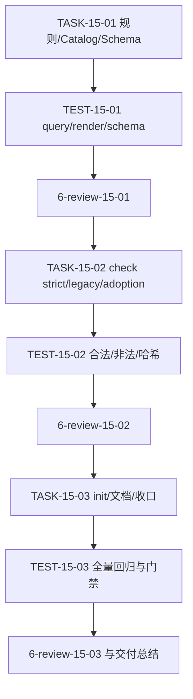
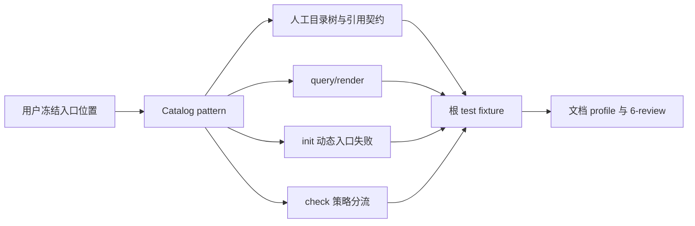

# 代码位置目录规则 V2 实施总览：二进制入口与 cmd 收敛

结论：以 Catalog pattern 为唯一事实源，补齐后端独立项目和同仓后端的主/额外二进制入口，并在 CLI 中实现查询、展示、初始化失败关闭和策略检查；影响：入口不会再因默认放入 `cmd/` 而与项目根职责混淆；范围：规则、Catalog、CLI、测试和文档；非范围：真实业务项目迁移、构建发布和外部服务；变化：新增 pattern 节点、路径检查和 init 拒绝边界；完成标准：五项 AC 全部有本地真实测试与风格回归证据；术语说明：`primary` 是默认入口，`additional` 是附加 binary；验证状态：专项测试、全量 Python 入口、文档 profile 与 `6-review` 已通过。

## 图片资产决策

图片资产决策：N/A + 原因：本实施总览只表达目录规则和验证关系；证据：无 UI、视觉对比或截图验收项，Mermaid 已覆盖依赖关系。

## 当前计划最终方案简要说明

新增 `binary-entrypoint` 的 `primary` / `additional` 两组 pattern 条目，分别映射根入口与 `cmd/<binary>` 入口。`check` 对 `main.<ext>` 和 `cmd` 结构执行失败关闭或告警分流；`init` 不创建动态入口；现有非入口目录规则与 adoption 快照语义保持不变。

## Agent 对当前问题的理解

| 项目 | 结论 |
| --- | --- |
| 问题 | 目录树说明了 `cmd/`，但没有定义后端根主入口，Catalog/CLI 也没有入口 pattern 或非法路径检查。 |
| 本轮范围 | `package-structure-rules` 五份 reference、Catalog、Schema、Python CLI、根 `test/` 测试、需求/周期/审查/测试证据和项目状态。 |
| 非范围 | 真实项目迁移、入口源代码、构建脚本、前端入口、网络服务、数据库和 Git 历史。 |
| 优先闭环 | TASK-15-01 冻结事实；TASK-15-02 实现 check 策略；TASK-15-03 实现 init/Schema 回归并完成文档收口。 |
| 依赖 | Python 标准库、现有 Catalog JSON 兼容 YAML、根 `test/` 入口和文档校验脚本。 |
| 最大推进边界 | 只修改本 Skill 和本仓库活动文档/测试；不扩展到其它 Skill 的目录 Owner。 |

unresolved_decisions：`[]`；入口规则和测试策略已由用户确认。

## 现状与落点

```text
package-structure-rules/
├── SKILL.md
├── references/
│   ├── project-layout-v2.md
│   ├── go-package-layout.md
│   ├── structure-general.md
│   ├── lookup-and-reference-contract.md
│   ├── placement-catalog.yaml
│   └── placement-catalog.schema.json
└── scripts/
    └── placement_catalog.py
test/
└── package-structure-rules/
    └── entrypoint_layout_test.py
```

## 周期依赖图

图形目的：说明三项任务的先后依赖与每项任务的真实测试闸门。
关联 ID：`CYCLE-15`、`TASK-15-01` 至 `TASK-15-03`。



## 端到端闭环图

图形目的：说明同一 Catalog 事实如何驱动目录树、CLI 和测试。
关联 ID：`AC-PSR-BINARY-001` 至 `AC-PSR-BINARY-005`。



## 周期与最小任务

| 周期 | 任务 | 垂直闭环 | 完成条件 | 停止条件 |
| --- | --- | --- | --- | --- |
| `CYCLE-15` | `TASK-15-01` | 规则/Catalog/Schema -> query/render/schema 测试 -> 6-review | 两类项目各两条 pattern 唯一可查，目录树职责清晰。 | 入口 pattern 不唯一或目录树与 Catalog 漂移。 |
| `CYCLE-15` | `TASK-15-02` | check 实现 -> strict/legacy/adoption/哈希测试 -> 6-review | 合法路径通过，五类非法路径失败，策略语义保持。 | 非法入口放行或检查产生写入。 |
| `CYCLE-15` | `TASK-15-03` | init/文档/全量回归 -> 文档门禁 -> 6-review | 动态 init 失败关闭，所有 AC、追踪和证据齐全。 | placeholder 被创建、门禁失败或未决 P0/P1。 |

## 任务执行契约

每项任务必须按“实现 -> 精确 local 命令真实测试 -> 失败预期复验 -> 清理临时目录 -> 6-review 风格回归”顺序闭环。真实测试不以 build、lint 或人工阅读替代；所有临时项目使用 Python `tempfile`，不读取外部连接配置。

## 回滚、停止与清理

| 项目 | 规则 |
| --- | --- |
| 回滚 | 只撤销本轮未提交文件改动；不使用 reset/checkout，不触碰历史 `doc/5-tests/` 可执行资产。 |
| 清理 | 测试用例使用上下文管理器清理临时项目；不在仓库留下运行产物。 |
| 停止 | Catalog/CLI/目录树任一事实冲突、strict 写入、文档校验失败或测试失败即停止。 |
| 外部边界 | 不连接任何数据库、缓存、消息队列、第三方 API 或非 local 服务。 |

## 总追踪矩阵

| SRC/DEC | REQ/RULE | AC | CYCLE/TASK | 文件/符号 | TEST | EVIDENCE |
| --- | --- | --- | --- | --- | --- | --- |
| `SRC-PSR-BINARY-ENTRY-001` / `DEC-PSR-BINARY-ENTRY-001` | `RULE-PSR-BINARY-ENTRY-001` | `AC-PSR-BINARY-001` | `CYCLE-15/TASK-15-01` | 五份 reference、Catalog、Schema | `test/package-structure-rules/entrypoint_layout_test.py` | `EVD-TASK-15-01-*` |
| 同上 | `RULE-PSR-BINARY-ENTRY-002` | `AC-PSR-BINARY-002`、`004` | `CYCLE-15/TASK-15-02` | `check_binary_entrypoint_path`、`command_check` | 同上 | `EVD-TASK-15-02-*` |
| `DEC-PSR-BINARY-ENTRY-001` | `RULE-PSR-BINARY-ENTRY-003` | `AC-PSR-BINARY-003`、`005` | `CYCLE-15/TASK-15-03` | `command_init`、Schema、文档 | 同上、文档校验 | `EVD-TASK-15-03-*` |

## 验收与交付条件

- 代码和测试使用 UTF-8，Python 可编译，`git diff --check` 无错误。
- 根测试入口通过，目标 Skill 校验通过，工程文档 profile 全部 `valid: true`。
- `6-review` 只判断格式、风格、可读性、注释和目录归位，输出 `STYLE: PASS`；不替代业务正确性或发布放行判断。
- 当前轮无 Git 提交授权，收口保持未提交。

## 实施周期总览

| 周期 | 目标 | 进入条件 | 收口条件 |
| --- | --- | --- | --- |
| `CYCLE-15` | 收敛主入口、额外入口、策略检查和 init。 | `REQ-PSR-BINARY-ENTRY-001` 已冻结。 | AC-001 至 AC-005、根测试、文档门禁和 `STYLE: PASS` 全部通过。 |

## 阶段计划

| 阶段 | 内容 | 停止边界 |
| --- | --- | --- |
| 规则事实 | Catalog、目录树、Schema 同步。 | pattern 不唯一或文档漂移。 |
| 行为实现 | check 与 init 失败关闭。 | 合法路径被拒或检查写入 fixture。 |
| 收口 | 测试、文档和 6-review。 | 任一门禁非通过。 |

## 最小任务清单

| 任务 | 文件/符号 | 真实测试 | 完成条件 |
| --- | --- | --- | --- |
| `TASK-15-01` | reference、Catalog、Schema | query/render/schema | 两类项目四条 pattern 唯一可查。 |
| `TASK-15-02` | `check_binary_entrypoint_path` | strict/legacy/adoption/hash | 合法通过、非法失败、历史快照兼容。 |
| `TASK-15-03` | `command_init`、活动文档 | init、根测试、profile、6-review | 不创建占位路径，所有交付门禁通过。 |

## 真实测试安排

| 测试 | 命令 | 样本/断言 |
| --- | --- | --- |
| `TEST-PSR-BINARY-001..004` | `python -X utf8 -B test/package-structure-rules/entrypoint_layout_test.py` | query、render、合法/非法路径、init、三种策略和哈希。 |
| 历史回归 | `python -X utf8 -B -m unittest discover -s doc/5-tests/2026-07-28_014412_代码位置目录规则V2/package-structure-rules -p test_*.py` | 既有 50 项 package-structure 行为不回归。 |

## 风险与阻断项

N/A + 原因：当前无未解决阻断；证据：实现与两组本地测试已通过。风险仍以任务内非法路径与无写入哈希作为停止边界，不连接外部服务。

## 任务完成、停止与最大推进边界

任务完成要求：五项 AC、根测试、文档 profile 和 `STYLE: PASS` 全部通过。停止条件：入口规则冲突、动态 init 写入、检查改变 fixture 或门禁失败。最大推进边界：只在本 Skill、本地测试和活动文档内修改，不迁移真实项目、不写 Git 历史。

图形目的：说明从实施任务到真实测试和风格回归的收口顺序。
关联 ID：`TASK-15-01`、`TASK-15-02`、`TASK-15-03`。


## 自审结论

- 范围：通过；只调整二进制入口目录规则和对应测试、文档。
- 一致性：通过；目录树、Catalog、Schema、CLI 与测试使用同一四条合法路径。
- 决策：通过；unresolved_decisions 为 `[]`，没有把旧 `cmd/main.<ext>` 作为兼容新入口。
- 图片资产：N/A + 原因和证据见“图片资产决策”。
