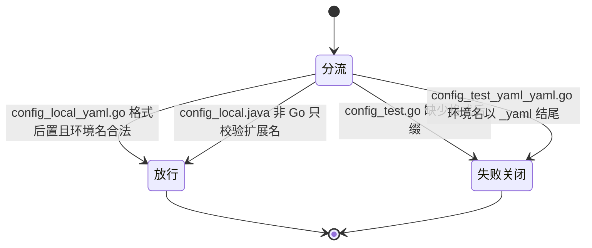

# 代码位置目录规则 V2 实施周期 20：embedded 配置文件名格式后置

结论：本周期把源码内嵌配置的文件名从环境名结尾改成格式名结尾，并把目录检查工具的判定方向整体反转。影响：所有按本规则组织后端配置的 Go 项目，以及执行目录检查的自动化入口。范围：配置目录说明、完整目录树、机器可读目录清单、目录检查命令行工具、根 `test/` 回归用例、项目长期记忆和本周期研发文档。非范围：外部 YAML 命名、配置目录位置、秘密原值边界、二进制入口规则、其他语言的内嵌配置文件名校验、真实业务仓库改名和任何写入版本历史的动作。变化：旧写法由合法变非法，带格式后缀的新写法由非法变合法，并新增一条排除重复格式名的约束。完成标准：七项完成条件全部有真实测试证据，跨周期回归用例不受影响，且检查过程全程只读。术语说明：`embedded` 指把 YAML 配置内容直接写在源码文件里、让配置随程序一起编译的做法；`失败关闭` 指检查发现问题时直接判定不通过而不是只提醒；`目录摘要` 指对目标目录全部路径和内容算出的指纹，用来证明检查没有改动任何文件。验证状态：两个最小任务均已完成实现、真实测试和风格回归，全部通过。

## 当前周期最终方案简要说明

本周期不改变配置目录的结构，只改变内嵌配置的文件名口径：把格式名 `yaml` 从"不许出现在文件名里"改成"必须放在环境名后面"。主落点是配置目录说明、机器可读目录清单和目录检查工具三处，因为它们共同决定项目会收到什么检查结论；之所以这么做，是因为原来的 `config_test.go` 会被 Go 当成测试文件而排除出生产构建，规则写出来的文件在真实项目里用不了。

## Agent 对当前问题的理解

| 项目 | 结论 |
|---|---|
| 问题/目标 | 上一周期冻结的内嵌配置文件名撞上了 Go 的保留命名，标准环境名 `test` 直接踩坑 |
| 本周期范围 | 配置目录说明、完整目录树、目录清单、检查工具、根 `test/` 回归、项目长期记忆和本周期研发文档 |
| 非范围 | 外部 YAML 命名、配置根位置、秘密原值边界、二进制入口、非 Go 语言文件名校验、真实仓库迁移 |
| 优先闭环 | 先把三处规则口径改成一致，再反转检查工具的判定并同步回归用例 |
| 关键假设 | 老项目通过既有的宽松与采纳两档策略过渡，本周期不新增迁移工具 |
| 当前状态 | `T20-01` 与 `T20-02` 均已完成，前置取舍已由用户在需求阶段全部选定 |
| 最大推进边界 | 只完成本周期，不触碰第 15 至 19 周期的既有成果，不改动仓库级规则文件与测试策略技能 |

## 当前周期目标、边界与进入条件

| 项目 | 冻结内容 |
|---|---|
| 周期目标 | 让规则文档、目录清单和检查工具对内嵌配置文件名给出同一个结论，且该结论不与任何语言的保留命名冲突 |
| 范围 | `configuration-layout.md`、`project-layout-v2.md`、`placement-catalog.yaml`、`placement_catalog.py`、`configuration_layout_test.py`、`PROJECT_MEMORY.md` 和本周期研发文档 |
| 非范围 | `AGENTS.md`、`CLAUDE.md`、`test-strategy-rules`、`placement-catalog.schema.json`、真实业务仓库文件、版本历史 |
| 进入条件 | `REQ-PSR-CONFIG-ENV-002` 已冻结；两处关键取舍已由用户选定；无未决实现层选择 |
| 收口条件 | `AC-PSR-CONFIG-009` 至 `AC-PSR-CONFIG-015` 全部通过；根 `test/` 全量回归通过；文档门禁通过；两个任务的风格回归均为 `STYLE: PASS` |
| 图片资产决策 | 图片资产决策：N/A + 原因：本周期不涉及界面、截图或视觉验收对象 + 证据：任务依赖与判定关系已由本文两张 Mermaid 图表达 |

## 当前代码/文档基线

| 项目 | 基线 |
|---|---|
| 基线提交 | `dfe23c9 fix: [删除] 不需要的文件` |
| 工作树状态 | 进入本周期前工作树干净，无未提交改动 |
| 被修订的历史结论 | `REQ-PSR-CONFIG-ENV-001` 与 `CYCLE-PSR-17-001` 冻结的 `config_<env>.go` 命名 |
| 关键基线事实 | 检查工具原先在 Go 分支里主动拒绝以 `_yaml.go` 结尾的文件名，本周期要反转的正是这一处判断 |
| 关键基线事实 | 目录树渲染直接从完整目录文档的代码块切片，因此改文档即改渲染输出，无需单独改渲染逻辑 |
| 关键基线事实 | 项目长期记忆中记录着"禁止把格式名拼入文件名"的稳定决策，与新口径直接矛盾，必须一并改写 |

## 文件/符号操作契约

| 序号 | 文件/符号 | 操作 | 契约 |
|---|---|---|---|
| 1 | `package-structure-rules/references/configuration-layout.md` | 修改 | 表格行、命名章节、目录树、合法示例改为格式后置；非法示例方向反转为缺少后缀与重复格式名两类；命名章节必须写清为什么后置 |
| 2 | `package-structure-rules/references/project-layout-v2.md` | 修改 | 后端目录树的内嵌节点与说明段改为格式后置；外部 YAML 节点不动；同仓与前端章节不动 |
| 3 | `package-structure-rules/references/placement-catalog.yaml` | 修改 | 两条内嵌配置条目的文件名模式字段改为格式后置；两条外部 YAML 条目不动 |
| 4 | `package-structure-rules/references/placement-catalog.schema.json` | 不动 | 无字段增减，结构定义保持原样 |
| 5 | `package-structure-rules/scripts/placement_catalog.py` 的 `check_environment_config_path` | 修改 | Go 分支的正则改为格式后置；守卫从"拒绝后缀"反转为"要求后缀"并新增环境名不得以 `_yaml` 结尾；错误文案保留 `Go embedded` 开头；外部 YAML 分支不动 |
| 6 | `test/package-structure-rules/configuration_layout_test.py` | 修改 | 契约断言、正向样本、反向样本与目录树断言同步；`.java` 样本保留原名以锚定"只对 Go 强制" |
| 7 | `PROJECT_MEMORY.md` 配置稳定决策条目 | 修改 | 改写被推翻的命名结论，补上格式后置的理由与外部 YAML 不加后缀的边界 |
| 8 | `package-structure-rules/SKILL.md` | 不动 | 技能说明与二级标题均未变动，因此不触发技能字典重新生成 |

### 任务依赖关系

图形目的：说明本周期两个最小任务的先后依赖，解释为什么规则口径必须先于检查工具反转。关联 ID：`T20-01`、`T20-02`。

### 判定分流与预期结论

图形目的：说明反转后检查工具对四类典型文件名的分流结论，作为真实测试断言的依据。关联 ID：`AC-PSR-CONFIG-011`、`AC-PSR-CONFIG-012`、`AC-PSR-CONFIG-013`。

## 周期内最小任务执行顺序

必须逐个闭环：每个任务先实现，再跑自己的真实测试，再做风格回归，通过后才允许推进下一个任务。禁止先做完两个任务再统一验证。

| 顺序 | 任务 ID | 任务 | 文件数 | 依赖 |
|---|---|---|---|---|
| 1 | `T20-01` | 规则说明与机器可读目录清单的口径反转 | 3 | 无 |
| 2 | `T20-02` | 检查工具判定反转、回归用例同步与长期记忆改写 | 3 | `T20-01` 已闭环 |

## 最小任务闭环

### T20-01 规则说明与目录清单口径反转

| 项目 | 内容 |
|---|---|
| 产出 | 配置目录说明、完整目录树、机器可读目录清单三处口径统一为格式后置 |
| 文件/符号 | 操作契约第 1、2、3 项 |
| 真实测试 | `TEST-PSR-CONFIG-002-A`：内嵌配置查询命令对两类后端项目各跑一次；目录树渲染命令跑一次；外部 YAML 查询命令跑一次确认未漂移 |
| 通过标准 | 查询返回的 Go 文件名模式为格式后置形式；渲染输出同时含新的内嵌占位与未改动的外部 YAML 占位；外部 YAML 模式与改动前一致 |
| 失败预期 | 若目录清单条目不唯一，查询命令返回非零并打印匹配数量；若目录树代码块被破坏，渲染命令抛出切片异常 |
| 任务完成条件 | 三条真实测试全部通过，且风格回归为 `STYLE: PASS` |
| 任务停止条件 | 目录清单的配置条目数不再是四条，或渲染命令无法定位目录树代码块 |
| 回滚 | 三个文件均为纯文本改动，回滚方式为 `git checkout -- <文件>` 恢复到基线提交状态，无需清理任何生成物 |
| 清理 | 无需清理：本任务不创建临时文件、不写入目标项目目录 |
| 执行结果 | 已完成。查询、渲染与外部 YAML 未漂移三项均通过，证据 `EVD-T20-01-TEST` |

### T20-02 检查工具判定反转与回归同步

| 项目 | 内容 |
|---|---|
| 产出 | 检查工具的 Go 分支判定反转、回归用例同步、长期记忆中矛盾结论改写 |
| 文件/符号 | 操作契约第 5、6、7 项 |
| 真实测试 | `TEST-PSR-CONFIG-002-B`：先跑配置布局行为回归文件，再跑目录规则全量回归 |
| 通过标准 | 配置布局回归七个用例全部通过；全量回归十六个用例全部通过；反向用例的目录摘要在检查前后一致 |
| 失败预期 | 若判定方向未完全反转，正向用例会因新命名被拒而失败；若漏掉环境名守卫，重复格式名的反向用例会因被放行而失败 |
| 任务完成条件 | 两轮真实测试全部通过，且风格回归为 `STYLE: PASS` |
| 任务停止条件 | 出现检查过程写入临时目录，或宽松与采纳两档策略的成功失败语义发生漂移 |
| 回滚 | 三个文件均为文本改动，回滚方式为 `git checkout -- <文件>` 恢复到基线提交状态；回滚后需重跑全量回归确认恢复到上一周期结论 |
| 清理 | 无需清理：回归用例使用临时目录，退出时由测试框架自行删除 |
| 执行结果 | 已完成。配置布局回归七项、全量回归十六项均通过，证据 `EVD-T20-02-TEST` |

## 真实测试与断言

| 测试 ID | 入口 | 依赖环境 | 样本来源 | 通过标准 |
|---|---|---|---|---|
| `TEST-PSR-CONFIG-002-A` | 目录检查工具的 `query` 与 `render` 子命令 | 本地 Python，仓库自带目录清单，无外部服务 | 仓库内规则资产本身 | 退出码为零；Go 文件名模式为格式后置；渲染含新旧两类占位 |
| `TEST-PSR-CONFIG-002-B` | `test/package-structure-rules/configuration_layout_test.py` 与该目录全量回归 | 本地 Python 与临时目录，无外部服务 | 测试用例内构造的临时目录样本 | 七项与十六项用例全绿；反向用例检查前后目录摘要一致 |

免测边界：N/A + 原因：本周期改动检查工具的可执行判定行为，不属于纯文档或纯排版场景 + 证据：`TEST-PSR-CONFIG-002-A` 与 `TEST-PSR-CONFIG-002-B` 均为真实运行，构建与静态检查不计入通过标准。

## 当前周期验证矩阵

| AC | 判定入口 | 真实测试 | 结果 | 证据 |
|---|---|---|---|---|
| `AC-PSR-CONFIG-009` | 内嵌配置查询命令，两类后端项目 | `TEST-PSR-CONFIG-002-A` | 通过 | `EVD-T20-01-TEST` |
| `AC-PSR-CONFIG-010` | 目录树渲染命令 | `TEST-PSR-CONFIG-002-A` | 通过 | `EVD-T20-01-TEST` |
| `AC-PSR-CONFIG-011` | 正向样本严格检查 | `TEST-PSR-CONFIG-002-B` | 通过 | `EVD-T20-02-TEST` |
| `AC-PSR-CONFIG-012` | 反向样本严格检查与目录摘要比对 | `TEST-PSR-CONFIG-002-B` | 通过 | `EVD-T20-02-TEST` |
| `AC-PSR-CONFIG-013` | `.java` 正向样本严格检查 | `TEST-PSR-CONFIG-002-B` | 通过 | `EVD-T20-02-TEST` |
| `AC-PSR-CONFIG-014` | 外部 YAML 查询与既有秘密边界用例 | `TEST-PSR-CONFIG-002-A`、`TEST-PSR-CONFIG-002-B` | 通过 | `EVD-T20-01-TEST`、`EVD-T20-02-TEST` |
| `AC-PSR-CONFIG-015` | 长期记忆条目复核 | `TEST-PSR-CONFIG-002-B` | 通过 | `EVD-T20-02-IMPL` |

## 周期阻断、停止与回滚

| 项目 | 内容 |
|---|---|
| 阻断项 | 无。本周期不依赖网络、数据库、缓存或第三方服务 |
| 周期停止条件 | 任一最小任务的真实测试无法通过且原因指向需求口径本身，此时必须回到需求阶段而不是放宽检查 |
| 周期停止条件 | 出现跨周期回归失败，说明本次改动越界，必须先回滚再重新收窄范围 |
| 回滚范围 | 本周期共六个文件，全部为文本改动，可用 `git checkout -- <文件>` 逐个回滚到基线提交 |
| 回滚验证 | 回滚后必须重跑目录规则全量回归，确认恢复到第 19 周期的结论 |
| 最大推进边界 | 只完成本周期两个最小任务；不改动仓库级规则文件、测试策略技能与结构定义文件；不迁移真实业务仓库；不执行任何写入版本历史的动作 |

## 自审结论

| 检查项 | 结论 |
|---|---|
| 任务是否逐个闭环 | 是。`T20-01` 先完成真实测试与风格回归，之后才开始 `T20-02` |
| 真实测试是否为真实运行 | 是。两项测试均实际执行并留下退出码与用例数，未以构建或静态检查替代 |
| 改动是否越界 | 未越界。六个文件全部在操作契约内，结构定义文件与仓库级规则文件确认未动 |
| 是否引入本轮残留 | 无。未产生未使用的导入、变量或孤儿文件 |
| 追踪链是否闭合 | 是。需求追踪矩阵的三条链路在本文验证矩阵中均有对应结果与证据 |
| unresolved_decisions | 无未决决策。两处关键取舍已在需求阶段由用户选定 |
| 提交状态 | 停在已改动未提交状态。本轮未获提交授权，未执行任何写入版本历史的动作 |
