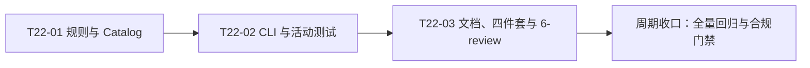
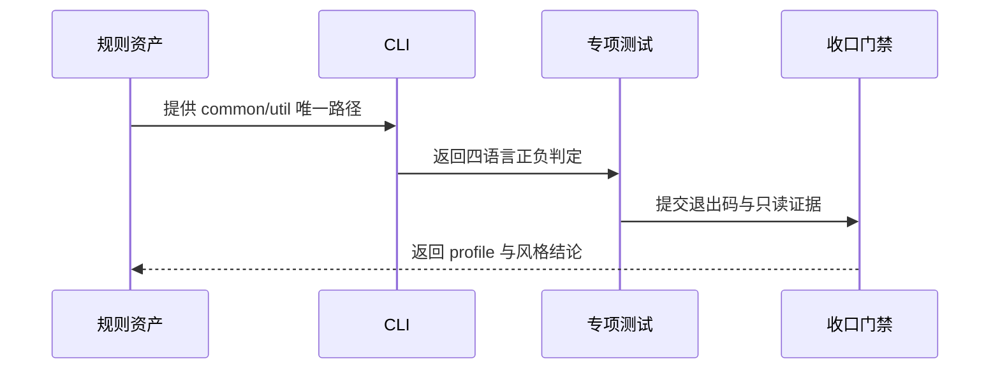

# 代码位置目录规则 V2 实施周期 22：独立后端 common/util 落点

结论：本周期把项目关联工具收敛到独立后端 `common/util/`，并用 Catalog、CLI 和活动测试冻结唯一落点。影响：查询、初始化、strict 检查及相邻 Skill 引用同步变化。范围：规则资产、CLI、测试、文档和四件套。非范围：真实项目迁移、前端工具目录、根 `utils` 职责和 Git 历史写入。变化：源码根 `util/` 新代码位置废弃。完成标准：专项测试、文档 profile、6-review 与 Skill 合规门禁通过。术语说明：`common/util` 是项目关联工具的扁平目录。验证状态：专项测试、文档 profile、6-review 与 Skill 合规门禁均已通过；工作树保持已改动未提交。

## 当前计划最终方案的简要说明

结论：本周期把项目关联工具从语言源码根 `util/` 收敛到独立后端根 `common/util/`，通过单一 Catalog 条目、扁平目录校验和兼容查询别名保持查找入口稳定。影响：目录查询、strict 检查、初始化和相邻 Skill 引用统一到新落点。范围：`placement-catalog.yaml`、`placement_catalog.py`、目录树、Schema、活动测试、四件套与本周期文档。非范围：真实项目迁移、前端工具目录、根 `utils` 职责和 Git 历史写入。变化：源码根 `util/` 新代码位置废弃。完成标准：专项测试、文档 profile、6-review 和 Skill 合规门禁全部通过。术语说明：`common/util` 是独立后端项目关联工具的扁平目录；`legacy` 是旧项目快照维护策略。验证状态：实现、专项测试、文档 profile、6-review 与 Skill 合规门禁均已通过；工作树保持已改动未提交。

## Agent 对当前问题的理解

| 项目 | 结论 |
|---|---|
| 问题/目标 | 用户要求独立后端 `common/` 增加与根 `utils/` 不同职责的 `util/` 目录 |
| 本轮范围 | 规则文档、Catalog、Schema、CLI、相邻 Skill、活动测试、四件套和本周期证据 |
| 非范围 | 真实业务项目迁移、前端 `common/util`、根 `utils` 重新定义、Git 历史写入 |
| 当前优先闭环 | 先统一规则事实源，再验证 CLI 的正负路径边界，最后完成文档与风格收口 |
| 关键假设 | 旧源码根 util 仅通过 adoption legacy 快照渐进迁移，不新增自动搬移命令 |
| 最大推进边界 | 只修改本周期列出的 skill 资产、测试和文档；不扩散到其它项目 |

## 当前周期目标、边界与进入条件

| 项目 | 冻结内容 |
|---|---|
| 周期目标 | 让规则文档、Catalog、CLI 和测试对 `common/util` 给出一致结论 |
| 进入条件 | 用户决策已冻结；旧源码根不自动迁移；本地测试入口可用 |
| 收口条件 | `AC-PSR-COMMON-UTIL-001` 至 `004` 均有真实证据，文档 profile 与风格门禁通过 |
| 停止边界 | 不修改真实业务项目、不连接外部服务、不写入 Git 历史 |

## 当前代码/文档基线

| 项目 | 基线事实 |
|---|---|
| Catalog | 原有四个 `backend.source-util.*` 条目已替换为唯一 `backend.common.util` |
| CLI | 已加入 `check_common_util_path` 与旧源码根拒绝逻辑 |
| 测试 | 新增 `test/package-structure-rules/backend_common_util_layout_test.py`，四项通过 |
| 工作树 | 保留既有用户未提交改动；本周期不执行 destructive git 或历史写入 |

## 依赖图与端到端闭环

图形目的：表达 Catalog、CLI、测试和文档的依赖关系。关联 ID：`T22-01`、`T22-02`、`T22-03`。

图形目的：表达规则、实现、测试和证据的顺序依赖。关联 ID：`T22-01`、`T22-02`、`T22-03`。

## 周期内最小任务执行顺序

| 顺序 | 任务 ID | 任务 | 文件数 | 依赖 |
|---|---|---|---:|---|
| 1 | `T22-01` | Catalog、Schema、规则引用统一为 `common/util` | 8 | 无 |
| 2 | `T22-02` | CLI 边界实现与活动行为测试 | 2 | `T22-01` |
| 3 | `T22-03` | 四件套、需求/实施/测试证据和 6-review 收口 | 8 | `T22-02` |

## 最小任务闭环

### T22-01 规则与 Catalog 统一

- 实现：更新 `package-structure-rules/SKILL.md`、目录树、工具布局、引用契约、四语言 reference、Catalog、Schema。
- 真实测试：`python -X utf8 package-structure-rules/scripts/placement_catalog.py query --artifact common-util`；`render --project-kind backend`。
- 通过标准：唯一条目返回 `common/util`；目录树出现 `common/util`，不再把源码根 `util` 作为新落点。
- 失败预期：Catalog 条目不唯一或 render 代码块损坏时返回非零。
- 清理/回滚：仅文本改动；失败时逐文件恢复本周期改动并重跑目录规则回归。
- 完成条件：查询与渲染均通过，且 `placement-catalog.schema.json` 可解析。
- 停止条件：出现第二个 `common-util` 条目或目录树与 Catalog 产生漂移。

### T22-02 CLI 与行为测试

- 实现：`placement_catalog.py` 新增 `common/util` 扁平校验、旧源码根拒绝、非 backend 拒绝和 `source-util` 兼容别名；新增 `backend_common_util_layout_test.py`。
- 真实测试：`python -X utf8 -B test/package-structure-rules/backend_common_util_layout_test.py -v`。
- 样本：Go、Java、Node.js、Python 直接文件；错误扩展、嵌套文件、`utils/helper`、旧源码根和 frontend 根 `common/util`。
- 通过标准：四语言正向全绿，全部负向样本返回 2；strict 检查不改变临时目录。
- 失败预期：错误扩展或子目录被放行、旧源码根未拒绝、兼容查询不返回 `common/util` 时停止。
- 清理/回滚：测试使用 `TemporaryDirectory` 自动清理；代码失败时回滚 CLI 与专项测试后重跑根测试。
- 完成条件：专项测试全绿，`py_compile` 通过。
- 停止条件：出现非 local 连接、测试写入仓库外部状态或无法证明只读。

### T22-03 文档与收口

- 实现：更新 `PROJECT_CURRENT.md`、`PROJECT_MEMORY.md`、`PROJECT_STYLE.md`、`PROJECT_HISTORY.md`，生成测试证据和 `doc/6-review`。
- 真实测试：根 Python 测试、文档 profile、UTF-8/换行检查、`git diff --check`。
- 通过标准：根测试全绿，文档 profile `valid: true`，6-review 输出 `STYLE: PASS`，Skill 合规门禁 PASS。
- 失败预期：文档追踪链缺 ID、编码漂移、风格回归失败或执行证据缺失时不得收口。
- 清理/回滚：删除本周期生成的测试证据目录和临时文件；只回滚本周期文件，不触碰其它会话改动。
- 完成条件：所有 AC 有 TEST/EVIDENCE 对应，工作树保持已改动未提交。
- 停止条件：任何必须证据缺失，或用户范围外文件需要修改。

## 测试与验收映射

| AC | 真实测试入口 | 断言 |
|---|---|---|
| `AC-PSR-COMMON-UTIL-001` | 专项测试、query、render | 唯一 Catalog 与渲染路径为 `common/util` |
| `AC-PSR-COMMON-UTIL-002` | 专项测试 | 四种语言直接文件放行，错误扩展/子目录失败 |
| `AC-PSR-COMMON-UTIL-003` | 专项测试 | 根 utils、旧源码根、非 backend common/util 失败 |
| `AC-PSR-COMMON-UTIL-004` | 根测试、文档 profile、6-review | 无回归、UTF-8、只读检查和风格证据齐全 |

## 当前周期验证矩阵

| AC | 结果 | 证据 |
|---|---|---|
| `AC-PSR-COMMON-UTIL-001` | 通过 | query/render/init 与专项测试 |
| `AC-PSR-COMMON-UTIL-002` | 通过 | 四语言 strict 正向与负向样本 |
| `AC-PSR-COMMON-UTIL-003` | 通过 | 旧源码根、根 utils、frontend 负向样本 |
| `AC-PSR-COMMON-UTIL-004` | 通过 | 文档 profile、6-review、Skill 合规门禁 |

## 周期追踪矩阵

| TASK | 文件/符号 | TEST | EVIDENCE |
|---|---|---|---|
| `T22-01` | Catalog、Schema、目录树 | `TEST-PSR-COMMON-UTIL-001` | `EVD-T22-01-TEST` |
| `T22-02` | `check_common_util_path`、专项测试 | `TEST-PSR-COMMON-UTIL-001` | `EVD-T22-02-TEST` |
| `T22-03` | 四件套、文档、6-review | 文档 profile 与风格回归 | `EVD-T22-03-DOC` |

## 活动证据分类登记

为满足活动实施周期的逐任务追踪契约，每个任务均登记实现、测试和风格三类证据；证据正文分散在本周期实施文档、测试报告和 `6-review` 记录中。

| TASK | IMPL | TEST | STYLE |
|---|---|---|---|
| `T22-01` | `EVD-T22-01-IMPL` | `EVD-T22-01-TEST` | `EVD-T22-01-STYLE` |
| `T22-02` | `EVD-T22-02-IMPL` | `EVD-T22-02-TEST` | `EVD-T22-02-STYLE` |
| `T22-03` | `EVD-T22-03-IMPL` | `EVD-T22-03-TEST` | `EVD-T22-03-STYLE` |

## 自审结论

| 检查项 | 当前结论 |
|---|---|
| 需求边界 | 未扩散到真实业务项目或外部服务 |
| 真实测试 | 专项与 package-structure-rules 回归通过；全仓存在一项历史 fixture 路径失败 |
| 文档门禁 | 本周期文档初次 profile 发现字段与图形缺口，已补齐后待复验 |
| 提交状态 | 已修改未提交，未获用户当轮 Git 提交授权 |

## 回滚与提交边界

- 回滚：只恢复本周期列出的文件；不使用 destructive git 命令，不迁移真实项目。
- 提交边界：当前轮没有用户提交授权，必须停在已修改未提交状态。
- 状态：实现、专项测试、文档 profile、6-review 和合规门禁均已通过；状态改为 `accepted`，工作树保持已改动未提交。

## 周期阻断、停止与回滚

- 阻断项：全仓既有文档测试夹具引用缺失的历史 `doc/7-验收` 文件；不属于本轮 common/util 范围，作为基线失败单独记录。
- 停止条件：若本轮文档 profile、专项测试或 `git diff --check` 失败，停止收口并回到对应唯一 Owner 修复。
- 回滚：仅恢复本周期新增/修改的 skill、测试和文档文件，不回退其它会话改动。
- 最大推进边界：完成本周期验证与收口，不执行真实项目迁移和 Git 历史写入。

## 图片资产决策

图片资产决策：N/A + 原因：本周期不涉及界面、截图或视觉验收对象 + 证据：flowchart 与 sequenceDiagram 已表达依赖和端到端顺序。
