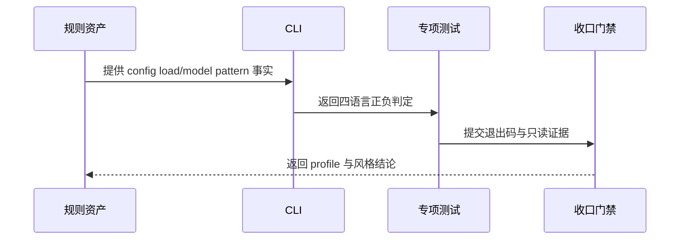

# 代码位置目录规则 V2 实施周期 23：config 根加载与结构文件

结论：本周期让 `config/load.<ext>` 与 `config/model.<ext>` 成为独立后端和同仓后端的唯一配置加载/结构落点，并用 Catalog、CLI 和活动测试冻结机器校验。影响：查询、渲染、strict 检查、配置 reference 和相邻测试的落点契约统一变化。范围：规则资产、CLI、测试、文档和项目四件套。非范围：`common/util/` 既有规则、前端 `config/`、真实项目迁移和 Git 历史写入。变化：config/ 根直接源码文件从“一律拒绝”变为“仅放行 load/model 两个命名”。完成标准：专项测试、四文件回归、文档 profile、6-review 与 Skill 合规门禁通过。术语说明：`load.<ext>` 是配置加载与解析入口，`model.<ext>` 是配置结构定义文件。验证状态：专项测试 `11/11`、四文件回归 `26/26`、需求/实施/测试/风格 profile 与 Skill 合规门禁均已通过；工作树保持已改动未提交。

## 当前计划最终方案的简要说明

结论：在 `package-structure-rules` 的 Catalog 与 CLI 中新增 `config/load.<ext>` + `config/model.<ext>` 两个条件提交源码文件条目，strict 检查对 config/ 根这两个命名放行、其余一律拒绝。影响：目录查询、渲染、strict 检查和配置文档同步到新落点。范围：Catalog、Schema、目录树、CLI、配置 reference、SKILL.md 核心边界、活动测试、四件套与本周期文档。非范围：`common/util/`、前端 `config/`、真实业务项目迁移和 Git 历史写入。变化：config/ 根直接源码文件从“一律拒绝”变为“仅放行 load/model 两个命名”。完成标准：专项测试、四文件回归、文档 profile、6-review 和 Skill 合规门禁全部通过。术语说明：`load.<ext>` 读取 yaml/embedded 配置并解析，`model.<ext>` 声明配置结构。验证状态：实现、专项测试、文档 profile、6-review 与 Skill 合规门禁均已通过；工作树保持已改动未提交。

## Agent 对当前问题的理解

| 项目 | 结论 |
|---|---|
| 问题/目标 | 用户要求后端 `config/` 下新增 2 个文件：一个加载配置、一个定义配置结构；`config/yaml/` 与 `config/embedded/` 只存放配置数据 |
| 本轮范围 | 规则文档、目录树、Catalog、Schema、CLI、配置 reference、SKILL.md 核心边界、活动测试、四件套和本周期证据 |
| 非范围 | `common/util/` 既有规则、前端 `config/`、真实业务项目迁移、Git 历史写入 |
| 当前优先闭环 | 先统一规则事实源，再验证 CLI 的正负路径边界，最后完成文档与风格收口 |
| 关键假设 | 2 个文件为条件提交，存在即校验，`init` 不创建；沿用“只检查已有文件、不要求环境齐全”语义 |
| 最大推进边界 | 只修改本周期列出的 skill 资产、测试和文档；不扩散到其它项目 |

## 当前周期目标、边界与进入条件

| 项目 | 冻结内容 |
|---|---|
| 周期目标 | 让规则文档、Catalog、CLI 和测试对 `config/load.<ext>`、`config/model.<ext>` 给出一致结论 |
| 进入条件 | 用户三个决策（统一 load/model、条件提交、后端两类）已冻结；本地测试入口可用 |
| 收口条件 | `AC-PSR-CONFIG-SOURCE-001` 至 `004` 均有真实证据，文档 profile 与风格门禁通过 |
| 停止边界 | 不修改真实业务项目、不连接外部服务、不写入 Git 历史 |

## 当前代码/文档基线

| 项目 | 基线事实 |
|---|---|
| Catalog | 原有 4 个 config 环境条目（yaml/embedded），新增 4 个 config loader/model pattern 条目 |
| CLI | `check_environment_config_path` 扩展 config/ 根 load/model 放行与稳定失败文案 |
| 测试 | `configuration_layout_test.py` 从 8 项扩展为 11 项，四文件回归 26/26 通过 |
| 工作树 | 保留既有用户未提交改动；本周期不执行 destructive git 或历史写入 |

## 依赖图与端到端闭环

图形目的：表达 Catalog、CLI、测试和文档的依赖关系。关联 ID：`T23-01`、`T23-02`、`T23-03`、`T23-04`。

图形目的：表达规则、实现、测试和证据的顺序依赖。关联 ID：`T23-01`、`T23-02`。

## 周期内最小任务执行顺序

| 顺序 | 任务 ID | 任务 | 文件数 | 依赖 |
|---|---|---|---:|---|
| 1 | `T23-01` | 规则与数据基线：需求文档、目录树、Catalog、Schema、契约测试 | 5 | 无 |
| 2 | `T23-02` | CLI 行为与配置文档：脚本、configuration-layout.md、SKILL.md、行为测试 | 4 | `T23-01` |
| 3 | `T23-03` | 周期文档与测试证据：实施周期文档、测试 README、6-review 记录 | 3 | `T23-02` |
| 4 | `T23-04` | 项目四件套与收口门禁：记忆同步、文档 profile、全量回归、Skill 合规 | 3 | `T23-03` |

## 最小任务闭环

### T23-01 规则与数据基线

- 实现：新建需求文档；目录树两棵后端树新增 `load.<ext>`/`model.<ext>`；Catalog 新增 4 个 pattern 条目；Schema 补 loader/model allOf 守卫。
- 真实测试：`python -X utf8 -m unittest discover -s test/package-structure-rules -p configuration_layout_test.py -v`；需求文档 profile。
- 通过标准：契约用例通过；query/render 唯一一致表达；需求 profile `valid: true`。
- 失败预期：Catalog 条目不唯一、render 代码块损坏或需求字段缺失时返回非零。
- 清理/回滚：仅文本改动；失败时逐文件恢复本周期改动并重跑目录规则回归。
- 完成条件：需求文档落盘且 profile 通过；Catalog/Schema/树/测试四者口径一致；契约用例通过。
- 停止条件：出现非唯一 config 查询、目录树与 Catalog 漂移或需求 profile 失败。

### T23-02 CLI 行为与配置文档

- 实现：`check_environment_config_path` 扩展 config/ 根 load/model 放行与稳定文案；`check_path` 让 config 根直接文件由配置专项唯一裁决；configuration-layout.md 与 SKILL.md 同步。
- 真实测试：`python -X utf8 -m unittest discover -s test/package-structure-rules -p configuration_layout_test.py -v`；四文件回归。
- 样本：四语言 load/model 正向；helper.go、load.yaml、错误扩展名、子目录、禁止路径负向。
- 通过标准：正向退出码 0，负向退出码 2 + 稳定文案；`directory_hash` 前后一致；专项 `11/11`、四文件回归 `26/26`。
- 失败预期：错误扩展或子目录被放行、稳定文案漂移或既有 yaml/embedded 用例回归时停止。
- 清理/回滚：测试使用 `TemporaryDirectory` 自动清理；代码失败时回滚 CLI 与专项测试后重跑根测试。
- 完成条件：脚本、两文档与行为用例同步更新；正反向断言全过；既有用例不回归。
- 停止条件：出现非 local 连接、测试写入仓库外部状态或无法证明只读。

### T23-03 周期文档与测试证据

- 实现：落盘实施周期文档、测试 README 与 6-review 记录。
- 真实测试：免测 + 理由：纯文档/证据归档，不改变可执行行为 + 证据：文档 profile 机器校验与全量回归结果引用。
- 通过标准：三份文档 profile 均为 `valid: true`；周期文档 4 个任务闭环状态与真实测试结果一致。
- 失败预期：profile 校验失败或文档出现占位词时停止修正。
- 清理/回滚：仅文档文本改动；失败时修正对应文档后重跑 profile。
- 完成条件：三份文档落盘且 profile 校验通过。
- 停止条件：任一份文档 profile 失败或追踪 ID 断裂。

### T23-04 项目四件套与收口门禁

- 实现：覆盖式维护 `PROJECT_CURRENT.md`；合并 `PROJECT_MEMORY.md` 稳定决策；追加 `PROJECT_HISTORY.md` 周期事件。
- 真实测试：免测 + 理由：本任务不改变可执行行为 + 证据：以 T23-01/02 行为测试与下述校验作为收口依据。
- 通过标准：四件套同步且 `PROJECT_CURRENT.md` 不超 51,200 字节；文档 profile、全量回归、`git diff --check`、UTF-8 回读与 Skill 合规 PASS。
- 失败预期：任一门禁失败即停止并回到对应任务修复。
- 清理/回滚：仅恢复本周期文件，不回退其它会话改动。
- 完成条件：全部门禁 PASS，工作树保持已改动未提交。
- 停止条件：未给出 PASS 不得宣告完成。

## 测试与验收映射

| AC | 真实测试入口 | 断言 |
|---|---|---|
| `AC-PSR-CONFIG-SOURCE-001` | 专项契约测试、query、render、Schema | 4 个 pattern 唯一查询；两棵树含 load/model；环境配置计数按 category 过滤仍唯一 |
| `AC-PSR-CONFIG-SOURCE-002` | 专项行为测试 | 四语言 load/model strict 正向退出码 0 |
| `AC-PSR-CONFIG-SOURCE-003` | 专项行为测试 | 非 load/model、错误扩展名、子目录、禁止路径退出码 2 + 稳定文案，hash 不变 |
| `AC-PSR-CONFIG-SOURCE-004` | 专项 init 用例、四文件回归、文档 profile、门禁 | init 不创建 pattern 文件；回归全绿；profile/6-review/Skill 合规 PASS |

## 当前周期验证矩阵

| AC | 结果 | 证据 |
|---|---|---|
| `AC-PSR-CONFIG-SOURCE-001` | 通过 | 契约用例、query/render/Schema 断言 |
| `AC-PSR-CONFIG-SOURCE-002` | 通过 | 四语言 strict 正向用例 |
| `AC-PSR-CONFIG-SOURCE-003` | 通过 | 负向用例与只读 hash 断言 |
| `AC-PSR-CONFIG-SOURCE-004` | 通过 | init 用例、四文件回归、文档 profile、6-review、Skill 合规门禁 |

## 周期追踪矩阵

| TASK | 文件/符号 | TEST | EVIDENCE |
|---|---|---|---|
| `T23-01` | 需求文档、目录树、Catalog、Schema | `TEST-PSR-CONFIG-SOURCE-001` | `EVD-T23-01-TEST` |
| `T23-02` | `check_environment_config_path`、configuration-layout.md、SKILL.md | `TEST-PSR-CONFIG-SOURCE-001` | `EVD-T23-02-TEST` |
| `T23-03` | 实施周期文档、测试 README、6-review | 文档 profile | `EVD-T23-03-DOC` |
| `T23-04` | 项目四件套、门禁 | 全量回归与门禁清单 | `EVD-T23-04-GATE` |

## 活动证据分类登记

为满足活动实施周期的逐任务追踪契约，每个任务均登记实现、测试和风格三类证据；证据正文分散在本周期实施文档、测试报告和 `6-review` 记录中。

| TASK | IMPL | TEST | STYLE |
|---|---|---|---|
| `T23-01` | `EVD-T23-01-IMPL` | `EVD-T23-01-TEST` | `EVD-T23-01-STYLE` |
| `T23-02` | `EVD-T23-02-IMPL` | `EVD-T23-02-TEST` | `EVD-T23-02-STYLE` |
| `T23-03` | `EVD-T23-03-IMPL` | `EVD-T23-03-TEST` | `EVD-T23-03-STYLE` |
| `T23-04` | `EVD-T23-04-IMPL` | `EVD-T23-04-TEST` | `EVD-T23-04-STYLE` |

## 自审结论

| 检查项 | 当前结论 |
|---|---|
| 需求边界 | 未扩散到真实业务项目、`common/util/` 或前端 `config/` |
| 真实测试 | 专项 `11/11`、package-structure-rules 四文件回归 `26/26` 通过 |
| 文档门禁 | 需求、实施、测试、风格四份文档 profile 均 `valid: true` |
| 提交状态 | 已修改未提交，未获用户当轮 Git 提交授权 |

## 周期阻断、停止与回滚

- 阻断项：无已知阻断；根测试既有历史 fixture 基线限制只记录，不扩大本轮范围。
- 停止条件：若本轮文档 profile、专项测试或 `git diff --check` 失败，停止收口并回到对应唯一 Owner 修复。
- 回滚：仅恢复本周期新增/修改的 skill、测试和文档文件，不回退其它会话改动。
- 最大推进边界：完成本周期验证与收口，不执行真实项目迁移和 Git 历史写入。

## 图片资产决策

图片资产决策：N/A + 原因：本周期不涉及界面、截图或视觉验收对象 + 证据：flowchart 与 sequenceDiagram 已表达依赖和端到端顺序。
