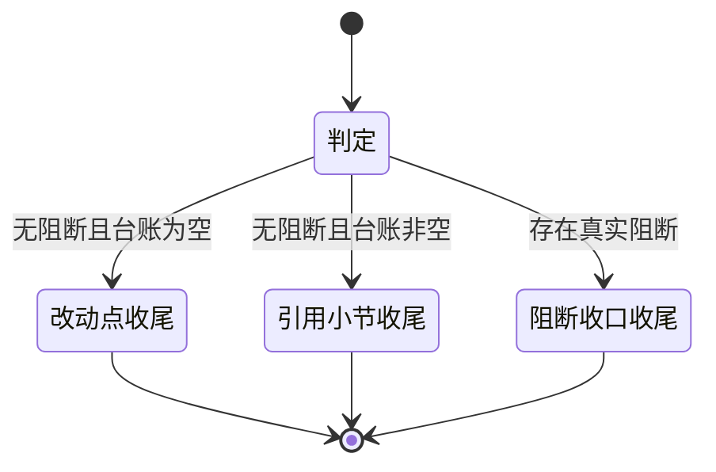

# 总结知识引用清单 实施周期 21：Obsidian 引用可视化

结论：本周期在最终总结末尾新增「知识引用」小节，并要求知识库技能在每次成功读写后立即登记台账，让引用清单来自真实调用证据而不是回忆。影响：所有真实用过知识库的回答，其最终总结的末尾结构会变化。范围：总结技能的说明文件、三份参考文件、一份代理配置，知识库技能的说明文件与一份参考文件，一个新增的规则契约测试，以及技能字典的两个生成物和项目记忆三件套。非范围：知识库桥接脚本、允许命令清单、笔记字段定义、执行案例契约、首条命中检查四态口径、计划模式出口，以及命令行回显中文乱码问题本身。变化：原先禁止为知识库单开小节，现在允许且必要时强制；原先「本次改动点」固定收尾，现在存在引用小节时由引用小节收尾。完成标准：五项完成条件全部有真实测试证据，台账为空时该小节不出现同样被测试锁定。术语说明：`台账` 指本轮会话内部记录读过写过哪些笔记的临时清单，不落盘也不写入知识库；`readback` 指写入笔记后再读回一次以证明确实写进去了；`契约测试` 指用可执行断言检查规则文本是否写到位的测试。验证状态：五个最小任务已逐个闭环，四项真实测试全部通过，风格回归为 `STYLE: PASS`。

## 当前周期最终方案简要说明

本周期不改变总结的整体骨架，只在末尾新增一个条件小节，并把原先散落在两处的知识库单行摘要合并进这个小节。主落点是总结技能的固定顺序定义与三份参考文件，因为它们共同决定执行模型会输出什么结构；同时必须在知识库技能里加一条台账登记约束，否则引用清单只能在收口时凭回忆拼出，会与仓库「严禁脑补工具结果」的硬规则冲突。

## Agent 对当前问题的理解

| 项目 | 结论 |
|---|---|
| 问题/目标 | 用户只能看到一个 `Obsidian:检索` 状态字，看不到本轮到底引用了知识库里的哪些知识 |
| 本周期范围 | 总结技能说明与三份参考文件、代理配置、知识库技能说明与一份参考文件、新增契约测试、字典生成物、四类研发文档、项目记忆三件套 |
| 非范围 | 桥接脚本、命令清单、笔记字段定义、执行案例契约、四态口径、计划模式出口、回显乱码修复 |
| 优先闭环 | 先建立台账契约，再改总结结构，再同步模板与正反例，最后补测试与刷字典 |
| 关键假设 | 知识库保持可用；本轮已实测自检成功且能读取真实笔记 |
| 当前状态 | 五个最小任务均已完成，五项关键取舍已由用户在计划阶段通过选择框全部选定，无未决实现层决策 |
| 最大推进边界 | 只完成本周期五个最小任务；停在已改动未提交状态，不执行任何写入版本历史的动作 |

## 当前周期目标、边界与进入条件

| 项目 | 冻结内容 |
|---|---|
| 周期目标 | 让引用清单从台账登记到末尾渲染形成一条可核验的完整链路，并让"没读没写就不出现"同样成为硬约束 |
| 范围 | `reasoning-summary-structure-rules/SKILL.md`、`agents/openai.yaml`、`references/summary-structure-template.md`、`references/conditional-sections-rules.md`、`references/output-examples.md`、`obsidian-knowledge-flow/SKILL.md`、`obsidian-knowledge-flow/references/capture-retrieve-distill.md`、`test/reasoning-summary-structure-rules/obsidian_citation_contract_test.py`、`skill-dictionary/data.js`、`字典.md`、项目记忆三件套与本周期研发文档 |
| 非范围 | `obsidian_cli_bridge.py`、允许命令清单、`note-schema.md`、`execution-case-notes.md`、`skill-hit-check-rules`、`implementation-planning-rules`、真实业务仓库、版本历史 |
| 进入条件 | `REQ-RSR-OBS-CITATION-001` 已冻结；五项关键取舍已由用户选定；知识库自检本轮已实测成功 |
| 收口条件 | `AC-RSR-CIT-001` 至 `AC-RSR-CIT-005` 全部通过；契约测试全绿；字典刷新成功；四类文档落盘；五个任务的风格回归均为 `STYLE: PASS` |
| 图片资产决策 | 图片资产决策：N/A + 原因：本周期不涉及界面、截图或视觉验收对象 + 证据：任务依赖与末尾顺序变化已由本文两张 Mermaid 图表达 |

## 当前代码/文档基线

| 项目 | 基线 |
|---|---|
| 基线提交 | `142282c merge: [分支合并] 合并origin/main，解决PROJECT_CURRENT/HISTORY/README三处冲突` |
| 工作树状态 | 进入本周期前工作树干净，无未提交改动 |
| 关键基线事实 | 总结技能第 148 行与模板第 198 行明确禁止为知识库单开小节，这两处是本周期必须放宽的对象 |
| 关键基线事实 | 条件字段规则第 36 至 43 行把知识库状态限定为两处单行摘要，本周期整节重写 |
| 关键基线事实 | 项目记忆记录本仓库历史上曾判定 `Obsidian:阻断`，但本轮实测自检成功并读取到真实笔记，该记录已过期需要改写 |
| 关键基线事实 | 检索命令只返回文件名，笔记状态必须靠读取笔记头部拿到，因此未读取的笔记不具备填表所需信息 |
| 关键基线事实 | 命令行回显中文会乱码，因此笔记名必须取自本地发起调用时使用的路径字符串 |

## 文件/符号操作契约

| 序号 | 文件/符号 | 操作 | 契约 |
|---|---|---|---|
| 1 | `doc/2-需求/2026-08-04_总结知识引用清单_Obsidian引用可视化.md` | 新增 | 冻结五项用户决策、八条规则、五项完成条件与追踪矩阵 |
| 2 | `doc/3-实施/2026-08-04_总结知识引用清单_实施周期21_Obsidian引用可视化.md` | 新增 | 本文件；冻结五个最小任务的执行顺序、真实测试与停止条件 |
| 3 | `obsidian-knowledge-flow/SKILL.md` 的检索规则与捕获规则 | 修改 | 各追加台账登记条目；不改固定根目录、四态判定与桥接边界条文 |
| 4 | `obsidian-knowledge-flow/references/capture-retrieve-distill.md` | 修改 | 新增引用台账小节，定义六字段、登记时机与三条硬约束 |
| 5 | `reasoning-summary-structure-rules/SKILL.md` | 修改 | 固定顺序在改动点之后插入知识引用项、阻断收口顺延；放宽单开小节禁令；改写末尾顺序；条件字段判定与发送前自检各加一条；通过与驳回标准补充；小节图标清单补一项；技能说明追加引用清单口径 |
| 6 | `reasoning-summary-structure-rules/agents/openai.yaml` | 修改 | 默认提示词同步引用清单口径，删除两处旧摘要行描述 |
| 7 | `reasoning-summary-structure-rules/references/summary-structure-template.md` | 修改 | 标准样式在改动点之后插入两张表；结构要求同步末尾顺序；删除两处旧摘要行 |
| 8 | `reasoning-summary-structure-rules/references/conditional-sections-rules.md` | 修改 | 第 5 节整节重写为知识引用条件字段；第 1 节改动点位置说明微调 |
| 9 | `reasoning-summary-structure-rules/references/output-examples.md` | 修改 | 正例补引用小节并移除两处旧摘要行；新增一条"未读取却列入引用"反例 |
| 10 | `test/reasoning-summary-structure-rules/obsidian_citation_contract_test.py` | 新增 | 五组断言加编码断言，全部针对仓库内真实规则文本 |
| 11 | `skill-dictionary/data.js`、`字典.md` | 生成 | 由字典脚本刷新，不手工编辑 |
| 12 | `obsidian-knowledge-flow/scripts/obsidian_cli_bridge.py` | 不动 | 桥接行为与允许命令清单保持原样 |
| 13 | `obsidian-knowledge-flow/references/note-schema.md`、`execution-case-notes.md` | 不动 | 笔记字段定义与执行案例契约保持原样 |
| 14 | 总结技能的计划模式排除条款与等待用户决策条文 | 不动 | 必须逐字保持不变 |

### 任务依赖关系

图形目的：说明本周期五个最小任务的先后依赖，解释为什么台账契约必须先于总结结构改写。关联 ID：`T21-01` 至 `T21-05`。

### 末尾顺序的状态变化

图形目的：说明改动前后总结末尾由哪一节收尾，作为顺序类断言的依据。关联 ID：`RULE-RSR-CITATION-002`、`AC-RSR-CIT-001`。

## 周期内最小任务执行顺序

必须逐个闭环：每个任务先实现，再跑自己的真实测试，再做风格回归，通过后才允许推进下一个任务。禁止先做完多个任务再统一验证。

| 顺序 | 任务 ID | 任务 | 文件数 | 依赖 |
|---|---|---|---|---|
| 1 | `T21-01` | 需求与实施周期文档落盘 | 2 | 无 |
| 2 | `T21-02` | 知识库技能引用台账契约 | 2 | `T21-01` 已闭环 |
| 3 | `T21-03` | 总结技能结构与约束改写 | 2 | `T21-02` 已闭环 |
| 4 | `T21-04` | 总结模板、条件规则与正反例同步 | 3 | `T21-03` 已闭环 |
| 5 | `T21-05` | 契约测试补全、字典刷新与记忆同步 | 5 | `T21-04` 已闭环 |

## 最小任务闭环

### T21-01 需求与实施周期文档落盘

| 项目 | 内容 |
|---|---|
| 产出 | 需求主文档与本周期文档，冻结五项用户决策与五个任务边界 |
| 文件/符号 | 操作契约第 1、2 项 |
| 真实测试 | `TEST-RSR-CIT-DOC`：对两份文档分别运行文档完整性校验器的需求与实施周期两个档位 |
| 通过标准 | 两个档位均判定通过；无孤立标识、无未决高优先级项 |
| 失败预期 | 若追踪矩阵存在未被引用的规则或完成条件，校验器报孤立标识并返回非零 |
| 任务完成条件 | 两个档位均通过且文档为 UTF-8 |
| 任务停止条件 | 校验器连续两次判定失败且原因指向校验器自身缺陷，此时停止并转技能演进域 |
| 回滚 | 两份文档均为新增文件，回滚方式为直接删除 |
| 清理 | 无需清理：本任务不创建临时文件 |
| 执行结果 | 已完成。两份文档的 requirement 与 implementation_cycle 两档校验均 `valid=True`、`error_codes=[]`，证据 `EVD-T21-01-TEST` |

### T21-02 知识库技能引用台账契约

| 项目 | 内容 |
|---|---|
| 产出 | 台账六字段定义、立即登记时机与三条硬约束 |
| 文件/符号 | 操作契约第 3、4 项 |
| 真实测试 | `TEST-RSR-CIT-001` 的台账组断言 |
| 通过标准 | 两份文件同时含六个字段名、"立即登记"、"未读取不得入表"、"不使用回显文本"四项表述 |
| 失败预期 | 若只在参考文件写台账而技能说明未提，断言会因技能说明缺少入口而失败 |
| 任务完成条件 | 台账组断言全绿，且风格回归为 `STYLE: PASS` |
| 任务停止条件 | 发现台账语义与执行案例笔记的状态事件契约冲突，此时停止并先做边界裁决 |
| 回滚 | 两个文件均为文本改动，回滚方式为 `git checkout -- obsidian-knowledge-flow/` |
| 清理 | 无需清理：不创建临时文件，不写入知识库 |
| 执行结果 | 已完成。契约测试台账组六项全绿，证据 `EVD-T21-02-TEST` |

### T21-03 总结技能结构与约束改写

| 项目 | 内容 |
|---|---|
| 产出 | 固定顺序第 9 项、放宽后的禁令、新的末尾顺序、条件字段判定项、发送前自检项、驳回标准与技能说明 |
| 文件/符号 | 操作契约第 5、6 项 |
| 真实测试 | `TEST-RSR-CIT-001` 的顺序组与禁令组断言 |
| 通过标准 | 固定顺序中知识引用位于改动点之后、阻断收口之前；旧禁令表述在全仓已不存在；技能说明含引用清单口径 |
| 失败预期 | 若只插入知识引用项但未顺延阻断收口，顺序组断言会因阻断收口不是最后一项而失败 |
| 任务完成条件 | 顺序组与禁令组断言全绿，计划模式排除条款逐字未变，且风格回归为 `STYLE: PASS` |
| 任务停止条件 | 改写与其它收口闸门技能引用的旧顺序冲突，此时停止并先裁决职责边界 |
| 回滚 | 两个文件均为文本改动，回滚方式为 `git checkout -- reasoning-summary-structure-rules/SKILL.md reasoning-summary-structure-rules/agents/openai.yaml` |
| 清理 | 无需清理：不创建临时文件 |
| 执行结果 | 已完成。顺序组与禁令组共八项全绿，计划模式排除条款逐字核验未变，证据 `EVD-T21-03-TEST` |

### T21-04 总结模板、条件规则与正反例同步

| 项目 | 内容 |
|---|---|
| 产出 | 模板两张表、条件字段规则整节重写、正反例同步 |
| 文件/符号 | 操作契约第 7、8、9 项 |
| 真实测试 | `TEST-RSR-CIT-001` 的模板组与样例组断言 |
| 通过标准 | 三份文件含新小节与两张表的固定表头；两处旧摘要行在三份文件中均已消失；正反例各至少一处引用小节样例 |
| 失败预期 | 若模板保留了旧的沉淀摘要行，样例组断言会因同一事实两处重复而失败 |
| 任务完成条件 | 模板组与样例组断言全绿，且风格回归为 `STYLE: PASS` |
| 任务停止条件 | 模板与正反例出现无法同时满足的顺序要求，此时停止并回到 `T21-03` 修正顺序定义 |
| 回滚 | 三个文件均为文本改动，回滚方式为 `git checkout -- reasoning-summary-structure-rules/references/` |
| 清理 | 无需清理：不创建临时文件 |
| 执行结果 | 已完成。契约测试全量二十项全绿，证据 `EVD-T21-04-TEST` |

### T21-05 契约测试补全、字典刷新与记忆同步

| 项目 | 内容 |
|---|---|
| 产出 | 完整契约测试、刷新后的字典生成物、测试说明、风格回归记录与项目记忆三件套同步 |
| 文件/符号 | 操作契约第 10、11 项，另加测试说明、风格回归记录与项目记忆三件套 |
| 真实测试 | `TEST-RSR-CIT-002` 字典刷新与 `TEST-RSR-CIT-003` 知识库实机验证 |
| 通过标准 | 契约测试全绿；字典脚本退出码为零且两个生成物已更新、无新增缺项；实机验证渲染出至少一条引用条目且笔记名与状态映射正确 |
| 失败预期 | 若技能说明改了但忘记刷字典，字典生成物与技能说明不一致；若台账为空却渲染出小节，实机验证会暴露空表 |
| 任务完成条件 | 契约测试与字典刷新全部通过，实机验证通过或按停止条件降级为受限项，且风格回归为 `STYLE: PASS` |
| 任务停止条件 | 实机验证因知识库不可达而阻断，此时记为受限项写入项目当前状态的门禁说明，契约测试与字典刷新仍必须通过，不得宣称已实机验证 |
| 回滚 | 测试文件为新增可直接删除，字典生成物可重跑脚本恢复，文档与记忆改动可用 `git checkout -- <文件>` 回滚 |
| 清理 | 实机验证若创建了临时笔记，由用户决定是否保留，不自动删除知识库内容 |
| 执行结果 | 已完成。字典脚本退出码 0 且两个生成物含新口径，知识库实机验证读取与写入均 `verified=true`，证据 `EVD-T21-05-TEST` |

## 真实测试与断言

| 测试 ID | 入口 | 依赖环境 | 样本来源 | 通过标准 |
|---|---|---|---|---|
| `TEST-RSR-CIT-DOC` | 文档完整性校验器的需求与实施周期两个档位 | 本地 Python，无外部服务 | 本周期两份新增文档 | 两个档位均判定通过，无孤立标识 |
| `TEST-RSR-CIT-001` | `test/reasoning-summary-structure-rules/obsidian_citation_contract_test.py` | 本地 Python，无外部服务 | 仓库内七份真实规则文件文本 | 台账、顺序、禁令、模板、样例五组断言与编码断言全绿 |
| `TEST-RSR-CIT-002` | `skill-dictionary/generate_dictionary.py` | 本地 Python，无外部服务 | 全仓技能说明文件的头部字段与二级标题 | 退出码为零；两个生成物已更新；总结技能条目含新说明；无新增缺项 |
| `TEST-RSR-CIT-003` | 知识库桥接的自检、检索与读取命令，随后按新模板产出一次真实总结 | Obsidian 1.12.7 以上安装版、命令行接口已启用、固定根目录已注册 | 知识库内真实笔记 `知识库/INDEX.md` | 引用小节渲染出至少一条条目，笔记名与状态映射正确；台账为空时该小节不出现 |

免测边界：N/A + 原因：本周期改变总结输出结构契约与台账登记时机，属于会影响运行结果的行为变更 + 证据：四项测试均为真实运行，构建、静态检查与人工阅读不计入通过标准。

## 当前周期验证矩阵

| AC | 判定入口 | 真实测试 | 结果 | 证据 |
|---|---|---|---|---|
| `AC-RSR-CIT-001` | 契约测试顺序组 | `TEST-RSR-CIT-001` | 通过 | `EVD-T21-03-TEST` |
| `AC-RSR-CIT-002` | 契约测试禁令组与样例组 | `TEST-RSR-CIT-001` | 通过 | `EVD-T21-03-TEST`、`EVD-T21-04-TEST` |
| `AC-RSR-CIT-003` | 契约测试模板组 | `TEST-RSR-CIT-001` | 通过 | `EVD-T21-04-TEST` |
| `AC-RSR-CIT-004` | 契约测试台账组 | `TEST-RSR-CIT-001` | 通过 | `EVD-T21-02-TEST` |
| `AC-RSR-CIT-005` | 字典生成脚本 | `TEST-RSR-CIT-002` | 通过 | `EVD-T21-05-TEST` |

## 周期阻断、停止与回滚

| 项目 | 内容 |
|---|---|
| 阻断项 | 无。本周期不依赖数据库、缓存或第三方服务；知识库自检本轮已实测成功 |
| 周期停止条件 | 任一最小任务的真实测试无法通过且原因指向需求口径本身，此时必须回到需求阶段而不是放宽断言 |
| 周期停止条件 | 放宽旧禁令后与其它收口闸门技能产生职责冲突，必须先裁决边界再继续 |
| 回滚范围 | 本周期共十一个改动文件加三份记忆文件，全部为文本或可重生成产物，可用 `git checkout -- <文件>` 逐个回滚到基线提交 |
| 回滚验证 | 回滚后必须重跑契约测试与字典脚本，确认恢复到基线结论 |
| 最大推进边界 | 只完成本周期五个最小任务；不改桥接脚本、命令清单、笔记字段定义与计划模式出口；不迁移真实业务仓库；不执行任何写入版本历史的动作 |

## 自审结论

| 检查项 | 结论 |
|---|---|
| 任务是否逐个闭环 | 是。五个任务按顺序各自完成实现、真实测试与风格回归后才推进下一个 |
| 真实测试是否为真实运行 | 是。四项测试均实际执行并留下退出码与用例数，未以构建或静态检查替代 |
| 改动是否越界 | 未越界。十一个文件全部在操作契约内，桥接脚本与笔记字段定义确认不动 |
| 是否引入本轮残留 | 无。不产生未使用的导入、变量或孤儿文件 |
| 追踪链是否闭合 | 是。需求追踪矩阵的五条链路在本文验证矩阵中均有对应入口与证据 |
| unresolved_decisions | 无未决决策。五项关键取舍已在计划阶段由用户选定 |
| 提交状态 | 停在已改动未提交状态。本轮未获提交授权，不执行任何写入版本历史的动作 |
