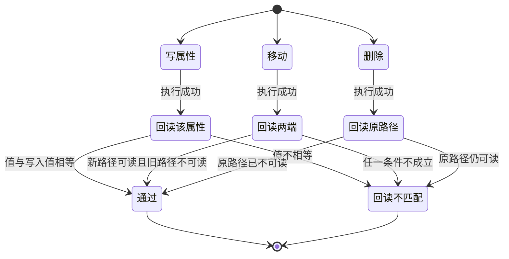

# 知识库可迭代更新 实施周期 22：bridge 能力扩展

结论：本周期给知识库桥接补上八个命令，让它从"只能读和追加"变成能改笔记头部属性、移动笔记、删除笔记和枚举全库。影响：桥接的调用面从八个命令扩到十六个，三类写操作各自带回读验证。范围：桥接脚本、Windows 适配器、命令模板、验证清单，以及一个新增的参数校验测试。非范围：冲突处置规则、写入前判定、巡检脚本、笔记字段定义，这些留给第二期；也不改分块写入与既有创建追加的回读逻辑。变化：白名单从八个命令扩到十六个；新增三类写操作的回读判据；执行失败案例目录被硬性保护，禁止移动与删除。完成标准：四项完成条件全部有真实测试证据，八个命令实机可用。术语说明：`回读验证` 指写入后再读一次以证明确实写成功；`白名单` 指桥接允许透传给官方命令行的命令集合；`执行失败案例笔记` 指记录工具执行失败经验的一类特殊笔记，用追加方式维护历史证据。验证状态：三个最小任务已逐个闭环，八个命令实机可用，风格回归为 `STYLE: PASS`。

## 当前周期最终方案简要说明

本周期不改变桥接的整体结构，只在三个位置扩展：白名单常量、参数校验分支、适配器的操作分支。主落点是这三处，因为它们共同决定桥接允许做什么、参数怎么校验、写入后怎么验证。之所以先做能力再做规则，是因为现在连"把旧笔记标记为已废弃"都做不到——追加只能往文件末尾写，改不了笔记头部的状态字段。

## Agent 对当前问题的理解

| 项目 | 结论 |
|---|---|
| 问题/目标 | 桥接缺少修改元数据、移动、删除和枚举能力，导致治理规则无法执行 |
| 本周期范围 | 桥接脚本、Windows 适配器、命令模板、验证清单、新增参数校验测试 |
| 非范围 | 冲突处置规则、写入前判定、巡检脚本、笔记字段定义、分块写入与既有回读逻辑 |
| 优先闭环 | 先钉死参数形态并打通只读组，再打通写操作组与回读，最后同步文档 |
| 关键假设 | 八个命令的参数形态已实机实测，执行时直接采用，不需要再试 |
| 当前状态 | 参数形态实测已完成，三个最小任务待执行 |
| 最大推进边界 | 只完成本周期三个最小任务；停在已改动未提交状态，不执行任何写入版本历史的动作 |

## 当前周期目标、边界与进入条件

| 项目 | 冻结内容 |
|---|---|
| 周期目标 | 桥接具备改属性、移动、删除、枚举四类能力，且每次写入都有可验证的回读 |
| 范围 | `obsidian_cli_bridge.py`、`obsidian_cli_windows.ps1`、`references/cli-operations.md`、`references/validation-checklist.md`、`test/obsidian-knowledge-flow/bridge_request_contract_test.py` |
| 非范围 | `conflict-staleness.md`、`capture-retrieve-distill.md`、`note-schema.md`、`execution-case-notes.md`、`vault-layout.md`、巡检脚本、技能主入口、字典生成物 |
| 进入条件 | 需求已冻结；八命令参数形态已实机实测；桥接自检返回成功且已验证 |
| 收口条件 | 三个最小任务逐个闭环；`AC-OBS-KB-001` 至 `AC-OBS-KB-003` 与 `AC-OBS-KB-008` 全部通过；三个任务的风格回归均为 `STYLE: PASS` |
| 图片资产决策 | 图片资产决策：N/A + 原因：本周期不涉及界面、截图或视觉验收对象 + 证据：任务依赖与写操作回读判据已由本文两张 Mermaid 图表达 |

## 当前代码/文档基线

| 项目 | 基线 |
|---|---|
| 基线提交 | `142282c merge: [分支合并] 合并origin/main，解决PROJECT_CURRENT/HISTORY/README三处冲突` |
| 工作树状态 | 进入本周期前工作树含上一周期已改动未提交的内容，本周期只在其上新增改动，不回滚既有改动 |
| 关键基线事实 | 白名单常量在 `obsidian_cli_bridge.py:23`，当前只有八个命令 |
| 关键基线事实 | 参数校验集中在 `build_request`，路径型命令集合在第 275 行，写入内容校验在第 277 行 |
| 关键基线事实 | 命令行入口参数在 `parse_args`，当前只有路径、正文文件、查询、条数、项目路径与发行版 |
| 关键基线事实 | 适配器的允许操作列表在 `obsidian_cli_windows.ps1:15`，操作分支在 `Invoke-VaultOperation` |
| 关键基线事实 | 适配器已记录一条踩坑：当前命令行版本的读取与打开只接受 `file=`，传 `path=` 会返回退出码为零的错误载荷；创建与追加则用 `path=` |
| 关键基线事实 | 执行失败案例目录前缀常量已存在于 `obsidian_cli_bridge.py:25`，可直接复用做保护判断 |
| 关键基线事实 | 本周期开头实测：八个新命令全部接受 `path=`；写属性会保留其余头部属性与中文；移动的目标目录必须已存在；删除返回移入回收站并已在 Windows 回收站中找到 |

## 文件/符号操作契约

| 序号 | 文件/符号 | 操作 | 契约 |
|---|---|---|---|
| 1 | `doc/2-需求/2026-08-05_知识库可迭代更新_冲突取代与废弃治理.md` | 新增 | 冻结五项用户决策、十四条规则、八项完成条件与追踪矩阵 |
| 2 | `doc/3-实施/2026-08-05_知识库可迭代更新_实施总览.md` | 新增 | 两期总执行顺序、阶段计划与七个最小任务索引 |
| 3 | `doc/3-实施/2026-08-05_知识库可迭代更新_实施周期22_bridge能力扩展.md` | 新增 | 本文件；冻结第一期三个最小任务的执行顺序、真实测试与停止条件 |
| 4 | `obsidian_cli_bridge.py` 的 `ALLOWED_COMMANDS` | 修改 | 新增八个命令名，保持既有八个不变 |
| 5 | `obsidian_cli_bridge.py` 的 `build_request` | 修改 | 新增路径型命令、写属性参数、移动目标、枚举目录的校验分支；复用 `validate_knowledge_path`；执行案例目录拒绝移动与删除 |
| 6 | `obsidian_cli_bridge.py` 的 `parse_args` 与 `main` | 修改 | 新增属性名、属性值、属性类型、移动目标、枚举目录五个入口参数并透传 |
| 7 | `obsidian_cli_windows.ps1` 的 `$AllowedOperations` 与 `Assert-Request` | 修改 | 同步允许操作列表；路径校验集合扩展到新增路径型命令 |
| 8 | `obsidian_cli_windows.ps1` 的 `Invoke-VaultOperation` | 修改 | 新增只读分支直接回传输出；新增三个写分支及各自回读；不改分块写入与既有创建追加回读 |
| 9 | `references/cli-operations.md` | 修改 | 新增八条命令模板、参数形态实测结论、三类回读语义与两条边界 |
| 10 | `references/validation-checklist.md` | 修改 | 新增只读组、写操作组与执行案例保护三项验证，并同步证据映射表 |
| 11 | `test/obsidian-knowledge-flow/bridge_request_contract_test.py` | 新增 | 只读组、写操作组、文档组三类断言，不依赖知识库 |
| 12 | `obsidian_cli_bridge.py` 的分块与既有创建追加逻辑 | 不动 | 正文分块、隐含换行与既有回读比对保持原样 |
| 13 | `references/execution-case-notes.md` | 不动 | 追加式契约文本必须逐字不变 |

### 任务依赖关系

图形目的：说明本周期三个最小任务的先后依赖，解释为什么只读组必须先于写操作组。关联 ID：`T22-01` 至 `T22-03`。

### 三类写操作的回读判据

图形目的：说明每类写操作执行后如何验证，作为适配器实现与实机测试断言的共同依据。关联 ID：`RULE-OBS-CAP-002`、`AC-OBS-KB-002`。

## 周期内最小任务执行顺序

必须逐个闭环：每个任务先实现，再跑自己的真实测试，再做风格回归，通过后才允许推进下一个任务。禁止先做完多个任务再统一验证。

| 顺序 | 任务 ID | 任务 | 文件数 | 依赖 |
|---|---|---|---|---|
| 1 | `T22-01` | 需求与周期文档落盘、参数形态实测、只读组五命令 | 5 | 无 |
| 2 | `T22-02` | 写操作组三命令与回读 | 3 | `T22-01` 已闭环 |
| 3 | `T22-03` | 命令模板与验证清单同步 | 2 | `T22-02` 已闭环 |

## 最小任务闭环

### T22-01 需求与周期文档落盘、参数形态实测、只读组五命令

| 项目 | 内容 |
|---|---|
| 产出 | 三份研发文档；八命令参数形态实测结论；桥接与适配器支持读属性、读整篇属性、查反向链接、枚举文件、枚举孤儿五个只读命令 |
| 文件/符号 | 操作契约第 1、2、3、4、5、6、7、8 项中与只读命令相关的部分 |
| 真实测试 | `TEST-OBS-KB-001`：参数校验单元测试只读组，加五条桥接只读实机命令 |
| 通过标准 | 单测全绿；五条实机命令均返回成功且数据与直连命令行一致；三份文档校验通过 |
| 失败预期 | 若只读命令未加入白名单，桥接会以参数错误码拒绝；若路径校验集合漏加，适配器会因缺少规范化路径而失败 |
| 任务完成条件 | 只读组断言全绿、五条实机命令通过、三份文档校验通过，且风格回归为 `STYLE: PASS` |
| 任务停止条件 | 某命令在当前命令行版本既不接受 `path=` 也不接受 `file=`，此时停止并把该命令移出本轮范围，在本文记为受限项 |
| 回滚 | 脚本改动用 `git checkout -- obsidian-knowledge-flow/scripts/` 回滚；三份文档为新增可直接删除 |
| 清理 | 删除参数形态实测使用的一次性测试笔记，并核对知识库文件总数与孤儿数复原 |
| 执行结果 | 已完成。参数形态实测记入基线；三份文档校验通过；只读组五命令单测 6 项与五条实机命令全部通过，证据 `EVD-T22-01-TEST` |

### T22-02 写操作组三命令与回读

| 项目 | 内容 |
|---|---|
| 产出 | 桥接与适配器支持写属性、移动、删除三个命令，各自带回读验证；执行失败案例目录被拒绝移动与删除 |
| 文件/符号 | 操作契约第 4、5、6、7、8、11 项中与写操作相关的部分 |
| 真实测试 | `TEST-OBS-KB-002`：参数校验单元测试写操作组，加一次性测试笔记的完整实机链路 |
| 通过标准 | 单测全绿；实机链路创建、写属性、回读、移动、验证两端、删除、验证不可读各步均成功；执行案例路径的移动与删除被拒 |
| 失败预期 | 若写属性缺少属性值校验，桥接会把空值透传给命令行并写坏笔记；若删除透传永久参数，文件将无法从回收站恢复 |
| 任务完成条件 | 写操作组断言全绿、实机链路全部步骤通过，且风格回归为 `STYLE: PASS` |
| 任务停止条件 | 删除在当前命令行版本不进回收站而是直接永久删除，此时立即停止并把删除降级为受限项，改由移动到归档目录承担最重处置 |
| 回滚 | 脚本改动用 `git checkout -- obsidian-knowledge-flow/scripts/` 回滚；若实机误删生产笔记，从 Windows 回收站恢复；移动过的笔记移回原路径 |
| 清理 | 实机链路以删除收尾，测试笔记自然清除；回收站条目由用户决定是否清空 |
| 执行结果 | 已完成。写操作组单测 7 项全绿；实机链路 14 步全部成功，含执行案例路径被拒；发现并修正回读探测误用宽松模式的缺陷，证据 `EVD-T22-02-TEST` |

### T22-03 命令模板与验证清单同步

| 项目 | 内容 |
|---|---|
| 产出 | 八条命令模板、参数形态实测结论、三类回读语义、两条边界，以及三项新增验证与证据映射 |
| 文件/符号 | 操作契约第 9、10 项 |
| 真实测试 | `TEST-OBS-KB-003`：参数校验单元测试文档组 |
| 通过标准 | 文档组断言全绿；命令模板列举的白名单与脚本常量逐项一致 |
| 失败预期 | 若文档漏写某个新命令，断言会因文档列举与脚本常量集合不等而失败 |
| 任务完成条件 | 文档组断言全绿，且风格回归为 `STYLE: PASS` |
| 任务停止条件 | 文档与脚本白名单无法对齐，此时回到 `T22-01` 或 `T22-02` 修正脚本，而不是放宽文档 |
| 回滚 | `git checkout -- obsidian-knowledge-flow/references/` |
| 清理 | 无需清理：本任务不创建临时文件，不写入知识库 |
| 执行结果 | 已完成。文档组 3 项全绿；命令模板与白名单 16 项逐项一致，顺带补齐既有缺失的 `project-context` 模板，证据 `EVD-T22-03-TEST` |

## 真实测试与断言

| 测试 ID | 入口 | 依赖环境 | 样本来源 | 通过标准 |
|---|---|---|---|---|
| `TEST-OBS-KB-001` | `python -X utf8 -m unittest discover -s test/obsidian-knowledge-flow -p bridge_request_contract_test.py -k readonly`，加五条桥接只读实机命令 | Windows Git Bash 与仓库 Python；实机部分需应用运行且固定根已注册 | 单测用构造参数；实机用真实知识库与一次性测试笔记 | 单测全绿；实机命令成功且与直连命令行数据一致 |
| `TEST-OBS-KB-002` | 同上 `-k write`，加一次性测试笔记四步实机链路 | 同上 | 一次性系统测试目录下的临时笔记 | 单测全绿；四步链路每步成功且回读通过；执行案例路径被拒 |
| `TEST-OBS-KB-003` | 同上 `-k docs` | 本地 Python，无需知识库 | 命令模板、验证清单与桥接脚本常量 | 文档列举与脚本白名单逐项一致；三类回读语义与两条边界在位 |

免测边界：N/A + 原因：本周期改动桥接脚本的可执行行为，属于会改变运行结果的实现变更 + 证据：三项测试均为真实运行，构建与静态检查不计入通过标准。

实机边界：写操作只允许落一次性系统测试目录并以删除收尾自清理；禁止在知识目录或实体目录做写测试。知识库不可达时实机部分记为受限项并显式标注，单元测试部分仍必须通过。

## 当前周期验证矩阵

| AC | 判定入口 | 真实测试 | 结果 | 证据 |
|---|---|---|---|---|
| `AC-OBS-KB-001` | 参数校验单元测试只读组与写操作组 | `TEST-OBS-KB-001`、`TEST-OBS-KB-002` | 通过 | `EVD-T22-01-TEST`、`EVD-T22-02-TEST` |
| `AC-OBS-KB-002` | 一次性测试笔记的实机链路 | `TEST-OBS-KB-002` | 通过 | `EVD-T22-02-TEST` |
| `AC-OBS-KB-003` | 执行案例路径的移动与删除拒绝断言 | `TEST-OBS-KB-002` | 通过 | `EVD-T22-02-TEST` |
| `AC-OBS-KB-008` | 文档组断言直接解析脚本常量比对 | `TEST-OBS-KB-003` | 通过 | `EVD-T22-03-TEST` |

## 周期阻断、停止与回滚

| 项目 | 内容 |
|---|---|
| 阻断项 | 无。本周期不依赖网络、数据库或第三方服务；知识库已实测可用 |
| 周期停止条件 | 某命令参数形态无法工作，或删除不进回收站，此时按对应最小任务的停止条件降级并记为受限项 |
| 周期停止条件 | 新增校验与既有分块写入或创建追加回读发生冲突，必须先裁决边界再继续 |
| 回滚范围 | 本周期共两个脚本、两份参考文件、一个新增测试与三份新增文档；脚本与参考文件用 `git checkout --` 回滚，新增文件直接删除 |
| 回滚验证 | 回滚后必须重跑桥接自检与既有创建追加实机命令，确认恢复到本周期基线行为 |
| 最大推进边界 | 只完成本周期三个最小任务；不改冲突规则、写入前判定、巡检脚本与笔记字段定义；不新增八命令之外的子命令；不执行任何写入版本历史的动作 |

## 自审结论

| 检查项 | 结论 |
|---|---|
| unresolved_decisions | 无未决决策。五项关键取舍已在计划阶段由用户选定 |
| 任务是否逐个闭环 | 是。三个任务按顺序各自完成实现、真实测试与风格回归后才推进下一个 |
| 真实测试是否为真实运行 | 是。三项测试均为可执行入口，未以构建或静态检查替代 |
| 改动是否越界 | 未越界。所有改动落在操作契约十三项之内，执行案例契约确认不动 |
| 是否引入本轮残留 | 待收口核对。要求不产生未使用的导入、变量、函数或孤儿文件 |
| 追踪链是否闭合 | 是。需求追踪矩阵中归属本周期的三条链路在本文验证矩阵中均有对应入口与证据 |
| 提交状态 | 停在已改动未提交状态。本轮未获提交授权，不执行任何写入版本历史的动作 |
