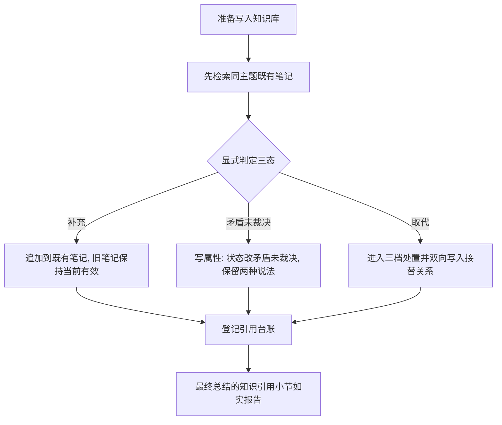

# 知识库可迭代更新 实施周期 23：迭代治理规则

结论：本周期把「不要删除」这条旧规则改写为三档处置，把冲突判定前移到每次写入之前，并交付一个只读巡检脚本清理已积压的历史冲突。影响：所有向知识库写入的动作都会多一道判定；已取代和已归档的笔记不再被当作当前事实。范围：冲突与过期规则、捕获与沉淀流程、笔记字段定义、技能主入口与代理配置、一个新增巡检脚本、一个新增巡检测试、字典生成物与项目记忆。非范围：桥接脚本与适配器，第一期已完成；执行失败案例笔记契约；知识库目录布局；现存积压笔记的批量清理。变化：冲突流程第五步由"标记但不删除"改为按剩余价值分三档；笔记头部新增双向接替关系字段；写入前必须显式判定补充、矛盾未裁决或取代之一。完成标准：四项完成条件全部有真实测试证据，巡检脚本对真实知识库出报告且零写入。术语说明：`三档处置` 指按旧笔记剩余价值分别执行改状态、移到归档目录或删除；`接替关系` 指新旧笔记之间双向记录的取代指向；`巡检` 指只读扫描知识库并输出待清理候选，不做任何修改。验证状态：四个最小任务已逐个闭环，三档处置已在真实笔记上演练成功，风格回归为 `STYLE: PASS`。

## 当前周期最终方案简要说明

本周期只改规则文本和新增一个只读脚本，不动桥接。主落点是 `conflict-staleness.md` 的冲突流程第五步和 `capture-retrieve-distill.md` 的捕获流程第三步：前者把"不要删除"改成三档判据，后者把冲突判定从"发现矛盾时才处理"改成"每次写入前必须显式判定"。之所以配一个只读巡检脚本，是因为规则只能管住以后的新增，已经积压的 41 篇孤儿笔记和潜在冲突需要一次性捞出来。

## Agent 对当前问题的理解

| 项目 | 结论 |
|---|---|
| 问题/目标 | 旧规则明确禁止删除，导致废弃笔记只能持续堆积；冲突判定是被动的，依赖 agent 自己注意到 |
| 本周期范围 | 冲突与过期规则、捕获与沉淀流程、笔记字段定义、技能主入口与代理配置、巡检脚本与其测试、字典生成物、测试与风格回归文档、项目记忆三件套 |
| 非范围 | 桥接脚本与适配器、执行案例笔记契约、知识库目录布局、批量清理现存孤儿笔记 |
| 优先闭环 | 先定字段与三档判据，再把判定前移，再交付巡检脚本，最后全局收口 |
| 关键假设 | 第一期已交付写属性、移动、删除、枚举四类能力，三档处置有执行手段 |
| 当前状态 | 四个最小任务均已完成，并用真实笔记演练了「标记取代」档处置 |
| 最大推进边界 | 只完成本周期四个最小任务；停在已改动未提交状态，不批量清理现存孤儿笔记 |

## 当前周期目标、边界与进入条件

| 项目 | 冻结内容 |
|---|---|
| 周期目标 | 三档处置与写入前冲突判定成为强制规则，并交付只读巡检报告能力 |
| 范围 | `references/conflict-staleness.md`、`references/capture-retrieve-distill.md`、`references/note-schema.md`、`obsidian-knowledge-flow/SKILL.md`、`agents/openai.yaml`、`scripts/audit_vault_knowledge.py`、`test/obsidian-knowledge-flow/vault_audit_contract_test.py`、字典生成物、项目记忆三件套与本周期研发文档 |
| 非范围 | `obsidian_cli_bridge.py`、`obsidian_cli_windows.ps1`、`execution-case-notes.md`、`vault-layout.md`、上一周期的总结知识引用小节口径 |
| 进入条件 | 第一期已收口，八个命令实机可用；`AC-OBS-KB-001` 至 `AC-OBS-KB-003` 与 `AC-OBS-KB-008` 已通过 |
| 收口条件 | 四个最小任务逐个闭环；`AC-OBS-KB-004` 至 `AC-OBS-KB-007` 全部通过；字典刷新；六份文档落盘；四个任务的风格回归均为 `STYLE: PASS` |
| 图片资产决策 | 图片资产决策：N/A + 原因：本周期不涉及界面、截图或视觉验收对象 + 证据：任务依赖与写入前判定分流已由本文两张 Mermaid 图表达 |

## 当前代码/文档基线

| 项目 | 基线 |
|---|---|
| 基线提交 | `142282c merge: [分支合并] 合并origin/main，解决PROJECT_CURRENT/HISTORY/README三处冲突` |
| 工作树状态 | 进入本周期前工作树含第一期已改动未提交的内容，本周期只在其上新增改动 |
| 关键基线事实 | 冲突流程第五步在 `conflict-staleness.md:35`，明确写「标记为 `deprecated` 或 `retired`，不要删除」，是本周期必须改写的对象 |
| 关键基线事实 | 状态含义表已定义当前有效、可能过期、矛盾未裁决、已被替代、退役、已归档六种普通状态，本周期复用不重新定义 |
| 关键基线事实 | 捕获流程第三步只说"先检索现有笔记判断是否已有承接位置"，没有要求判定是否矛盾或取代 |
| 关键基线事实 | 笔记通用头部当前没有接替关系字段，`note-schema.md` 必填字段清单需新增两个 |
| 关键基线事实 | 上一周期已在捕获与检索规则各加过一条引用台账登记条目，本周期在其后追加，不覆盖 |
| 关键基线事实 | 知识库当前 65 篇笔记，41 篇无人引用，是巡检脚本的首个真实样本 |
| 关键基线事实 | 执行案例笔记用追加式状态事件表达取代，其契约在 `execution-case-notes.md:86` 规定追加是唯一更新方式；三档处置对其排除，原因是覆盖或删除会破坏历史证据链，证据为该契约条款本身 |

## 文件/符号操作契约

| 序号 | 文件/符号 | 操作 | 契约 |
|---|---|---|---|
| 1 | `doc/3-实施/2026-08-05_知识库可迭代更新_实施周期23_迭代治理规则.md` | 新增 | 本文件；冻结第二期四个最小任务的执行顺序、真实测试与停止条件 |
| 2 | `references/note-schema.md` | 修改 | 通用头部新增接替与被接替两个列表字段；必填字段说明写清被接替字段非空时状态不得为当前有效 |
| 3 | `references/conflict-staleness.md` | 修改 | 冲突流程第五步改写为三档处置；新增处置前置检查、执行案例排除范围与自动化边界三节；状态含义表与脱敏规则不动 |
| 4 | `references/capture-retrieve-distill.md` | 修改 | 捕获流程第三步升级为强制冲突判定；新增迭代更新流程与巡检流程两节；检索规则补充接替跳转 |
| 5 | `obsidian-knowledge-flow/SKILL.md` | 修改 | 目标小节新增迭代循环；捕获规则与检索规则各补一条指向三档处置与接替跳转；技能说明追加迭代治理语义 |
| 6 | `agents/openai.yaml` | 修改 | 默认提示词同步三档处置与写入前判定口径 |
| 7 | `scripts/audit_vault_knowledge.py` | 新增 | 只读巡检；只调用桥接只读命令；输出四类候选；源码内不得出现任何写操作命令 |
| 8 | `test/obsidian-knowledge-flow/vault_audit_contract_test.py` | 新增 | 巡检脚本纯函数断言与只读约束源码扫描 |
| 9 | `skill-dictionary/data.js`、`字典.md` | 生成 | 由字典脚本刷新，不手工编辑 |
| 10 | `PROJECT_CURRENT.md`、`PROJECT_MEMORY.md`、`PROJECT_HISTORY.md` | 修改 | 状态覆盖、稳定规则与机器索引条目、历史事件追加 |
| 11 | `references/execution-case-notes.md` | 不动 | 追加式契约文本必须逐字不变 |
| 12 | `obsidian_cli_bridge.py`、`obsidian_cli_windows.ps1` | 不动 | 第一期已完成，本周期不再改动 |
| 13 | 四态判定与固定根目录条款 | 不动 | `SKILL.md` 中这两处必须逐字保持不变 |

### 任务依赖关系

图形目的：说明本周期四个最小任务的先后依赖，解释为什么字段与判据必须先于判定前移。关联 ID：`T23-01` 至 `T23-04`。

### 写入前判定的三态分流

图形目的：说明每次写入前的三态判定各自触发什么动作，作为规则文本与断言的共同依据。关联 ID：`RULE-OBS-DETECT-001`、`AC-OBS-KB-006`。

## 周期内最小任务执行顺序

必须逐个闭环：每个任务先实现，再跑自己的真实测试，再做风格回归，通过后才允许推进下一个任务。禁止先做完多个任务再统一验证。

| 顺序 | 任务 ID | 任务 | 文件数 | 依赖 |
|---|---|---|---|---|
| 1 | `T23-01` | 接替关系字段与三档处置规则 | 3 | 第一期已收口 |
| 2 | `T23-02` | 写入前强制冲突判定 | 3 | `T23-01` 已闭环 |
| 3 | `T23-03` | 只读巡检脚本 | 2 | `T23-02` 已闭环 |
| 4 | `T23-04` | 主入口、字典、文档与记忆收口 | 5 | `T23-03` 已闭环 |

## 最小任务闭环

### T23-01 接替关系字段与三档处置规则

| 项目 | 内容 |
|---|---|
| 产出 | 笔记头部新增双向接替关系字段；冲突流程第五步改写为三档判据；新增处置前置检查、执行案例排除范围与自动化边界三节 |
| 文件/符号 | 操作契约第 1、2、3 项 |
| 真实测试 | `TEST-OBS-KB-004`：规则契约测试分级组断言 |
| 通过标准 | 「不要删除」已不存在；三档判据、反向链接前置检查、执行案例排除声明、自动化边界四项均在位；两个新字段与"被接替字段非空时状态不得为当前有效"约束均在位 |
| 失败预期 | 若只加字段而未改冲突流程第五步，断言会因旧禁令仍在而失败 |
| 任务完成条件 | 分级组断言全绿，状态含义表与脱敏规则逐字未变，且风格回归为 `STYLE: PASS` |
| 任务停止条件 | 三档判据与执行案例的追加式契约出现语义冲突，此时停止并先裁决边界 |
| 回滚 | `git checkout -- obsidian-knowledge-flow/references/` |
| 清理 | 无需清理：本任务不创建临时文件，不写入知识库 |
| 执行结果 | 已完成。分级组 7 项全绿；「不要删除」已移除，三档判据与四节新增约束在位，证据 `EVD-T23-01-TEST` |

### T23-02 写入前强制冲突判定

| 项目 | 内容 |
|---|---|
| 产出 | 捕获流程第三步升级为三态判定；新增迭代更新流程与巡检流程两节；检索规则补充接替跳转；技能主入口新增迭代循环 |
| 文件/符号 | 操作契约第 4、5 项 |
| 真实测试 | `TEST-OBS-KB-005`：规则契约测试检测组断言 |
| 通过标准 | 三态判定、双向接替关系、接替跳转、迭代循环四项均在位；四态判定与固定根目录条款文本逐字未变 |
| 失败预期 | 若只在参考文件写判定而技能主入口未提，断言会因缺少入口而失败 |
| 任务完成条件 | 检测组断言全绿，且风格回归为 `STYLE: PASS` |
| 任务停止条件 | 新增迭代循环与既有检索、捕获、沉淀、学习四条循环职责重叠不清，此时停止并先划清边界 |
| 回滚 | `git checkout -- obsidian-knowledge-flow/` |
| 清理 | 无需清理：本任务不创建临时文件，不写入知识库 |
| 执行结果 | 已完成。检测组 6 项全绿；四态判定与固定根目录条款经断言核验逐字未变，证据 `EVD-T23-02-TEST` |

### T23-03 只读巡检脚本

| 项目 | 内容 |
|---|---|
| 产出 | 只读巡检脚本，输出同主题候选冲突组、状态非当前有效、孤儿笔记、标了已取代但缺接替者四类候选；配套纯函数与只读约束测试 |
| 文件/符号 | 操作契约第 7、8 项 |
| 真实测试 | `TEST-OBS-KB-006`：巡检组断言，加对真实知识库跑一次完整巡检 |
| 通过标准 | 源码扫描确认无写操作命令字面量；纯函数单测全绿；实跑返回四类候选计数，且巡检前后文件总数与孤儿数不变 |
| 失败预期 | 若脚本误用写属性或删除命令，源码扫描断言会直接失败；若巡检改动了笔记，前后计数比对会失败 |
| 任务完成条件 | 巡检组断言全绿、真实知识库实跑出报告且零写入，且风格回归为 `STYLE: PASS` |
| 任务停止条件 | 逐篇读属性对 65 篇笔记耗时超过五分钟，此时停止并把巡检降级为按目录分批，不做全库单次扫描 |
| 回滚 | 两个文件均为新增，可直接删除 |
| 清理 | 报告只输出到标准输出，不落盘知识库；无临时文件 |
| 执行结果 | 已完成。巡检单测 11 项全绿；真实知识库实跑 64 秒出四类候选，前后 65/41 不变，证据 `EVD-T23-03-TEST` |

### T23-04 主入口、字典、文档与记忆收口

| 项目 | 内容 |
|---|---|
| 产出 | 技能说明与代理配置同步迭代治理语义；刷新后的字典生成物；测试证据与风格回归文档；项目记忆三件套同步 |
| 文件/符号 | 操作契约第 5、6、9、10 项，另加测试证据与风格回归文档 |
| 真实测试 | `TEST-OBS-KB-007`：全量契约测试、字典生成脚本与六档文档校验 |
| 通过标准 | 全量断言全绿；字典退出码为零且两个生成物含新技能说明、缺项数无新增；六档文档校验全部通过；项目当前状态文件不超过五万一千两百字节且机器索引区可解析 |
| 失败预期 | 若技能说明改了但忘记刷字典，字典生成物与技能说明不一致 |
| 任务完成条件 | 全部断言与门禁通过、风格回归为 `STYLE: PASS`、项目记忆三件套已同步 |
| 任务停止条件 | 项目当前状态文件逼近字节上限，此时先压缩历史段再写入，不静默截断 |
| 回滚 | `git checkout -- .`（未提交前有效）；字典生成物可重跑脚本恢复 |
| 清理 | 无需清理：本任务不创建临时文件 |
| 执行结果 | 已完成。字典退出码 0 且缺项数与基线一致；六档文档校验全部通过；60 项断言全绿，证据 `EVD-T23-04-TEST` |

## 真实测试与断言

| 测试 ID | 入口 | 依赖环境 | 样本来源 | 通过标准 |
|---|---|---|---|---|
| `TEST-OBS-KB-004` | `python -X utf8 -m unittest discover -s test/obsidian-knowledge-flow -p bridge_request_contract_test.py -k grading` | 本地 Python，无需知识库 | 冲突规则与笔记字段定义文本 | 旧禁令已消失；三档判据、前置检查、排除范围、自动化边界与两个新字段全部在位 |
| `TEST-OBS-KB-005` | 同上 `-k detect` | 本地 Python，无需知识库 | 捕获与沉淀流程、技能主入口文本 | 三态判定、双向接替、接替跳转与迭代循环在位；四态判定与固定根目录条款逐字未变 |
| `TEST-OBS-KB-006` | `python -X utf8 -m unittest discover -s test/obsidian-knowledge-flow -p vault_audit_contract_test.py`，加 `python obsidian-knowledge-flow/scripts/audit_vault_knowledge.py --json` | 单测无需知识库；实跑需知识库可用 | 单测用构造头部数据；实跑用真实 65 篇笔记 | 源码零写操作字面量；纯函数单测全绿；实跑出四类候选且前后文件总数与孤儿数不变 |
| `TEST-OBS-KB-007` | `python skill-dictionary/generate_dictionary.py`，加六档文档校验，加全量单元测试 | 本地 Python | 全仓技能说明与本轮六份研发文档 | 字典退出码为零且缺项数无新增；六档校验全部通过；全量断言全绿 |

免测边界：N/A + 原因：本周期改动知识库写入语义并新增可执行巡检脚本，属于会改变运行结果的实现变更 + 证据：四项测试均为真实运行，构建与静态检查不计入通过标准。

实机边界：本周期不做知识库写操作；巡检脚本对真实知识库只读，实跑前后必须核对文件总数与孤儿数不变。知识库不可达时巡检实跑记为受限项并显式标注，单元测试部分仍必须通过。

## 当前周期验证矩阵

| AC | 判定入口 | 真实测试 | 结果 | 证据 |
|---|---|---|---|---|
| `AC-OBS-KB-004` | 规则契约测试分级组 | `TEST-OBS-KB-004` | 通过 | `EVD-T23-01-TEST` |
| `AC-OBS-KB-005` | 规则契约测试分级组的字段断言 | `TEST-OBS-KB-004` | 通过 | `EVD-T23-01-TEST` |
| `AC-OBS-KB-006` | 规则契约测试检测组 | `TEST-OBS-KB-005` | 通过 | `EVD-T23-02-TEST` |
| `AC-OBS-KB-007` | 巡检组断言与真实知识库实跑 | `TEST-OBS-KB-006` | 通过 | `EVD-T23-03-TEST` |

## 周期阻断、停止与回滚

| 项目 | 内容 |
|---|---|
| 阻断项 | 无。本周期不依赖网络、数据库或第三方服务；巡检实跑依赖知识库，不可达时降级为受限项 |
| 周期停止条件 | 三档判据与执行案例契约冲突，或迭代循环与既有四条循环职责重叠不清，必须先裁决边界再继续 |
| 周期停止条件 | 巡检逐篇读属性超过五分钟，改按目录分批，不做全库单次扫描 |
| 回滚范围 | 本周期共三份参考文件、技能主入口、代理配置、两个新增脚本与测试、字典生成物与记忆三件套；参考文件与技能资产用 `git checkout --` 回滚，新增文件直接删除，生成物重跑脚本恢复 |
| 回滚验证 | 回滚后必须重跑规则契约测试与字典脚本，确认恢复到第一期收口时的结论 |
| 最大推进边界 | 只完成本周期四个最小任务；不改桥接脚本与适配器；不批量清理现存 41 篇孤儿笔记；不清空回收站；不执行任何写入版本历史的动作 |

## 自审结论

| 检查项 | 结论 |
|---|---|
| unresolved_decisions | 无未决决策。五项关键取舍已在计划阶段由用户选定 |
| 任务是否逐个闭环 | 是。四个任务按顺序各自完成实现、真实测试与风格回归后才推进下一个 |
| 真实测试是否为真实运行 | 是。四项测试均为可执行入口，未以构建或静态检查替代 |
| 改动是否越界 | 未越界。所有改动落在操作契约十三项之内，桥接脚本与执行案例契约确认不动 |
| 是否引入本轮残留 | 待收口核对。要求不产生未使用的导入、变量、函数或孤儿文件 |
| 追踪链是否闭合 | 是。需求追踪矩阵中归属本周期的四条链路在本文验证矩阵中均有对应入口与证据 |
| 提交状态 | 停在已改动未提交状态。本轮未获提交授权，不执行任何写入版本历史的动作 |
