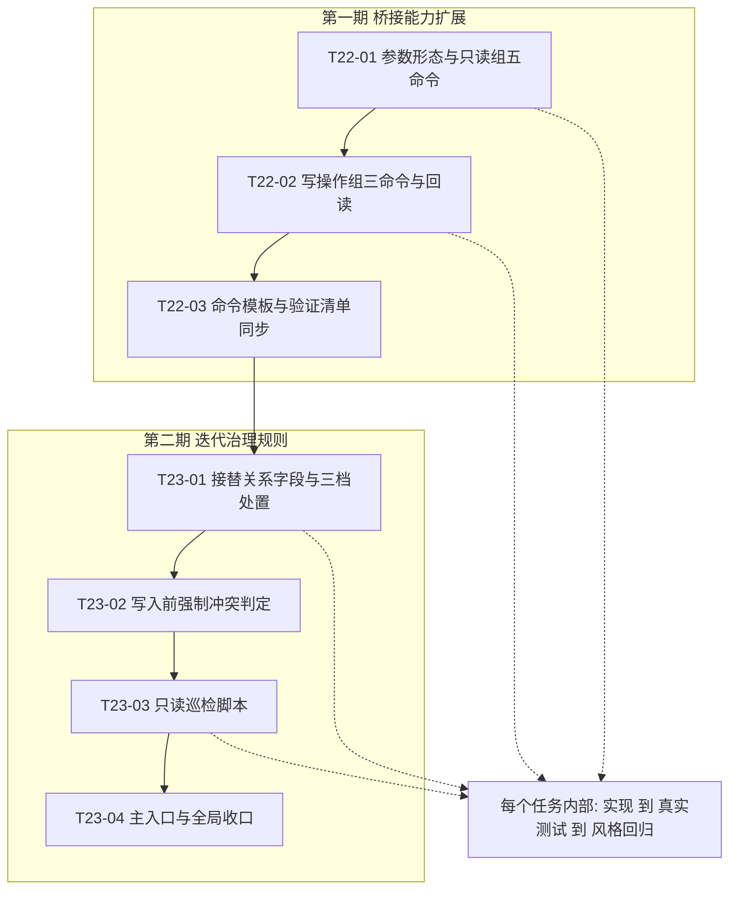
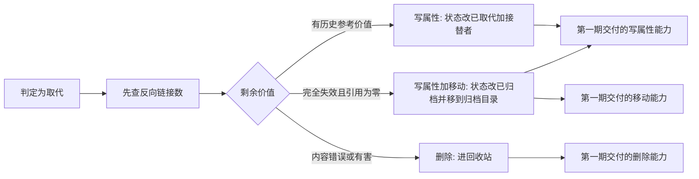
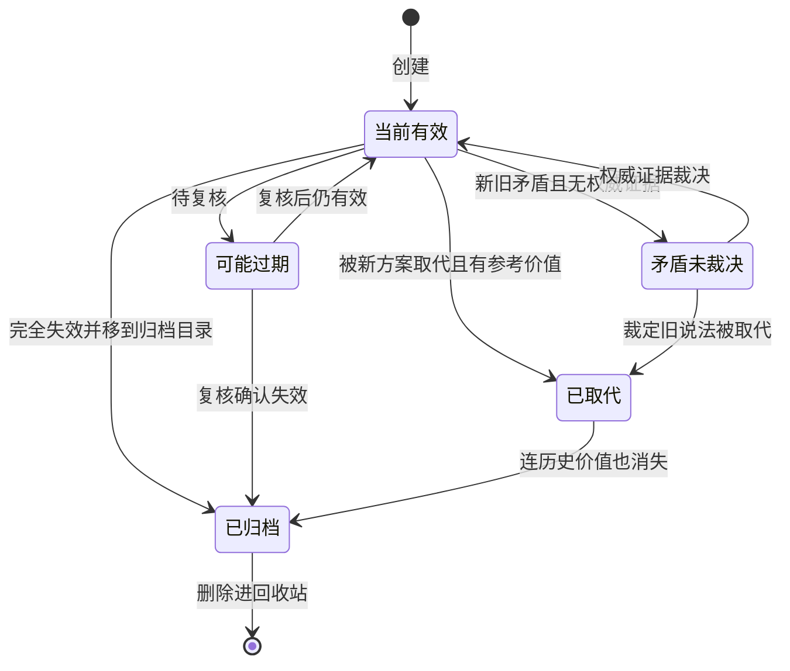

# 知识库可迭代更新 实施总览

结论：分两期做。第一期给知识库桥接补上八个命令，让它能改笔记头部属性、移动、删除和枚举；第二期把「不要删除」这条旧规则改写成三档处置，并把冲突判定前移到每次写入之前，另交付一个只读巡检脚本。影响：所有向知识库写入的动作都会多一道冲突判定，检索时只有当前有效的知识会被当作事实。范围：桥接脚本与 Windows 适配器、六份规则参考文件、技能主入口与代理配置、一个新增巡检脚本、两个新增测试文件、技能字典与项目记忆。非范围：知识库目录结构、执行失败案例笔记契约、本轮八个命令之外的子命令、永久删除、现存积压笔记的批量清理。变化：桥接从只能读和追加变成可迭代更新；冲突处置从一句"不要删除"变成三档有判据的动作。完成标准：八项完成条件全部有真实测试证据，且两期各自的最小任务都逐个闭环。术语说明：`桥接` 指本仓库唯一允许操作知识库的公开入口脚本；`回读验证` 指写入后再读一次证明确实写成功；`巡检` 指只读扫描知识库并输出待清理候选，不做任何修改。验证状态：需求已冻结，八个命令的参数形态已实机实测，两期七个最小任务待逐个执行。

## 当前计划最终方案简要说明

先补能力再改规则：桥接白名单新增八个官方命令行本就支持、但一直没接进来的命令，主落点是 `obsidian_cli_bridge.py` 的白名单与参数校验、以及 `obsidian_cli_windows.ps1` 的操作分支与回读；能力打通后再把 `conflict-staleness.md` 的「不要删除」改写为三档处置，并在 `capture-retrieve-distill.md` 把冲突判定前移到写入之前。之所以这个顺序，是因为现在连"把旧笔记标记为已废弃"都做不到——`append` 只能追加到文件末尾，改不了笔记头部的状态字段，规则写得再细也无法执行。

## Agent 对当前问题的理解

| 项目 | 结论 |
|---|---|
| 问题/目标 | 知识库只能增量补充，旧知识换了新方案后仍以"当前有效"躺在知识目录里，检索时无法判断哪个是现在的口径 |
| 本轮范围 | 桥接脚本、Windows 适配器、六份规则参考文件、技能主入口与代理配置、新增巡检脚本与两个测试文件、字典生成物、六份研发文档、项目记忆三件套 |
| 非范围 | 知识库目录布局、执行案例笔记契约、其他命令行子命令、永久删除、批量清理现存孤儿笔记 |
| 优先闭环 | 第一期打通四类能力并实机验证；第二期落三档处置规则、写入前判定与巡检脚本 |
| 关键假设 | 知识库保持可用；八个命令参数形态已实机实测，执行时直接采用 |
| 当前状态 | 五项关键取舍已由用户在计划阶段选定，无未决实现层决策 |
| 最大推进边界 | 只完成两期共七个最小任务；停在已改动未提交状态，不执行任何写入版本历史的动作 |

## 现状与落点

### 代码落点目录树

```text
D:\luode\luode-skills\
├─ obsidian-knowledge-flow\
│  ├─ SKILL.md                                   # 改：技能说明与检索/捕获规则新增分级处置与巡检入口
│  ├─ agents\openai.yaml                         # 改：默认提示词同步迭代治理口径
│  ├─ scripts\
│  │  ├─ obsidian_cli_bridge.py                  # 改：白名单、参数校验、命令行入口与主流程
│  │  ├─ obsidian_cli_windows.ps1                # 改：允许操作列表、请求校验、操作分支与回读
│  │  └─ audit_vault_knowledge.py                # 新增：只读巡检，枚举加读属性加读引用数，输出候选报告
│  └─ references\
│     ├─ conflict-staleness.md                   # 改：核心改动，从「不要删除」改写为三档处置
│     ├─ capture-retrieve-distill.md             # 改：写入前强制冲突判定与巡检流程
│     ├─ note-schema.md                          # 改：新增双向接替关系字段
│     ├─ cli-operations.md                       # 改：新增八条命令模板与三类回读语义
│     └─ validation-checklist.md                 # 改：新增迭代治理验证项与证据映射
├─ test\obsidian-knowledge-flow\
│  ├─ bridge_request_contract_test.py            # 新增：桥接参数校验单元测试，不依赖知识库
│  └─ vault_audit_contract_test.py               # 新增：巡检脚本纯函数与只读约束测试
├─ skill-dictionary\data.js / 字典.md            # 生成物：由字典脚本刷新
├─ PROJECT_CURRENT.md / PROJECT_MEMORY.md / PROJECT_HISTORY.md  # 改：状态、稳定规则、历史事件
└─ doc\
   ├─ 2-需求\2026-08-05_知识库可迭代更新_冲突取代与废弃治理.md
   ├─ 3-实施\2026-08-05_知识库可迭代更新_实施总览.md                      # 本文件
   ├─ 3-实施\2026-08-05_知识库可迭代更新_实施周期22_bridge能力扩展.md
   ├─ 3-实施\2026-08-05_知识库可迭代更新_实施周期23_迭代治理规则.md
   ├─ 5-tests\2026-08-05_<时间戳>_知识库可迭代更新\README.md
   └─ 6-review\2026-08-05_知识库可迭代更新_6-review.md
```

### 新增文件用途

```text
obsidian-knowledge-flow/scripts/audit_vault_knowledge.py   # 只读巡检入口，输出四类待清理候选，脚本内零写操作
test/obsidian-knowledge-flow/bridge_request_contract_test.py # 桥接白名单与参数校验断言，无需知识库即可运行
test/obsidian-knowledge-flow/vault_audit_contract_test.py    # 巡检脚本的纯函数断言与只读约束源码扫描
```

数据库 SQL：N/A + 原因：本轮无表结构或字段变更 + 证据：范围内无 DDL 文件、无 schema 资产，笔记头部属性由命令行写属性命令维护。

图片资产决策：N/A + 原因：本轮不涉及界面、截图或视觉验收对象 + 证据：周期依赖、分级分流与状态迁移已由本文三张 Mermaid 图表达。

### 现有可复用资产

| 资产 | 位置 | 复用方式 |
|---|---|---|
| `validate_knowledge_path` | `obsidian_cli_bridge.py:214` | 新增命令的路径与移动目标路径直接复用，不另写校验 |
| `EXECUTION_CASE_PREFIX` | `obsidian_cli_bridge.py:25` | 判断是否为执行案例笔记，用于拒绝移动与删除 |
| `BridgeError` 与 `exit_code_for` | `obsidian_cli_bridge.py:404` | 新增校验失败复用参数错误码，不新建错误体系 |
| `Test-KnowledgePath` | `obsidian_cli_windows.ps1` | 适配器侧新增命令的路径校验直接复用 |
| `Invoke-ObsidianCli` 与 `Test-CliOperationSuccess` | `obsidian_cli_windows.ps1` | 新命令的调用与"退出码为零但返回错误载荷"判定复用现成实现 |
| `Normalize-ReadbackText` | `obsidian_cli_windows.ps1:461` | 写属性的值比对复用同一换行归一化 |
| 上一周期的契约测试写法 | `test/reasoning-summary-structure-rules/obsidian_citation_contract_test.py` | 两个新增测试沿用同构写法与函数头风格 |
| 知识库内一次性系统测试目录 | `知识库/90-Archive/_system-tests/` | 实机写测试的唯一落点，测试后删除自清理 |

## 实施周期总览

| 周期 | 期次定位 | 目标 | 进入条件 | 收口条件 | 完成标志 |
|---|---|---|---|---|---|
| `CYCLE-OBS-22-001` | 第一期 | 桥接具备改属性、移动、删除、枚举四类能力且实机验证通过 | 需求已冻结；参数形态已实测；桥接自检通过 | 三个最小任务逐个闭环；八命令实机可用；单元测试全绿；风格回归通过 | `AC-OBS-KB-001` 至 `AC-OBS-KB-003`、`AC-OBS-KB-008` 全部通过 |
| `CYCLE-OBS-23-001` | 第二期 | 三档处置与写入前冲突判定成为强制规则，并交付只读巡检报告能力 | 第一期已收口，八命令可用 | 四个最小任务逐个闭环；巡检脚本对真实知识库出报告；字典刷新；文档落盘；风格回归通过 | `AC-OBS-KB-004` 至 `AC-OBS-KB-007` 全部通过 |

衔接关系：第一期交付的写属性、移动、删除三类能力，正是第二期三档处置各自依赖的执行手段；第一期交付的枚举文件与枚举孤儿，正是第二期巡检脚本的取数来源。第一期未收口前不得进入第二期。

### 周期依赖与任务顺序

图形目的：展示两期的先后依赖与各期内最小任务顺序，说明为什么能力必须先于规则。关联 ID：`CYCLE-22`、`CYCLE-23`、`T22-01` 至 `T23-04`。



### 三档处置分流

图形目的：展示分级处置如何依赖第一期交付的三类写能力，作为两期之间的契约。关联 ID：`RULE-OBS-SUPERSEDE-001` 至 `004`。



### 端到端状态迁移

图形目的：展示普通知识笔记在迭代治理下的完整状态迁移与可恢复路径。关联 ID：`RULE-OBS-SUPERSEDE-002`、`RULE-OBS-DETECT-002`。



## 阶段计划

| 阶段 | 周期 | 只做一件事 | 输入 | 输出 | 验证门槛 |
|---|---|---|---|---|---|
| S1 | 22 | 冻结需求与两份周期文档 | 本计划与用户五项决策 | 需求、总览、两份周期文档 | 四份文档校验通过 |
| S2 | 22 | 打通只读组五命令 | 参数形态实测结果 | 桥接与适配器的只读分支 | 五命令实机返回真实数据 |
| S3 | 22 | 打通写操作组三命令与回读 | 只读组可用 | 桥接与适配器的写分支 | 一次性测试笔记走通三类写操作 |
| S4 | 23 | 定义接替关系与三档处置 | 八命令可用 | 笔记字段定义与冲突规则 | 分级组断言通过 |
| S5 | 23 | 冲突判定前移到写入前 | 三档规则已定 | 捕获与沉淀流程 | 检测组断言通过 |
| S6 | 23 | 交付只读巡检报告 | 枚举命令可用 | 巡检脚本与其测试 | 对真实知识库出报告且零写入 |
| S7 | 23 | 主入口与全局收口 | 全部改动 | 技能说明、字典、文档、记忆 | 全量测试、字典与风格回归通过 |

## 最小任务清单

| 顺序 | 任务 ID | 所属周期 | 周期内顺序 | 垂直切片目标 | 预计触达文件数 | 依赖 |
|---|---|---|---|---|---|---|
| 1 | `T22-01` | `CYCLE-OBS-22-001` | 1 | 钉死参数形态并让桥接能只读枚举与读属性 | 5 | 无 |
| 2 | `T22-02` | `CYCLE-OBS-22-001` | 2 | 让桥接能改属性、移动、删除且每次写入有回读 | 3 | `T22-01` |
| 3 | `T22-03` | `CYCLE-OBS-22-001` | 3 | 把八命令调用形态与回读语义写成可照抄文档 | 2 | `T22-02` |
| 4 | `T23-01` | `CYCLE-OBS-23-001` | 1 | 把"旧的废弃或删除"变成有字段支撑的三档规则 | 2 | `T22-03` |
| 5 | `T23-02` | `CYCLE-OBS-23-001` | 2 | 让每次写入前都必须回答是补充还是取代 | 2 | `T23-01` |
| 6 | `T23-03` | `CYCLE-OBS-23-001` | 3 | 把已积压的冲突、过期与孤儿笔记捞成清理清单 | 2 | `T23-02` |
| 7 | `T23-04` | `CYCLE-OBS-23-001` | 4 | 让本次能力与规则变更对外可见、可检索、可交接 | 5 | `T23-03` |

每个最小任务的文件/符号操作契约、真实测试、断言、清理、回滚、完成条件与停止条件，分别写在两份实施周期文档中，本总览不重复展开。

## 真实测试安排

| 测试 ID | 入口 | 依赖环境 | 样本来源 | 通过标准 | 归属任务 |
|---|---|---|---|---|---|
| `TEST-OBS-KB-001` | 桥接参数校验单元测试只读组，加五条桥接只读实机命令 | Windows Git Bash 与仓库 Python；实机部分需应用运行且固定根已注册 | 单测用构造参数；实机用真实知识库 | 单测全绿；五条实机命令成功且数据与直连命令行一致 | `T22-01` |
| `TEST-OBS-KB-002` | 同上写操作组，加一次性测试笔记的完整实机链路 | 同上 | 一次性系统测试目录下的临时笔记 | 单测全绿；实机链路每步成功且回读通过；执行案例路径被拒 | `T22-02` |
| `TEST-OBS-KB-003` | 同上文档组 | 本地 Python，无需知识库 | 命令模板、验证清单与桥接脚本常量 | 文档列举与脚本白名单逐项一致 | `T22-03` |
| `TEST-OBS-KB-004` | 同上分级组 | 本地 Python | 冲突规则与笔记字段定义 | 「不要删除」已消失；三档判据、前置检查、排除范围、自动化边界与两个新字段全部在位 | `T23-01` |
| `TEST-OBS-KB-005` | 同上检测组 | 本地 Python | 捕获与沉淀流程、技能主入口 | 三态判定、双向接替、接替跳转与新增循环在位；四态判定文本逐字未变 | `T23-02` |
| `TEST-OBS-KB-006` | 巡检脚本测试，加对真实知识库跑一次完整巡检 | 单测无需知识库；实跑需知识库可用 | 单测用构造头部数据；实跑用真实 65 篇笔记 | 源码零写操作字面量；纯函数单测全绿；实跑出四类候选且前后文件总数与孤儿数不变 | `T23-03` |
| `TEST-OBS-KB-007` | 字典生成脚本，加六档文档校验，加全量单元测试 | 本地 Python | 全仓技能说明与本轮六份研发文档 | 字典退出码为零且无新增缺项；六档校验全部通过；全量断言全绿 | `T23-04` |

免测边界：N/A + 原因：本轮改动桥接脚本的可执行行为与知识库写入语义，不属于纯文档或纯排版场景 + 证据：七项测试均为真实运行，构建、静态检查与人工阅读不计入通过标准。

实机边界：写操作只允许落一次性系统测试目录并以删除收尾；禁止在知识目录或实体目录做写测试。知识库不可达时实机部分记为受限项并显式标注，单元测试部分仍必须通过。

## 任务完成、停止与最大推进边界

| 项目 | 内容 |
|---|---|
| 完成定义 | 两期七个最小任务全部逐个闭环，八项完成条件均有真实测试证据，六份研发文档落盘，风格回归通过，项目记忆三件套已同步 |
| 总体停止条件 | 任一命令在当前命令行版本无法按实测形态工作，或删除行为不进回收站，或三档判据与执行案例契约冲突时，停止并按对应周期文档的停止条件降级或裁决 |
| 最大推进边界 | 只完成本总览列出的七个最小任务；停在已改动未提交状态，不执行任何写入版本历史的动作；不批量清理现存孤儿笔记；不新增八命令之外的子命令；不清空回收站 |
| 回滚方案 | `ROLLBACK-OBS-KB-001`：脚本与规则改动用 `git checkout -- obsidian-knowledge-flow/` 回滚；新增文件直接删除；生成物重跑脚本恢复；知识库内误删笔记从回收站恢复；移动过的笔记移回原路径 |

## 风险与阻断项

| ID | 风险 | 应对 |
|---|---|---|
| `RISK-OBS-KB-001` | 自动删除误判会丢掉仍有价值的笔记 | 三档强制前置反向链接检查，引用不为零不得移动或删除；删除仅限内容错误或有害；回收站保留可恢复性；每次处置都在最终总结登记 |
| `RISK-OBS-KB-002` | 分级处置误伤执行案例笔记，破坏追加式历史证据 | 桥接层拒绝对执行案例目录执行移动与删除；规则层写明排除范围；有专门断言 |
| `RISK-OBS-KB-003` | 移动的目标目录不存在时会失败 | 已实测确认失败时原文件无损；命令模板写明目标目录必须已存在 |
| `RISK-OBS-KB-004` | 逐篇读属性对 65 篇笔记可能较慢 | 巡检是手动入口不进自动流程；超时改按目录分批 |
| `RISK-OBS-KB-005` | 技能说明变更后忘记刷新字典 | 字典刷新列为放行硬条件，写入 `T23-04` 完成条件 |
| 阻断项 | 无。本轮不依赖网络、数据库或第三方服务；知识库已实测可用 | 无需应对：本轮不存在阻断项 |

## 自审结论

| 检查项 | 结论 |
|---|---|
| unresolved_decisions | 无未决决策。五项关键取舍已在计划阶段由用户通过选择框选定 |
| 字段完整性 | 必填字段逐项已填，SQL 与图片资产均按 N/A 加原因加证据处理，无占位词 |
| 阶段单一目标 | S1 至 S7 各只做一件事；七个最小任务各只承载一个目标，均归属唯一周期 |
| 任务粒度 | 每个最小任务预计触达文件数不超过五个，均写明文件/符号落点 |
| 逐个闭环 | 每个任务先实现、再跑自己的真实测试、再做风格回归；禁止连续实现后统一验证 |
| 周期顺序 | 第一期未收口不得进入第二期，理由为能力先于规则 |
| 真实测试 | 七项测试均为真实运行入口，构建与静态检查不计入 |
| 图文一致性 | 三张图的周期、任务与规则术语与正文、追踪矩阵完全一致 |
| 最大推进边界 | 已显式写明，停在已改动未提交状态 |
