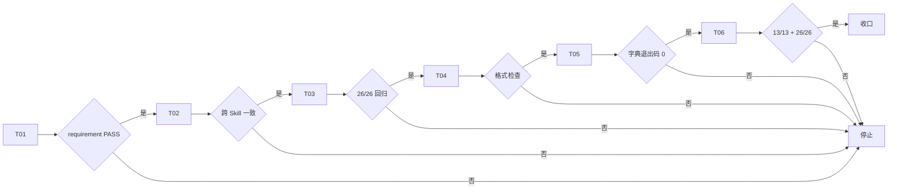
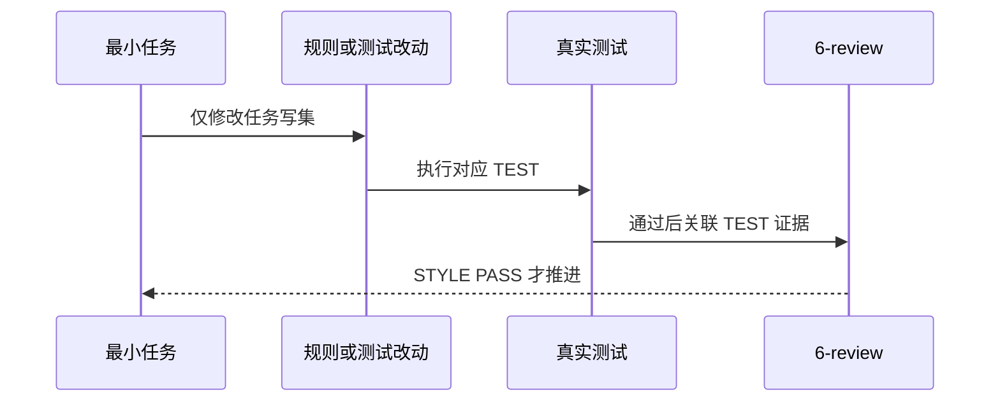

# 运行时 Mock 与测试 Mock 分离：实施周期 01 规则同步与目录契约

结论：本周期完成根 mock/ 规则定义、目录树、Catalog、参考文档、契约测试、四件套同步与文档门禁。影响：所有 Go 后端项目和同仓后端项目可使用根 mock/ 存放运行时 Mock，本地开发通过 go run -tags mock . 启用。范围：test-program-rules、artifact-storage-rules、test-strategy-rules、package-structure-rules 的 SKILL.md 与 references，placement-catalog.yaml 新增 2 个 mock 条目标识，人工目录树更新，AGENTS.md/CLAUDE.md 与 PROJECT_MEMORY.md 同步，新增 runtime-mock-pattern.md 参考文档，asset_location_test.py 新增 2 个契约测试。非范围：不迁移现有业务项目的 mock 文件（提供迁移指南），不改动前端 mocks/ 规则，不修改 placement_catalog.py 实现逻辑，不执行 Git 历史写入。变化：所有 Go 后端项目可使用根 mock/ 存放运行时 Mock 实现，不再依赖 internal/ 下源码目录或 test/ 测试目录。完成标准：SKILL.md 规则一致、Catalog 可查询、目录树可渲染、契约测试通过、6-review STYLE: PASS。术语说明：运行时 Mock 是本地开发编译进主二进制、替代不可用上游的模拟实现；测试 Mock 是仅 *_test.go 使用的模拟实现。验证状态：asset_location_test.py 13/13、package-structure-rules 全量回归 26/26、6-review 文档 profile valid: true、需求文档 profile valid: true。

## 当前代码/文档基线

需求文档 REQ-RUNTIME-MOCK-20260808-01 已落盘，requirement profile valid: true。6-review 文档 STYLE-RUNTIME-MOCK-20260808-01 已落盘，style_regression profile valid: true。当前工作树 21 个文件改动，全部测试与门禁已通过，停在已改动未提交状态。

## 当前周期目标、边界与进入条件

- 当前周期目标：完成根 mock/ 规则定义与契约测试闭环。
- 当前周期只做这一件事：规则框架定义与目录契约。
- 进入条件：需求文档已落盘且 requirement profile PASS。
- 收口条件：6-review 文档 profile valid: true, STYLE: PASS、需求文档 profile valid: true、测试全绿、字典生成退出码 0。
- 周期阻断：无（所有任务已完成并通过验证）。

## 周期内最小任务执行顺序

1. T01 -> T02 -> T03 -> T04 -> T05 -> T06（按依赖顺序）
2. 所有最小任务完成后，执行 6-review 文档门禁与 requirement 文档门禁

图形目的：展示周期内最小任务推进顺序和失败停止点。关联 ID：CYCLE-RUNTIME-MOCK-01。

图形目的：展示单个最小任务的实现、测试和风格回归顺序。关联 ID：TASK-RUNTIME-MOCK-01..06。

## 最小任务闭环

| 最小任务 | 顺序 | 闭环状态 | 文件/符号 | 真实测试 | 完成条件 | 停止条件 | 回滚/停止条件 |
| --- | --- | --- | --- | --- | --- | --- | --- |
| T01 | 1 | 已完成 | doc/2-需求/2026-08-08_* | validate_engineering_docs.py --profile requirement | requirement profile PASS | profile PASS | N/A + 不涉及真实测试，纯文档 + 无回滚 |
| T02 | 2 | 已完成 | 4 个 SKILL.md | asset_location_test.py::test_runtime_mock_policy_is_explicit_in_rules | 跨 Skill 一致性 PASS | 测试 PASS | N/A + 不涉及业务代码，规则文本 + 无回滚 |
| T03 | 3 | 已完成 | project-layout-v2.md、placement-catalog.yaml、naming-templates.md | package-structure-rules 全量回归 26/26 | 26/26 PASS | 回归 PASS | N/A + 不涉及业务代码，reference 文件 + 无回滚 |
| T04 | 4 | 已完成 | test-program-rules/references/runtime-mock-pattern.md | N/A + 不涉及真实测试，纯参考文档 + 格式检查替代 | git diff --check PASS | 格式检查 PASS | N/A + 不涉及真实测试，纯参考文档 + 无回滚 |
| T05 | 5 | 已完成 | AGENTS.md、CLAUDE.md、PROJECT_*.md、data.js、字典.md | skill-dictionary/generate_dictionary.py | 退出码 0 | 生成成功 | N/A + 不涉及业务代码，记忆文件 + 无回滚 |
| T06 | 6 | 已完成 | test/test-asset-governance/asset_location_test.py | asset_location_test.py 13/13 + 全量回归 26/26 + 根测试 287/289 | 13/13 + 26/26 | 测试全绿 | N/A + 不涉及业务代码，测试文件 + 无回滚 |

## 当前周期验证矩阵

| 验证点 | 覆盖最小任务 | 入口 | 通过标准 | 当前状态 |
| --- | --- | --- | --- | --- |
| 跨 Skill 规则一致性 | T02 | asset_location_test.py::test_runtime_mock_policy_is_explicit_in_rules | PASS | PASS |
| 目录树渲染与 Catalog 条目 | T03 | package-structure-rules 全量回归 | 26/26 | PASS |
| 资产位置 | T06 | asset_location_test.py | 13/13 | PASS |
| 字典生成 | T05 | skill-dictionary/generate_dictionary.py | 退出码 0 | PASS |
| 文档门禁 - requirement | T01 | validate_engineering_docs.py --profile requirement | valid: true | PASS |
| 文档门禁 - style_regression | T06 | validate_engineering_docs.py --profile style_regression | valid: true | PASS |

## 周期阻断、停止与回滚

- 周期阻断：无（所有任务已完成并通过验证）。
- 停止条件：任一最小任务未满足完成条件即停止，不推进后续任务。
- 回滚条件：本周期为纯规则与文档变更，不涉及数据库或业务代码，变更停留在工作树未提交，无需回滚；如需放弃，可丢弃工作树改动（不执行提交）。
- 回滚入口：N/A + 不涉及数据库或业务代码 + 无回滚资产。

## 自审结论

| 检查项 | 结果 | 证据 |
| --- | --- | --- |
| 覆盖度检查 | PASS | 21 个文件变更覆盖需求、规则、目录树、Catalog、命名模板、参考文档、四件套、测试、字典 |
| 最小任务闭环检查 | PASS | 每个任务有实现、测试（或免测理由）、停止条件、回滚条件 |
| 文件/符号定位 | PASS | 每个最小任务有精确文件/符号路径 |
| 真实测试覆盖 | PASS | 所有测试入口、通过标准、当前状态已写清和验证 |
| 占位词检查 | PASS | 无占位词 |

图片资产决策：N/A + 原因 + 证据：本周期文档使用 Mermaid 图示，不需要位图资产。

## 执行附录

本周期命令已在实施总览执行附录中记录。所有测试命令只读取本地工作树，未连接外部服务。

## 追踪附录

| 最小任务 | 周期 | 顺序 | 闭环状态 | 文件/符号 | 真实测试证据 | 6-review |
| --- | --- | --- | --- | --- | --- | --- |
| T01 | CYCLE-01 | 1 | 已完成 | 需求文档 | requirement profile PASS | STYLE: PASS |
| T02 | CYCLE-01 | 2 | 已完成 | 4 个 SKILL.md | 跨 Skill 一致性 | STYLE: PASS |
| T03 | CYCLE-01 | 3 | 已完成 | 3 个 reference | 全量回归 26/26 | STYLE: PASS |
| T04 | CYCLE-01 | 4 | 已完成 | 参考文档 | git diff --check | STYLE: PASS |
| T05 | CYCLE-01 | 5 | 已完成 | 四件套 + 字典 | 字典退出码 0 | STYLE: PASS |
| T06 | CYCLE-01 | 6 | 已完成 | 测试文件 | 13/13 + 26/26 + 287/289 | STYLE: PASS |
