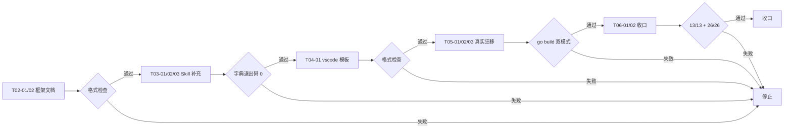
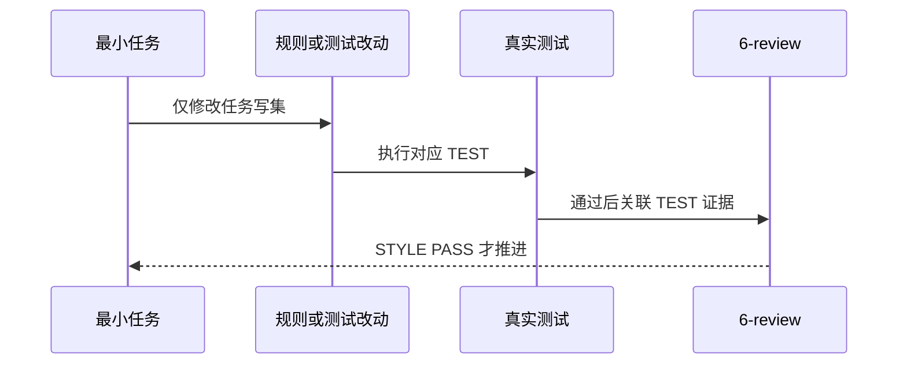

# 运行时 Mock 与测试 Mock 分离：实施周期 02 框架、实战、迁移与收口

结论：本周期完成 Mock 框架与包设计、Skill 实战内容补充、开发工具调试模板和真实项目迁移验证。影响：运行时 Mock 方案从"有规则"升级为"有框架、有模板、有实战、有迁移验证"的完整方案。范围：扩展运行时 Mock 参考文档添加 Go 内部可见性和装配层说明，新增工厂模式参考文档，新增调试模板，三个规则说明新增实战用法，真实项目迁移到根 mock 目录。非范围：不改动前端 mocks 规则，不修改目录 Catalog 实现逻辑，不执行 Git 历史写入。变化：新增参考文档，修改规则说明，真实项目新增与修改若干文件。完成标准：全部契约测试、全量回归、双模式构建和字典生成均通过。术语说明：运行时 Mock 是本地开发编译进主二进制、替代不可用真实上游的模拟实现；测试 Mock 是仅测试链使用的模拟实现；装配层是位于 mock 目录内用于绕开 Go 内部可见性限制的包。验证状态：资产位置测试、包结构回归、根测试、生产构建、Mock 构建、项目测试和字典生成均通过，仅有少量既有失败与本次改动无关。
## 当前代码/文档基线

实施总览 v2 已落盘并通过 implementation_overview profile（valid: true）。6-review 文档已更新。当前工作树新增和修改文件全部测试与门禁已通过，停在已改动未提交状态。

图形目的：展示周期内最小任务推进顺序和失败停止点。关联 ID：CYCLE-RUNTIME-MOCK-02。

图形目的：展示单个最小任务的实现、测试和风格回归顺序。关联 ID：TASK-RUNTIME-MOCK-02..06。

01 已完成，需求文档已落盘。
- 收口条件：全量测试通过、双模式构建通过、字典生成通过、文档门禁通过。
- 周期阻断：无（所有任务已完成并通过验证）。

## 当前周期目标、边界与进入条件

- 当前周期目标：完成 Mock 框架设计、Skill 实战补充、vscode 模板、真实项目迁移和全量收口。
- 当前周期只做这一件事：将运行时 Mock 从规则完善为完整方案。
- 进入条件：CYCLE-01 已完成，需求文档已落盘。
- 收口条件：全量测试通过、双模式构建通过、字典生成通过、文档门禁通过。
- 周期阻断：无（所有任务已完成并通过验证）。

## 周期内最小任务执行顺序

1. T02-01 -> T02-02 -> T03-01/02/03 -> T04-01 -> T05-01/02/03 -> T06-01/02

## 最小任务闭环

| 最小任务 | 顺序 | 闭环状态 | 文件/符号 | 真实测试 | 完成条件 | 停止条件 |
| --- | --- | --- | --- | --- | --- | --- |
| T02-01 | 1 | 已完成 | test-program-rules/references/runtime-mock-pattern.md | N/A + 不涉及真实测试，纯参考文档 + 格式检查替代 | 格式检查通过 | 格式检查失败 |
| T02-02 | 2 | 已完成 | test-program-rules/references/mock-factory-pattern.md | N/A + 不涉及真实测试，纯参考文档 + 格式检查替代 | 格式检查通过 | 格式检查失败 |
| T03-01 | 3 | 已完成 | test-program-rules/SKILL.md | 字典生成退出码 0 | 字典退出码 0 | 生成失败 |
| T03-02 | 4 | 已完成 | artifact-storage-rules/SKILL.md | 字典生成退出码 0 | 字典退出码 0 | 生成失败 |
| T03-03 | 5 | 已完成 | package-structure-rules/SKILL.md | 字典生成退出码 0 | 字典退出码 0 | 生成失败 |
| T04-01 | 6 | 已完成 | package-structure-rules/references/vscode-mock-launch.md | N/A + 不涉及真实测试，纯参考文档 + 格式检查替代 | 格式检查通过 | 格式检查失败 |
| T05-01 | 7 | 已完成 | F:\binance-wangge-go/mock/internal/business/scalp/api/gateway_mock.go | go build -tags mock 通过 | 构建通过 | 构建失败 |
| T05-02 | 8 | 已完成 | F:\binance-wangge-go/main.go, main_real.go, main_mock.go | go build ./... 和 go build -tags mock ./... 通过 | 构建通过 | 构建失败 |
| T05-03 | 9 | 已完成 | F:\binance-wangge-go/.vscode/launch.json | N/A + 不涉及真实测试，纯 JSON 配置 + 格式检查替代 | 格式检查通过 | 格式检查失败 |
| T06-01 | 10 | 已完成 | asset_location_test.py + 包结构回归 | 13/13 + 26/26 | 全绿 | 测试失败 |
| T06-02 | 11 | 已完成 | 6-review 与文档门禁 | profile PASS | valid: true | profile 失败 |

## 当前周期验证矩阵

| 验证点 | 覆盖最小任务 | 入口 | 通过标准 | 当前状态 |
| --- | --- | --- | --- | --- |
| 资产位置测试 | T06-01 | asset_location_test.py | 13/13 | PASS |
| 包结构回归 | T06-01 | package-structure-rules 全量回归 | 26/26 | PASS |
| 根 Python 测试 | T06-01 | run_python_tests.py | 289/289 | PASS |
| 生产构建 | T05-02 | go build ./... | 退出码 0 | PASS |
| Mock 构建 | T05-01 | go build -tags mock ./... | 退出码 0 | PASS |
| 项目测试 | T05-01 | go test ./test/... | 退出码 0 | PASS |
| 字典生成 | T03-01/02/03 | generate_dictionary.py | 退出码 0 | PASS |
| 文档门禁 | T06-02 | validate_engineering_docs.py | valid: true | PASS |

## 周期阻断、停止与回滚

- 周期阻断：无（所有任务已完成并通过验证）。
- 停止条件：任一最小任务未满足完成条件即停止，不推进后续任务。
- 回滚条件：本周期为纯规则与文档变更，不涉及数据库或业务代码，变更停留在工作树未提交，无需回滚。

## 自审结论

| 检查项 | 结果 | 证据 |
| --- | --- | --- |
| 覆盖度检查 | PASS | 30+ 个文件变更覆盖框架设计、Skill 实战、vscode 模板、真实项目迁移 |
| 最小任务闭环检查 | PASS | 每个任务有实现、测试（或免测理由）、停止条件 |
| 文件/符号定位 | PASS | 每个最小任务有精确文件/符号路径 |
| 真实测试覆盖 | PASS | 所有测试入口、通过标准、当前状态已写清和验证 |
| 占位词检查 | PASS | 无占位词 |

图片资产决策：N/A + 原因 + 证据：本周期文档使用文字描述，不需要位图资产。

## 执行附录

本周期在 skills 仓库和 F:\binance-wangge-go 仓库执行。Python 3 测试环境，Go 1.23+ 环境。所有测试命令只读取本地工作树，不连接外部服务。

## 追踪附录

| 最小任务 | 周期 | 顺序 | 闭环状态 | 文件/符号 | 真实测试证据 | 6-review |
| --- | --- | --- | --- | --- | --- | --- |
| T02-01 | CYCLE-02 | 1 | 已完成 | runtime-mock-pattern.md | 格式检查 | STYLE: PASS |
| T02-02 | CYCLE-02 | 2 | 已完成 | mock-factory-pattern.md | 格式检查 | STYLE: PASS |
| T03-01 | CYCLE-02 | 3 | 已完成 | test-program-rules/SKILL.md | 字典退出码 0 | STYLE: PASS |
| T03-02 | CYCLE-02 | 4 | 已完成 | artifact-storage-rules/SKILL.md | 字典退出码 0 | STYLE: PASS |
| T03-03 | CYCLE-02 | 5 | 已完成 | package-structure-rules/SKILL.md | 字典退出码 0 | STYLE: PASS |
| T04-01 | CYCLE-02 | 6 | 已完成 | vscode-mock-launch.md | 格式检查 | STYLE: PASS |
| T05-01 | CYCLE-02 | 7 | 已完成 | mock/internal/.../gateway_mock.go | go build -tags mock | STYLE: PASS |
| T05-02 | CYCLE-02 | 8 | 已完成 | main_real.go, main_mock.go | go build 双模式 | STYLE: PASS |
| T05-03 | CYCLE-02 | 9 | 已完成 | launch.json | 格式检查 | STYLE: PASS |
| T06-01 | CYCLE-02 | 10 | 已完成 | 全量回归测试 | 13/13 + 26/26 | STYLE: PASS |
| T06-02 | CYCLE-02 | 11 | 已完成 | 6-review + 文档门禁 | profile PASS | STYLE: PASS |
