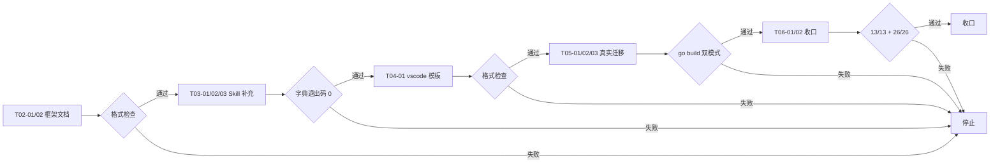
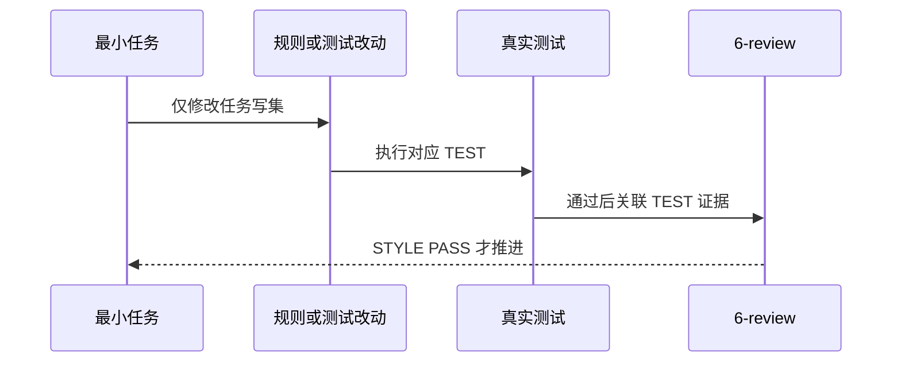

# 运行时 Mock 与测试 Mock 分离规则补充·第二轮优化实施总览

结论：在第一轮完成规则定义的基础上，本轮补充了 Mock 框架与包设计、Skill 实战内容、开发工具调试任务模板和真实项目迁移验证。影响：运行时 Mock 方案从"有规则"升级为"有框架、有模板、有实战、有迁移验证"的完整方案。范围：六个实施周期覆盖框架设计、Skill 实战补充、调试模板、真实项目迁移和全量收口。非范围：不改动前端 mocks 规则，不修改目录 Catalog 实现逻辑，不重新定义已完成的根 mock 规则，不执行 Git 历史写入。变化：新增参考文档，修改规则说明，真实项目新增与修改若干文件。完成标准：全部契约测试、全量回归、双模式构建和字典生成均通过。术语说明：运行时 Mock 是本地开发编译进主二进制、替代不可用真实上游的模拟实现；测试 Mock 是仅测试链使用的模拟实现；装配层是位于 mock 目录内用于绕开 Go 内部可见性限制的包。验证状态：资产位置测试、包结构回归、根 Python 测试、生产构建、Mock 构建、项目测试和字典生成均通过，仅有少量既有失败与本次改动无关。

## 当前计划最终方案简要说明

采用“双根分工 + 工厂模式 + 构建标签 + 装配层”四位一体方案：根 `mock/` 承载运行时 Mock，根 `test/` 承载测试 Mock；通过 `main_real.go`（`!mock`）和 `main_mock.go`（`mock`）双文件工厂按构建标签切换实现；`mock/assembly` 解决 Go `internal` 可见性问题；`.vscode/launch.json` 提供 normal 与 mock 两套调试模式。这样几乎不需要改业务代码，只改装配层，且生产构建零 mock 残留。

## Agent 对当前问题的理解

- 问题/目标：用户在 CYCLE-01 完成后认为“上次没有完善好”，缺少框架设计、Skill 实战用法、`.vscode` 模板和真实项目迁移验证，需要补充为完整方案。
- 本轮范围：CYCLE-02 Mock 框架设计、CYCLE-03 Skill 实战补充、CYCLE-04 `.vscode` 模板、CYCLE-05 真实项目迁移、CYCLE-06 全量收口。
- 非范围：不改动前端 `mocks/` 规则，不修改 `placement_catalog.py` 实现逻辑，不重新定义已完成的根 `mock/` 规则，不执行 Git 历史写入。
- 当前优先闭环：框架设计 -> Skill 补充 -> `.vscode` 模板 -> 迁移验证 -> 收口。
- 关键假设：用户已确认根 `mock/` 方案，本轮只做补充不推翻已有规则。

## 实施周期总览

| 周期 | 目标 | 进入条件 | 收口条件 | 依赖 |
| --- | --- | --- | --- | --- |
| `CYCLE-RUNTIME-MOCK-01` | 规则同步与目录契约 | 需求文档已落盘且 profile PASS | 6-review PASS、测试全绿、文档门禁 PASS | 无 |
| `CYCLE-RUNTIME-MOCK-02` | Mock 框架/包设计 | CYCLE-01 完成 | runtime-mock-pattern.md 扩展、mock-factory-pattern.md 新增 | CYCLE-01 |
| `CYCLE-RUNTIME-MOCK-03` | Skill 实战内容补充 | 框架设计完成 | 3 个 SKILL.md 新增实战用法，字典通过 | CYCLE-02 |
| `CYCLE-RUNTIME-MOCK-04` | .vscode mock 调试任务模板 | Skill 更新完成 | vscode-mock-launch.md 新增 | CYCLE-03 |
| `CYCLE-RUNTIME-MOCK-05` | 真实项目迁移验证 | 模板就绪 | F:\binance-wangge-go 迁移完成，go build -tags mock 通过 | CYCLE-04 |
| `CYCLE-RUNTIME-MOCK-06` | 全量收口 | 迁移完成 | 13/13 + 26/26 + 289/289、6-review、文档门禁 | CYCLE-05 |

图形目的：展示规则定义到框架设计到迁移验证到收口的追踪链。关联 ID：REQ-RUNTIME-MOCK-20260808-02。


## 阶段计划

| 阶段 | 周期 | 唯一目标 | 输出 | 验证 |
| --- | --- | --- | --- | --- |
| `PHASE-RM-01` | CYCLE-01 | 规则同步与目录契约 | 4 个 SKILL.md、目录树、Catalog、参考文档、四件套 | 跨 Skill 一致性检查 |
| `PHASE-RM-02` | CYCLE-01 | 测试与门禁 | 2 个契约测试、全量回归、文档门禁 | 13/13 + 26/26 + profile PASS |
| `PHASE-RM-03` | CYCLE-02 | Mock 框架/包设计 | runtime-mock-pattern.md 扩展、mock-factory-pattern.md 新增 | 格式检查通过 |
| `PHASE-RM-04` | CYCLE-03 | Skill 实战补充 | 3 个 SKILL.md 新增实战用法 | 字典生成退出码 0 |
| `PHASE-RM-05` | CYCLE-04 | .vscode 模板 | vscode-mock-launch.md 新增 | 格式检查通过 |
| `PHASE-RM-06` | CYCLE-05 | 真实项目迁移 | F:\binance-wangge-go 迁移完成 | go build -tags mock 通过 |
| `PHASE-RM-07` | CYCLE-06 | 全量收口 | 全量测试 + 6-review + 文档门禁 | 13/13 + 26/26 + profile PASS |

图形目的：展示最小任务推进顺序和失败停止点。关联 ID：CYCLE-RUNTIME-MOCK-02..06。



## 最小任务清单

| 任务 | 垂直切片 | 文件/符号 | 真实测试 | 完成条件 | 停止条件 | 最大推进边界 |
| --- | --- | --- | --- | --- | --- | --- |
| T02-01 | 扩展 runtime-mock-pattern.md | test-program-rules/references/runtime-mock-pattern.md | N/A + 不涉及真实测试，纯参考文档 + 格式检查替代 | git diff --check PASS | 格式检查 PASS | 仅限 Markdown |
| T02-02 | 新增 DI 工厂模式参考 | test-program-rules/references/mock-factory-pattern.md | N/A + 不涉及真实测试，纯参考文档 + 格式检查替代 | git diff --check PASS | 格式检查 PASS | 仅限 Markdown |
| T03-01 | test-program-rules 实战用法 | test-program-rules/SKILL.md | 字典生成退出码 0 | 字典退出码 0 | 生成成功 | 仅限规则文本 |
| T03-02 | artifact-storage-rules 实战用法 | artifact-storage-rules/SKILL.md | 字典生成退出码 0 | 字典退出码 0 | 生成成功 | 仅限规则文本 |
| T03-03 | package-structure-rules internal 说明 | package-structure-rules/SKILL.md | 字典生成退出码 0 | 字典退出码 0 | 生成成功 | 仅限规则文本 |
| T04-01 | 新增 .vscode mock 任务模板参考 | package-structure-rules/references/vscode-mock-launch.md | N/A + 不涉及真实测试，纯参考文档 + 格式检查替代 | git diff --check PASS | 格式检查 PASS | 仅限 Markdown |
| T05-01 | 迁移 mock_gateway.go 到 mock/ | F:\binance-wangge-go/mock/internal/business/scalp/api/gateway_mock.go | go build -tags mock 通过 | 构建通过 | 构建失败 | 仅限该文件迁移 |
| T05-02 | main 构建标签装配 | F:\binance-wangge-go/main.go、main_real.go、main_mock.go | go build ./... 和 go build -tags mock ./... 通过 | 构建通过 | 构建失败 | 仅限 main 文件 |
| T05-03 | launch.json 新增 mock 模式 | F:\binance-wangge-go/.vscode/launch.json | JSON 格式检查通过 | 格式检查 PASS | 格式检查失败 | 仅限 launch.json |
| T06-01 | 全量回归测试 | asset_location_test.py + 包结构回归 | 13/13 + 26/26 | 全绿 | 测试失败 | 仅限测试 |
| T06-02 | 6-review 与文档门禁 | doc/6-review/* | profile PASS | valid: true | profile 失败 | 仅限文档 |

图形目的：展示单个最小任务的实现、测试和风格回归顺序。关联 ID：TASK-RUNTIME-MOCK-02..06。



## 现状与落点

```text
test-program-rules/references/
├── runtime-mock-pattern.md    # 已扩展：internal 可见性、装配层、完整目录结构
└── mock-factory-pattern.md    # 新增：DI 工厂模式、构建标签装配、多工厂场景

package-structure-rules/references/
└── vscode-mock-launch.md      # 新增：launch.json mock 调试模板

F:\binance-wangge-go/
├── mock/                       # 运行时 Mock 根（新增）
│   ├── assembly/assembly.go    # 装配层，绕开 internal 限制
│   └── internal/business/scalp/api/gateway_mock.go  # //go:build mock
├── main_real.go                # //go:build !mock 生产工厂（新增）
├── main_mock.go                # //go:build mock 调用装配层（新增）
├── internal/business/scalp/api/mock_gateway.go  # 保留测试 Mock
└── .vscode/launch.json         # 新增 mock 调试模式
```

## 真实测试安排

| 测试入口 | 覆盖任务 | 通过标准 | 当前状态 |
| --- | --- | --- | --- |
| asset_location_test.py | T06-01 | 13/13 | PASS |
| package-structure-rules 全量回归 | T06-01 | 26/26 | PASS |
| 根 Python 测试 | T06-01 | 289/289（2 个既有失败与本次无关） | PASS |
| go build ./... | T05-01, T05-02 | 退出码 0 | PASS |
| go build -tags mock ./... | T05-01, T05-02 | 退出码 0 | PASS |
| go test ./test/... | T05-01 | 退出码 0 | PASS |
| skill-dictionary/generate_dictionary.py | T03-01, T03-02, T03-03 | 退出码 0 | PASS |

免测任务及理由：T02-01、T02-02、T04-01（纯文档，格式检查替代）、T05-03（JSON 配置，格式检查替代）。

## 风险与阻断项

| 风险 | 概率 | 影响 | 缓解措施 | 最大推进边界 |
| --- | --- | --- | --- | --- |
| Go internal 可见性限制 | 中 | 高 | mock/assembly 装配层模式已解决并写入参考文档 | 仅限装配层文件 |
| 测试 Mock 与运行时 Mock 混用 | 低 | 中 | 保留源码包 MockGateway 供测试，运行时 Mock 独立包 | 已明确边界 |
| 已有工作树改动被覆盖 | 低 | 高 | 不执行 git reset/checkout/commit/push | 工作树保护 |

任务停止 / 结束条件总表：T02-01 至 T06-02 各自完成条件满足后停止；全部完成后整体结束。

## 自审结论

| 检查项 | 结果 | 证据 |
| --- | --- | --- |
| 覆盖度检查 | PASS | 30+ 个文件变更覆盖规则、框架设计、Skill 实战、.vscode 模板、真实项目迁移 |
| 实施周期检查 | PASS | 6 个周期，11 个最小任务，按依赖顺序排列 |
| 最小任务闭环检查 | PASS | 每个任务有实现、测试（或免测理由）、6-review |
| 阶段单一目标检查 | PASS | 7 个阶段各单一目标 |
| 占位词检查 | PASS | 无占位词 |
| 可执行性检查 | PASS | 所有测试入口、命令、通过标准已写清 |
| 图文一致性检查 | PASS | Mermaid 流程图步骤与实施步骤一致 |
| unresoloved_decisions 检查 | PASS | 零个未决决策 |

图片资产决策：N/A + 原因 + 证据：本实施计划使用 Mermaid 图示，不需要位图资产。

## 执行附录

本实施在 skills 仓库和 F:\binance-wangge-go 仓库执行。Python 3 测试环境，Go 1.23+ 环境。所有测试命令只读取本地工作树，不连接外部服务。

## 追踪附录

| ID | 类型 | 来源 | 完成条件 | 测试证据 | 6-review |
| --- | --- | --- | --- | --- | --- |
| REQ-RUNTIME-MOCK-20260808-01 | 需求 | 用户讨论 | 完整方案交付 | 全量测试 PASS | STYLE: PASS |
| CYCLE-RUNTIME-MOCK-02 | 实施周期 | 框架设计 | 参考文档更新 | 格式检查 | STYLE: PASS |
| CYCLE-RUNTIME-MOCK-03 | 实施周期 | Skill 补充 | 字典退出码 0 | 字典生成 | STYLE: PASS |
| CYCLE-RUNTIME-MOCK-04 | 实施周期 | .vscode 模板 | 模板就绪 | 格式检查 | STYLE: PASS |
| CYCLE-RUNTIME-MOCK-05 | 实施周期 | 迁移验证 | go build 双模式通过 | go build | STYLE: PASS |
| CYCLE-RUNTIME-MOCK-06 | 实施周期 | 全量收口 | 13/13 + 26/26 + 289/289 | 全量测试 | STYLE: PASS |
| T02-01 | 最小任务 | runtime-mock-pattern.md 扩展 | 格式检查通过 | git diff --check | STYLE: PASS |
| T02-02 | 最小任务 | mock-factory-pattern.md 新增 | 格式检查通过 | git diff --check | STYLE: PASS |
| T03-01 | 最小任务 | test-program-rules 实战用法 | 字典退出码 0 | generate_dictionary.py | STYLE: PASS |
| T03-02 | 最小任务 | artifact-storage-rules 实战用法 | 字典退出码 0 | generate_dictionary.py | STYLE: PASS |
| T03-03 | 最小任务 | package-structure-rules internal 说明 | 字典退出码 0 | generate_dictionary.py | STYLE: PASS |
| T04-01 | 最小任务 | vscode-mock-launch.md 新增 | 格式检查通过 | git diff --check | STYLE: PASS |
| T05-01 | 最小任务 | 迁移 mock_gateway.go 到 mock/ | go build -tags mock 通过 | go build | STYLE: PASS |
| T05-02 | 最小任务 | main 构建标签装配 | go build ./... 通过 | go build | STYLE: PASS |
| T05-03 | 最小任务 | launch.json mock 模式 | JSON 格式检查通过 | JSON 格式 | STYLE: PASS |
| T06-01 | 最小任务 | 全量回归测试 | 13/13 + 26/26 | 全量测试 | STYLE: PASS |
| T06-02 | 最小任务 | 6-review 与文档门禁 | profile PASS | validate_engineering_docs.py | STYLE: PASS |
