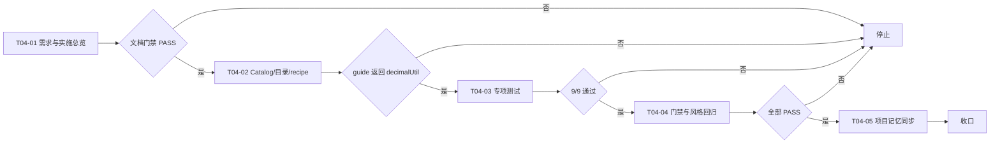
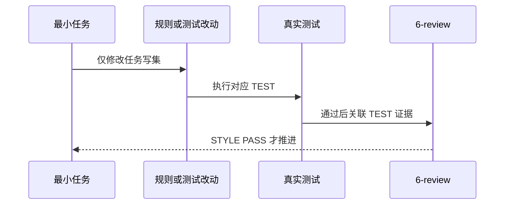

# 目录用法入口升级（含 Decimal 收录）：实施总览

结论：目录位置规则升级为目录驱动的用法入口，让 Catalog 每个目录节点都能关联代码风格、工具包写法、实用 recipe 和相关 skill，并将真实项目中的 Decimal 工具包收录为可查询规则。影响：编码时从目录查询直接获得用法指引，不再需要分别查多个 skill；金额与 Decimal 类型编码获得唯一落点。范围：Catalog Schema 元数据字段、guide CLI 子命令、目录用法索引文档、Go recipe 文档（含 Decimal）、Decimal 目录收录、契约测试和工程文档。非范围：不改动其他 skill 的 SKILL.md 正文，不改动既有 query/render/init/check/hash 子命令行为，不修改真实项目源码，不执行 Git 历史写入。变化：新增 guide 子命令、新增 4 个 Catalog 元数据字段、新增 Decimal 目录规则，专项测试从 5 个增至 9 个。完成标准：guide 子命令对七类 recipe 正确输出，9 个契约测试全绿，文档门禁 PASS。术语说明：guide 是 CLI 用法查询子命令；recipe 是跨 skill 的代码用法示例。验证状态：全部实施周期执行完毕，九个契约测试通过，文档门禁 PASS。

## 当前计划最终方案简要说明

采用"Catalog 元数据 + guide 查询 + recipe 索引"三层结构：Catalog 保存目录唯一事实和元数据字段，guide CLI 提供查询入口，recipe 文档提供代码用法示例。Decimal 作为真实项目工具包按同一机制收录，不新增独立 Skill，不改动 CLI 脚本与 Schema。

## Agent 对当前问题的理解

- 问题/目标：让 Catalog 从"目录位置规则"升级为"目录驱动的用法入口"，并把 Decimal 工具包收录为可查询规则。
- 本轮范围：Schema 元数据扩展、guide 子命令、索引文档、recipe 文档、Decimal Catalog 条目、目录树、专项测试、工程文档、项目记忆。
- 非范围：不改动其他 skill 的 SKILL.md 正文，不改动既有 CLI 子命令行为，不修改真实项目源码，不执行 Git 历史写入。
- 当前优先闭环：需求与实施总览 -> Catalog/目录/recipe -> 专项测试 -> 文档门禁与风格回归 -> 项目记忆同步。
- 关键假设：Decimal 作为项目无关、可独立复制的技术工具包，落点为后端根 `utils/decimal/`；Go 包别名 `decimalUtil`，与既有工具包命名风格一致。

## 实施周期总览

| 周期 | 目标 | 进入条件 | 收口条件 | 依赖 |
| --- | --- | --- | --- | --- |
| `CYCLE-01` | Schema 扩展 + 目录事实收敛 | 计划确认 | Schema 校验通过，Catalog 101 条 | 无 |
| `CYCLE-02` | guide 子命令 + 六类 Go recipe | CYCLE-01 完成 | guide 六类 recipe 正确输出 | CYCLE-01 |
| `CYCLE-03` | 测试、工程文档与收口 | CYCLE-02 完成 | 5/5 测试通过，字典退出码 0 | CYCLE-02 |
| `CYCLE-04` | Decimal 目录规则收录 | CYCLE-03 完成 | guide Decimal 返回 decimalUtil，9/9 测试通过，门禁 PASS | CYCLE-03 |

图形目的：展示从需求到实施周期再到测试与风格回归的整体追踪链。关联 ID：REQ-PSR-DIR-USAGE-001、CHG-PSR-DIR-USAGE-DECIMAL-001。


图形目的：展示最小任务推进顺序和失败停止点。关联 ID：CYCLE-01 至 CYCLE-04。



图形目的：展示单个最小任务的实现、测试和风格回归闭环顺序。关联 ID：T04-01 至 T04-05。



## 阶段计划

| 阶段 | 周期 | 唯一目标 | 输出 | 验证 |
| --- | --- | --- | --- | --- |
| `PHASE-DU-01` | CYCLE-01/02 | 目录用法入口建立 | Schema、Catalog、guide、索引、recipe | guide 六类 recipe 输出 |
| `PHASE-DU-02` | CYCLE-03 | 测试与文档收口 | 契约测试、测试 README、6-review | 5/5 测试通过、字典退出码 0 |
| `PHASE-DU-03` | CYCLE-04 | Decimal 目录收录 | Catalog 条目、目录树、recipe、专项测试、工程文档 | guide Decimal 查询、9/9 测试、门禁 PASS |

## 最小任务清单

| 任务 | 垂直切片 | 文件/符号 | 真实测试 | 完成条件 | 停止条件 | 最大推进边界 |
| --- | --- | --- | --- | --- | --- | --- |
| T04-01 | 更新需求、实施总览并新增周期文档 | doc/2-需求/2026-08-08_REQ-PSR-DIR-USAGE-001_目录用法入口升级.md、doc/3-实施/2026-08-08_REQ-PSR-DIR-USAGE-001_实施总览.md、doc/3-实施/2026-08-09_REQ-PSR-DIR-USAGE-001_实施周期04_Decimal目录用法收录.md | validate_engineering_docs.py --profile requirement / implementation_overview / implementation_cycle | 三份文档 profile PASS | 门禁失败 | 仅限文档 |
| T04-02 | 新增 Catalog 条目、两棵目录树、util 职责与包名例外 | placement-catalog.yaml、project-layout-v2.md、backend-util-layout.md | guide --category decimal --language go | 返回 decimalUtil 别名 | 查询失败 | 仅限 reference 文件 |
| T04-03 | 新增完整 Decimal recipe、目录路由、SKILL 示例和 4 个测试 | usage-recipes-go.md、directory-usage-routing.md、SKILL.md、backend_utils_usage_routing_test.py | backend_utils_usage_routing_test.py | 9/9 通过 | 测试失败 | 仅限 recipe/索引/测试 |
| T04-04 | 全量回归、quick validation、文档门禁、测试证据和 6-review | doc/5-tests/2026-08-08_REQ-PSR-DIR-USAGE/README.md、doc/6-review/2026-08-08_REQ-PSR-DIR-USAGE_6-review.md | 专项测试 + py_compile + git diff --check + 文档门禁 | 全部验证通过 | 任一失败 | 仅限证据文档 |
| T04-05 | 同步项目四件套 | PROJECT_CURRENT.md、PROJECT_MEMORY.md、PROJECT_HISTORY.md | N/A + 不涉及真实测试，纯记忆文档 + UTF-8 回读替代 | 文件更新完成且 UTF-8 无乱码 | 文件被外部改动或编码漂移 | 仅限记忆文件 |

## 现状与落点

```text
doc/
├── 2-需求/
│   └── 2026-08-08_REQ-PSR-DIR-USAGE-001_目录用法入口升级.md   # 需求文档 v1.1
├── 3-实施/
│   ├── 2026-08-08_REQ-PSR-DIR-USAGE-001_实施总览.md            # 本文件
│   └── 2026-08-09_REQ-PSR-DIR-USAGE-001_实施周期04_*.md         # CYCLE-04 周期文档
├── 5-tests/
│   └── 2026-08-08_REQ-PSR-DIR-USAGE/README.md                  # 测试 README 9/9
└── 6-review/
    └── 2026-08-08_REQ-PSR-DIR-USAGE_6-review.md                # 6-review 记录

package-structure-rules/
├── references/
│   ├── placement-catalog.yaml          # backend.utils.decimal 条目
│   ├── project-layout-v2.md            # utils/decimal 目录节点
│   ├── backend-util-layout.md          # Decimal 职责行与包别名
│   ├── usage-recipes-go.md             # decimal recipe 小节
│   └── directory-usage-routing.md      # utils/decimal 索引行
├── SKILL.md                            # guide 示例追加 Decimal

test/
└── package-structure-rules/
    └── backend_utils_usage_routing_test.py  # 4 个 Decimal 专项测试
```

## 真实测试安排

| 测试入口 | 覆盖任务 | 通过标准 | 当前状态 |
| --- | --- | --- | --- |
| guide --category decimal --language go | T04-02 | 返回 decimalUtil 别名 | PASS |
| backend_utils_usage_routing_test.py | T04-03 | 9/9 | PASS |
| py_compile backend_utils_usage_routing_test.py 与 placement_catalog.py | T04-04 | 退出码 0 | PASS |
| git diff --check | T04-04 | 无 whitespace 错误 | PASS |
| validate_engineering_docs.py --profile requirement | T04-01 | valid: true | PASS |
| validate_engineering_docs.py --profile implementation_overview | T04-01 | valid: true | 本周期执行 |
| validate_engineering_docs.py --profile implementation_cycle | T04-01 | valid: true | PASS |

免测任务及理由：T04-05（纯记忆文档，无可执行代码）——UTF-8 回读与 `git diff --check` 替代真实测试。

## 风险与阻断项

| 风险 | 概率 | 影响 | 缓解措施 | 最大推进边界 |
| --- | --- | --- | --- | --- |
| guide 新增 Decimal 分类影响既有输出 | 低 | 低 | 仅 backend 条目启用，不改变其他分类行为 | 仅限 reference 文件 |
| 目录树与 Catalog 不一致 | 低 | 中 | 专项测试断言目录树、recipe、索引与 Catalog 一致 | 仅限规则文本 |
| 既有未提交改动被意外覆盖 | 低 | 高 | 不执行 git reset/git checkout/git commit/git push | 工作树保护 |
| Obsidian 固定根未注册 | 中 | 低 | 仅阻断知识沉淀，不阻断仓库规则实施，最终如实记录 | 不调用 Obsidian CLI |

任务停止 / 结束条件总表：T04-01 至 T04-05 各自完成条件满足后停止；全部完成后整体结束。

## 自审结论

| 检查项 | 结果 | 证据 |
| --- | --- | --- |
| 覆盖度检查 | PASS | 10 个文件变更覆盖需求、实施总览、周期文档、Catalog、目录树、recipe、索引、SKILL、测试、记忆 |
| 实施周期检查 | PASS | 4 个周期，CYCLE-04 含 5 个最小任务，按依赖顺序排列 |
| 最小任务闭环检查 | PASS | 每个任务有实现、测试（或免测理由）、6-review |
| 阶段单一目标检查 | PASS | 阶段 1 入口建立，阶段 2 测试收口，阶段 3 Decimal 收录 |
| 占位词检查 | PASS | 无占位词 |
| 可执行性检查 | PASS | 所有测试入口、命令、通过标准已写清 |
| 图文一致性检查 | PASS | Mermaid 流程图步骤与实施步骤一致 |
| unresolved_decisions 检查 | PASS | 零个未决决策 |

图片资产决策：N/A + 原因 + 证据：本实施计划使用 Mermaid 图示，不需要位图资产。

## 执行附录

本实施在 `C:\Users\luode\.codex\skills` 仓库执行，Python 3 测试环境，`go` 无需安装（纯规则仓库）。所有测试命令与通过状态见真实测试安排表。Obsidian 固定根未注册，知识沉淀阻断但仓库实施不受影响。

## 追踪附录

| ID | 类型 | 来源 | 完成条件 | 测试证据 | 6-review |
| --- | --- | --- | --- | --- | --- |
| REQ-PSR-DIR-USAGE-001 | 需求 | 用户讨论 | 目录用法入口建立完成 | requirement profile PASS | STYLE: PASS |
| CHG-PSR-DIR-USAGE-DECIMAL-001 | 需求 | 用户提供 Decimal 源码 | Decimal 目录收录完成 | 9/9 专项测试 | STYLE: PASS |
| AC-GUIDE-001 至 005 | 验收 | guide 五类 recipe | guide 查询正确 | backend_utils_usage_routing_test.py | STYLE: PASS |
| AC-DECIMAL-001 至 004 | 验收 | Decimal 收录 | guide/目录树/recipe/索引一致 | backend_utils_usage_routing_test.py | STYLE: PASS |
| T04-01 | 最小任务 | 工程文档 | 三份文档 profile PASS | validate_engineering_docs.py | STYLE: PASS |
| T04-02 | 最小任务 | Catalog/目录/recipe | guide 返回 decimalUtil | guide 命令 | STYLE: PASS |
| T04-03 | 最小任务 | 专项测试 | 9/9 通过 | backend_utils_usage_routing_test.py | STYLE: PASS |
| T04-04 | 最小任务 | 门禁与风格回归 | 全部验证 PASS | 测试与门禁命令 | STYLE: PASS |
| T04-05 | 最小任务 | 项目记忆同步 | 文件更新完成 | UTF-8 回读 | STYLE: PASS |
