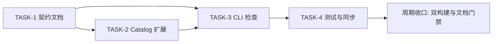
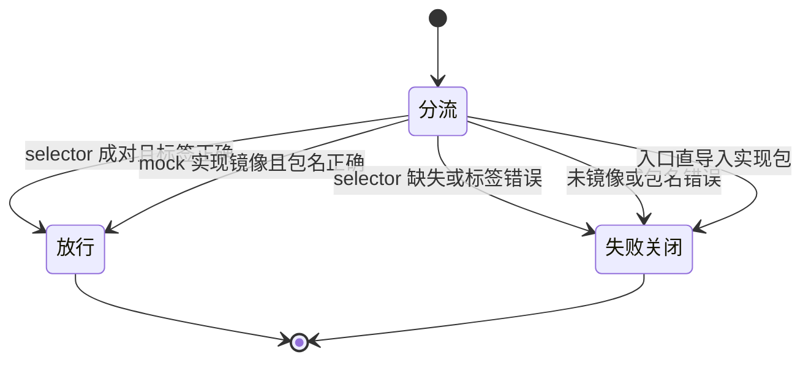

# 代码位置目录规则 V2 实施周期 01：运行时 Mock 目录与装配契约

结论：本周期把 `package-structure-rules` 从"声明 `mock/` 是合法目录"升级为"Catalog 可查询、CLI 可检查、Go 后端可验证"的运行时 Mock 规范。影响：所有按本规则组织 Go 后端和前后端同仓后端的项目，以及执行目录检查的自动化入口。范围：Go 运行时 Mock 的目录树、入口选择器、装配桥、机器可读目录清单、只读检查工具、正反例测试、目录树文档和 Skill 字典。非范围：前端 `mocks/`、Java/Node/Python Mock、测试专用 Mock、业务 Mock 行为设计、真实业务代码迁移和任何写入版本历史的动作。变化：新增 `runtime-mock-layout-go.md` 专项契约、5 类 Mock Catalog 元数据、CLI 对 selector 配对/构建标签/包名/镜像/导入边界的只读检查，以及配套测试。完成标准：Catalog 查询唯一、合法样例 strict/adoption 通过、每类违规稳定失败关闭、普通构建与 mock 构建均通过、目录文档与字典一致。术语说明：`selector` 指 `main_mock.go` 与 `main_real.go` 两份入口选择文件；`assembly` 指 `mock/assembly` 装配桥接包。验证状态：四个最小任务均已完成实现、真实测试和风格回归，全部通过。

## 当前周期最终方案简要说明

推荐方案：在现有 `package-structure-rules` 内增加 Go 运行时 Mock 专项规范、Catalog 元数据和只读检查，不新增独立 Skill。主落点是 `package-structure-rules/references`、`placement-catalog.yaml`、`placement_catalog.py` 及其测试；之所以这么做，是因为当前已有 `mock/` 和 `vscode-mock-launch.md`，缺口主要是规则分散且缺少机器校验，补强现有 Owner 的改动最小。

## Agent 对当前问题的理解

| 项目 | 结论 |
|---|---|
| 问题/目标 | 让 Mock 的目录位置、入口选择器、构建标签和装配边界能被 Catalog 查询并被 CLI 自动检查 |
| 本周期范围 | Go 后端及前后端同仓后端的运行时 Mock；覆盖规则、Catalog、Schema、CLI、测试、目录树与字典 |
| 非范围 | 前端 `mocks/`、Java/Node/Python Mock、测试专用 Mock、业务 Mock 行为设计、真实业务迁移 |
| 优先闭环 | 目录位置 -> 构建标签 -> 入口选择器 -> assembly 装配 -> strict/adoption 检查 -> 测试验证 |
| 关键假设 | 根入口为独立后端 `main.go`；同仓后端对应 `backend/main.go`；额外二进制沿用同样的入口配对规则 |
| 当前状态 | `TASK-1` 至 `TASK-4` 均已完成，前置取舍已由用户在需求阶段全部选定 |
| 最大推进边界 | 完成 Skill 规则、Catalog、CLI、测试和目录树文档同步；不修改业务 Mock 实现，不提交 Git |

## 当前周期目标、边界与进入条件

| 项目 | 冻结内容 |
|---|---|
| 周期目标 | 让 `mock/` 的目录镜像、selector 配对、build tag、assembly 包名和入口导入边界形成机器可验证闭环 |
| 范围 | `runtime-mock-layout-go.md`、`placement-catalog.yaml`、`placement-catalog.schema.json`、`placement_catalog.py`、`runtime_mock_layout_test.py`、`project-layout-v2.md`、`SKILL.md`、Skill 字典和外部项目目录树文档 |
| 非范围 | 前端 `mocks/`、Java/Node/Python Mock、测试专用 Mock、业务 Mock 行为设计、真实业务 Mock 迁移 |
| 进入条件 | 用户已确认升级深度、语言范围和入口强度；当前 Mock 路径和入口事实已核对 |
| 收口条件 | 5 类 Mock Catalog 查询唯一；合法样例 strict/adoption 通过；每类违规非零退出；双构建通过；字典生成退出码 0；文档门禁通过 |
| 图片资产决策 | 图片资产决策：N/A + 原因：本周期不涉及界面、截图或视觉验收对象 + 证据：任务依赖与判定关系已由本文两张 Mermaid 图表达 |

## 当前代码/文档基线

| 项目 | 基线 |
|---|---|
| 基线提交 | 未提交工作树；`git status` 显示本仓库存在既有未提交改动 |
| 工作树状态 | 进入本周期前工作树包含目录用法升级等既有未提交改动，本周期不覆盖、不还原 |
| 被修订的历史结论 | 既有 `backend.mock.runtime` 与 `fullstack.mock.runtime` 只有根条目，缺少 selector/assembly/implementation 分类和机器约束 |
| 关键基线事实 | `F:\binance-wangge-go` 已存在 `mock/assembly`、`main_mock.go`、`main_real.go` 和镜像实现，是正例基准 |
| 关键基线事实 | 根入口 `main.go` 只调用 `newXxx()` selector，不直接判断 Mock |
| 关键基线事实 | 现有 Catalog 是 JSON 兼容 YAML，Schema 未声明 `paired_with`、`required_build_tag` 等 Mock 元数据字段 |

## 文件/符号操作契约

| 序号 | 文件/符号 | 操作 | 契约 |
|---|---|---|---|
| 1 | `package-structure-rules/references/runtime-mock-layout-go.md` | 新增 | 定义目录树、入口选择器、assembly、镜像、包名、构建命令和反例 |
| 2 | `package-structure-rules/references/placement-catalog.yaml` | 修改 | 为 backend/fullstack 各增加 root、selector-mock、selector-real、assembly、implementation 五类 Mock 条目 |
| 3 | `package-structure-rules/references/placement-catalog.schema.json` | 修改 | 新增 Mock 元数据字段与分类约束 |
| 4 | `package-structure-rules/scripts/placement_catalog.py` | 修改 | `guide` 支持 `runtime-mock`；新增 `check_runtime_mock_structure`；adoption 放行合法 selector 与 `mock` 根 |
| 5 | `test/package-structure-rules/runtime_mock_layout_test.py` | 新增 | 覆盖 Catalog 查询、strict 正反例、adoption 分流和 reference 一致性 |
| 6 | `package-structure-rules/references/project-layout-v2.md` | 修改 | 三类项目树的 `mock/` 节点补充 assembly 与实现镜像说明 |
| 7 | `package-structure-rules/SKILL.md` | 修改 | 唯一事实源、核心边界 8.1 与 guide 示例引用专项契约；不新增二级标题 |
| 8 | `skill-dictionary/data.js` 与 `字典.md` | 重新生成 | 字典生成脚本退出码 0，`implemented_total` 保持 69 |
| 9 | `F:\binance-wangge-go\doc\1-架构\2-目录树.md` | 修改 | 记录 selector、assembly 和测试 Mock 边界；不改业务 Mock 实现 |

### 任务依赖关系

图形目的：说明本周期四个最小任务的先后依赖，解释为什么规则与 Catalog 必须先于 CLI 检查。关联 ID：`TASK-1` 至 `TASK-4`。

### 判定分流与预期结论

图形目的：说明 CLI 对合法结构和各类违规的分流结论，作为真实测试断言的依据。关联 ID：`TASK-3`、`TASK-4`。

## 周期内最小任务执行顺序

必须逐个闭环：每个任务先实现，再跑自己的真实测试，再做风格回归，通过后才允许推进下一个任务。禁止先做完多个任务再统一验证。

| 顺序 | 任务 ID | 任务 | 文件数 | 依赖 |
|---|---|---|---|---|
| 1 | `TASK-1` | 建立 Go 运行时 Mock 契约文档 | 1 | 无 |
| 2 | `TASK-2` | 扩展 Catalog 与查询契约 | 2 | `TASK-1` 已闭环 |
| 3 | `TASK-3` | 实现 Mock 结构检查 | 1 | `TASK-2` 已闭环 |
| 4 | `TASK-4` | 补充正反例测试与项目同步 | 不超过 5 | `TASK-3` 已闭环 |

## 最小任务闭环

### TASK-1 建立 Go 运行时 Mock 契约

| 项目 | 内容 |
|---|---|
| 产出 | `runtime-mock-layout-go.md`，包含目录树、入口选择器、assembly、镜像、包名、反例和构建命令 |
| 文件/符号 | 操作契约第 1 项 |
| 真实测试 | Markdown 结构检查由 `TASK-4` 的 `test_reference_and_catalog_are_consistent` 覆盖；本任务同时人工核对规则与计划一致 |
| 通过标准 | 规范包含目录树、正例、反例、构建命令和边界说明；Catalog reference 测试引用可命中 |
| 停止条件 | 发现规则需要跨语言抽象或改变现有合法路径时停止并回到需求决策 |
| 最大推进边界 | 只新增 1 个 reference 文件 |

### TASK-2 扩展 Catalog 与查询契约

| 项目 | 内容 |
|---|---|
| 产出 | backend/fullstack 各 5 类 Mock Catalog 条目，Schema 新增 Mock 元数据字段与约束 |
| 文件/符号 | 操作契约第 2、3 项 |
| 真实测试 | `test_catalog_mock_categories_are_unique_and_guide_returns_recipe`：对 10 个分类执行 query，断言唯一；`guide --category runtime-mock --language go` 返回 10 条配方 |
| 通过标准 | 每种项目类型和分类查询最多返回一个唯一条目；Schema 字段存在；guide 返回完整配方 |
| 停止条件 | 需要改变既有 mock 根条目 ID 兼容性时停止 |
| 最大推进边界 | 只改 Catalog 与 Schema |

### TASK-3 实现 Mock 结构检查

| 项目 | 内容 |
|---|---|
| 产出 | `check_runtime_mock_structure` 支持 selector 配对、build tag、函数集合、镜像、包名和导入边界检查 |
| 文件/符号 | 操作契约第 4 项 |
| 真实测试 | `test_strict_accepts_good_runtime_mock_layout` 与 `test_strict_rejects_bad_runtime_mock_layouts_without_writing`：8 类违规均非零退出且不写入 fixture |
| 通过标准 | 合法样例 strict 通过；每类违规返回稳定错误；错误退出码为 2；目录哈希不变 |
| 停止条件 | 需要完整 Go AST 或引入新依赖时停止，优先收缩到已冻结的静态契约 |
| 最大推进边界 | 只改 `placement_catalog.py` |

### TASK-4 补充正反例测试与项目同步

| 项目 | 内容 |
|---|---|
| 产出 | 新增测试文件、目录树文档同步、SKILL 引用、字典重新生成和真实项目双构建证据 |
| 文件/符号 | 操作契约第 5、6、7、8、9 项 |
| 真实测试 | `python -m unittest test/package-structure-rules/runtime_mock_layout_test.py`；`check --root F:/binance-wangge-go --policy adoption`；`go build -mod=vendor .`；`go build -tags mock -mod=vendor .`；字典生成脚本 |
| 通过标准 | 新增测试全部通过；目录文档、Catalog、reference、CLI 和字典一致；普通/mock 构建均通过 |
| 停止条件 | 当前项目 adoption 检查因既有遗留快照失败时，不扩大规则豁免，记录阻断证据 |
| 最大推进边界 | 不超过 5 个文件；不改业务 Mock 实现 |

## 当前周期验证矩阵

| 验证项 | 命令/入口 | 通过标准 | 证据 |
|---|---|---|---|
| Catalog 查询 | `placement_catalog.py query --artifact mock --category <分类>` | 10 个分类各返回唯一条目 | `runtime_mock_layout_test.py::test_catalog_mock_categories_are_unique_and_guide_returns_recipe` |
| strict 正例 | `placement_catalog.py check --policy strict` | backend/fullstack 正例均退出码 0 | `test_strict_accepts_good_runtime_mock_layout` |
| strict 反例 | `placement_catalog.py check --policy strict` | 8 类违规均退出码 2 且哈希不变 | `test_strict_rejects_bad_runtime_mock_layouts_without_writing` |
| adoption 分流 | `placement_catalog.py check --policy adoption` | 遗留 Mock 跳过、新增 Mock 校验 | `test_adoption_skips_legacy_mock_and_validates_new_mock` |
| 双构建 | `go build -mod=vendor .` 与 `go build -tags mock -mod=vendor .` | 两个命令退出码 0 | 本周期真实命令输出 |
| 字典 | `skill-dictionary/generate_dictionary.py` | 退出码 0，`implemented_total` 69 | 脚本 JSON 摘要 |

## 周期阻断、停止与回滚

| 项目 | 冻结内容 |
|---|---|
| 阻断 | `F:\binance-wangge-go` adoption 检查报告 `test/binance/mock_gateway_test.go` 与 `test/scalp/oracle_mock_test.go` 不在既有 `test/` 遗留快照；这是既有遗留快照与新加测试文件的不一致，不属于本轮运行时 Mock 规则，按计划不扩大豁免并记录阻断证据 |
| 停止条件 | 需要完整 Go AST、引入新依赖、改变既有 mock 根兼容性或要求迁移真实业务 Mock 时停止 |
| 回滚 | 删除本轮新增的 reference、测试和 Mock Catalog 条目，还原 `placement_catalog.py` 的检查函数与 `guide` 分支，重跑字典和目录树渲染即可回到改动前状态；检查过程只读，不自动创建、迁移或删除用户文件 |
| 文件/符号 | 所有回滚动作只针对本周期列出的文件与符号，不触碰既有未提交改动 |
| 真实测试 | 回滚后重跑 `test/package-structure-rules` 全量回归确认无残留断言 |

## 自审结论

| 项目 | 结论 |
|---|---|
| 覆盖度 | 已覆盖入口、目录、装配、标签、包名、导入边界、测试和迁移兼容 |
| 周期检查 | 4 个最小任务按依赖顺序推进，每个任务均有真实测试与风格回归 |
| 可执行性 | 文件落点、CLI 行为、命令和通过标准已冻结 |
| 用户确认状态 | 升级深度、语言范围、入口强度均已确认 |
| 收口要求 | `skill-execution-compliance-gate-rules` 与 `skill-audit-rules` 已执行，最终风格回归为 `STYLE: PASS` |

## 执行附录

- 所有命令均在本地执行；禁止使用 test/prod/live 配置或外部连接。
- 目录规则检查保持只读，不自动创建、迁移、删除或修改项目文件。
- 双构建命令在 `F:\binance-wangge-go` 本地执行，不访问数据库、Binance testnet 或 live。
- adoption 阻断证据记录在本周期验证矩阵，不扩大 `test/` 遗留快照豁免。

## 追踪附录

| 稳定 ID | 规则 | 任务 | 测试 | 文件/符号 |
|---|---|---|---|---|
| RULE-MOCK-DIR-001 | Mock 根与镜像路径 | TASK-1/2 | Catalog 查询测试 | runtime-mock-layout-go.md, placement-catalog.yaml |
| RULE-MOCK-DIR-002 | selector 配对与 build tags | TASK-2/3 | good/bad fixture | placement_catalog.py |
| RULE-MOCK-DIR-003 | assembly 与 internal 可见性边界 | TASK-3 | 入口导入检查 | placement_catalog.py |
| RULE-MOCK-DIR-004 | 普通/mock 构建隔离 | TASK-4 | 两套 go build | F:\binance-wangge-go |
| RULE-MOCK-DIR-005 | 目录树、Catalog、CLI、文档一致 | TASK-4 | pytest、adoption 检查、字典校验 | project-layout-v2.md, SKILL.md, 字典.md |
