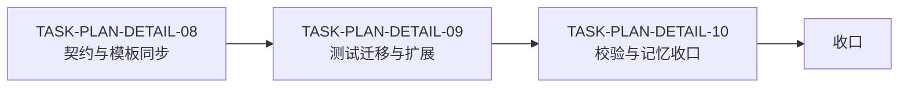
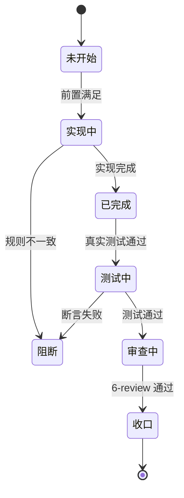

# CYCLE-PD-02：模板闸门测试与收口

结论：本周期完成跨会话契约、模板闸门同步、测试迁移扩展与项目记忆收口；影响：正式计划可跨会话独立执行，外部引用地址完整可复现；范围：`implementation-planning-rules` 规则与测试资产、五份正式文档、项目记忆；非范围：相邻 skill、Desktop 产品源码、其它会话改动与 Git 历史写入；变化：计划输出从骨架升级为零决策跨会话任务卡；完成标准：六项验收条件全部通过；术语说明：`EXT-*` 是外部项目引用标识；验证状态：实施中。图片资产决策：`N/A + 原因`：本周期只涉及文本规则、测试 fixture 与文档 `+ 证据`：任务依赖图与状态机图已表达全部关系。

## 当前周期目标、边界与进入条件

目标：完成 3 个最小任务的实现、真实测试与 6-review 闭环。进入条件：需求已确认、基线核对完成、无未决决策、用户已授权默认执行。边界：只改 `implementation-planning-rules`、`test/implementation-planning-rules/`、五份正式文档与项目记忆，不触碰其它会话写集，不提交 Git。

## 当前代码/文档基线

- 分支 / 提交：`main` / `32c1e32e98f08f1ec9250264073e6b7d72df07aa`。
- 已核实文件和符号：`cross-session-plan-execution-contract.md`、`plan-output-gate.md` 字段矩阵、`plan-structure-template.md` 阶段字段、`test/implementation-planning-rules/plan_output_contract_test.py`。
- 依赖版本与 local 配置：Python 3，仓库自带脚本，无外部服务。
- 与计划不一致时的停止规则：发现符号不存在、接口已变化或基线不一致，立即停止并回写 `GAP-PD-*`，不得猜测替代落点。

## 跨会话执行入口与外部项目代码引用

- 新会话接手第一步：读取本周期文档，进入 `F:/luode-skills`，核对基线 `32c1e32e98f08f1ec9250264073e6b7d72df07aa`，从第一个未完成 `TASK-PLAN-DETAIL-*` 开始。
- 主项目名称与项目根：`luode-skills`，`F:/luode-skills`。
- 主项目仓库类型与代码基线：Git 仓库，HEAD `32c1e32e98f08f1ec9250264073e6b7d72df07aa`。
- 当前周期 / 任务标识与中断点核验顺序：`CYCLE-PD-02`；先核对 `git status` 与规则文件 diff，再核对测试入口与文档。
- local 环境与依赖入口：Python 3，全部命令在 `F:/luode-skills` 本地执行。
- 外部项目代码引用：`N/A + 原因`：本周期不读取其他项目代码 `+ 证据`：全部落点均为本仓库路径，`F:/other-project` 仅为测试 fixture 脱敏值。

## 周期内最小任务执行顺序

| 顺序 | 任务 ID | 唯一目标 | 前置依赖 | 允许文件 | 禁止触碰区 | 状态 |
|---|---:|---|---|---|---|---|
| 1 | `TASK-PLAN-DETAIL-08` | 补齐跨会话契约与模板闸门同步 | 需求确认 | 6 个参考文件、`agents/openai.yaml` | 其它 skill 目录 | in_progress |
| 2 | `TASK-PLAN-DETAIL-09` | 迁移测试并扩展到 15 项 | `TASK-PLAN-DETAIL-08` | `test/implementation-planning-rules/` | 历史只读文档正文 | pending |
| 3 | `TASK-PLAN-DETAIL-10` | 执行校验并同步项目记忆 | `TASK-PLAN-DETAIL-09` | 五份正式文档、记忆文件 | 其它会话写集 | pending |

## 最小任务闭环

每个任务固定执行"实现 -> 真实测试 -> 6-review"；任何一步失败立即停止当前周期并保留失败证据，不跨任务推进。禁止先连续实现多个任务再统一验证。

## 文件与符号操作契约

| 任务 | 文件路径 | 符号/区段 | 操作 | 修改前职责 | 修改后职责 | 调用方影响 | 兼容要求 |
|---|---|---|---|---|---|---|---|
| `TASK-PLAN-DETAIL-08` | `implementation-planning-rules/references/plan-structure-template.md` | 阶段字段 | 删除错位字段 | 阶段字段含跨会话检查 | 阶段字段只承载单一目标 | 模板使用者 | 与 2.3 清单一致 |
| `TASK-PLAN-DETAIL-08` | `implementation-planning-rules/references/plan-output-gate.md` | 正式字段矩阵 | 新增两行 | 矩阵缺跨会话行 | 矩阵含跨会话与 EXT-* 行 | 闸门判定 | hard-fail 判定一致 |
| `TASK-PLAN-DETAIL-08` | 总览/周期/入口/Agent 提示词 | 跨会话章节 | 新增字段 | 缺跨会话字段 | 全部含跨会话清单 | 模板使用者 | 与契约文件一致 |
| `TASK-PLAN-DETAIL-09` | `test/implementation-planning-rules/plan_output_contract_test.py` | 测试类 | 迁移并扩展 | 历史位置 12 项 | 活动位置 15 项 | 回归执行者 | 15/15 通过 |
| `TASK-PLAN-DETAIL-09` | `test/implementation-planning-rules/fixtures/plan_output_cases.json` | fixture | 迁移 | 历史位置 | 活动位置 | 测试执行者 | JSON 可解析 |
| `TASK-PLAN-DETAIL-10` | 五份正式文档 | 文档结构 | 新增 | 无 | profile 全 PASS | 新会话接手者 | 文档门禁通过 |
| `TASK-PLAN-DETAIL-10` | `PROJECT_MEMORY.md`、`PROJECT_HISTORY.md` | 记忆条目 | 更新 | 无本轮记录 | 记录本轮决策与历史 | 后续会话 | 保留其它会话内容 |

## 当前周期验证矩阵

| 测试 ID | 对应任务 | 精确命令 | local 依赖 | fixture/数据 | 断言 | 失败预期 | 清理 |
|---|---|---|---|---|---|---|---|
| `TEST-PD-09-01` | `TASK-PLAN-DETAIL-09` | `python -X utf8 -B test/implementation-planning-rules/plan_output_contract_test.py` | Python 3 | 脱敏 fixture | 15 项全 PASS | 任一断言失败 | 无持久化数据 |
| `TEST-PD-09-02` | `TASK-PLAN-DETAIL-09` | 测试内子进程 | Python 3 | 状态机用例 | 10 项回归 PASS | 子进程退出码非 0 | 无 |
| `TEST-PD-10-01` | `TASK-PLAN-DETAIL-10` | `validate_engineering_docs.py` 五档 | Python 3 | 正式文档 | `valid: true` | 任一 profile 失败 | 无 |
| `TEST-PD-10-02` | `TASK-PLAN-DETAIL-10` | `validate_engineering_docs.py --strict` | Python 3 | 四档文档 | 全 PASS | 任一 profile 失败 | 无 |
| `TEST-PD-10-03` | `TASK-PLAN-DETAIL-10` | 字典生成与 `git diff --check` | Python 3 | 仓库字典 | 退出码 0 | 任一步骤失败 | 无 |

## 回滚与停止条件

- `ROLLBACK-PD-01`：先删除新增行与新增文件，再逐文件回读确认；不使用 `git reset` 或 `git checkout`。
- 停止条件：命令失败、断言失败、依赖不可用、数据不符合前置、计划落点不存在或发现安全/数据损坏风险。
- 恢复路径：回到 `TASK-PLAN-DETAIL-08` 重新同步规则，补证据后重启。
- 当前 agent 最大推进边界：周期收口后停在已改动未提交，不写 Git 历史。

## 周期阻断、停止与回滚

- 停止：任一测试失败、profile 失败、发现未授权扩散改动、工作树冲突、用户要求停止。
- 回滚：只删除本周期新增行与新增文件，不触碰其它会话改动，不使用 `git reset` / `git checkout`。

## 周期追踪矩阵

| `REQ-*` / `RULE-*` | `AC-*` | `TASK-*` | 文件/符号 | `TEST-*` | `STYLE-*` | `EVIDENCE-*` | 闭环状态 |
|---|---|---|---|---|---|---|---|
| `REQ-PD-001/002/003` | `AC-PD-001/002` | `TASK-PLAN-DETAIL-08` | 六份规则文件 | `TEST-PD-09-01` | `STYLE-PD-01` | `EVD-TASK-PLAN-DETAIL-08-TEST-01` | 实施中 |
| `REQ-PD-004/005/006` | `AC-PD-001/002` | `TASK-PLAN-DETAIL-09` | 测试与 fixture | `TEST-PD-09-01/02` | `STYLE-PD-01` | `EVD-TASK-PLAN-DETAIL-09-TEST-01`、`EVD-TASK-PLAN-DETAIL-09-TEST-02` | 实施中 |
| `REQ-PD-007/008` | `AC-PD-003..006` | `TASK-PLAN-DETAIL-10` | 五份文档与记忆 | `TEST-PD-10-01..04` | `STYLE-PD-01` | `EVD-TASK-PLAN-DETAIL-10-TEST-01`、`EVD-TASK-PLAN-DETAIL-10-TEST-02`、`EVD-TASK-PLAN-DETAIL-10-TEST-03`、`EVD-TASK-PLAN-DETAIL-10-TEST-04` | 待执行 |

## 周期内任务依赖图

图形目的：展示 `TASK-PLAN-DETAIL-08..10` 的依赖顺序；关联 ID：`CYCLE-PD-02`。

## 任务闭环状态机

图形目的：展示最小任务的状态迁移；关联 ID：`TASK-PLAN-DETAIL-08..10`。

## 自审结论

- 每个任务是否只承载一个目标：已覆盖，三个任务目标互斥。
- 是否按实现 -> 真实测试 -> 6-review 逐个闭环：已覆盖，禁止批量实现后统一测试。
- 是否存在未决决策或模糊落点：已覆盖，无未决决策，落点精确到文件与区段。
- 图形、表格和正文是否一致：已覆盖，任务依赖图与执行顺序一致，状态机与停止条件一致。

## 执行附录

- 本地执行顺序：先运行 15 项契约测试，再运行等待模型回归，随后运行五档文档 profile 与字典生成，最后 `git diff --check`。
- 清理与回滚顺序：删除临时投影输入 `.codex-plan-projection-input.json`；回滚按 `ROLLBACK-PD-01` 执行。

## 追踪附录

- 稳定 ID：`REQ-PLAN-DETAIL-COMPLETE-002`、`AC-PD-001..006`、`CYCLE-PD-02`、`TASK-PLAN-DETAIL-08..10`、`TEST-PD-09-01/02`、`TEST-PD-10-01..04`、`STYLE-PD-01`。
- 证据定位：`EVD-TASK-PLAN-DETAIL-08-TEST-01`、`EVD-TASK-PLAN-DETAIL-09-TEST-01/02`、`EVD-TASK-PLAN-DETAIL-10-TEST-01..04`。
