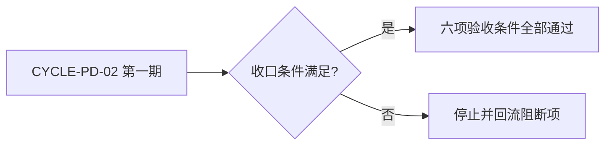
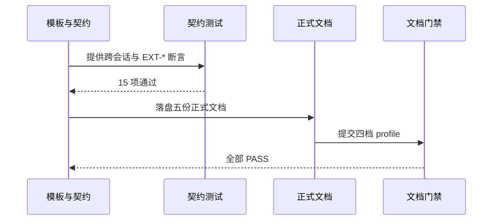

# 计划输出完整性与跨会话独立执行：实施总览

结论：本总览把计划输出完整度修复收敛为一个实施周期，按"契约与模板 -> 测试迁移与扩展 -> 校验与记忆收口"逐任务闭环；影响：所有 Plan Mode 正式计划将完整承载思考细节并支持新会话独立执行；范围：`implementation-planning-rules` 的模板、闸门、自审、契约、Agent 提示词、回归测试与正式文档；非范围：相邻 skill 核心行为、Desktop 产品源码、其它会话改动和 Git 历史写入；变化：计划从章节骨架升级为零决策跨会话任务卡；完成标准：六项验收条件全部可验证，四档文档 profile PASS；术语说明：`EXT-*` 是外部项目代码引用标识；验证状态：实施中，契约测试 15/15 已通过。

## 当前计划最终方案简要说明

推荐方案：全链路收口，把"思考细节必须落盘、跨会话自包含、外部引用 `EXT-*` 全字段"写入模板与闸门，迁移并扩展回归测试，最后落盘正式文档与项目记忆。主落点：`implementation-planning-rules/references/` 下 6 个模板与契约文件、`agents/openai.yaml`、`test/implementation-planning-rules/`。原因：问题根因是规则允许压缩、闸门只验章节标题、模板缺少跨会话字段，三者互为因果，必须全链路覆盖。

## Agent 对当前问题的理解

- 问题 / 目标：正式计划输出时省略思考细节，且未保证新会话独立执行；目标是把完整字段、跨会话清单和外部引用地址全部冻结进计划与闸门。
- 本轮范围：模板与契约同步、闸门字段矩阵、测试迁移与 15 项扩展、五份正式文档、项目记忆同步。
- 非范围：相邻 skill 核心行为、Codex Desktop 产品源码、`package-structure-rules` 其它会话改动、Git 历史写入。
- 当前优先闭环：先让模板、闸门、Agent 提示词与契约文件口径一致，再迁移测试并收口。
- 关键假设 / 待确认点：无未决决策；`F:/other-project` 仅为测试 fixture 脱敏值，本任务不存在真实外部项目引用。

## 跨会话独立执行与外部项目代码引用清单

- 新会话接手第一步：读取本实施总览与 `CYCLE-PD-02` 实施周期，核对 `F:/luode-skills` 工作树与基线 `32c1e32e98f08f1ec9250264073e6b7d72df07aa`，从第一个未完成 `TASK-PLAN-DETAIL-*` 开始。
- 主项目名称与项目根：`luode-skills`，本机绝对路径 `F:/luode-skills`。
- 主项目仓库类型与代码基线：Git 仓库，HEAD `32c1e32e98f08f1ec9250264073e6b7d72df07aa`。
- 计划源文件与版本：本实施总览、`doc/3-实施/2026-08-09_190217_REQ-PLAN-DETAIL-COMPLETE-002_实施周期01_模板闸门测试与收口.md`，v1.0。
- 依赖安装、local 配置和服务启动入口：Python 3 与仓库自带脚本，无外部服务；所有命令使用 local 工作树。
- 中断点核验顺序：先核对工作树 `git status`，确认 `implementation-planning-rules` 改动与计划一致，再核对 `test/implementation-planning-rules/` 测试入口，最后核对五份正式文档。
- 外部项目代码引用：`N/A + 原因`：本计划只修改 `F:/luode-skills` 自身规则、测试与文档，不读取、复制、对照、调用或修改其他项目代码 `+ 证据`：全部文件落点均为本仓库相对路径。

## 现状与落点

图片资产决策：`N/A + 原因`：本总览只涉及文本规则、目录树和文档，不存在界面或视觉产物 `+ 证据`：三张 Mermaid 图已表达周期、依赖与验证关系。

- 已核实目录：`implementation-planning-rules/references/`、`implementation-planning-rules/agents/`、`test/implementation-planning-rules/`、`doc/2-需求/`、`doc/3-实施/`、`doc/5-tests/`、`doc/6-review/`。
- 已核实基线：HEAD `32c1e32e98f08f1ec9250264073e6b7d72df07aa`；工作树同时存在另一会话 `package-structure-rules` 改动，本任务不触碰。
- 关键符号：`plan-output-gate.md` 正式字段矩阵、`plan-structure-template.md` 阶段字段、`implementation-overview-template.md` 跨会话清单、`implementation-cycle-template.md` 跨会话入口、`agents/openai.yaml` `default_prompt`。

```text
implementation-planning-rules/
├── SKILL.md                                # 已同步跨会话与 EXT-* 路由
├── agents/openai.yaml                      # 已同步跨会话自包含提示词
└── references/
    ├── cross-session-plan-execution-contract.md   # 新增契约
    ├── plan-output-gate.md                 # 已补字段矩阵两行
    ├── plan-structure-template.md          # 已修正阶段字段错位
    ├── implementation-overview-template.md # 已补跨会话清单
    ├── implementation-cycle-template.md    # 已补跨会话入口
    ├── plan-entry-checklist.md             # 已补交接检查项
    ├── minimum-task-execution-contract.md  # 已同步必填字段
    ├── plan-mode-and-cycle-contracts.md    # 已同步流程
    └── plan-review-checklist.md            # 已同步自审项
```

## 实施周期总览

| 顺序 | 周期 ID | 期次定位 | 单一周期目标 | 进入条件 | 收口条件 | 依赖 | 文档 |
|---|---|---|---|---|---|---|---|
| 1 | `CYCLE-PD-02` | 第一期 | 完成契约、测试与记忆收口 | 需求确认、基线核对、无未决决策 | `AC-PD-001..006` 全部通过，四档 profile PASS | `REQ-PLAN-DETAIL-COMPLETE-002` | `2026-08-09_190217_REQ-PLAN-DETAIL-COMPLETE-002_实施周期01_模板闸门测试与收口.md` |

图形目的：说明周期门禁和不可跳期规则。关联 ID：`CYCLE-PD-02`、`AC-PD-001..006`。



图形目的：说明三个最小任务的执行顺序与收口依赖。关联 ID：`CYCLE-PD-02`、`TASK-PLAN-DETAIL-08..10`。


图形目的：说明从规则同步到文档门禁的端到端验证关系。关联 ID：`AC-PD-001..006`。



## 阶段计划

| 阶段 | 周期 | 唯一目标 | 输入 | 输出 | 验证门槛 |
|---|---|---|---|---|---|
| `PHASE-PD-01` | `CYCLE-PD-02` | 同步契约、模板、闸门与 Agent 提示词 | `cross-session-plan-execution-contract.md` | 6 个参考文件与 `agents/openai.yaml` 口径一致 | 静态断言测试通过 |
| `PHASE-PD-02` | `CYCLE-PD-02` | 迁移并扩展回归测试 | 历史测试入口 | `test/implementation-planning-rules/` 15 项测试 | 15/15 通过且旧入口不残留 |
| `PHASE-PD-03` | `CYCLE-PD-02` | 落盘正式文档并同步记忆 | 实施产物与测试证据 | 五份正式文档、记忆更新、临时文件清理 | 四档 profile PASS、`git diff --check` 通过 |

## 最小任务清单

| 周期内顺序 | 任务 ID | 垂直切片目标 | 预计文件数 | 文件/符号契约 | 真实测试 | 完成条件 | 停止条件 |
|---|---|---|---:|---|---|---|---|
| 1 | `TASK-PLAN-DETAIL-08` | 补齐跨会话独立执行与外部引用地址契约 | 6 | 模板、闸门、自审、契约、入口清单、Agent 提示词 | `TEST-PD-09-01` | 六个文件同步且静态断言通过 | 断言失败、字段错位或发现敏感信息 |
| 2 | `TASK-PLAN-DETAIL-09` | 迁移测试并扩展到 15 项 | 3 | `test/implementation-planning-rules/` 测试与 fixture | `TEST-PD-09-01/02` | 15/15 与 10 项回归通过 | 任一测试失败或旧入口残留 |
| 3 | `TASK-PLAN-DETAIL-10` | 执行校验并同步项目记忆 | 8 | 五份正式文档、`PROJECT_MEMORY.md`、`PROJECT_HISTORY.md`、临时文件 | `TEST-PD-10-01..04` | 四档 profile PASS、字典退出码 0、临时文件清理 | profile 失败、字典失败或记忆文件损坏 |

## 追踪矩阵

| 来源/完成条件 | 周期 | 任务 | 文件/符号 | 测试 | 风格回归 | 证据 | 状态 |
|---|---|---|---|---|---|---|---|
| `AC-PD-001/002` | `CYCLE-PD-02` | `TASK-PLAN-DETAIL-08` | `implementation-planning-rules/references/*` | `TEST-PD-09-01` | `STYLE-PD-01` | `EVD-TASK-PLAN-DETAIL-08-TEST-01` | 实施中 |
| `AC-PD-002` | `CYCLE-PD-02` | `TASK-PLAN-DETAIL-09` | `test/implementation-planning-rules/` | `TEST-PD-09-01/02` | `STYLE-PD-01` | `EVD-TASK-PLAN-DETAIL-09-TEST-01`、`EVD-TASK-PLAN-DETAIL-09-TEST-02` | 实施中 |
| `AC-PD-003..006` | `CYCLE-PD-02` | `TASK-PLAN-DETAIL-10` | 五份正式文档与记忆文件 | `TEST-PD-10-01..04` | `STYLE-PD-01` | `EVD-TASK-PLAN-DETAIL-10-TEST-01`、`EVD-TASK-PLAN-DETAIL-10-TEST-02`、`EVD-TASK-PLAN-DETAIL-10-TEST-03`、`EVD-TASK-PLAN-DETAIL-10-TEST-04` | 待执行 |

## 真实测试安排

| 测试 ID | 任务 | 命令/入口 | local 环境 | 样本 | 断言 | 失败预期 | 清理 | 证据 |
|---|---|---|---|---|---|---|---|---|
| `TEST-PD-09-01` | `TASK-PLAN-DETAIL-09` | `python -X utf8 -B test/implementation-planning-rules/plan_output_contract_test.py` | 本地工作树 | 脱敏 fixture | 15 项全 PASS | 任一断言失败 | 无持久化数据 | `EVD-TASK-PLAN-DETAIL-09-TEST-01` |
| `TEST-PD-09-02` | `TASK-PLAN-DETAIL-09` | 测试入口内子进程运行等待模型 | 本地工作树 | 状态机用例 | `plan-mode-wait-loop: PASS (10 cases)` | 子进程退出码非 0 | 无持久化数据 | `EVD-TASK-PLAN-DETAIL-09-TEST-02` |
| `TEST-PD-10-01` | `TASK-PLAN-DETAIL-10` | `validate_engineering_docs.py` 五份文档 | 本地工作树 | 正式文档 | 对应 profile `valid: true` | 任一 profile 失败 | 无 | `EVD-TASK-PLAN-DETAIL-10-TEST-01` |
| `TEST-PD-10-02` | `TASK-PLAN-DETAIL-10` | `validate_engineering_docs.py --strict` 四档 | 本地工作树 | 需求/总览/周期/6-review | 四档 PASS | 任一 profile 失败 | 无 | `EVD-TASK-PLAN-DETAIL-10-TEST-02` |
| `TEST-PD-10-03` | `TASK-PLAN-DETAIL-10` | `skill-dictionary/generate_dictionary.py` 与 `git diff --check` | 本地工作树 | 仓库字典 | 退出码 0、无空白错误 | 任一步骤失败 | 无 | `EVD-TASK-PLAN-DETAIL-10-TEST-03` |
| `TEST-PD-10-04` | `TASK-PLAN-DETAIL-10` | 文件检查 | 本地工作树 | 临时文件清单 | `.codex-plan-projection-input.json` 不存在 | 临时文件残留 | 删除临时文件 | `EVD-TASK-PLAN-DETAIL-10-TEST-04` |

## 任务完成、停止与最大推进边界

- 任务完成条件：每个 `TASK-PLAN-DETAIL-*` 完成自己的实现、真实测试与 `6-review` 闭环，`AC-PD-001..006` 可验证。
- 任务停止 / 结束条件：任一测试失败、profile 失败、字段错位、工作树冲突、发现敏感信息或用户要求停止。
- 最大推进边界：本周期收口后停在"已改动未提交"，不执行 Git 历史写入，不扩散到其它会话文件。

## 风险与阻断项

| ID | 风险/阻断 | 触发证据 | 当前措施 | 恢复路径 | 禁止动作 |
|---|---|---|---|---|---|
| `GAP-PD-01` | 历史文档引用旧测试路径 | 引用搜索 | 历史目录 README 更新新入口，正式文档引用新入口 | 按新入口运行测试 | 批量改写历史只读文档 |
| `ROLLBACK-PD-01` | 模板或契约同步错误 | 静态断言失败 | 逐文件回读并修正 | 删除新增行后重新同步 | 使用 `git reset` / `git checkout` |

## 自审结论

- 零决策交接：已覆盖，每个任务有文件/符号、操作、禁止触碰、真实测试、断言、清理、回滚、完成与停止条件。
- 文件/符号落点：已覆盖，目录树列出 6 个参考文件与 Agent 提示词。
- 需求/验收/任务/测试覆盖率：已覆盖，`AC-PD-001..006` 均映射到 `TASK-*` 与 `TEST-*`。
- 周期顺序与闭环：已覆盖，`CYCLE-PD-02` 内任务逐个闭环。
- 图形语义与 Mermaid 解析：已覆盖，总览含边界与周期门禁图，周期含任务依赖图与状态机图。
- 占位词和 N/A 证据：已覆盖，所有占位均以 `N/A + 原因 + 证据` 显式说明。
- 用户确认状态：用户已明确要求落盘计划并执行。

## 执行附录

- 本地执行顺序：`python -X utf8 -B test/implementation-planning-rules/plan_output_contract_test.py`，随后运行四档 profile 与字典生成。
- 清理与回滚：删除临时投影输入 `.codex-plan-projection-input.json`；回滚只删除新增行和新增文件，不使用 `git reset` 或 `git checkout`。

## 追踪附录

- 稳定 ID：`REQ-PLAN-DETAIL-COMPLETE-002`、`AC-PD-001..006`、`CYCLE-PD-02`、`TASK-PLAN-DETAIL-08..10`、`TEST-PD-09-01/02`、`TEST-PD-10-01..04`。
- 证据定位：`EVD-TASK-PLAN-DETAIL-08-TEST-01`、`EVD-TASK-PLAN-DETAIL-09-TEST-01/02`、`EVD-TASK-PLAN-DETAIL-10-TEST-01..04`。
