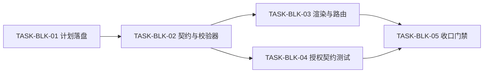
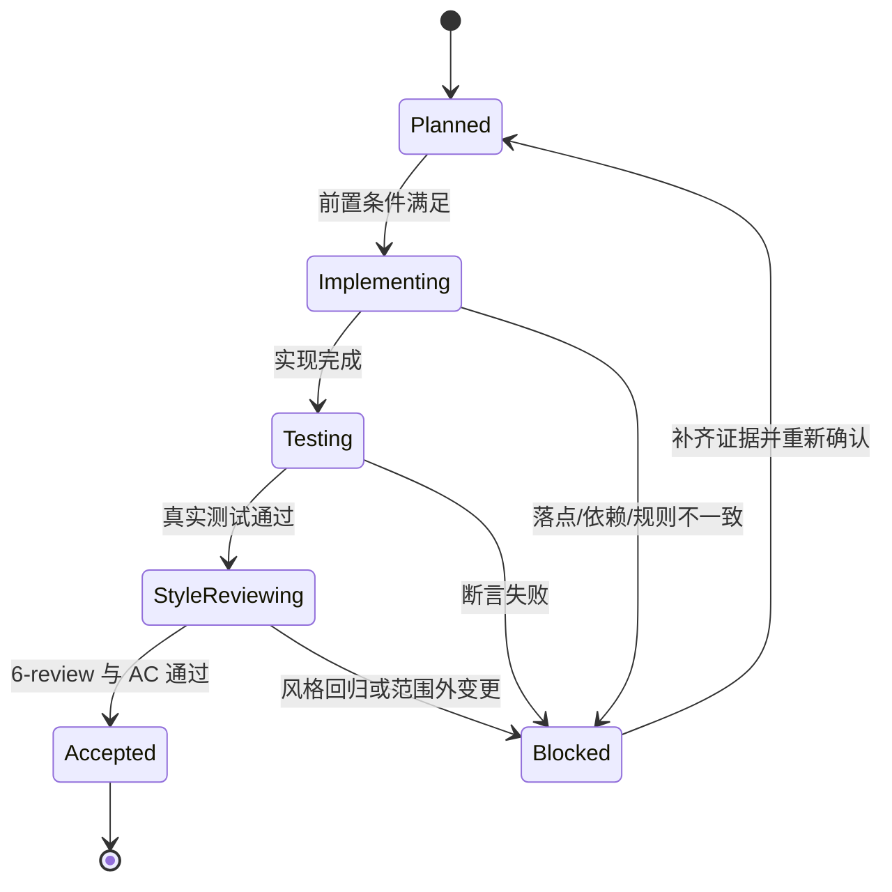

# CYCLE-BLK-01：阻断授权契约与收口

结论：本周期把阻断授权操作从“只有原因”补齐为“原因 + 授权动作 + 边界 + 验证”，并完成契约、校验器、渲染路由、契约测试与文档收口；影响：用户在真实阻断收口中只需回复“同意授权”或“暂不授权”；范围：阻断契约字段、profile、校验器、渲染模板、命中检查、投影恢复、根 `test/` 契约测试与五份正式文档；非范围：Desktop 产品源码、真实业务项目源码、其它会话改动和 Git 历史写入；变化：阻断收口直接展示“请直接回复：`同意授权`”；完成标准：七项验收条件全部通过，四档 profile PASS；术语说明：阻断记录标识用于唯一对应一条恢复动作，`同意授权` 表示允许执行该条记录列明的恢复动作；验证状态：实施完成，定向阻断字段测试 2/2、授权契约测试 5/5、总结引用契约测试 20/20 与四档 profile 均 PASS。

## 当前周期目标、边界与进入条件

- 周期 ID / 期次定位：`CYCLE-BLK-01` / 第一期
- 只做这一件事：补齐阻断授权操作的全链路规则、校验与契约测试，并完成收口
- 对应需求、验收和实施总览：`REQ-BLK-AUTH-001`、`AC-BLK-001..007`、`2026-08-09_214745_REQ-BLK-AUTH-001_实施总览.md`
- 本周期不做：不修改 Desktop 产品源码、不修改真实业务项目、不触碰其它会话既有改动、不执行 Git 历史写入
- 进入条件：需求文档 requirement profile PASS，基线 `32c1e32e98f08f1ec9250264073e6b7d72df07aa` 已核对，无未决决策

## 周期图片资产决策与边界

图片资产决策：`N/A + 原因`：本周期只涉及规则文本、校验逻辑、目录树和文档，不存在界面、截图或视觉验收对象 `+ 证据`：周期内两张 Mermaid 图已表达任务依赖与状态机。

## 周期图片资产清单

| 图片 ID | 用途 / 生成输入 | 来源 | 相对路径 | 版本 | 关联 REQ/RULE / AC / CYCLE / TASK | 引用章节 | 敏感状态 | 版权状态 |
|---|---|---|---|---|---|---|---|---|
| `N/A + 原因`：本周期不涉及图片 | 无 | 无 | 无 | 无 | 无 | 无 | 无敏感信息 | 不适用 |

## 进入条件与收口条件

| 类型 | 条件 | 证据/命令 | 状态 |
|---|---|---|---|
| 进入 | 需求、边界和实施计划中的 `AC-BLK-001..007` 已确认 | `validate_engineering_docs.py --profile requirement` PASS | 已满足 |
| 收口 | 所有任务实现、真实测试和 `6-review` 三项闭环通过 | 四档 profile PASS、`TEST-BLK-*` 全 PASS | 已满足 |

## 当前代码/文档基线

- 分支 / 提交：HEAD `32c1e32e98f08f1ec9250264073e6b7d72df07aa`。
- 已核实文件和符号：`TASK_BLOCKER_REQUIRED_FIELDS`（`validate_engineering_docs.py`）、`task_blocker_closure.required_fields`（`document-quality-profiles.yaml`）、`TASK_BLOCKER_SECTION = "任务阻断收口"`、`reasoning-summary-structure-rules` 阻断渲染模板、`skill-hit-check-rules/SKILL.md` 命中检查、`task-plan-rehydration-rules/SKILL.md` 投影恢复。
- 依赖版本与 local 配置：Python 3 与仓库自带脚本，无外部服务。
- 与计划不一致时的停止规则：发现符号不存在、接口已变化或基线不一致，立即停止并回写 `GAP-*`，不得猜测替代落点。

## 跨会话执行入口与外部项目代码引用

- 新会话接手第一步：读取本周期文档，核对 `F:/luode-skills` 工作树与基线，从第一个未完成 `TASK-BLK-*` 开始；先核验 `in_progress` 中断点。
- 主项目名称与项目根：`luode-skills`，本机绝对路径 `F:/luode-skills`。
- 主项目仓库类型与代码基线：Git 仓库，HEAD `32c1e32e98f08f1ec9250264073e6b7d72df07aa`。
- 当前周期 / 任务标识与中断点核验顺序：`CYCLE-BLK-01`；顺序为工作树 `git status` -> 相关 skill 目录与测试入口 -> 五份正式文档。
- local 环境与依赖入口：Python 3，仓库自带脚本，所有命令使用 local 工作树。
- 外部项目代码引用：`N/A + 原因`：本计划只修改 `F:/luode-skills` 自身规则、测试与文档，不读取、复制、对照、调用或修改其他项目代码 `+ 证据`：全部文件落点均为本仓库相对路径。

## 周期内最小任务执行顺序

| 顺序 | 任务 ID | 唯一目标 | 前置依赖 | 允许文件 | 禁止触碰区 | 状态 |
|---:|---|---|---|---|---|---|
| 1 | `TASK-BLK-01` | 落盘需求与实施计划 | 无 | `doc/2-需求/`、`doc/3-实施/` 三份新文档 | 其它会话的 skill 与测试文件 | completed |
| 2 | `TASK-BLK-02` | 契约新增“用户授权操作”字段并贯通校验器 | `TASK-BLK-01` | `artifact-delivery-gate-rules/references/task-blocker-closure-contract.md`、`document-quality-profiles.yaml`、`scripts/validate_engineering_docs.py`、`test/artifact-delivery-gate-rules/validate_engineering_docs_test.py` | `reasoning-summary-structure-rules`、`skill-hit-check-rules`、`task-plan-rehydration-rules`、新契约测试文件 | completed |
| 3 | `TASK-BLK-03` | 同步渲染与路由规则 | `TASK-BLK-02` | `reasoning-summary-structure-rules/SKILL.md` 及两个 references、`skill-hit-check-rules/SKILL.md`、`task-plan-rehydration-rules/SKILL.md` | `artifact-delivery-gate-rules` 下文件、新契约测试文件 | completed |
| 4 | `TASK-BLK-04` | 根 `test/` 补授权契约测试 | `TASK-BLK-02` | `test/artifact-delivery-gate-rules/blocker_authorization_contract_test.py`（新增） | `validate_engineering_docs_test.py` 之外的既有测试文件 | completed |
| 5 | `TASK-BLK-05` | 收口门禁与记忆同步 | `TASK-BLK-02/03/04` | 五份正式文档、`doc/6-review/`、`PROJECT_CURRENT.md`、`PROJECT_MEMORY.md`、`PROJECT_HISTORY.md`、字典 | 其它会话写集 | completed |

## 最小任务闭环

| 任务 ID | 实施计划完成条件 | 实现 | 真实测试 | 6-review 风格回归 |
|---|---|---|---|---|
| `TASK-BLK-01` | requirement / overview / cycle 三档 profile PASS | 三份正式文档已落盘 | `TEST-BLK-007` 阶段执行 | `STYLE-BLK-01` |
| `TASK-BLK-02` | 缺失“用户授权操作”输出 `blocker.closure_invalid` | 修改契约、profile、校验器与测试 | `TEST-BLK-001/002` | `STYLE-BLK-01` |
| `TASK-BLK-03` | 模板与规则统一突出授权操作 | 修改三个 skill 域文件 | `TEST-BLK-003/004/005` | `STYLE-BLK-01` |
| `TASK-BLK-04` | 四类授权场景全部通过 | 新增 `blocker_authorization_contract_test.py` | `TEST-BLK-006` | `STYLE-BLK-01` |
| `TASK-BLK-05` | 四档 profile PASS、字典退出码 0、记忆同步 | 落盘 6-review、同步记忆 | `TEST-BLK-007` | `STYLE-BLK-01` |

## 文件与符号操作契约

| 任务 | 文件路径 | 符号/区段 | 操作 | 修改前职责 | 修改后职责 | 调用方影响 | 兼容要求 |
|---|---|---|---|---|---|---|---|
| `TASK-BLK-02` | `artifact-delivery-gate-rules/references/task-blocker-closure-contract.md` | 正文模板字段列表 | 新增“用户授权操作” | 只说明阻断原因与解决计划 | 增加授权动作与边界 | 最终阻断渲染消费 | 历史已通过文档不受影响 |
| `TASK-BLK-02` | `artifact-delivery-gate-rules/references/document-quality-profiles.yaml` | `task_blocker_closure.required_fields` | 新增字段 | 9 个必填字段 | 10 个必填字段 | profile 读取方 | 新字段必填 |
| `TASK-BLK-02` | `artifact-delivery-gate-rules/scripts/validate_engineering_docs.py` | `TASK_BLOCKER_REQUIRED_FIELDS` 与 `check_task_blocker_closure` | 新增字段与校验 | 校验 9 字段 | 校验 10 字段 | 文档门禁 | 缺失输出 `blocker.closure_invalid` |
| `TASK-BLK-02` | `test/artifact-delivery-gate-rules/validate_engineering_docs_test.py` | `_task_blocker_closure` 与新增用例 | 更新 fixture 与用例 | 既有 9 字段 fixture | 10 字段 fixture + 缺失字段负例 | 校验器回归 | 全量回归通过 |
| `TASK-BLK-03` | `reasoning-summary-structure-rules/SKILL.md` | 阻断渲染要求 | 新增授权操作提示 | 渲染阻断字段 | 渲染“请直接回复：`同意授权`”与边界 | 最终总结 | 唯一渲染 owner |
| `TASK-BLK-03` | `reasoning-summary-structure-rules/references/summary-structure-template.md` | 阻断收口模板 | 新增授权操作行 | 阻断表格 6 字段 | 阻断表格含授权操作 | 总结输出 | 与契约字段一致 |
| `TASK-BLK-03` | `reasoning-summary-structure-rules/references/conditional-sections-rules.md` | 任务阻断收口节 | 新增授权操作要求 | 阻断字段列表 | 含授权操作与边界 | 条件渲染 | 与契约字段一致 |
| `TASK-BLK-03` | `skill-hit-check-rules/SKILL.md` | 命中检查 | 新增“同意授权 / 暂不授权”意图识别 | 未识别授权意图 | 识别并路由恢复流程 | 首轮命中 | 不破坏既有命中检查 |
| `TASK-BLK-03` | `task-plan-rehydration-rules/SKILL.md` | 投影恢复 | 新增授权操作与边界说明 | 未展示授权操作 | 展示授权操作与边界 | 投影恢复 | 不破坏既有投影 |
| `TASK-BLK-04` | `test/artifact-delivery-gate-rules/blocker_authorization_contract_test.py` | 新增测试类 | 新增 | 不存在 | 覆盖四类授权场景 | 契约测试 | 根 `test/` ASCII 镜像 |

## 任务图片资产执行契约

| 任务 | 图片决策 | 生成输入与 imagegen 命令 | 目标资产路径 | Markdown 相对引用 | `IMG-*` / 版本 | 资产清单与引用章节 | Mermaid 不替代说明 |
|---|---|---|---|---|---|---|---|
| `TASK-BLK-01..05` | `N/A + 原因`：纯规则与测试改动 `+ 证据`：无界面、截图或视觉产物 | 无 | 无 | 无 | 无 | 无 | 任务依赖与状态机已由 Mermaid 表达 |

## 当前周期验证矩阵

| 测试 ID | 对应任务 | 精确命令 | local 依赖 | fixture/数据 | 断言 | 失败预期 | 清理 |
|---|---|---|---|---|---|---|---|
| `TEST-BLK-001` | `TASK-BLK-02` | `python -X utf8 -B test/artifact-delivery-gate-rules/validate_engineering_docs_test.py` | Python 3 | 阻断 fixture | `required_fields` 含“用户授权操作” | fixture 字段缺失 | 无 |
| `TEST-BLK-002` | `TASK-BLK-02` | 同一入口内子用例 | Python 3 | 缺失字段阻断文档 | 输出 `blocker.closure_invalid` | 校验器放行 | 无 |
| `TEST-BLK-003/004/005` | `TASK-BLK-03` | 静态断言测试 | Python 3 | 模板与规则文本 | 含授权提示与边界 | 模板缺失提示 | 无 |
| `TEST-BLK-006` | `TASK-BLK-04` | `python -X utf8 -B test/artifact-delivery-gate-rules/blocker_authorization_contract_test.py` | Python 3 | 脱敏授权样本 | 四类场景全部 PASS | 任一断言失败 | 无 |
| `TEST-BLK-007` | `TASK-BLK-05` | `validate_engineering_docs.py` 四档 profile、字典生成、`git diff --check` | Python 3 | 正式文档 | 全部 PASS / 退出码 0 | 任一失败 | 无 |

## 回滚与停止条件

- `ROLLBACK-BLK-01`：撤销新增“用户授权操作”字段：删除契约正文新增行、profile `required_fields` 新字段、校验器新字段与测试新断言，再重跑既有测试。
- `ROLLBACK-BLK-02`：撤销渲染与路由规则：删除三个 skill 域新增行，保留既有阻断渲染字段，再重跑静态断言。
- `ROLLBACK-BLK-03`：撤销契约测试：删除 `blocker_authorization_contract_test.py`，再重跑既有测试入口。
- 停止条件：命令失败、断言失败、依赖不可用、数据不符合前置、计划落点不存在或发现安全/数据损坏风险。
- 恢复路径：回到对应 `TASK-BLK-*`，补证据后从该任务重启。
- 当前 agent 最大推进边界：周期收口后停在“已改动未提交”，不执行 Git 历史写入，不扩散到其它会话文件。

## 周期追踪矩阵

| `REQ-*` / `RULE-*` | `AC-*` | `TASK-*` | 文件/符号 | `TEST-*` | `STYLE-*` | `EVIDENCE-*` | 闭环状态 |
|---|---|---|---|---|---|---|---|
| `REQ-BLK-001/002/003` | `AC-BLK-001/002` | `TASK-BLK-02` | `task-blocker-closure-contract.md`、`document-quality-profiles.yaml`、`validate_engineering_docs.py` | `TEST-BLK-001/002` | `STYLE-BLK-01` | `EVD-TASK-BLK-02-TEST-01` | 已完成 |
| `REQ-BLK-004/005/006` | `AC-BLK-003/004/005` | `TASK-BLK-03` | `reasoning-summary-structure-rules/`、`skill-hit-check-rules/SKILL.md`、`task-plan-rehydration-rules/SKILL.md` | `TEST-BLK-003/004/005` | `STYLE-BLK-01` | `EVD-TASK-BLK-03-TEST-01` | 已完成 |
| `REQ-BLK-007` | `AC-BLK-006` | `TASK-BLK-04` | `test/artifact-delivery-gate-rules/blocker_authorization_contract_test.py` | `TEST-BLK-006` | `STYLE-BLK-01` | `EVD-TASK-BLK-04-TEST-01` | 已完成 |
| `REQ-BLK-001..007` | `AC-BLK-007` | `TASK-BLK-05` | 五份正式文档、记忆文件 | `TEST-BLK-007` | `STYLE-BLK-01` | `EVD-TASK-BLK-05-TEST-01` | 已完成 |

## 周期内任务依赖图

图形目的：说明本周期任务必须逐个闭环、不能批量实现后统一验证。关联 ID：`TASK-BLK-01..05`。

## 任务闭环状态机

图形目的：说明最小任务只能按“实现 -> 真实测试 -> 6-review -> 完成”推进，失败进入阻断。关联 ID：`TASK-BLK-*`、`TEST-BLK-*`、`STYLE-BLK-01`。

## 自审结论

- 每个任务是否只承载一个目标：是，`TASK-BLK-01..05` 各只有一个垂直切片目标。
- 是否按实现 -> 真实测试 -> 6-review 风格回归逐个闭环：是，周期文档已冻结任务闭环矩阵。
- 是否存在未决决策或模糊落点：无，全部决策在需求文档 `DEC-BLK-001..005` 冻结。
- 图形、表格和正文是否一致：是，任务依赖图与状态机与周期任务表一致。

## 执行附录

- local 环境、任务步骤、精确命令：见“真实测试与断言”表；全部命令在 `F:/luode-skills` local 工作树执行，使用 `python -X utf8 -B` 入口。
- 清理与回滚顺序：回指“回滚与停止条件”，无持久化外部数据。

## 追踪附录

- 稳定 ID、需求来源、验收依据、证据：`REQ-BLK-AUTH-001`、`AC-BLK-001..007`、`CYCLE-BLK-01`、`TASK-BLK-01..05`、`TEST-BLK-001..007`、`EVD-TASK-BLK-02-TEST-01`、`EVD-TASK-BLK-03-TEST-01`、`EVD-TASK-BLK-04-TEST-01`、`EVD-TASK-BLK-05-TEST-01`。
- 附录维护规则：执行附录与追踪附录保持连续且位于文档末尾，后面不得新增业务章节。
