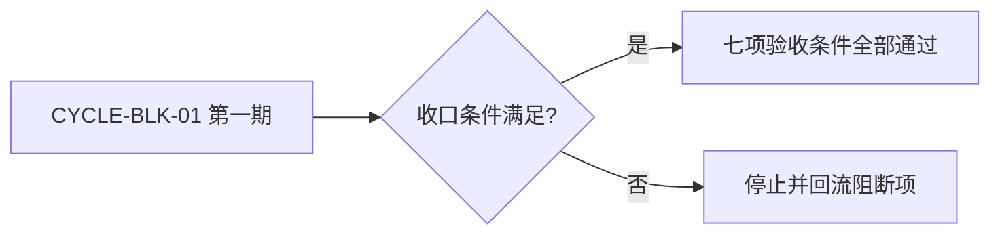
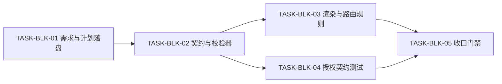
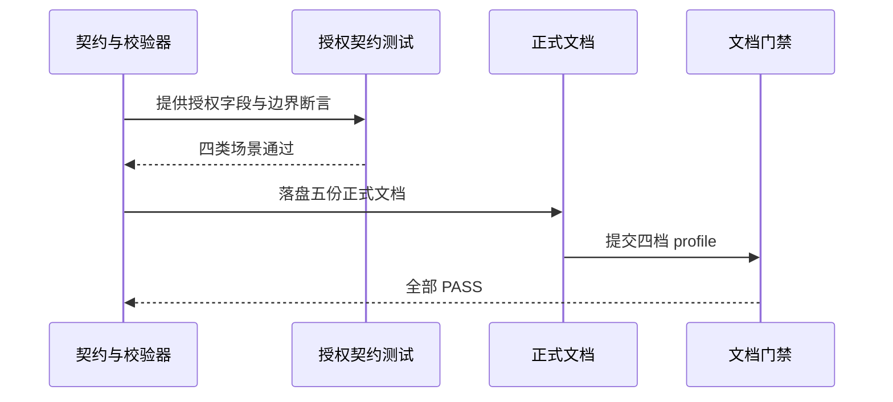

# 任务阻断授权操作提示：实施总览

结论：本总览把阻断收口“只说明原因”的缺口收敛为一个实施周期，按“契约与校验器 -> 渲染与路由规则 -> 授权契约测试 -> 收口门禁”逐任务闭环；影响：所有真实任务阻断收口都会直接展示“请直接回复：`同意授权`”或“请直接回复：`暂不授权`”，并明确授权边界；范围：阻断契约、文档质量 profile、机器校验器、最终阻断渲染、命中检查、投影恢复、根 `test/` 授权契约测试与正式文档；非范围：Codex Desktop 产品源码、真实业务项目源码、其它会话的既有未提交改动和 Git 历史写入；变化：用户从“看到阻断原因后自行猜测”变为“看到明确授权动作与边界”；完成标准：七项验收条件全部可验证，四档文档 profile PASS；术语说明：`BLK-*` 是任务阻断记录标识，`同意授权` 表示允许执行该条记录列明的恢复动作；验证状态：实施完成，阻断字段定向正反例 2/2、授权契约测试 5/5、总结引用契约测试 20/20 与四档 profile 均 PASS。

## 当前计划最终方案简要说明

推荐方案：把“用户授权操作”作为阻断契约的必填字段，贯通 profile、校验器、最终渲染、命中检查与投影恢复，并用根 `test/` 契约测试冻结有效授权、范围隔离、过期/多阻断拒绝和验证失败后保持阻断四类行为。主落点：`artifact-delivery-gate-rules/references/task-blocker-closure-contract.md`、`document-quality-profiles.yaml`、`scripts/validate_engineering_docs.py`、`reasoning-summary-structure-rules/`、`skill-hit-check-rules/SKILL.md`、`task-plan-rehydration-rules/SKILL.md`、`test/artifact-delivery-gate-rules/blocker_authorization_contract_test.py`。原因：阻断只说明原因是因为契约字段、校验器、渲染和路由都没有承载“授权动作”这一可执行信息，必须全链路补上，才能让用户只需回复“同意授权”即可恢复。

## Agent 对当前问题的理解

- 问题 / 目标：真实任务阻断时用户不知道如何恢复；目标是把“请直接回复：`同意授权`”和“请直接回复：`暂不授权`”固化进所有阻断收口，并冻结授权边界。
- 本轮范围：阻断契约与 profile、机器校验器、最终阻断渲染、命中检查意图识别、投影恢复授权展示、根 `test/` 授权契约测试、五份正式文档、项目记忆同步。
- 非范围：Codex Desktop 产品源码、真实业务项目源码、`package-structure-rules` 等其它会话的既有未提交改动、Git 历史写入。
- 当前优先闭环：先冻结契约与校验器，再同步渲染与路由规则，最后补契约测试并收口。
- 关键假设 / 待确认点：无未决决策；授权回复固定为“同意授权”与“暂不授权”，授权仅作用于最近一条、唯一有效、仍未解除的 `BLK-*` 记录列明的恢复动作。

## 跨会话独立执行与外部项目代码引用清单

- 新会话接手第一步：读取本实施总览与 `CYCLE-BLK-01` 实施周期，核对 `F:/luode-skills` 工作树与基线 `32c1e32e98f08f1ec9250264073e6b7d72df07aa`，从第一个未完成 `TASK-BLK-*` 开始。
- 主项目名称与项目根：`luode-skills`，本机绝对路径 `F:/luode-skills`。
- 主项目仓库类型与代码基线：Git 仓库，HEAD `32c1e32e98f08f1ec9250264073e6b7d72df07aa`。
- 计划源文件与版本：本实施总览、`doc/3-实施/2026-08-09_214745_REQ-BLK-AUTH-001_实施周期01_阻断授权契约与收口.md`，v1.0。
- 依赖安装、local 配置和服务启动入口：Python 3 与仓库自带脚本，无外部服务；所有命令使用 local 工作树。
- 中断点核验顺序：先核对工作树 `git status`，确认 `artifact-delivery-gate-rules`、`reasoning-summary-structure-rules`、`skill-hit-check-rules`、`task-plan-rehydration-rules` 改动与计划一致，再核对根 `test/artifact-delivery-gate-rules/` 测试入口，最后核对五份正式文档。
- 外部项目代码引用：`N/A + 原因`：本计划只修改 `F:/luode-skills` 自身规则、测试与文档，不读取、复制、对照、调用或修改其他项目代码 `+ 证据`：全部文件落点均为本仓库相对路径。

## 现状与落点

图片资产决策：`N/A + 原因`：本总览只涉及规则文本、校验逻辑、目录树和文档，不存在界面或视觉产物 `+ 证据`：三张 Mermaid 图已表达周期、依赖与验证关系。

- 已核实目录：`artifact-delivery-gate-rules/references/`、`artifact-delivery-gate-rules/scripts/`、`reasoning-summary-structure-rules/references/`、`skill-hit-check-rules/`、`task-plan-rehydration-rules/`、`test/artifact-delivery-gate-rules/`、`doc/2-需求/`、`doc/3-实施/`、`doc/6-review/`。
- 已核实基线：HEAD `32c1e32e98f08f1ec9250264073e6b7d72df07aa`；工作树同时存在其它会话 `package-structure-rules` 与 `implementation-planning-rules` 改动，本任务不触碰。
- 关键符号：`TASK_BLOCKER_REQUIRED_FIELDS`（校验器固定阻断字段）、`task_blocker_closure.required_fields`（profile）、`TASK_BLOCKER_SECTION = "任务阻断收口"`、`reasoning-summary-structure-rules` 的阻断渲染模板、`skill-hit-check-rules` 命中检查、`task-plan-rehydration-rules` 投影恢复。

```text
artifact-delivery-gate-rules/
├── references/
│   ├── task-blocker-closure-contract.md        # 新增必填“用户授权操作”字段
│   └── document-quality-profiles.yaml          # required_fields 同步新增字段
├── scripts/
│   └── validate_engineering_docs.py            # 阻断校验新增“用户授权操作”非空检查
reasoning-summary-structure-rules/
├── SKILL.md                                    # 阻断渲染要求突出授权操作
└── references/
    ├── summary-structure-template.md           # 阻断模板新增授权操作行
    └── conditional-sections-rules.md           # 条件规则新增授权操作字段
skill-hit-check-rules/
└── SKILL.md                                    # 新增“同意授权/暂不授权”意图识别
task-plan-rehydration-rules/
└── SKILL.md                                    # 投影恢复新增授权操作与边界
test/
└── artifact-delivery-gate-rules/
    ├── validate_engineering_docs_test.py       # 更新阻断 fixture
    └── blocker_authorization_contract_test.py  # 新增授权契约测试
```

## 实施周期总览

| 顺序 | 周期 ID | 期次定位 | 单一周期目标 | 进入条件 | 收口条件 | 依赖 | 文档 |
|---|---|---|---|---|---|---|---|
| 1 | `CYCLE-BLK-01` | 第一期 | 阻断授权契约、渲染路由、契约测试与收口 | 需求确认、基线核对、无未决决策 | `AC-BLK-001..007` 全部通过，四档 profile PASS | `REQ-BLK-AUTH-001` | `2026-08-09_214745_REQ-BLK-AUTH-001_实施周期01_阻断授权契约与收口.md` |

图形目的：说明周期门禁和不可跳期规则。关联 ID：`CYCLE-BLK-01`、`AC-BLK-001..007`。



图形目的：说明五个最小任务的执行顺序与依赖关系。关联 ID：`CYCLE-BLK-01`、`TASK-BLK-01..05`。



图形目的：说明从规则同步到文档门禁的端到端验证关系。关联 ID：`AC-BLK-001..007`。



## 阶段计划

| 阶段 | 周期 | 唯一目标 | 输入 | 输出 | 验证门槛 |
|---|---|---|---|---|---|
| `PHASE-BLK-01` | `CYCLE-BLK-01` | 冻结阻断契约与机器校验 | 需求文档、既有校验器 | `task-blocker-closure-contract.md`、`document-quality-profiles.yaml`、`validate_engineering_docs.py` 与测试 | 校验器测试通过，缺失字段输出 `blocker.closure_invalid` |
| `PHASE-BLK-02` | `CYCLE-BLK-01` | 同步渲染与路由规则 | 契约结论 | `reasoning-summary-structure-rules`、`skill-hit-check-rules`、`task-plan-rehydration-rules` 规则文件 | 模板与规则静态断言通过 |
| `PHASE-BLK-03` | `CYCLE-BLK-01` | 补授权契约测试 | 契约结论 | `blocker_authorization_contract_test.py` | 四类场景全部通过 |
| `PHASE-BLK-04` | `CYCLE-BLK-01` | 收口门禁与记忆同步 | 实施产物与测试证据 | 五份正式文档、`6-review`、项目记忆、字典刷新 | 四档 profile PASS、`git diff --check` 通过 |

## 最小任务清单

| 周期内顺序 | 任务 ID | 垂直切片目标 | 预计文件数 | 文件/符号契约 | 真实测试 | 完成条件 | 停止条件 |
|---|---|---|---:|---|---|---|---|
| 1 | `TASK-BLK-01` | 落盘需求与实施计划 | 3 | `doc/2-需求/`、`doc/3-实施/` 三份文档 | `TEST-BLK-007` | requirement / overview / cycle profile PASS | profile 失败、字段缺失或发现敏感信息 |
| 2 | `TASK-BLK-02` | 阻断契约新增“用户授权操作”字段并贯通校验器 | 4 | `task-blocker-closure-contract.md`、`document-quality-profiles.yaml`、`validate_engineering_docs.py`、`validate_engineering_docs_test.py` | `TEST-BLK-001/002` | 缺失字段输出 `blocker.closure_invalid`，既有测试回归通过 | 任一测试失败或字段口径漂移 |
| 3 | `TASK-BLK-03` | 同步渲染与路由规则 | 6 | `reasoning-summary-structure-rules`、`skill-hit-check-rules/SKILL.md`、`task-plan-rehydration-rules/SKILL.md` | `TEST-BLK-003/004/005` | 模板、条件规则与命中/投影规则一致突出授权操作 | 静态断言失败或口径冲突 |
| 4 | `TASK-BLK-04` | 根 `test/` 补授权契约测试 | 1 | `test/artifact-delivery-gate-rules/blocker_authorization_contract_test.py` | `TEST-BLK-006` | 有效授权、范围隔离、过期/多阻断拒绝、验证失败后保持阻断四类场景通过 | 任一断言失败 |
| 5 | `TASK-BLK-05` | 收口门禁与记忆同步 | 6 | 五份正式文档、`PROJECT_MEMORY.md`、`PROJECT_HISTORY.md`、字典 | `TEST-BLK-007` | 四档 profile PASS、字典退出码 0、记忆同步、`git diff --check` 通过 | profile 失败、字典失败或记忆文件损坏 |

## 追踪矩阵

| 来源/完成条件 | 周期 | 任务 | 文件/符号 | 测试 | 风格回归 | 证据 | 状态 |
|---|---|---|---|---|---|---|---|
| `AC-BLK-001/002` | `CYCLE-BLK-01` | `TASK-BLK-02` | `task-blocker-closure-contract.md`、`document-quality-profiles.yaml`、`validate_engineering_docs.py` | `TEST-BLK-001/002` | `STYLE-BLK-01` | `EVD-TASK-BLK-02-TEST-01` | 已完成 |
| `AC-BLK-003/004/005` | `CYCLE-BLK-01` | `TASK-BLK-03` | `reasoning-summary-structure-rules/`、`skill-hit-check-rules/SKILL.md`、`task-plan-rehydration-rules/SKILL.md` | `TEST-BLK-003/004/005` | `STYLE-BLK-01` | `EVD-TASK-BLK-03-TEST-01` | 已完成 |
| `AC-BLK-006` | `CYCLE-BLK-01` | `TASK-BLK-04` | `test/artifact-delivery-gate-rules/blocker_authorization_contract_test.py` | `TEST-BLK-006` | `STYLE-BLK-01` | `EVD-TASK-BLK-04-TEST-01` | 已完成 |
| `AC-BLK-007` | `CYCLE-BLK-01` | `TASK-BLK-05` | 五份正式文档、`PROJECT_MEMORY.md`、`PROJECT_HISTORY.md` | `TEST-BLK-007` | `STYLE-BLK-01` | `EVD-TASK-BLK-05-TEST-01` | 已完成 |

## 真实测试安排

| 测试 ID | 任务 | 命令/入口 | local 环境 | 样本 | 断言 | 失败预期 | 清理 | 证据 |
|---|---|---|---|---|---|---|---|---|
| `TEST-BLK-001` | `TASK-BLK-02` | `python -X utf8 -B test/artifact-delivery-gate-rules/validate_engineering_docs_test.py` | 本地工作树 | 阻断 fixture | profile 读取 `required_fields` 含“用户授权操作” | fixture 字段缺失 | 无持久化数据 | `EVD-TASK-BLK-02-TEST-01` |
| `TEST-BLK-002` | `TASK-BLK-02` | 同一测试入口内子用例 | 本地工作树 | 缺失“用户授权操作”的阻断文档 | 输出 `blocker.closure_invalid` | 校验器放行 | 无持久化数据 | `EVD-TASK-BLK-02-TEST-01` |
| `TEST-BLK-003` | `TASK-BLK-03` | 静态断言测试 | 本地工作树 | 模板文本 | 渲染模板含“请直接回复：`同意授权`”与边界说明 | 模板缺失提示 | 无 | `EVD-TASK-BLK-03-TEST-01` |
| `TEST-BLK-004` | `TASK-BLK-03` | 静态断言测试 | 本地工作树 | 命中检查文本 | 含“同意授权 / 暂不授权”意图识别 | 规则缺失 | 无 | `EVD-TASK-BLK-03-TEST-01` |
| `TEST-BLK-005` | `TASK-BLK-03` | 静态断言测试 | 本地工作树 | 投影恢复文本 | 含授权操作与边界说明 | 规则缺失 | 无 | `EVD-TASK-BLK-03-TEST-01` |
| `TEST-BLK-006` | `TASK-BLK-04` | `python -X utf8 -B test/artifact-delivery-gate-rules/blocker_authorization_contract_test.py` | 本地工作树 | 脱敏授权样本 | 四类场景全部 PASS | 任一断言失败 | 无持久化数据 | `EVD-TASK-BLK-04-TEST-01` |
| `TEST-BLK-007` | `TASK-BLK-05` | `validate_engineering_docs.py` 四档 profile 与字典生成 | 本地工作树 | 正式文档 | 对应 profile `valid: true`、字典退出码 0 | 任一 profile 失败 | 无 | `EVD-TASK-BLK-05-TEST-01` |

## 任务完成、停止与最大推进边界

- 任务完成条件：每个 `TASK-BLK-*` 完成自己的实现、真实测试与 `6-review` 闭环，`AC-BLK-001..007` 可验证。
- 任务停止 / 结束条件：任一测试失败、profile 失败、字段口径漂移、工作树冲突、发现敏感信息或用户要求停止。
- 最大推进边界：本周期收口后停在“已改动未提交”，不执行 Git 历史写入，不扩散到其它会话文件。

## 风险与阻断项

| ID | 风险/阻断 | 触发证据 | 当前措施 | 恢复路径 | 禁止动作 |
|---|---|---|---|---|---|
| `GAP-BLK-01` | 历史阻断文档缺“用户授权操作”字段 | 校验器扫描 | 只对 `status: blocked` 与审查/验收阻断结论启用新字段校验 | 补充字段后重跑校验 | 批量改写历史只读文档 |
| `ROLLBACK-BLK-01` | 多 skill 渲染口径冲突 | 静态断言失败 | 唯一渲染归 `reasoning-summary-structure-rules`，其余只提供事实 | 删除冲突行后重新同步 | 生成第二套用户可见阻断模板 |

## 自审结论

- 零决策交接：已覆盖，每个任务有文件/符号、操作、禁止触碰、真实测试、断言、清理、回滚、完成与停止条件。
- 文件/符号落点：已覆盖，目录树列出全部新增与修改文件。
- 需求/验收/任务/测试覆盖率：已覆盖，`AC-BLK-001..007` 均映射到 `TASK-*` 与 `TEST-*`。
- 周期顺序与闭环：已覆盖，`CYCLE-BLK-01` 内任务逐个闭环。
- 图形语义与 Mermaid 解析：已覆盖，总览含周期门禁图、任务依赖图与验证时序图。
- 占位词和 N/A 证据：已覆盖，所有占位均以 `N/A + 原因 + 证据` 显式说明。
- 用户确认状态：用户已明确要求落盘计划并执行，且允许使用多 agent 并行。

## 执行附录

- 本地执行顺序：先运行 `validate_engineering_docs.py` requirement / overview / cycle / style_regression 四档 profile，再运行 `test/artifact-delivery-gate-rules/` 下两个测试入口，最后运行字典生成与 `git diff --check`。
- 清理与回滚：无持久化外部数据；回滚只删除新增行和新增文件，不使用 `git reset` 或 `git checkout`。

## 追踪附录

- 稳定 ID：`REQ-BLK-AUTH-001`、`AC-BLK-001..007`、`CYCLE-BLK-01`、`TASK-BLK-01..05`、`TEST-BLK-001..007`。
- 证据定位：`EVD-TASK-BLK-02-TEST-01`、`EVD-TASK-BLK-03-TEST-01`、`EVD-TASK-BLK-04-TEST-01`、`EVD-TASK-BLK-05-TEST-01`。
