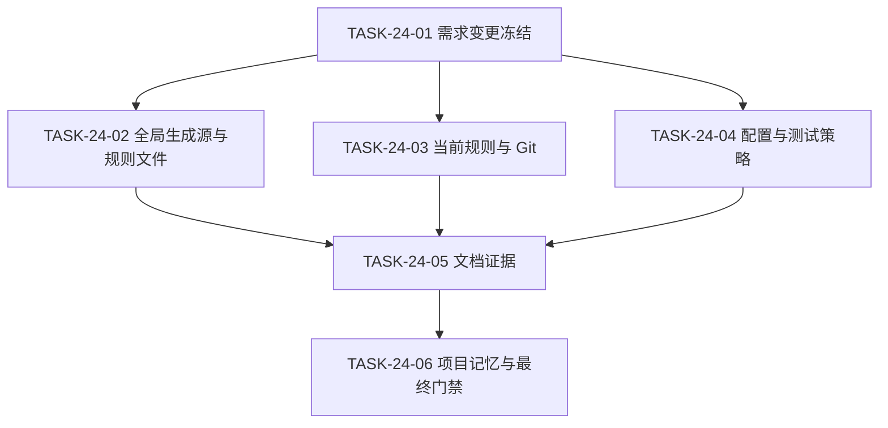
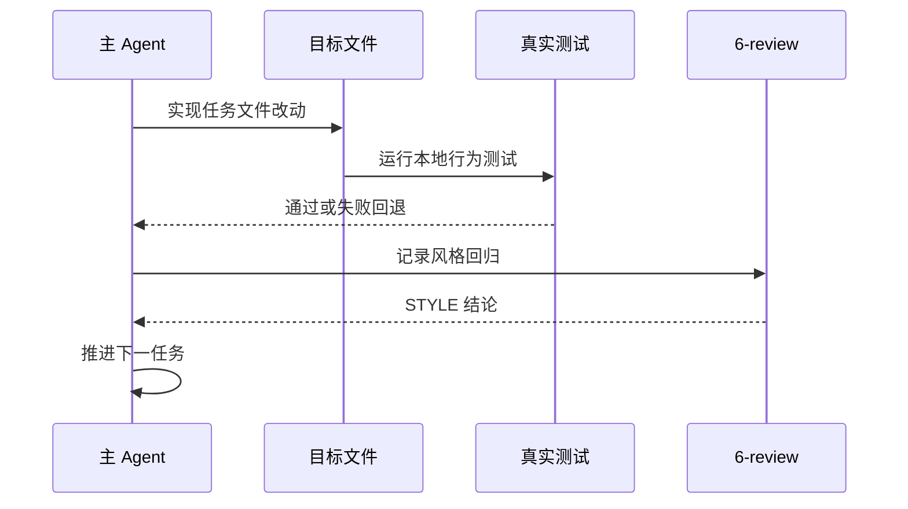

# 代码位置目录规则 V2 实施周期 24：凭据持久化与输出脱敏

结论：本周期把凭据边界从「禁止写入代码/文档/日志/输出/Git」收敛为「允许将真实 API key、token、密码、私钥、连接串原值写入代码、配置、普通维护文档和对应 Git 提交；禁止在日志、错误信息、测试报告与证据、终端输出、Agent 中间/最终回复、会话交接、执行失败案例、自动知识摘要等过程性输出中回显原值」。影响：父级全局规则、仓库规则文件、bootstrap 生成源、Git 预检人工核查清单、配置 Catalog/reference/测试、测试策略 Skill 和项目记忆。范围：上述规则资产及对应本地测试；非范围：真实后端加载器、真实密钥读取、外部服务、test/prod 连接、Git 历史写入。变化：YAML 配置由 `forbid_plain_secret` 改为 `allow_plain_secret`，与 embedded 一致；`source_policy`、Schema、CLI 参数和返回结构不变。完成标准：六任务逐个完成实现、真实测试和 6-review，四档文档 profile、根回归、Skill 合规和 6-review 全部通过。术语说明：凭据原值指真实 API key、token、密码、私钥、连接串；过程性输出指日志、错误信息、测试报告与证据、终端输出、Agent 回复、会话交接、执行失败案例、自动知识摘要。验证状态：六任务全部完成，门禁全部通过。

## 当前周期最终方案简要说明

主落点是规则生成源（`bootstrap_agents.sh` 的受管章节）和配置 Catalog 的 `secret_policy`，因为它们分别是仓库规则与机器查询的唯一权威源；采用「允许持久化 + 禁止过程性输出回显」的单一口径，避免每个 skill 各自维护一套敏感边界。

## Agent 对当前问题的理解

| 项目 | 结论 |
|---|---|
| 问题/目标 | 现行规则全面禁止凭据原值写入代码、文档、日志、输出和 Git 提交，与用户确认的「允许持久化、仅禁止过程性回显」不一致。 |
| 本周期范围 | 父级全局规则、`AGENTS.md`/`CLAUDE.md`、bootstrap 生成源、Git 预检核查清单与测试、配置 Catalog/reference/测试、测试策略 Skill、周期文档、测试 README、6-review、项目记忆。 |
| 非范围 | 真实后端迁移、配置加载器、真实密钥、外部服务、test/prod 连接、Git 历史写入。 |
| 当前优先闭环 | 先冻结需求变更与周期契约，再并行推进规则生成源、Git 规则、配置与测试策略三个互斥写集，最后收口文档证据与项目记忆。 |
| 最大边界 | CYCLE-24 完成后停止，不进入具体业务项目运行时改造。 |

## 当前周期目标、边界与进入条件

| 项目 | 冻结内容 |
|---|---|
| 周期目标 | 全局规则、bootstrap 生成源、Git 核查清单、配置 Catalog、测试策略 Skill 统一为「允许持久化、禁止过程性输出回显」；Catalog 四条配置查询均返回 `allow_plain_secret`。 |
| 范围 | 规则资产、bootstrap 脚本、Git 预检与测试、配置 reference/Catalog/测试、测试策略 SKILL、周期与记忆文档。 |
| 非范围 | 真实后端加载器、真实密钥、外部服务、test/prod 连接、Git 历史写入。 |
| 进入条件 | `REQ-PSR-CONFIG-SECRET-002` 与 `CHG-PSR-CONFIG-SECRET-002` 已冻结；CYCLE-19 周期和既有工作树改动保留。 |
| 收口条件 | `AC-PSR-CONFIG-SECRET-007..012`、六任务真实测试、四档文档 profile、Skill 合规和 6-review 全部通过。 |
| 最大推进边界 | CYCLE-24 收口后停止。 |

图片资产决策：N/A + 原因：纯规则、元数据和测试变更，无界面或视觉产物 + 证据：本文 Mermaid 依赖图与任务闭环图。

## 当前代码/文档基线

当前工作树已包含其他会话未提交改动（`AGENTS.md`、`CLAUDE.md`、`PROJECT_CURRENT.md`、`PROJECT_MEMORY.md`、`PROJECT_HISTORY.md`、`placement-catalog.yaml`、`project-layout-v2.md` 等）；本周期只在既有文件上做目标区段手术式修改，不覆盖 Decimal、计划完整性或 projection 相关改动。基线测试：`configuration_layout_test.py` 11 项中 8 项既有失败（含 YAML/embedded `source_policy` 漂移和互斥 split 用例），`pre_commit_gate_test.py` 3/3 通过；本周期修复属于本范围的失败，既有无关失败集合不得扩大。

## 周期依赖图

图形目的：表达需求冻结、三路并行实现、文档证据与最终门禁的顺序。关联 ID：`TASK-24-01..06`。

## 任务闭环时序图

图形目的：表达单个最小任务「实现 -> 真实测试 -> 6-review -> 推进」的强制闭环。关联 ID：`TASK-24-01..06`、`TEST-PSR-CONFIG-SECRET-005..010`。

## 任务执行顺序与闭环契约

顺序固定为 `TASK-24-01 -> TASK-24-02/03/04（写集互斥，可并行）-> TASK-24-05 -> TASK-24-06`。每个任务必须完成文档/实现、local 真实测试、清理和 6-review 后才能推进；并行任务由主 agent 负责回收与冲突裁决。

## 周期内最小任务执行顺序

`TASK-24-01 → TASK-24-02/03/04 → TASK-24-05 → TASK-24-06`；每个任务必须先完成自身实现、真实测试和 `6-review`，不得跨任务合并验证。

## 最小任务闭环

- `TASK-24-01`：落盘需求变更文档、更新实施总览、建周期文档、测试 README 与 6-review 骨架；运行 requirement/implementation_overview/implementation_cycle 三档 profile；STYLE 检查章节、ID 和中文表达；通过后进入 TASK-24-02/03/04。
- `TASK-24-02`：修改 `C:/Users/luode/.codex/AGENTS.md`、`F:/luode-skills/AGENTS.md`、`F:/luode-skills/CLAUDE.md`、`project-rule-file-bootstrap-rules/scripts/bootstrap_agents.sh`、`vercel-react-best-practices/AGENTS.md`；新增 `test/project-rule-file-bootstrap-rules/bootstrap_agents_test.py`；真实运行 bootstrap 到临时仓库并回读；STYLE 检查脚本与测试命名；通过后进入 TASK-24-05。
- `TASK-24-03`：修改 `git-collaboration-rules/references/staged-review-and-evidence.md` 安全核查表述；扩展 `test/git-collaboration-rules/pre_commit_gate_test.py` 的 sentinel 允许用例与输出不回显断言；运行 pre_commit_gate_test；STYLE 检查测试隔离与命名；通过后进入 TASK-24-05。
- `TASK-24-04`：修改 `placement-catalog.yaml`（四条配置 `secret_policy=allow_plain_secret` 与 purpose）、`configuration-layout.md`、`project-layout-v2.md`、`test/package-structure-rules/configuration_layout_test.py`、`test-strategy-rules/SKILL.md`；运行四条 query 断言与配置回归；STYLE 检查字段命名和目录归位；通过后进入 TASK-24-05。
- `TASK-24-05`：回填测试 README 实测结果与 6-review 记录；运行 requirement/implementation_overview/implementation_cycle/test/style_regression 五档 profile；通过后进入 TASK-24-06。
- `TASK-24-06`：更新 `PROJECT_CURRENT.md`、`PROJECT_MEMORY.md`、`PROJECT_HISTORY.md`；运行根回归、字典生成、`git diff --check`、Skill 合规门禁与 6-review 复核；全部通过后周期结束。

## 文件与符号操作契约

| 文件/符号 | 允许操作 | 禁止操作 |
|---|---|---|
| `C:/Users/luode/.codex/AGENTS.md` | 更新凭据边界条目 | 覆盖图像配置、Goal 策略或其他无关章节 |
| `AGENTS.md`、`CLAUDE.md`、`vercel-react-best-practices/AGENTS.md` | 更新「注意」凭据边界表述 | 改写 local 连接红线或其他规则章节 |
| `bootstrap_agents.sh` | 更新 `BODY_NOTICE` 受管章节 | 创建第二份实现或改动其他受管章节 |
| `staged-review-and-evidence.md` | 更新安全核查凭据口径 | 删除格式/并发/崩溃/边界核查 |
| `placement-catalog.yaml` | 四条配置条目 `secret_policy=allow_plain_secret` 与 purpose | 修改 `source_policy`、Schema、CLI 参数或无关条目 |
| `configuration-layout.md`、`project-layout-v2.md` | 同步 YAML 允许原值口径 | 删除 embedded/YAML 互斥或命名契约 |
| `configuration_layout_test.py`、`pre_commit_gate_test.py` | 更新凭据断言并新增 sentinel 用例 | 读取真实密钥、连接外部服务 |
| `test-strategy-rules/SKILL.md` | 更新本地配置敏感信息边界 | 修改 description 或新增 `##` 标题（若必须改动则触发字典刷新） |
| `PROJECT_CURRENT.md` | 覆盖当前状态，原样保留 v4 registry | 删除其他会话 projection |
| `PROJECT_MEMORY.md` | 更新配置环境来源契约与凭据边界实体 | 覆盖非相关人类区或机器索引区内容 |
| `PROJECT_HISTORY.md` | 追加事件并裁剪至最近 20 条 | 覆盖或重排既有历史 |

## 真实测试与断言

| TEST | 入口 | 断言 | 失败预期 |
|---|---|---|---|
| `TEST-PSR-CONFIG-SECRET-005` | `bootstrap_agents_test.py` | 临时仓库生成规则文件含新凭据边界、不含旧禁句 | 任一断言失败 |
| `TEST-PSR-CONFIG-SECRET-006` | `pre_commit_gate_test.py` | sentinel 允许用例通过且 gate 输出不含 sentinel | 任一断言失败 |
| `TEST-PSR-CONFIG-SECRET-007` | `placement_catalog.py query` | backend/fullstack × yaml/embedded 四条查询均返回 `allow_plain_secret` | 任一返回非目标值 |
| `TEST-PSR-CONFIG-SECRET-008` | `configuration_layout_test.py` | 本范围断言通过，失败集合不扩大 | 新增非预期失败 |
| `TEST-PSR-CONFIG-SECRET-009` | `validate_engineering_docs.py` | requirement/implementation_overview/implementation_cycle/test/style_regression 五档 PASS | 任一 profile 失败 |
| `TEST-PSR-CONFIG-SECRET-010` | 根回归、字典、`git diff --check`、Skill 合规 | 失败集合不扩大、字典退出码 0、无 whitespace 错误、合规 PASS | 任一失败 |

## 周期阻断、停止与回滚

- 停止条件：需求边界漂移、规则文件被覆盖、bootstrap 在 Windows Git Bash 无法运行、测试必须连接非 local 环境、或出现历史周期证据删除要求。
- 阻断条件：`validate_engineering_docs.py` 任一时序 profile 失败且无法修复；`source_policy`/Schema/CLI 被意外改动；工作树目标区段与记忆内容漂移。
- 回滚：任何任务失败只回退该任务文件，不覆盖已独立验证通过的并行结果；禁止 `git reset --hard`、`git checkout --` 等破坏性命令。

## 当前周期验证矩阵

| AC | 验证 | 证据 |
|---|---|---|
| `AC-PSR-CONFIG-SECRET-007` | bootstrap 行为测试 | `TEST-PSR-CONFIG-SECRET-005` |
| `AC-PSR-CONFIG-SECRET-008` | pre-gate sentinel 用例 | `TEST-PSR-CONFIG-SECRET-006` |
| `AC-PSR-CONFIG-SECRET-009` | Catalog 四条 query | `TEST-PSR-CONFIG-SECRET-007` |
| `AC-PSR-CONFIG-SECRET-010` | 配置 reference 与测试 | `TEST-PSR-CONFIG-SECRET-008` |
| `AC-PSR-CONFIG-SECRET-011` | 文档 profile | `TEST-PSR-CONFIG-SECRET-009` |
| `AC-PSR-CONFIG-SECRET-012` | 根回归与门禁 | `TEST-PSR-CONFIG-SECRET-010` |

## 自审结论

| 检查项 | 结论 | 依据 |
|---|---|---|
| 需求与周期追踪 | 通过 | `SRC -> CHG -> RULE -> AC -> CYCLE -> TASK -> TEST` 双向可追踪 |
| 文件/符号冻结 | 通过 | 上表逐文件允许/禁止操作明确 |
| 真实测试 | 通过 | 六任务均有本地真实测试入口与通过标准 |
| 停止/回滚边界 | 通过 | 明确停止条件、阻断条件和回滚边界 |
| 最终放行 | 通过 | 六任务、五档 profile、根回归、Skill 合规和 6-review 全部通过 |

## 执行附录

- 需求变更：`doc/2-需求/2026-08-09_215249_REQ-PSR-CONFIG-SECRET-002_凭据持久化与输出脱敏变更.md`
- 实施总览：`doc/3-实施/2026-07-28_014412_代码位置目录规则V2_实施总览.md`
- 测试 README：`doc/5-tests/2026-08-09_215249_REQ-PSR-CONFIG-SECRET-001/README.md`
- 6-review：`doc/6-review/2026-08-09_215249_REQ-PSR-CONFIG-SECRET-001_6-review.md`

## 追踪附录

| 上游 | 规则 | AC | 任务 | 文件/符号 | 测试 |
|---|---|---|---|---|---|
| `REQ-PSR-CONFIG-SECRET-002`、`CHG-PSR-CONFIG-SECRET-002` | `RULE-PSR-CONFIG-SECRET-005..008` | `AC-PSR-CONFIG-SECRET-007..012` | `TASK-24-01..06` | 全局规则、bootstrap 脚本、Git 核查清单、Catalog、reference、测试策略 SKILL、四件套 | `TEST-PSR-CONFIG-SECRET-005..010` |
