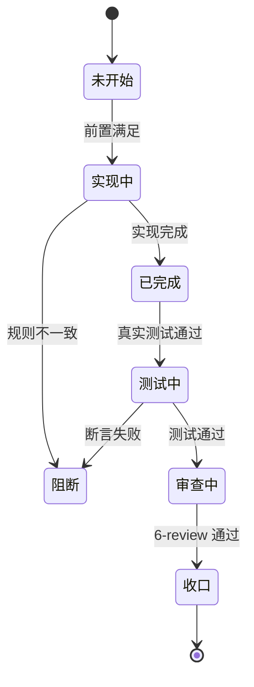

# CYCLE-PD-01：全链路规则修复

结论：本周期按 7 个最小任务逐个闭环，从模板删除压缩口子开始，到全量回归收口结束；影响：所有 Plan Mode 下正式计划输出将不再丢失思考阶段的细节；范围：implementation-planning-rules/references/ 下 4 个核心文件 + 2 个平台规则 + 1 套测试 fixture；非范围：相邻 skill 核心行为、Desktop 产品源码、Git 历史写入；变化：计划输出从"章节标题骨架"升级为"零决策完整字段可执行任务"；完成标准：7 个任务全部闭环，6 条 AC 可验证；术语说明：hard-fail 表示闸门直接阻断输出；验证状态：实施中。图片资产决策：N/A + 原因 + 证据（本周期只涉及文本规则和测试 fixture，不需要位图）。

## 当前代码/文档基线

基线提交：2707009b94c07b6b142057fa8bf32db0d7134cb8。工作树存在其他会话未提交改动，本周期只允许目标文件窄补丁。

## 当前周期目标、边界与进入条件

目标：完成全链路 7 个任务的实现、真实测试和 6-review 闭环。进入条件：来源需求已确认、修复边界和 AC 已冻结、用户已授权 Default Mode 执行、无未决选择。边界：不改产品源码、不提交 Git、不改非目标文件。

## 周期内最小任务执行顺序

| 顺序 | 任务 | 只做一件事 |
|---|---|---|
| 01 | TASK-PD-01 | 删模板压缩口子，写思考细节落盘强制 |
| 02 | TASK-PD-02 | 升级闸门内容密度 hard-fail |
| 03 | TASK-PD-03 | 自审清单 + 契约对齐 |
| 04 | TASK-PD-04 | 平台规则写死完整度优先 |
| 05 | TASK-PD-05 | 升级 fixture + unittest |
| 06 | TASK-PD-06 | 字典与记忆同步 |
| 07 | TASK-PD-07 | 全量回归 + 合规收口 |

## 最小任务闭环

每个任务固定执行"实现 -> 真实测试 -> 6-review"；任何一步失败立即停止当前周期并保留失败证据，不跨任务推进。禁止先连续实现多个任务再统一测试。

## 文件/符号操作契约

| 任务 | 文件/符号 | 操作 | 禁止触碰 |
|---|---|---|---|
| TASK-PD-01 | plan-structure-template.md、plan-mode-and-cycle-contracts.md | 删除"合并压缩"段落，新增"思考细节落盘"段落 | 其他参考文件、相邻 skill 文件 |
| TASK-PD-02 | plan-output-gate.md | 新增内容密度 hard-fail 条件 | 其他章节、非目标内容 |
| TASK-PD-03 | plan-review-checklist.md、minimum-task-execution-contract.md | 新增检查项 | 其他参考文件 |
| TASK-PD-04 | AGENTS.md、CLAUDE.md | 新增裁决句 | 其他规则段落 |
| TASK-PD-05 | plan_output_cases.json、	est_plan_output_contract.py | 新增正/负例和测试方法 | 既有 case 内容和测试方法 |
| TASK-PD-06 | 字典脚本、PROJECT_CURRENT.md、PROJECT_MEMORY.md | 刷新和更新 | 其他会话状态 |
| TASK-PD-07 | 无文件修改 | 运行回归和合规检查 | 无 |

## 当前周期验证矩阵

| ID | 入口 | 断言 | 失败处理 |
|---|---|---|---|
| TEST-PD-001 | grep -n 静态检查 | 旧条款不存在、新条款存在 | 修正后重验 |
| TEST-PD-002 | 计划输出回归 unittest | 9/9 通过（5 既有 + 4 新增） | 修正 fixture 或测试后重验 |
| TEST-PD-003 | alidate_engineering_docs.py | alid: true | 修正文档字段 |
| TEST-PD-004 | git diff --check | 无空白错误 | 修正编码/换行 |
| TEST-PD-005 | 字典生成脚本 | 退出码 0 | 检查依赖后重跑 |

## 任务停止 / 结束条件

- 停止条件：任一测试失败、profile 失败、发现未授权扩散改动、工作树冲突、用户要求停止。

## 周期阻断、停止与回滚

- 停止：任一测试失败、profile 失败、发现未授权扩散改动、工作树冲突、用户要求停止。
- 回滚：只删除本周期的新增行和新增文件；不使用 git reset/git checkout，不触碰其他会话改动。

## 自审结论

- 覆盖字段完整性：已覆盖 -- 每个 TASK-PD-* 均有唯一目标、前置条件、文件/符号、操作、禁止触碰、真实测试、断言、完成/停止条件
- 阶段单一目标：已覆盖 -- 每个阶段只做一件事
- 最小任务闭环：已覆盖 -- 每个任务"实现 -> 真实测试 -> 6-review"闭环
- 可执行性：已覆盖 -- 每个任务有精确文件/符号、操作、命令、断言、完成/停止条件
- 图文一致性：已覆盖 -- Mermaid 图与任务依赖一致
## 周期内任务依赖图

图形目的：展示 TASK-PD-01..07 的依赖顺序；关联 ID：`CYCLE-PD-01`。

## 任务闭环状态机

图形目的：展示最小任务的状态迁移；关联 ID：`TASK-PD-01..07`。

## 最小任务字段完整性

| 字段 | 合格要求 | 检查方式 |
|---|---|---|
| 文件/符号 | 精确相对路径 | grep 静态检查 |
| 操作 | 新增/修改/删除/迁移 | 文件回读 |
| 禁止触碰区 | 明确不得改动的文件/接口 | 文件回读 |
| 精确测试命令 | local 可执行命令 | 运行测试 |
| 断言 | 可观察的通过标准 | 运行测试 |
| 清理 | 测试后清理动作 | 文件回读 |
| 回滚 | 可回退的逆操作 | 文件回读 |
| 完成条件 | 可观察状态 | 运行测试 |
| 停止条件 | 失败/风险/未决信息 | 文件回读 |
