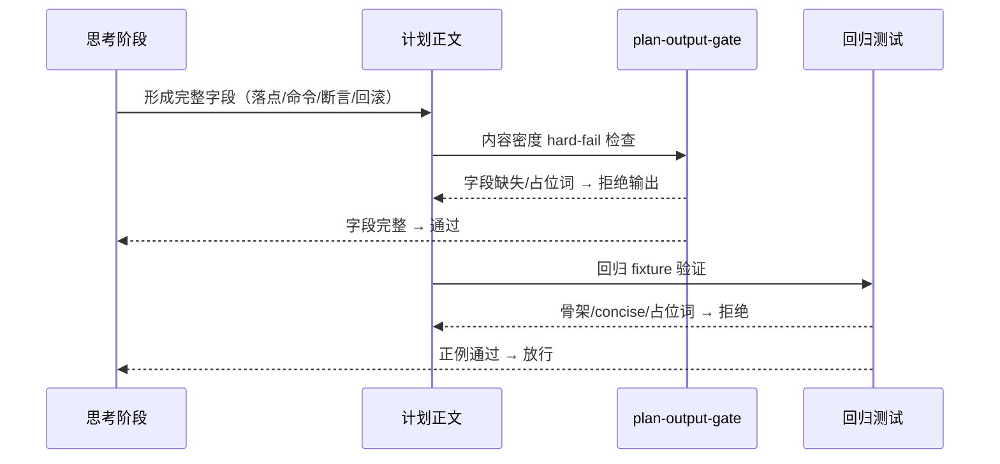
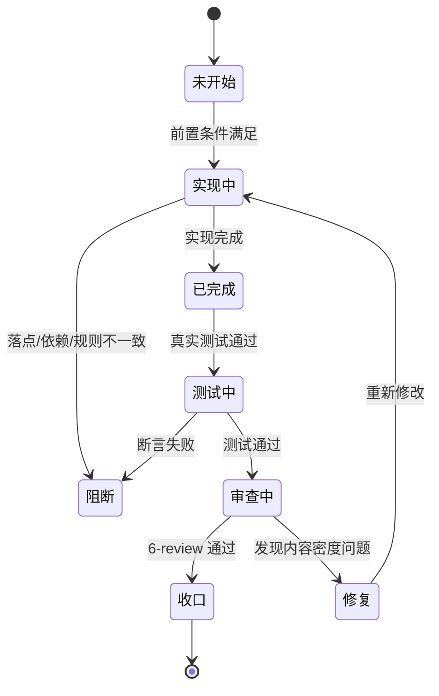

# 计划输出完整性升级：实施总览
结论：本实施通过全链路规则修复，消除 Plan Mode 计划输出时"思考细节完整但输出被压缩省略"的系统性缺陷；影响：所有 Plan Mode 下正式计划的接收者将获得字段完整、可直接执行的任务定义，不再需要自行补决策或猜测落点；范围：implementation-planning-rules/references/ 下的 plan-structure-template.md、plan-output-gate.md、plan-review-checklist.md、plan-mode-and-cycle-contracts.md、minimum-task-execution-contract.md，以及 AGENTS.md、CLAUDE.md、doc/5-tests/2026-07-26_plan-output/ 下的 fixture 和测试文件；非范围：相邻 skill 核心行为、Desktop 产品源码、Git 历史写入、ug-fix-proposal-rules、
easoning-summary-structure-rules；变化：计划输出从"章节标题骨架"升级为"零决策完整字段可执行任务"，"可以在最终回复里对小节做合并压缩"的允许性条款被删除，"思考细节必须落盘"成为硬要求；完成标准：6 条 AC 全部可验证通过，旧骨架回归样例被拒绝；术语说明：hard-fail 表示闸门直接阻断输出，不允许口头解释替代；验证状态：实施中；图片资产决策：N/A + 原因 + 证据（本实施只涉及文本规则、测试 fixture 和 JSON/YAML 契约，不需要位图）。最大推进边界：本周期 7 个任务全部闭环后停止，不自动进入下一来源对象，不改动相邻 skill 核心行为。

## 当前计划最终方案简要说明

推荐方案：全链路收口，从模板源头删除压缩口子，闸门升级内容密度 hard-fail，自审和契约对齐，平台规则写死完整度优先，测试 fixture 全面覆盖正/负例，最后全量回归。主落点：4 个核心参考文件 + 2 个平台规则 + 1 套测试 fixture。原因：三个根因（模板允许压缩、闸门只验章节标题、回归 fixture 只是标题骨架）互为因果，必须全链路覆盖。

## 基本信息

| 项目 | 内容 |
|---|---|
| 对应需求文档 | REQ-PLAN-DETAIL-COMPLETE-001 |
| 来源对象标识 | REQ-PLAN-DETAIL-COMPLETE-001 |
| 当前实施文档命名主干 | 2026-08-09_REQ-PLAN-DETAIL-COMPLETE-001 |
| 对应需求与实施计划全量顺序实施方案 | doc/3-实施/2026-08-09_REQ-PLAN-DETAIL-COMPLETE-001/需求与实施计划全量顺序实施方案.md |
| 实施计划完成条件（AC-*）所在章节 | 本实施总览"验收条件"章节 |
| 对应 6-review 风格回归记录 | doc/6-review/ 下待创建 |
| Agent 理解的问题/目标 | 用户反映 Plan Mode 计划输出"思考时细节完整，但输出计划时很多细节被省略"。根因是三个系统性漏洞：模板允许"可以合并压缩"、闸门只验章节标题存在不验内容密度、回归 fixture 只是标题骨架。目标是让计划正文完整承载思考阶段已形成的所有落点、命令、断言、回滚和完成条件，不得省略。 |
| 当前计划范围 | 改 plan-structure-template.md、plan-output-gate.md、plan-review-checklist.md、plan-mode-and-cycle-contracts.md、minimum-task-execution-contract.md、AGENTS.md、CLAUDE.md、doc/5-tests/2026-07-26_plan-output/fixtures/plan_output_cases.json、doc/5-tests/2026-07-26_plan-output/test_plan_output_contract.py |
| 明确不在范围 | 不改 ug-fix-proposal-rules、
easoning-summary-structure-rules、skill-hit-check-rules、context-compression-rules 等相邻 skill 的核心行为；不改 Desktop 产品源码；不执行 Git 历史写入；不改 project-memory-rules 或其他非目标 skill 的 SKILL.md |
| 当前优先闭环 | 先完成 TASK-PD-01（模板删除压缩口子），再逐个推进后续任务 |
| 关键假设/待确认点 | 假设当前 2026-07-26_BUG-PLAN-OUTPUT-20260726-001 的已有工作树改动仍然存在且不冲突；假设回归测试可以完整运行 |
| 是否已获得开始实施授权 | 是（用户已确认"给出完整的修复更新执行计划"并已得到实施授权） |

## 计划输出完整性检查流程

图形目的：展示计划输出从思考到最终输出的完整流程；关联 ID：`CYCLE-PD-01`、`AC-PLAN-DETAIL-001..006`。

## 决策维度覆盖表

| 维度 | 状态 | 结论/依据 |
|---|---|---|
| 架构/技术路线 | 已确定 | 全链路收口方案，不改架构，只改规则文件内容和测试覆盖 |
| 代码落点（目录/包/文件） | 已确定 | 固定为 implementation-planning-rules/references/ 下 4 个文件 + 2 个平台规则 + 1 套测试 fixture |
| 实现方式 | 已确定 | 删除/修改允许性条款，新增 hard-fail 条件，升级 fixture 正/负例，逐任务闭环 |
| 命名 | 已确定 | 沿用现有 TASK-PD-*、AC-PLAN-DETAIL-*、CYCLE-PD-* 命名体系 |
| 注释 | 已确定 | 中文注释，按 chinese-comment-rules 执行 |
| 日志 | N/A + 原因 + 证据 | 本任务只涉及规则文件和测试，无运行时日志埋点；证据：不产生运行日志，无日志配置变更 |
| 错误处理/异常 | 已确定 | 采用 hard-fail 模式：闸门检查不通过直接阻断，不输出半成品计划 |
| 数据模型/表/字段 | N/A + 原因 + 证据 | 本任务不涉及数据库；证据：无 CREATE TABLE 或 ALTER TABLE 需求 |
| 接口契约 | N/A + 原因 + 证据 | 本任务不涉及 API 接口；证据：无路由、controller 或 DTO 变更 |
| 依赖与库 | 已确定 | 仅使用 Python unittest、json、re 标准库，不引入新依赖 |
| 测试策略/样本 | 已确定 | 升级 fixture 正例（更密集字段）和负例（骨架/concise/占位词），内容密度断言 |
| 配置/开关/环境差异 | N/A + 原因 + 证据 | 不涉及配置开关；证据：无环境变量或开关配置变更 |
| 兼容性/迁移/版本 | 已确定 | 兼容既有 plan_output_cases.json 格式，只新增正/负例字段，不删除已有内容 |
| 性能/并发取舍 | N/A + 原因 + 证据 | 不涉及性能或并发取舍；证据：无性能敏感代码修改 |
| 安全/权限 | N/A + 原因 + 证据 | 不涉及安全或权限变更；证据：无认证授权或敏感数据修改 |
| 回滚/灰度/发布方式 | 已确定 | 只修改文件内容，不涉及代码部署；回滚只删除新增行，不触碰其他改动 |

## 最小任务完成状态机

图形目的：展示每个最小任务的闭环状态迁移；关联 ID：`TASK-PD-01..07`。

## 实施周期总览

| 周期 | 目标 | 包含任务 | 进入条件 | 收口条件 | 完成标志 |
|---|---|---|---|---|---|
| CYCLE-PD-01 | 全链路规则修复：模板→闸门→自审→平台→测试→记忆→收口 | TASK-PD-01 到 TASK-PD-07 | 来源需求已确认、边界和 AC 已冻结、用户已授权 | 全量回归通过、6-review PASS、合规审计通过 | 所有 AC 可验证，旧骨架样例被拒绝 |

## 阶段计划

| 阶段 | 只做一件事 | 输入条件 | 输出产物 | 验证门槛 |
|---|---|---|---|---|
| 规则修复 | 修改 4 个核心参考文件 + 2 个平台规则 | 当前文件内容基线 | 已修改的规则文件 | 逐文件回读 + grep 确认新条款存在、旧条款已删除 |
| 测试升级 | 升级 fixture 和 unittest | 规则修复后的新约束 | 已升级的 fixture JSON + 测试 PY | 新增断言通过，旧骨架用例被拒绝 |
| 记忆同步 | 更新字典和项目记忆 | 所有改动已完成 | 已刷新的字典 + 记忆文件 | 字典生成退出码 0，记忆文件 UTF-8 校验通过 |
| 收口验证 | 全量回归 + 合规审计 | 所有改动已完成 | 回归报告 + 6-review 记录 | 全部测试通过、alidate_engineering_docs.py PASS、git diff --check 通过 |

## 最小任务清单

### TASK-PD-01：删除"可合并压缩"口子，写入"思考细节必须落盘"

| 字段 | 内容 |
|---|---|
| 任务名 | 模板压缩口子删除与思考细节落盘强制 |
| 所属周期 | CYCLE-PD-01 |
| 周期内顺序 | 01 |
| 所属阶段 | 规则修复 |
| 本任务只做这一件事 | 修改 plan-structure-template.md 和 plan-mode-and-cycle-contracts.md，删除"可以在最终回复里对小节做合并压缩"的允许性条款，新增"思考中已形成的落点/命令/断言/回滚必须写入计划正文"的强制要求 |
| 垂直切片目标 | 从模板源头消除"计划输出可以压缩细节"的规则依据，同时建立"思考细节必须落盘"的硬约束 |
| 输入条件 | 当前文件基线已确认、无未决决策 |
| 实现产出 | 两个文件修改完毕：plan-structure-template.md 删除"可以在最终回复里对小节做合并压缩"并替换为"禁止在最终输出时压缩或省略已在思考中形成的任何落点、符号、命令、断言、回滚和完成条件"；plan-mode-and-cycle-contracts.md 同步删除对应压缩口子并新增"计划正文必须保持思考阶段已形成的完整细节，不得省略或合并" |
| 真实测试是否必需 | 是 |
| 真实测试入口 | grep -n "合并压缩\|压缩细节\|省略细节\|思考细节.*省略\|落点.*合并\|正文.*压缩" 正向验证新条款存在且旧条款已删除 |
| 真实测试依赖环境 | F:\luode-skills\implementation-planning-rules\references\ 目录可读 |
| 真实测试样本/数据来源 | 当前文件内容 |
| 真实测试通过标准 | plan-structure-template.md 中不再包含"可以在最终回复里对小节做合并压缩"或等效表述；plan-mode-and-cycle-contracts.md 中不再包含"可以在最终回复里对小节做合并压缩"或"允许合并同类小节，不允许丢字段"中暗示压缩的表述；两个文件中新增"思考细节必须落盘"或"禁止压缩"的强制裁决句 |
| 测试点 | 1. grep 旧条款不存在；2. grep 新条款存在 |
| 6-review 风格回归点 | 文件编码 UTF-8、中文注释正确、无占位词、格式符合 Markdown 规范 |
| 任务完成条件 | 两个文件修改完成，grep 验证通过 |
| 任务停止/结束条件 | 旧条款未删除、新条款未写入、grep 验证失败、发现非预期的相邻文件改动 |
| 阻断条件 | 文件被其他会话锁定、工作树冲突导致无法安全修改 |
| 前置依赖 | 无 |
| 下一任务依赖 | TASK-PD-02 依赖本任务完成 |
| 预计触达文件数 | 2 |

### TASK-PD-02：升级 plan-output-gate 内容密度 hard-fail

| 字段 | 内容 |
|---|---|
| 任务名 | 闸门内容密度 hard-fail 升级 |
| 所属周期 | CYCLE-PD-01 |
| 周期内顺序 | 02 |
| 所属阶段 | 规则修复 |
| 本任务只做这一件事 | 修改 plan-output-gate.md，在"硬失败结构"章节新增内容密度 hard-fail：缺零决策字段（文件/符号、操作、禁止触碰、精确测试命令、断言、清理、回滚、完成/停止条件中任一项）、出现"见上文/后续再定/多文件/实现时再看/TBD/TODO"等占位词、每个最小任务缺少字段时直接不合格 |
| 垂直切片目标 | 让闸门从"只验章节标题存在"升级为"验任务级可执行内容密度"，确保只有字段完整的计划才能通过 |
| 输入条件 | TASK-PD-01 已完成 |
| 实现产出 | plan-output-gate.md 的"硬失败结构"章节新增至少 3 条内容密度失败条件 |
| 真实测试是否必需 | 是 |
| 真实测试入口 | grep -n "硬失败\|内容密度\|零决策\|占位词\|见上文\|后续再定" 验证新条件存在 |
| 真实测试依赖环境 | F:\luode-skills\implementation-planning-rules\references\ 目录可读 |
| 真实测试样本/数据来源 | 当前文件内容 |
| 真实测试通过标准 | 新增至少 3 条内容密度 hard-fail 条件，每条有明确的"合格标准"描述 |
| 测试点 | 1. grep 新增条件存在；2. 新增条件与原有硬失败结构格式一致 |
| 6-review 风格回归点 | 文件编码 UTF-8、格式一致、无格式冲突 |
| 任务完成条件 | plan-output-gate.md 内容密度 hard-fail 条件已写入 |
| 任务停止/结束条件 | 新增条件未写入、格式不一致、发现非预期改动 |
| 阻断条件 | 文件被锁定 |
| 前置依赖 | TASK-PD-01 |
| 下一任务依赖 | TASK-PD-03 |
| 预计触达文件数 | 1 |

### TASK-PD-03：自审清单 + 最小任务契约对齐

| 字段 | 内容 |
|---|---|
| 任务名 | 自审清单与契约对齐 |
| 所属周期 | CYCLE-PD-01 |
| 周期内顺序 | 03 |
| 所属阶段 | 规则修复 |
| 本任务只做这一件事 | 修改 plan-review-checklist.md 新增"内容密度检查"项和"最小任务字段完整度"项；修改 minimum-task-execution-contract.md 确保"必填字段"表与零决策要求一致 |
| 垂直切片目标 | 自审清单和任务契约同步对齐新的内容密度要求，确保自审阶段能发现字段缺失 |
| 输入条件 | TASK-PD-02 已完成 |
| 实现产出 | 两个文件修改完成 |
| 真实测试是否必需 | 是 |
| 真实测试入口 | grep -n "内容密度\|字段完整\|零决策\|最小任务.*字段" 验证新检查项存在 |
| 真实测试依赖环境 | F:\luode-skills\implementation-planning-rules\references\ 目录可读 |
| 真实测试样本/数据来源 | 当前文件内容 |
| 真实测试通过标准 | plan-review-checklist.md 新增至少 2 条内容密度/字段完整度检查项；minimum-task-execution-contract.md 的"必填字段"表与零决策要求一致 |
| 测试点 | 1. grep 检查项存在；2. 格式一致 |
| 6-review 风格回归点 | 文件编码 UTF-8、格式一致 |
| 任务完成条件 | 两个文件修改完成，grep 验证通过 |
| 任务停止/结束条件 | 检查项未新增、格式不一致 |
| 阻断条件 | 文件被锁定 |
| 前置依赖 | TASK-PD-02 |
| 下一任务依赖 | TASK-PD-04 |
| 预计触达文件数 | 2 |

### TASK-PD-04：AGENTS.md/CLAUDE.md 写死仓库完整度优先

| 字段 | 内容 |
|---|---|
| 任务名 | 平台规则写死完整度优先 |
| 所属周期 | CYCLE-PD-01 |
| 周期内顺序 | 04 |
| 所属阶段 | 规则修复 |
| 本任务只做这一件事 | 在 AGENTS.md 和 CLAUDE.md 中新增/更新裁决句："宿主 concise / 3-5 小节只影响包裹层，不得删减计划正文字段与任务细节；仓库完整度优先于宿主简洁要求" |
| 垂直切片目标 | 解决宿主 concise 要求与仓库完整度冲突的问题，确保宿主简洁要求不成为删减理由 |
| 输入条件 | TASK-PD-03 已完成 |
| 实现产出 | 两个平台规则文件修改完成，关键裁决句一致 |
| 真实测试是否必需 | 是 |
| 真实测试入口 | grep -n "仓库完整度优先\|完整度优先于\|宿主.*concise.*不得\|包裹层.*不得删减" 验证两个文件核心句一致 |
| 真实测试依赖环境 | C:\Users\luode\.codex\skills\ 目录可读 |
| 真实测试样本/数据来源 | 当前文件内容 |
| 真实测试通过标准 | 两个文件均包含"仓库完整度优先于宿主简洁要求"或等效裁决句，且文本一致 |
| 测试点 | 1. grep AGENTS.md 裁决句存在；2. grep CLAUDE.md 裁决句存在；3. 两句内容一致 |
| 6-review 风格回归点 | 文件编码 UTF-8、格式一致、不破坏其他规则段落 |
| 任务完成条件 | 两个文件裁决句写入完成，静态 grep 一致性通过 |
| 任务停止/结束条件 | 裁决句未写入、两个文件口径不一致、破坏其他规则段 |
| 阻断条件 | 文件被锁定、工作树冲突 |
| 前置依赖 | TASK-PD-03 |
| 下一任务依赖 | TASK-PD-05 |
| 预计触达文件数 | 2 |

### TASK-PD-05：升级 fixture + unittest

| 字段 | 内容 |
|---|---|
| 任务名 | 测试 fixture 和 unittest 升级 |
| 所属周期 | CYCLE-PD-01 |
| 周期内顺序 | 05 |
| 所属阶段 | 测试升级 |
| 本任务只做这一件事 | 升级 plan_output_cases.json：正例新增 plan_ready_detailed 包含完整零决策字段（文件/符号、操作、禁止触碰、精确测试命令、断言、清理、回滚、完成/停止条件）；负例新增 plan_ready_skeleton_only（仅章节标题骨架）、plan_ready_concise_plan（宿主 concise 风格）、plan_ready_placeholder（含"见上文/后续再定/多文件"等占位词）。升级 	est_plan_output_contract.py：新增 	est_plan_ready_detailed_fields 验证正例字段完整、	est_plan_ready_skeleton_fails 验证骨架例被拒绝、	est_plan_ready_concise_fails 验证 concise 例被拒绝、	est_plan_ready_placeholder_fails 验证占位词例被拒绝 |
| 垂直切片目标 | 通过回归测试确保：字段完整计划通过、骨架/concise/占位词计划被拒绝，从而验证闸门内容密度 hard-fail 生效 |
| 输入条件 | TASK-PD-04 已完成，闸门内容密度条件已定义 |
| 实现产出 | 升级后的 plan_output_cases.json（4 个新增 case）和 	est_plan_output_contract.py（4 个新增测试方法） |
| 真实测试是否必需 | 是 |
| 真实测试入口 | py.exe -3 -X utf8 -B doc/5-tests/2026-07-26_plan-output/test_plan_output_contract.py |
| 真实测试依赖环境 | Python 3、doc/5-tests/2026-07-26_plan-output/fixtures/plan_output_cases.json 可读 |
| 真实测试样本/数据来源 | fixture JSON 中的正/负例数据 |
| 真实测试通过标准 | 正例字段完整测试通过，负例骨架/concise/占位词均被拒绝 |
| 测试点 | 1. 	est_plan_ready_detailed_fields：验证正例包含所有零决策字段；2. 	est_plan_ready_skeleton_fails：验证骨架例的 
equired_plan_sections 不完整或字段缺失；3. 	est_plan_ready_concise_fails：验证 concise 例缺少零决策字段；4. 	est_plan_ready_placeholder_fails：验证含占位词例缺少零决策字段 |
| 6-review 风格回归点 | 文件编码 UTF-8、Python 风格一致、测试方法命名符合 snake_case |
| 任务完成条件 | 4 个新增测试方法全部通过，且不影响既有 5 个测试方法 |
| 任务停止/结束条件 | 任一测试失败、新增 fixture 格式错误、既有测试被破坏 |
| 阻断条件 | Python 不可用、fixture 路径不可读 |
| 前置依赖 | TASK-PD-04 |
| 下一任务依赖 | TASK-PD-06 |
| 预计触达文件数 | 2 |

### TASK-PD-06：字典与项目记忆同步

| 字段 | 内容 |
|---|---|
| 任务名 | 字典与项目记忆同步 |
| 所属周期 | CYCLE-PD-01 |
| 周期内顺序 | 06 |
| 所属阶段 | 记忆同步 |
| 本任务只做这一件事 | 刷新 skill 字典脚本（skill-dictionary/data.js 和 字典.md），更新 PROJECT_CURRENT.md、PROJECT_MEMORY.md |
| 垂直切片目标 | 确保字典和项目记忆反映本轮所有改动，避免下次启动时上下文丢失 |
| 输入条件 | TASK-PD-05 已完成，所有规则和测试改动已完成 |
| 实现产出 | 已刷新的字典、已更新的项目记忆 |
| 真实测试是否必需 | 是 |
| 真实测试入口 | 字典生成脚本 + UTF-8 校验 + 字节数校验 |
| 真实测试依赖环境 | Python 3、skill-dictionary 工具可用 |
| 真实测试样本/数据来源 | 当前仓库文件系统 |
| 真实测试通过标准 | 字典生成退出码 0、PROJECT_CURRENT.md UTF-8 有效且不超过 51200 字节 |
| 测试点 | 1. 字典生成退出码 0；2. UTF-8 校验通过；3. 字节数不超限 |
| 6-review 风格回归点 | 文件编码 UTF-8、无格式错误 |
| 任务完成条件 | 字典刷新完成、项目记忆更新完成、校验通过 |
| 任务停止/结束条件 | 字典生成失败、UTF-8 校验失败、字节数超限 |
| 阻断条件 | 字典生成工具不可用 |
| 前置依赖 | TASK-PD-05 |
| 下一任务依赖 | TASK-PD-07 |
| 预计触达文件数 | 4 |

### TASK-PD-07：全量回归、diff check、6-review、合规收口

| 字段 | 内容 |
|---|---|
| 任务名 | 全量回归与合规收口 |
| 所属周期 | CYCLE-PD-01 |
| 周期内顺序 | 07 |
| 所属阶段 | 收口验证 |
| 本任务只做这一件事 | 运行全量回归测试、git diff --check、alidate_engineering_docs.py 文档 profile、6-review，并完成 skill-execution-compliance-gate-rules 收口 |
| 垂直切片目标 | 确认所有改动不破坏既有功能、文档合规、格式正确、无残留风险 |
| 输入条件 | TASK-PD-06 已完成，所有改动已落盘 |
| 实现产出 | 回归测试报告、6-review 记录、合规审计结论 |
| 真实测试是否必需 | 是 |
| 真实测试入口 | py.exe -3 -X utf8 -B doc/5-tests/2026-07-26_plan-output/test_plan_output_contract.py + git diff --check + alidate_engineering_docs.py |
| 真实测试依赖环境 | Python 3、git、alidate_engineering_docs.py 可用 |
| 真实测试样本/数据来源 | 当前仓库文件系统 |
| 真实测试通过标准 | 计划输出回归全部通过、git diff --check 无错误、文档 profile 全部 PASS、6-review 结论为 PASS |
| 测试点 | 1. 计划输出回归全部通过（含既有 5 个 + 新增 4 个测试方法）；2. git diff --check 无空白错误；3. 所有修改文件的文档 profile 通过；4. 6-review 结论为 PASS |
| 6-review 风格回归点 | 全部改动文件的格式、编码、注释、命名、目录归位检查 |
| 任务完成条件 | 全部测试通过、文档 profile 通过、6-review PASS、合规审计通过 |
| 任务停止/结束条件 | 任一测试失败、git diff --check 产生错误、文档 profile 未通过、合规审计发现未授权改动 |
| 阻断条件 | 测试工具不可用、文档 profile 脚本不可用 |
| 前置依赖 | TASK-PD-06 |
| 下一任务依赖 | 无（本周期最后一个任务） |
| 预计触达文件数 | 0（只运行测试，不修改文件） |

## 现状与落点

`	ext
F:\luode-skills\
├─ implementation-planning-rules\
│  └─ references\
│     ├─ plan-structure-template.md        # TASK-PD-01：删除"可合并压缩"口子，新增"思考细节必须落盘"
│     ├─ plan-output-gate.md               # TASK-PD-02：升级内容密度 hard-fail 条件
│     ├─ plan-review-checklist.md          # TASK-PD-03：新增内容密度/字段完整度检查项
│     ├─ plan-mode-and-cycle-contracts.md  # TASK-PD-01：同步删除压缩口子，新增完整细节强制
│     └─ minimum-task-execution-contract.md# TASK-PD-03：对齐零决策字段要求
├─ AGENTS.md                               # TASK-PD-04：新增"仓库完整度优先"裁决句
├─ CLAUDE.md                               # TASK-PD-04：同步新增"仓库完整度优先"裁决句
├─ doc/
│  └─ 5-tests/
│     └─ 2026-07-26_plan-output/
│        ├─ fixtures/
│        │  └─ plan_output_cases.json      # TASK-PD-05：新增正例 detailed + 负例 skeleton/concise/placeholder
│        └─ test_plan_output_contract.py   # TASK-PD-05：新增4个内容密度测试方法
├─ PROJECT_CURRENT.md                      # TASK-PD-06：更新当前任务状态
├─ PROJECT_MEMORY.md                       # TASK-PD-06：更新稳定规则
└─ doc/3-实施/
   └─ 2026-08-09_REQ-PLAN-DETAIL-COMPLETE-001/
      ├─ 需求与实施计划全量顺序实施方案.md   # 本文件
      └─ 实施总览.md                        # 本文件
`

## 方案选择

- 方案 A（全链路收口）：改模板、闸门、自审、平台、测试、记忆，全链路修复。推荐。原因：三个根因互为因果，单点修复治标不治本。
- 方案 B（仅改模板）：只删压缩口子。不推荐。原因：闸门和回归仍只验章节标题，旧 fixture 不会拒绝骨架计划。
- 方案 C（仅改闸门）：只升级内容密度。不推荐。原因：模板仍允许压缩，平台规则仍可能以 concise 为由删减。

## 实施依赖关系图

图形目的：表达 TASK-PD-01 至 TASK-PD-07 的依赖顺序和停止边界；关联 ID：`CYCLE-PD-01`、`TASK-PD-01..07`。

## 实施步骤

| 步骤 | 所属周期 | 所属阶段 | 对应最小任务 | 本步只做 |
|---|---|---|---|---|
| 01 | CYCLE-PD-01 | 规则修复 | TASK-PD-01 | 修改 plan-structure-template.md 和 plan-mode-and-cycle-contracts.md，删除压缩口子，新增思考细节落盘强制 |
| 02 | CYCLE-PD-01 | 规则修复 | TASK-PD-02 | 修改 plan-output-gate.md 新增内容密度 hard-fail 条件 |
| 03 | CYCLE-PD-01 | 规则修复 | TASK-PD-03 | 修改 plan-review-checklist.md 和 minimum-task-execution-contract.md 对齐 |
| 04 | CYCLE-PD-01 | 规则修复 | TASK-PD-04 | 修改 AGENTS.md 和 CLAUDE.md 写死完整度优先 |
| 05 | CYCLE-PD-01 | 测试升级 | TASK-PD-05 | 升级 fixture JSON 和 unittest 测试文件 |
| 06 | CYCLE-PD-01 | 记忆同步 | TASK-PD-06 | 刷新字典，更新项目记忆 |
| 07 | CYCLE-PD-01 | 收口验证 | TASK-PD-07 | 全量回归、diff check、文档 profile、6-review、合规收口 |

## 真实测试安排

| 测试 | 入口 | 覆盖任务 | 依赖环境 | 样本来源 | 通过标准 |
|---|---|---|---|---|---|
| 静态内容 grep | grep -n 验证新旧条款 | TASK-PD-01~04 | 文件系统可读 | 当前文件内容 | 旧条款不存在、新条款存在 |
| 计划输出回归 | py.exe -3 -X utf8 -B doc/5-tests/2026-07-26_plan-output/test_plan_output_contract.py | TASK-PD-05 | Python 3、fixture 可读 | fixture JSON | 9/9 测试通过（5 既有 + 4 新增） |
| 文档 profile | alidate_engineering_docs.py 对应 profile | TASK-PD-07 | Python 3 | 当前文档 | alid: true |
| 格式检查 | git diff --check | TASK-PD-07 | git | 当前 diff | 无空白错误 |
| 版本开关 | 字典生成脚本 | TASK-PD-06 | Python 3 | 当前仓库 | 退出码 0 |

## 风险与阻断项

| 风险 | 影响 | 缓解措施 |
|---|---|---|
| 工作树可能包含其他会话未提交改动 | 修改平台规则时可能冲突 | 只改目标文件，不触碰其他改动；git diff 确认目标文件无意外冲突 |
| 字典生成脚本可能依赖未安装的 Python 包 | 字典刷新失败 | 检查依赖后运行，失败时记录原因，不阻断其他任务 |
| alidate_engineering_docs.py 可能不可用 | 文档 profile 无法运行 | 记录 HOST_BLOCKED，用手工静态检查替代 |
| 原有 fixture 可能被误改 | 既有回归测试失败 | 只新增正/负例，不删除/修改已有 case 内容 |
| 平台规则文件可能被其他会话修改过 | 修改后内容漂移 | 修改前先 git diff 确认无意外改动 |

## 自审结论

- 覆盖字段完整性：已覆盖 -- 所有 AC、CYCLE、TASK 均有完整字段
- 阶段单一目标：已覆盖 -- 每个阶段只做一件事
- 最小任务闭环：已覆盖 -- 每个任务"实现 -> 真实测试 -> 6-review"闭环
- 可执行性：已覆盖 -- 每个任务有精确文件/符号、操作、命令、断言、完成/停止条件
- 图文一致性：N/A -- 本任务只涉及文本规则，不需要 Mermaid 或位图（简单任务，图形化决策：N/A + 原因 + 证据）
- 追踪链：REQ → AC → CYCLE → TASK → 文件/符号 → TEST → EVIDENCE 完整，无孤立 ID
- 占位词检查：无占位（待确定/待办/后续补充/见上文/多文件）或模糊表述
