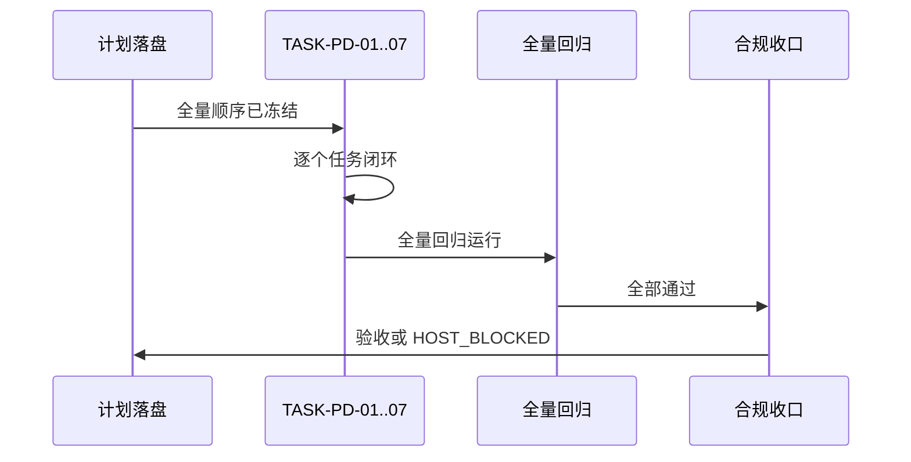

# 计划输出完整性升级：需求与实施计划全量顺序实施方案

结论：本全量顺序把"计划输出细节被压缩省略"的根因修复任务串为单一路径，按规则模板、闸门自审、平台同步、测试升级、收口合规的顺序逐周期闭环；影响：所有 Plan Mode 下的正式计划输出将不再丢失思考阶段的细节，每个最小任务字段完整可执行；范围：implementation-planning-rules 的参考文件、闸门、自审清单、契约、平台同步文件、回归测试 fixture 和项目记忆；非范围：不改动 ug-fix-proposal-rules、
easoning-summary-structure-rules 等相邻 skill 的核心行为，不改 Desktop 产品源码，不执行 Git 历史写入；变化：计划输出从"章节标题骨架"升级为"零决策完整字段可执行任务"；完成标准：6 条 AC 全部通过，旧骨架样例被回归拒绝；术语说明：硬失败表示闸门直接阻断输出，不允许用"建议后续修复"替代；验证状态：实施中；图片资产决策：N/A + 原因 + 证据，本任务只涉及文本规则、测试 fixture 和 YAML/JSON 契约，不需要位图。

## 当前计划最终方案简要说明

推荐方案：全链路收口 — 在 plan-structure-template.md 中删除"可以合并压缩"的口子并写入"思考细节必须落盘"，升级 plan-output-gate.md 内容密度 hard-fail（缺零决策字段直接不合格），同步 plan-review-checklist.md 和最小任务契约对齐，改 AGENTS.md/CLAUDE.md 写死仓库完整度优先，升级 fixture 正例更密集 / 负例骨架/concise/占位词全覆盖，最后全量回归并 6-review 合规收口。主落点：implementation-planning-rules/references/ 下的 4 个核心参考文件 + 2 个平台规则文件 + 1 套测试 fixture。原因：问题根因是规则允许压缩、闸门只验章节标题、回归 fixture 只是标题骨架，三者互为因果，单点打补丁治标不治本，必须全链路覆盖。

## 文档信息

| 项目 | 内容 |
|---|---|
| 来源对象 | REQ-PLAN-DETAIL-COMPLETE-001 |
| 维护状态 | 实施中 |
| 总执行入口 | CYCLE-PD-01 |
| 周期数 | 1 |

## 来源对象清单与回指关系

| 来源 | 需求 | 验收条件 | 实施总览 |
|---|---|---|---|
| REQ-PLAN-DETAIL-COMPLETE-001 | 本全量方案 | AC-PLAN-DETAIL-001..006 | IMPLEMENTATION-PLAN-DETAIL-001 |

## 全量执行顺序

| 顺序 | 周期 | 最小任务 |
|---|---|---|
| 01 | CYCLE-PD-01 | TASK-PD-01 删除"可合并压缩"口子，写入"思考细节必须落盘" |
| 02 | CYCLE-PD-01 | TASK-PD-02 升级 plan-output-gate 内容密度 hard-fail |
| 03 | CYCLE-PD-01 | TASK-PD-03 自审清单 + 最小任务契约对齐 |
| 04 | CYCLE-PD-01 | TASK-PD-04 AGENTS.md/CLAUDE.md 写死仓库完整度优先 |
| 05 | CYCLE-PD-01 | TASK-PD-05 升级 fixture + unittest（正例更密 / 负例骨架/concise/占位词） |
| 06 | CYCLE-PD-01 | TASK-PD-06 字典与项目记忆同步 |
| 07 | CYCLE-PD-01 | TASK-PD-07 全量回归、diff check、6-review、合规收口 |

## 当前执行入口与下一步

当前入口为 CYCLE-PD-01/TASK-PD-01；先改 plan-structure-template.md 中"可以在最终回复里对小节做合并压缩"的允许性条款，再逐任务推进。任何任务未完成自己的实现、真实测试和 6-review 闭环，不得进入下一任务。

## 验收条件（AC）

| ID | 内容 | 验证方式 |
|---|---|---|
| AC-PLAN-DETAIL-001 | 仅章节标题的正式计划 hard-fail | 负例 fixture 必被回归拒绝 |
| AC-PLAN-DETAIL-002 | 最小任务含完整零决策字段 | 正例 fixture 字段全覆盖 |
| AC-PLAN-DETAIL-003 | 宿主 concise 不得成为删减理由 | AGENTS/CLAUDE 裁决句一致 |
| AC-PLAN-DETAIL-004 | "见上文/后续再定/多个文件" hard-fail | 回归 fixture 拒绝含占位词样例 |
| AC-PLAN-DETAIL-005 | AGENTS/CLAUDE 关键裁决句一致 | 静态 grep 两文件核心句一致 |
| AC-PLAN-DETAIL-006 | 回归全过，旧骨架样例被拒绝 | unittest 全部通过，旧骨架产生 FAIL |

## 全量执行时序

图形目的：展示实施周期内任务执行的时序关系；关联 ID：`CYCLE-PD-01`、`TASK-PD-01..07`。

## 依赖、进入、收口与阻断

进入条件：来源需求已确认、修复边界和验收标准已冻结、用户已授权 Default Mode 执行、无未决选择。收口条件：自动回归、文档 profile、6-review 和合规审计均有证据，所有 AC 可验证。阻断：未决选择、工作树冲突、任何 P0/P1、alidate_engineering_docs.py 失败、git diff --check 产生错误。

## 全量顺序流程图

图形目的：表达周期内任务依赖和停止边界；关联 ID：CYCLE-PD-01、TASK-PD-01..07。

## 自审结论

全量顺序已覆盖 7 个最小任务、6 条 AC、4 个核心参考文件 + 2 个平台规则 + 1 套测试 fixture；追踪链 REQ → AC → CYCLE → TASK → 文件/符号 → TEST → EVIDENCE 完整，无孤立 ID；不存在未决决策，真实宿主缺证据时保留受限状态。
